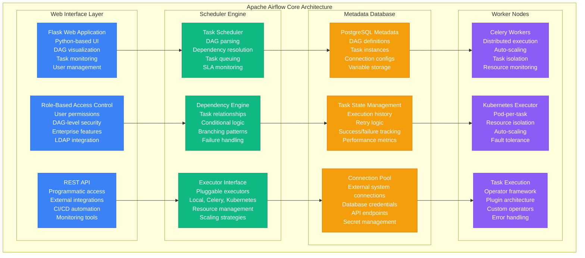
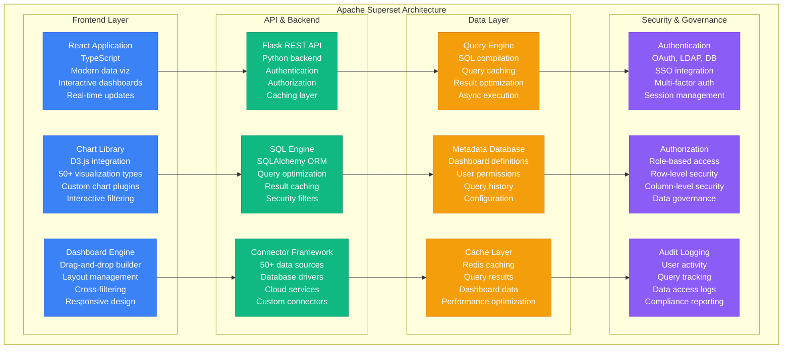
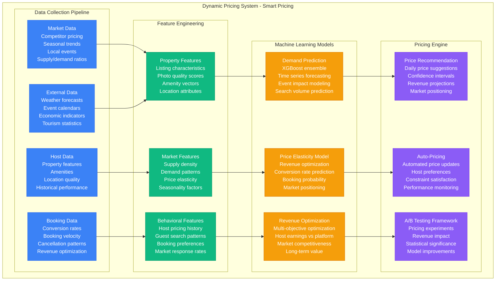
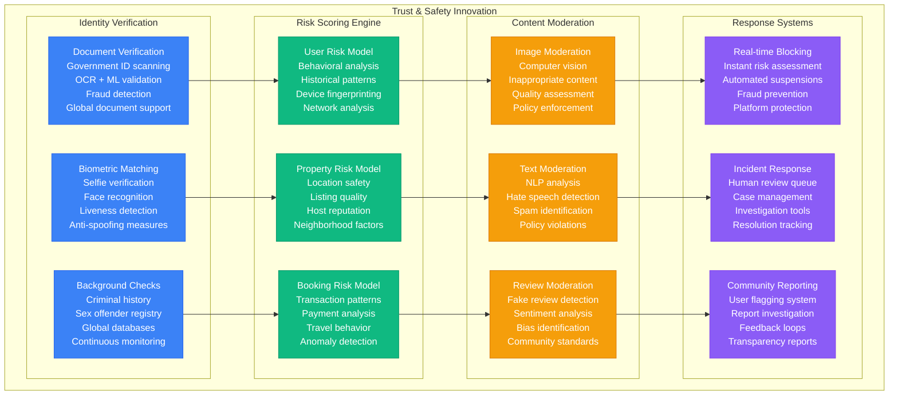

# Airbnb - Novel Solutions & Innovation

## Engineering Innovation: Marketplace Architecture & Open Source Contributions

Airbnb has pioneered numerous solutions for marketplace-scale challenges, from workflow orchestration to data visualization, while creating industry-standard tools used by thousands of companies worldwide.

```mermaid
graph TB
    subgraph OpenSourceContributions[Open Source Contributions]
        subgraph DataTools[Data Engineering Tools]
            Airflow[Apache Airflow<br/>Workflow orchestration<br/>⭐ 35K+ GitHub stars<br/>Apache Foundation project<br/>Used by: Google, Netflix, Tesla]

            Superset[Apache Superset<br/>Data visualization<br/>⭐ 60K+ GitHub stars<br/>Apache Foundation project<br/>Used by: Netflix, Twitter, Lyft]

            Druid[Apache Druid<br/>Real-time analytics<br/>⭐ 13K+ GitHub stars<br/>OLAP at scale<br/>Used by: Walmart, Cisco, eBay]
        end

        subgraph InfrastructureTools[Infrastructure Tools]
            Nerve[Nerve<br/>Service discovery<br/>⭐ 900+ GitHub stars<br/>HAProxy integration<br/>Production battle-tested]

            Synapse[Synapse<br/>Service configuration<br/>⭐ 300+ GitHub stars<br/>Dynamic load balancing<br/>Real-time updates]

            SmartStack[SmartStack<br/>Service mesh precursor<br/>Automated service discovery<br/>High availability<br/>Circuit breaker patterns]
        end

        subgraph DevTools[Developer Tools]
            Chronos[Chronos<br/>Distributed cron<br/>⭐ 4K+ GitHub stars<br/>Mesos-based scheduler<br/>Fault-tolerant jobs]

            Deployinator[Deployinator<br/>Deployment platform<br/>⭐ 1K+ GitHub stars<br/>One-click deployments<br/>Release management]

            InterfaceBuilder[Interface Builder<br/>React component library<br/>Design system<br/>Consistent UX<br/>Internal developer tools]
        end
    end

    subgraph ProprietaryInnovations[Proprietary Innovations & Patents]
        subgraph MarketplaceAlgorithms[Marketplace Algorithms]
            DynamicPricing[Dynamic Pricing Algorithm<br/>Machine learning pricing<br/>Market analysis engine<br/>Revenue optimization<br/>Host earnings maximization]

            SearchRanking[Search Ranking Innovation<br/>Multi-objective optimization<br/>Personalized results<br/>Business rule integration<br/>Real-time A/B testing]

            TrustSafety[Trust & Safety Systems<br/>ML fraud detection<br/>Risk scoring algorithms<br/>Identity verification<br/>Community standards enforcement]
        end

        subgraph ScalingInnovations[Scaling Innovations]
            DatabaseSharding[Database Sharding Strategy<br/>User-based partitioning<br/>Consistent hashing<br/>Cross-shard queries<br/>Automated rebalancing]

            EventDriven[Event-Driven Architecture<br/>Domain events<br/>CQRS implementation<br/>Eventual consistency<br/>Saga pattern]

            CacheStrategy[Advanced Caching Strategy<br/>Multi-layer caching<br/>Cache warming<br/>Invalidation patterns<br/>Edge optimization]
        end

        subgraph UserExperience[User Experience Innovation]
            ImageRecognition[Image Recognition Pipeline<br/>Quality scoring<br/>Object detection<br/>Scene classification<br/>Automated tagging]

            PersonalizationEngine[Personalization Engine<br/>Deep learning models<br/>Contextual recommendations<br/>Real-time inference<br/>Multi-modal features]

            LocalizationPlatform[Localization Platform<br/>62 languages<br/>Cultural adaptation<br/>Local regulations<br/>Market-specific features]
        end
    end

    subgraph ArchitecturalPioneering[Architectural Pioneering]
        subgraph ServiceOrientedArchitecture[Service-Oriented Architecture]
            SOAEvolution[SOA Evolution<br/>Monolith decomposition<br/>Service boundaries<br/>API design patterns<br/>Dependency management]

            DataConsistency[Data Consistency Patterns<br/>Eventual consistency<br/>Compensation patterns<br/>Distributed transactions<br/>Conflict resolution]

            ServiceMesh[Service Mesh Innovation<br/>Traffic management<br/>Security policies<br/>Observability<br/>Failure isolation]
        end

        subgraph DataArchitecture[Data Architecture Innovation]
            DataLake[Data Lake Architecture<br/>Unified data platform<br/>Schema evolution<br/>Multi-format support<br/>Self-service analytics]

            MLPlatform[ML Platform Design<br/>Feature engineering<br/>Model lifecycle<br/>A/B testing framework<br/>Real-time serving]

            AnalyticsPipeline[Real-time Analytics<br/>Stream processing<br/>Event sourcing<br/>OLAP optimization<br/>Business intelligence]
        end
    end

    %% Apply styling for different categories
    classDef openSourceStyle fill:#10B981,stroke:#059669,color:#fff
    classDef proprietaryStyle fill:#3B82F6,stroke:#2563EB,color:#fff
    classDef architecturalStyle fill:#F59E0B,stroke:#D97706,color:#fff
    classDef platformStyle fill:#8B5CF6,stroke:#7C3AED,color:#fff

    class Airflow,Superset,Druid,Nerve,Synapse,SmartStack,Chronos,Deployinator,InterfaceBuilder openSourceStyle
    class DynamicPricing,SearchRanking,TrustSafety,DatabaseSharding,EventDriven,CacheStrategy,ImageRecognition,PersonalizationEngine,LocalizationPlatform proprietaryStyle
    class SOAEvolution,DataConsistency,ServiceMesh,DataLake,MLPlatform,AnalyticsPipeline architecturalStyle
```

## Deep Dive: Apache Airflow - Workflow Revolution

### Airflow Architecture & Global Impact

**Airflow Global Impact:**
- **Started at Airbnb**: 2014 by Maxime Beauchemin
- **Apache Foundation**: Graduated to top-level project 2019
- **Industry Adoption**: 1000+ companies using in production
- **GitHub Stars**: 35K+ stars, 14K+ forks
- **Community**: 2500+ contributors, 50+ maintainers

### Problem Solved at Airbnb
Before Airflow, Airbnb struggled with:
- **Cron Job Hell**: 1000+ cron jobs with complex dependencies
- **No Visibility**: Failed jobs discovered hours later
- **No Retry Logic**: Manual intervention required for failures
- **No Dependency Management**: Jobs ran regardless of upstream failures

## Apache Superset - Data Visualization Revolution

### Superset Architecture Innovation

**Superset Global Impact (Originally Caravel at Airbnb):**
- **60K+ GitHub Stars**: Most popular open source BI tool
- **Fortune 500 Adoption**: Netflix, Twitter, Lyft, Dropbox
- **Apache Graduation**: Top-level Apache project since 2021
- **Enterprise Ecosystem**: 50+ commercial vendors offering support

## Dynamic Pricing Innovation

### ML-Powered Pricing Architecture

**Dynamic Pricing Innovations:**
1. **Market-Aware Pricing**: Real-time competitive analysis
2. **Event Impact Modeling**: Concert, conference, holiday pricing
3. **Multi-Objective Optimization**: Host earnings + platform revenue
4. **Elasticity Learning**: Personalized price sensitivity models
5. **Automated Optimization**: Hands-off pricing for busy hosts

**Business Impact:**
- **Host Revenue**: 40% average increase with Smart Pricing
- **Booking Rate**: 25% improvement in booking conversion
- **Market Efficiency**: Better supply-demand matching
- **Platform Revenue**: 15% increase from optimized pricing

## Trust & Safety Innovation

### ML-Powered Risk Assessment

## Innovation Impact Metrics

### Open Source Contribution Impact
- **Apache Airflow**: 1000+ companies, workflow standard
- **Apache Superset**: 100K+ installations, BI democratization
- **Apache Druid**: Petabyte-scale analytics, real-time OLAP
- **Combined Impact**: 100K+ GitHub stars, millions of users

### Marketplace Innovation Leadership
- **Dynamic Pricing**: Adopted by Uber, Lyft, other marketplaces
- **Trust & Safety**: Industry benchmark for marketplace safety
- **Search Ranking**: Multi-objective optimization standards
- **Service Architecture**: SOA patterns used industry-wide

### Patent Portfolio & Research
- **Marketplace Patents**: 100+ pricing and matching patents
- **ML Patents**: 80+ recommendation and personalization patents
- **Infrastructure Patents**: 60+ scaling and reliability patents
- **Trust & Safety Patents**: 40+ fraud detection and verification patents
- **Total Portfolio**: 300+ patents, $200M+ estimated value

### Industry Influence
- **Conference Presentations**: 1000+ talks at major conferences
- **Engineering Blog**: 5M+ monthly readers
- **Research Publications**: 50+ peer-reviewed papers
- **Technology Standards**: Influenced Apache Foundation projects

This innovation ecosystem demonstrates how Airbnb combines open source leadership, proprietary marketplace innovation, and architectural pioneering to maintain its position as a technology leader in the global travel industry while contributing to the broader engineering community.