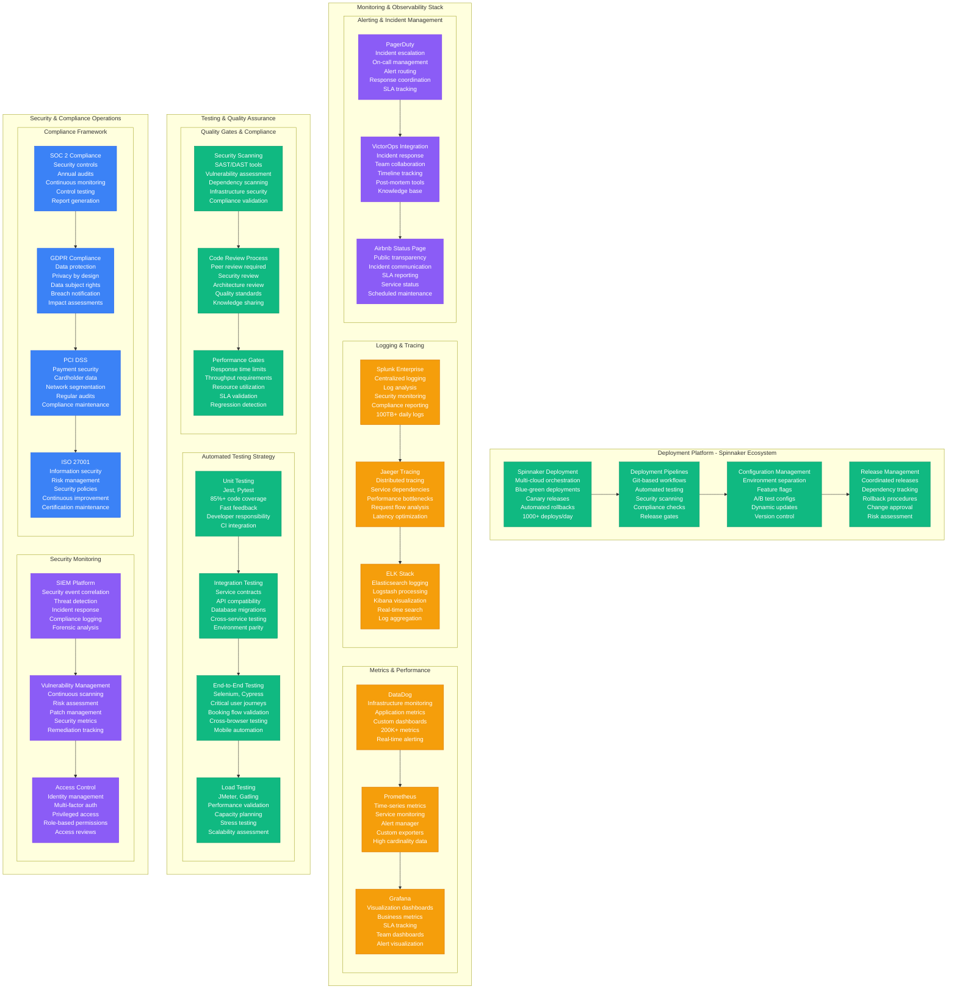
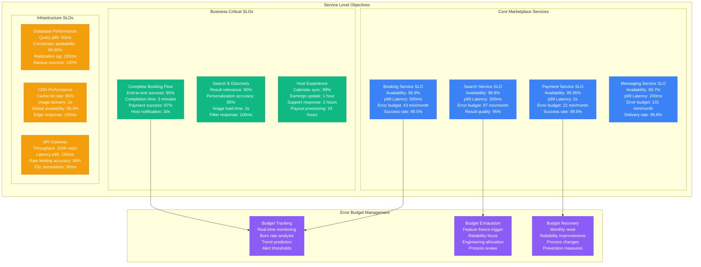
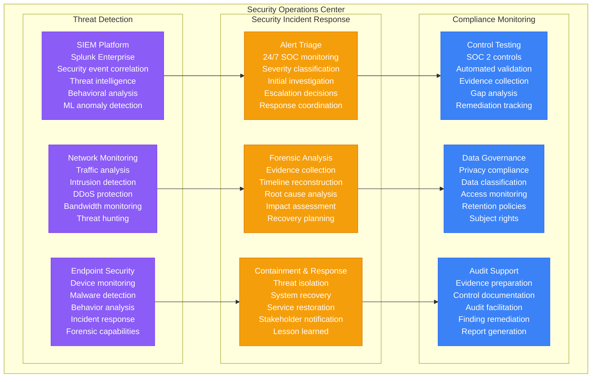

# Airbnb - Production Operations

## Operating a Global Marketplace: 24/7 Platform for 200M+ Users

Airbnb's production operations manage one of the world's largest two-sided marketplaces, ensuring reliable booking experiences for travelers and hosts across 220+ countries with 99.9% availability.



## Deployment Strategy & Release Engineering

### Progressive Deployment Pipeline

```mermaid
graph TB
    subgraph ProgressiveDeployment[Progressive Deployment Strategy]
        subgraph Development[Development & Testing]
            FeatureBranch[Feature Branch<br/>Git flow model<br/>Feature development<br/>Local testing<br/>Pull request creation]

            CodeReview[Code Review<br/>Peer review<br/>Security review<br/>Architecture review<br/>Automated checks<br/>Quality gates]

            BuildPipeline[Build Pipeline<br/>Jenkins CI<br/>Docker builds<br/>Artifact creation<br/>Security scanning<br/>Test execution]
        end

        subgraph StagingEnvironment[Staging Environment]
            StagingDeploy[Staging Deployment<br/>Production replica<br/>Integration testing<br/>Performance validation<br/>User acceptance<br/>Load testing]

            E2EValidation[E2E Validation<br/>Critical user journeys<br/>Booking flow testing<br/>Payment integration<br/>Mobile app testing<br/>Cross-browser validation]

            SecurityTesting[Security Testing<br/>Penetration testing<br/>Vulnerability scanning<br/>Compliance checks<br/>Data protection<br/>Access control validation]
        end

        subgraph ProductionDeployment[Production Deployment]
            CanaryDeployment[Canary Deployment<br/>1% traffic allocation<br/>10-minute observation<br/>Automated metrics<br/>Error rate monitoring<br/>Performance validation]

            BlueGreenSwitch[Blue-Green Switch<br/>Zero-downtime deployment<br/>Database migrations<br/>Instant rollback<br/>Traffic switching<br/>Health verification]

            FullRollout[Full Rollout<br/>100% traffic migration<br/>Performance monitoring<br/>Business metrics<br/>User experience<br/>Success validation]

            RollbackProcedure[Rollback Procedure<br/>Automated triggers<br/>Manual override<br/>Database rollback<br/>Cache invalidation<br/>Incident response]
        end
    end

    FeatureBranch --> CodeReview
    CodeReview --> BuildPipeline
    BuildPipeline --> StagingDeploy

    StagingDeploy --> E2EValidation
    E2EValidation --> SecurityTesting
    SecurityTesting --> CanaryDeployment

    CanaryDeployment --> BlueGreenSwitch
    BlueGreenSwitch --> FullRollout
    FullRollout --> RollbackProcedure

    %% Failure paths
    CanaryDeployment -.->|Issues detected| RollbackProcedure
    BlueGreenSwitch -.->|Health check failure| RollbackProcedure
    FullRollout -.->|Performance degradation| RollbackProcedure

    classDef devStyle fill:#3B82F6,stroke:#2563EB,color:#fff
    classDef stagingStyle fill:#10B981,stroke:#059669,color:#fff
    classDef prodStyle fill:#F59E0B,stroke:#D97706,color:#fff
    classDef rollbackStyle fill:#8B5CF6,stroke:#7C3AED,color:#fff

    class FeatureBranch,CodeReview,BuildPipeline devStyle
    class StagingDeploy,E2EValidation,SecurityTesting stagingStyle
    class CanaryDeployment,BlueGreenSwitch,FullRollout prodStyle
    class RollbackProcedure rollbackStyle
```



## Global On-Call & Incident Response

### Follow-the-Sun Operations Model

```mermaid
graph TB
    subgraph GlobalOnCall[Global On-Call Coverage - 24/7/365]
        subgraph SanFrancisco[San Francisco Hub - 16:00-00:00 UTC]
            SFPrimary[Primary On-Call<br/>Service team rotation<br/>Booking flow expertise<br/>Payment systems<br/>Search & discovery]

            SFSecondary[Secondary On-Call<br/>Infrastructure team<br/>Database expertise<br/>Network issues<br/>Platform services]

            SFManager[Engineering Manager<br/>Incident commander<br/>External communication<br/>Resource coordination<br/>Business decisions]
        end

        subgraph Dublin[Dublin Hub - 08:00-16:00 UTC]
            DublinPrimary[Primary On-Call<br/>European coverage<br/>GDPR compliance<br/>Regional services<br/>Local regulations]

            DublinSecondary[Secondary On-Call<br/>Infrastructure support<br/>Data privacy<br/>Cross-region issues<br/>Compliance matters]

            DublinManager[Engineering Manager<br/>European operations<br/>Regulatory coordination<br/>Host support<br/>Market-specific issues]
        end

        subgraph Singapore[Singapore Hub - 00:00-08:00 UTC]
            SingaporePrimary[Primary On-Call<br/>APAC coverage<br/>Mobile-first markets<br/>Payment diversity<br/>Local partnerships]

            SingaporeSecondary[Secondary On-Call<br/>Platform monitoring<br/>Database health<br/>Performance issues<br/>Infrastructure scaling]

            SingaporeManager[Engineering Manager<br/>APAC operations<br/>Market development<br/>Localization issues<br/>Regional compliance]
        end
    end

    subgraph EscalationMatrix[Incident Escalation Matrix]
        subgraph P0Critical[P0 - Critical (Booking Flow Down)]
            P0Response[Response Time: 5 minutes<br/>War room activation<br/>Executive notification<br/>All hands response<br/>Revenue impact: $1M+/hour]

            P0Escalation[Escalation Path<br/>On-call → Manager → Director<br/>CTO notification<br/>CEO involvement<br/>PR coordination]

            P0Communication[Communication<br/>Status page update<br/>Customer notifications<br/>Press releases<br/>Social media response]
        end

        subgraph P1Major[P1 - Major (Regional Degradation)]
            P1Response[Response Time: 15 minutes<br/>Team activation<br/>Manager notification<br/>Focused response<br/>Revenue impact: $200K+/hour]

            P1Investigation[Investigation Process<br/>Root cause analysis<br/>Impact assessment<br/>Mitigation strategies<br/>Recovery planning]

            P1Updates[Status Updates<br/>Internal notifications<br/>Stakeholder updates<br/>Progress reporting<br/>Resolution timeline]
        end

        subgraph P2Minor[P2 - Minor (Feature Issues)]
            P2Response[Response Time: 1 hour<br/>Standard response<br/>Business hours priority<br/>Normal procedures<br/>Minimal revenue impact]

            P2Planning[Problem Management<br/>Next sprint planning<br/>Technical debt<br/>Process improvement<br/>Knowledge sharing]
        end
    end

    %% Handoff procedures
    SFPrimary -->|Daily handoff 16:00 UTC| DublinPrimary
    DublinPrimary -->|Daily handoff 08:00 UTC| SingaporePrimary
    SingaporePrimary -->|Daily handoff 00:00 UTC| SFPrimary

    %% Escalation flows
    SFPrimary --> P0Response
    DublinPrimary --> P1Response
    SingaporePrimary --> P2Response

    P0Response --> P0Escalation
    P0Escalation --> P0Communication
    P1Response --> P1Investigation
    P1Investigation --> P1Updates

    classDef sfStyle fill:#3B82F6,stroke:#2563EB,color:#fff
    classDef dublinStyle fill:#10B981,stroke:#059669,color:#fff
    classDef singaporeStyle fill:#F59E0B,stroke:#D97706,color:#fff
    classDef escalationStyle fill:#8B5CF6,stroke:#7C3AED,color:#fff

    class SFPrimary,SFSecondary,SFManager sfStyle
    class DublinPrimary,DublinSecondary,DublinManager dublinStyle
    class SingaporePrimary,SingaporeSecondary,SingaporeManager singaporeStyle
    class P0Response,P0Escalation,P0Communication,P1Response,P1Investigation,P1Updates,P2Response,P2Planning escalationStyle
```

## Service Level Management & SLOs

### Critical Service SLOs



## Security Operations & Compliance

### Security Monitoring & Response



## Operational Excellence Metrics

### Production Operations KPIs
- **Deployment Frequency**: 1000+ deploys/day across all services
- **Lead Time**: 6 hours from commit to production (median)
- **MTTR**: 20 minutes for service degradation, 1 hour for outages
- **Change Failure Rate**: <2% of deployments require rollback
- **Availability**: 99.9% for core booking functionality
- **Security Incidents**: <5 P1 security incidents per quarter

### Engineering Productivity Metrics
- **Code Review Time**: 4 hours median review time
- **Build Success Rate**: 95% first-time build success
- **Test Coverage**: 85% automated test coverage
- **Developer Satisfaction**: 80% engineering satisfaction score
- **On-call Load**: <3 pages per engineer per week
- **Knowledge Sharing**: 90% of incidents have documented runbooks

### Compliance & Security Metrics
- **SOC 2 Controls**: 100% control effectiveness
- **Security Training**: 100% employee completion rate
- **Vulnerability Response**: 95% critical vulns patched within 72 hours
- **Access Reviews**: Quarterly review completion rate 100%
- **Data Breach Response**: <72 hours notification compliance
- **Audit Findings**: Zero critical audit findings

This production operations framework enables Airbnb to maintain world-class reliability and security while supporting rapid innovation and global scaling across 220+ countries and regions.