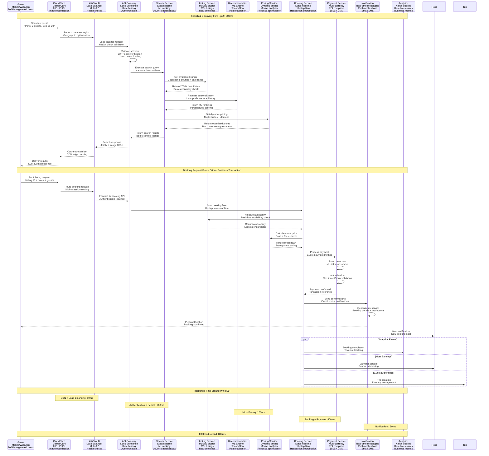
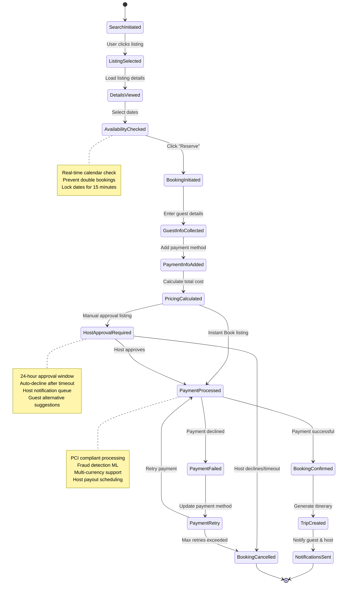
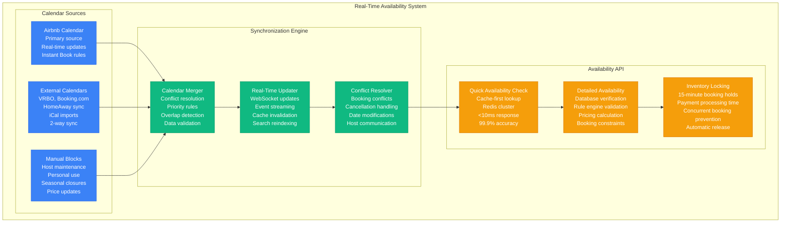

# Airbnb - Request Flow Architecture

## The Guest Journey: From Search to Stay in 12 Steps

This diagram shows how Airbnb processes a complete booking flow, from initial search through payment confirmation, handling millions of searches and thousands of bookings daily.

## Search & Discovery Deep Dive

### ML-Powered Search Ranking

```mermaid
graph TB
    subgraph SearchPipeline[Search & Ranking Pipeline]
        subgraph QueryProcessing[Query Processing]
            QueryParser[Query Parser<br/>Location extraction<br/>Date normalization<br/>Filter validation<br/>Intent understanding]

            LocationService[Location Service<br/>Geocoding<br/>Boundary expansion<br/>Neighborhood mapping<br/>Points of interest]

            InventoryFilter[Inventory Filter<br/>Availability check<br/>Capacity matching<br/>Price range filter<br/>Amenity requirements]
        end

        subgraph CandidateGeneration[Candidate Generation]
            GeoSearch[Geographic Search<br/>Elasticsearch geo queries<br/>Distance sorting<br/>Boundary constraints<br/>10K+ candidates]

            AvailabilityCheck[Availability Check<br/>Calendar service lookup<br/>Real-time inventory<br/>Booking conflicts<br/>Instant book eligible]

            InitialRanking[Initial Ranking<br/>Basic scoring<br/>Distance + price<br/>Photo quality<br/>Host response rate]
        end

        subgraph MLRanking[ML-Powered Ranking]
            FeatureExtraction[Feature Extraction<br/>Listing features: 200+<br/>Host features: 50+<br/>Guest features: 100+<br/>Contextual features: 30+]

            RankingModel[Ranking Model<br/>XGBoost ensemble<br/>Click-through prediction<br/>Booking probability<br/>Revenue optimization]

            PersonalizationLayer[Personalization<br/>User preferences<br/>Search history<br/>Booking patterns<br/>Similar guest behavior]
        end

        subgraph ResultOptimization[Result Optimization]
            DiversityEngine[Diversity Engine<br/>Price range spread<br/>Property type mix<br/>Neighborhood variety<br/>Booking probability balance]

            BusinessRules[Business Rules<br/>Superhost promotion<br/>New listing boost<br/>Quality filters<br/>Policy compliance]

            FinalRanking[Final Ranking<br/>Top 50 results<br/>A/B test variants<br/>Business metrics<br/>User experience optimization]
        end
    end

    QueryParser --> LocationService
    LocationService --> InventoryFilter
    InventoryFilter --> GeoSearch

    GeoSearch --> AvailabilityCheck
    AvailabilityCheck --> InitialRanking
    InitialRanking --> FeatureExtraction

    FeatureExtraction --> RankingModel
    RankingModel --> PersonalizationLayer
    PersonalizationLayer --> DiversityEngine

    DiversityEngine --> BusinessRules
    BusinessRules --> FinalRanking

    classDef queryStyle fill:#3B82F6,stroke:#2563EB,color:#fff
    classDef candidateStyle fill:#10B981,stroke:#059669,color:#fff
    classDef mlStyle fill:#F59E0B,stroke:#D97706,color:#fff
    classDef optimizeStyle fill:#8B5CF6,stroke:#7C3AED,color:#fff

    class QueryParser,LocationService,InventoryFilter queryStyle
    class GeoSearch,AvailabilityCheck,InitialRanking candidateStyle
    class FeatureExtraction,RankingModel,PersonalizationLayer mlStyle
    class DiversityEngine,BusinessRules,FinalRanking optimizeStyle
```

## Booking State Machine Architecture

### 12-Step Booking Process

## Real-Time Availability Management

### Calendar Synchronization System

## Performance Optimization Strategies

### CDN & Caching Strategy
- **CloudFlare CDN**: 95% cache hit rate for images and static content
- **Application Cache**: Redis cluster with 99% hit rate for search results
- **Database Query Cache**: MySQL query cache with 85% hit rate
- **API Response Cache**: 15-minute TTL for listing details

### Search Performance Optimization
- **Elasticsearch Sharding**: Geographic-based sharding for search performance
- **Index Warming**: Pre-warm search indices for popular destinations
- **Result Pagination**: Infinite scroll with 20 results per page
- **Predictive Caching**: Cache popular search queries regionally

### Booking Flow Optimization
- **Optimistic Locking**: Reduce booking conflicts with optimistic concurrency
- **Payment Caching**: Cache payment method validation for faster processing
- **Host Auto-Response**: ML-powered auto-approval for trusted guests
- **Mobile Optimization**: Streamlined mobile booking flow (8 steps vs 12)

## Critical Business Metrics

### Search Performance Metrics
- **Daily Searches**: 100M+ search queries globally
- **Search Conversion**: 3% of searches lead to bookings
- **Search Response Time**: p99 < 300ms globally
- **Search Relevance**: 85% click-through rate on top 3 results

### Booking Performance Metrics
- **Daily Bookings**: 15K+ bookings per day peak (summer)
- **Booking Success Rate**: 94% of initiated bookings complete
- **Payment Success Rate**: 97% first-attempt payment success
- **Host Approval Rate**: 89% for manual approval listings

### Revenue Impact Metrics
- **Gross Merchandise Value**: $50B+ annually
- **Average Booking Value**: $650 per booking
- **Revenue per Search**: $0.32 average
- **Host Payout Processing**: $40B+ paid to hosts since 2008

This request flow architecture enables Airbnb to handle millions of searches and thousands of bookings daily while maintaining a seamless user experience for both guests and hosts across the global marketplace.