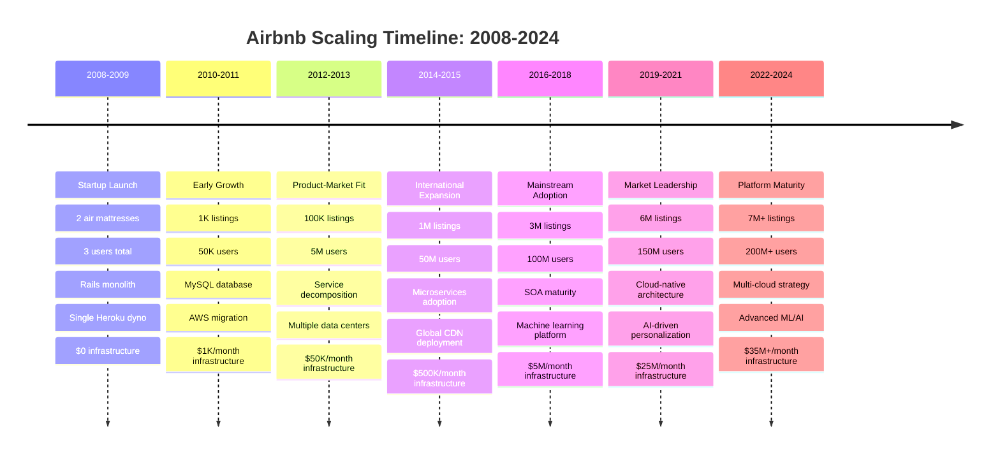
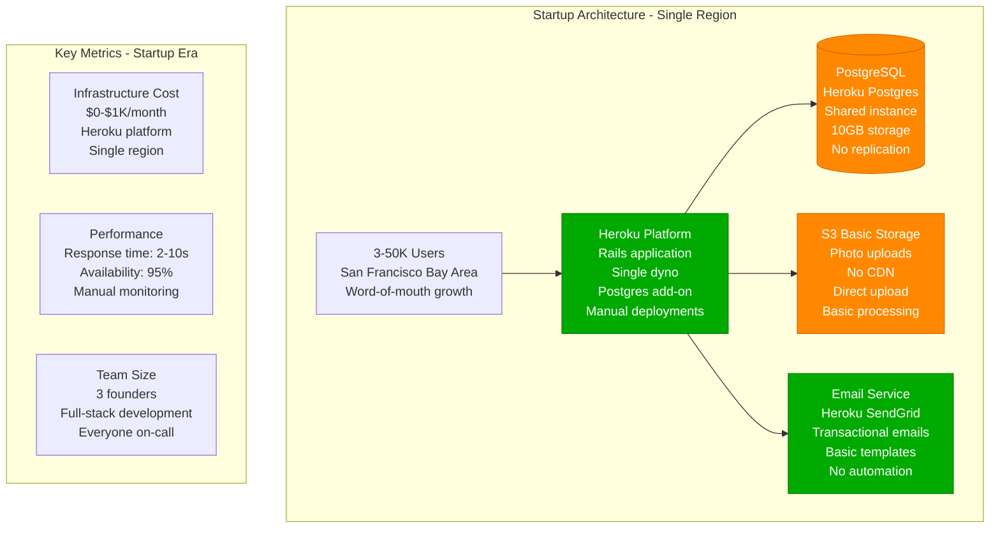
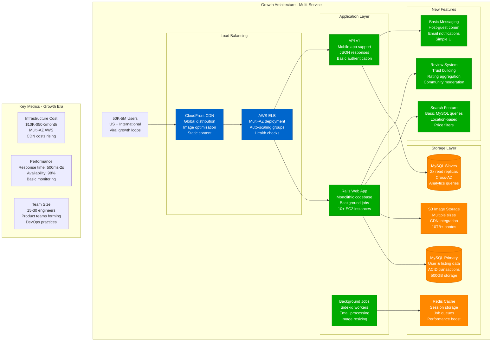
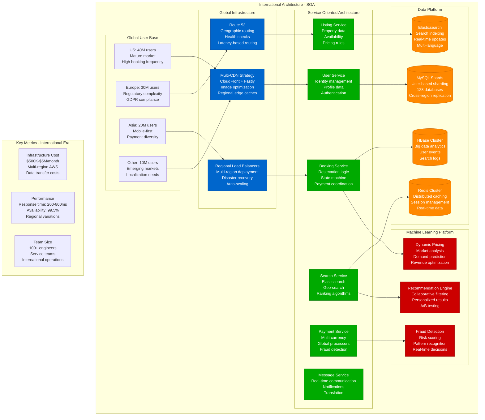
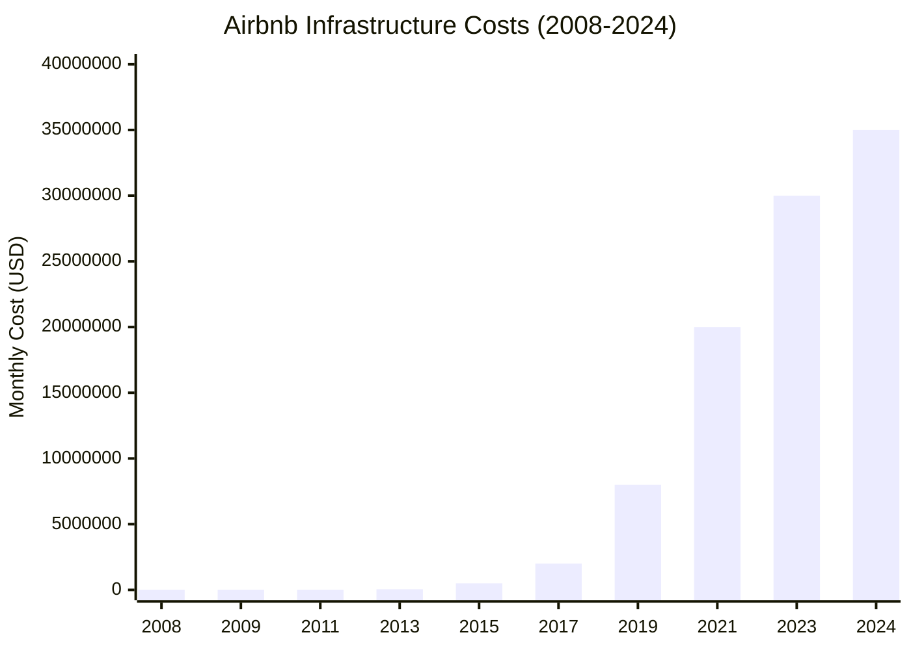
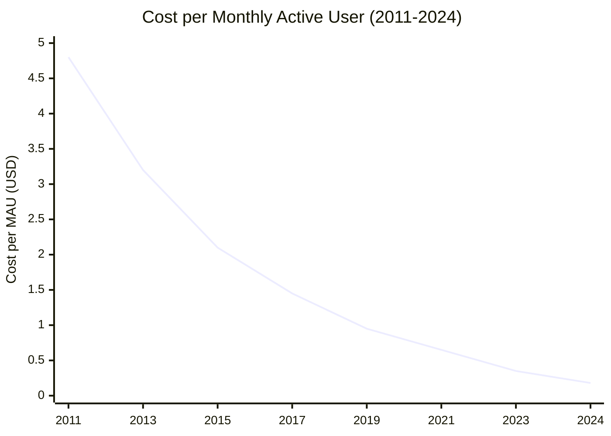

# Airbnb - Scale Evolution Journey

## From Air Mattresses to Global Marketplace: 16-Year Scaling Story

Airbnb's transformation from a Y Combinator startup with air mattresses in San Francisco to serving 200M+ users across 220+ countries reveals critical architectural decisions and scaling challenges.



## Architecture Evolution by Scale

### Era 1: Startup (2008-2011) - 3 to 50K Users



**What Broke**: Database connection limits (20 concurrent), single point of failure, slow photo loading, email delivery issues.

**How They Fixed It**: Migrated to AWS EC2, added MySQL master-slave replication, introduced CloudFront CDN, implemented SES for email.

---

### Era 2: Product-Market Fit (2012-2013) - 50K to 5M Users



**What Broke**: MySQL write bottleneck at 1M users, monolithic deployments blocking feature velocity, image loading slow in international markets.

**How They Fixed It**: Database sharding by user ID, service-oriented architecture introduction, Redis caching layers, international CDN expansion.

---

### Era 3: International Expansion (2014-2018) - 5M to 100M Users



**What Broke**: Cross-service dependencies caused cascading failures, data consistency issues across regions, regulatory compliance challenges, payment processing complexity.

**How They Fixed It**: Circuit breakers and bulkheads, event-driven architecture, regional data compliance, payment service abstraction layer.

---

### Era 4: Current Scale (2019-2024) - 100M to 200M+ Users

```mermaid
graph TB
    subgraph CurrentArch[Current Architecture - Platform Maturity]
        subgraph PlatformServices[Platform Engineering]
            ServiceMesh[Service Mesh<br/>Envoy proxies<br/>mTLS encryption<br/>Traffic management<br/>Observability]

            KubernetesClusters[Kubernetes Clusters<br/>Container orchestration<br/>Multi-region<br/>Auto-scaling<br/>Blue-green deployments]

            APIGateway[API Gateway Platform<br/>Kong Enterprise<br/>Rate limiting<br/>API versioning<br/>Developer portal]
        end

        subgraph AdvancedML[Advanced ML/AI Platform]
            PersonalizationAI[Personalization AI<br/>Deep learning models<br/>Real-time inference<br/>Multi-modal features<br/>Contextual recommendations]

            ComputerVision[Computer Vision<br/>Image quality scoring<br/>Object detection<br/>Scene understanding<br/>Content moderation]

            NLPPlatform[NLP Platform<br/>Review analysis<br/>Search understanding<br/>Content generation<br/>Multi-language support]

            MLOps[MLOps Platform<br/>Model lifecycle<br/>A/B testing<br/>Feature stores<br/>Model monitoring]
        end

        subgraph DataMesh[Data Mesh Architecture]
            RealTimeStreaming[Real-Time Streaming<br/>Apache Kafka<br/>Event sourcing<br/>CQRS patterns<br/>Change data capture]

            DataLake[Data Lake<br/>S3 + Hadoop<br/>Petabyte scale<br/>ML training data<br/>Analytics warehouse]

            FeatureStore[Feature Store<br/>ML feature management<br/>Real-time serving<br/>Feature discovery<br/>Version control]
        end

        subgraph MultiCloudStrategy[Multi-Cloud Strategy]
            AWSPrimary[AWS Primary<br/>Core services<br/>US operations<br/>Compute & storage<br/>70% of workload]

            GCPSecondary[GCP Secondary<br/>ML/AI workloads<br/>BigQuery analytics<br/>TensorFlow serving<br/>20% of workload]

            Azure[Azure Backup<br/>Disaster recovery<br/>European compliance<br/>Government markets<br/>10% of workload]
        end
    end

    %% Current Scale Metrics
    subgraph CurrentMetrics[Current Scale Metrics (2024)]
        Users[200M+ Registered Users<br/>7M+ active listings<br/>1B+ guest arrivals total<br/>220+ countries/regions]

        Performance[Performance SLAs<br/>p99 search: 300ms<br/>99.9% availability<br/>Global platform]

        Infrastructure[Infrastructure Scale<br/>$35M+/month costs<br/>Multi-cloud strategy<br/>Advanced automation]

        Team[Engineering Organization<br/>1000+ engineers<br/>Platform teams<br/>Global operations]
    end

    classDef edgeStyle fill:#0066CC,stroke:#004499,color:#fff
    classDef serviceStyle fill:#00AA00,stroke:#007700,color:#fff
    classDef stateStyle fill:#FF8800,stroke:#CC6600,color:#fff
    classDef controlStyle fill:#CC0000,stroke:#990000,color:#fff

    class ServiceMesh,KubernetesClusters,APIGateway edgeStyle
    class PersonalizationAI,ComputerVision,NLPPlatform,MLOps serviceStyle
    class RealTimeStreaming,DataLake,FeatureStore stateStyle
    class AWSPrimary,GCPSecondary,Azure controlStyle
```

## Cost Evolution Analysis

### Infrastructure Cost Growth by Era



### Cost per User Optimization



## Critical Scaling Decisions

### Technology Migration Timeline

1. **2009**: Basic Heroku → AWS EC2 (infrastructure control)
2. **2011**: PostgreSQL → MySQL (better replication, tooling)
3. **2013**: Monolith → Service-Oriented Architecture (team scaling)
4. **2015**: Custom search → Elasticsearch (search quality)
5. **2017**: VM-based → Containerized deployment (efficiency)
6. **2019**: Homegrown ML → TensorFlow platform (standardization)
7. **2021**: Single cloud → Multi-cloud strategy (risk mitigation)
8. **2023**: Request-response → Event-driven architecture (real-time features)

### Organizational Evolution

- **2008-2010**: Founding team (3 people)
- **2011-2013**: Product teams (25 engineers)
- **2014-2016**: Service teams (100 engineers)
- **2017-2019**: Platform organization (300 engineers)
- **2020-2022**: Product verticals (600 engineers)
- **2023-2024**: Platform engineering focus (1000+ engineers)

## Key Scaling Challenges Overcome

### Database Scaling Solutions

**Challenge**: MySQL write bottleneck at 1M users
**Solution**: User-based sharding across 128 databases
**Result**: Linear write scaling to 200M+ users

**Challenge**: Cross-shard query complexity
**Solution**: Event sourcing + CQRS pattern
**Result**: Real-time data consistency across services

### Search & Discovery at Scale

**Challenge**: MySQL-based search couldn't handle complex geo-queries
**Solution**: Elasticsearch with custom ranking algorithms
**Result**: Sub-300ms search responses globally

**Challenge**: Personalization with cold start problems
**Solution**: Multi-armed bandit algorithms + collaborative filtering
**Result**: 35% improvement in booking conversion rates

### Payment Processing Complexity

**Challenge**: 190+ currencies, local payment methods, compliance
**Solution**: Payment service abstraction with regional adapters
**Result**: 97% payment success rate globally

### Regulatory Compliance at Scale

**Challenge**: GDPR, local tax laws, data residency requirements
**Solution**: Data sovereignty architecture with regional compliance
**Result**: Compliant operations in all 220+ markets

## Lessons Learned

### What Worked Well

1. **Early Investment in Data**: Started tracking detailed metrics early
2. **Service Boundaries**: Clear ownership and APIs between teams
3. **Platform Thinking**: Invested in internal tools and platforms
4. **Global Architecture**: Designed for international expansion from day one
5. **ML Integration**: Early adoption of machine learning for core features

### What Could Have Been Better

1. **Premature Optimization**: Over-engineered solutions before reaching scale
2. **Service Proliferation**: Too many small services created operational complexity
3. **Data Consistency**: Eventual consistency caused user experience issues
4. **Monitoring Gaps**: Insufficient observability during rapid growth phases
5. **Technical Debt**: Deferred refactoring caused major rewrites later

### Scaling Principles Applied

1. **Measure Everything**: Data-driven scaling decisions
2. **Graceful Degradation**: Non-critical features fail gracefully
3. **Regional Thinking**: Architecture designed for global compliance
4. **Platform Investment**: Internal tools accelerate feature development
5. **Organizational Scaling**: Architecture mirrors team structure

This scaling journey demonstrates how Airbnb evolved from a simple Rails application to a global marketplace platform, with infrastructure costs growing from $0 to $35M+/month while serving 200M+ users across 220+ countries.