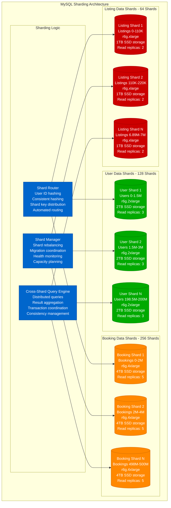
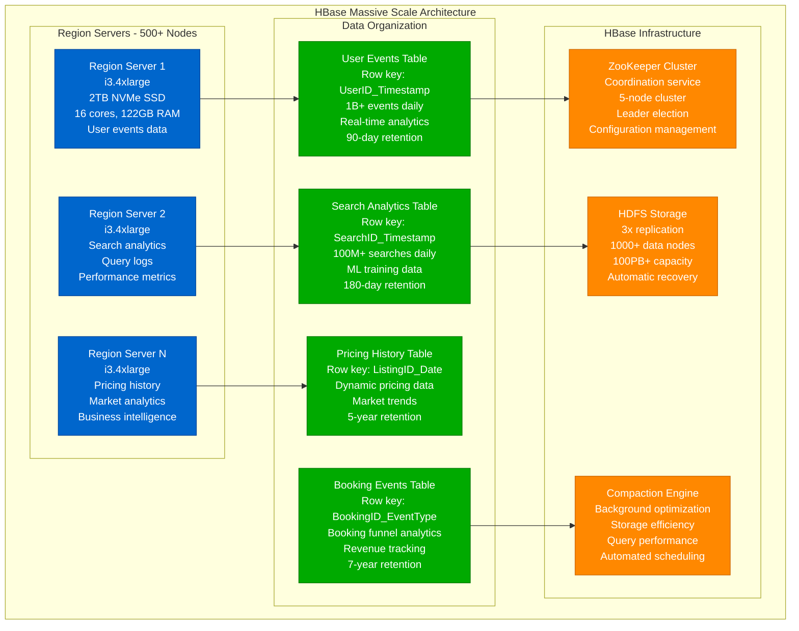
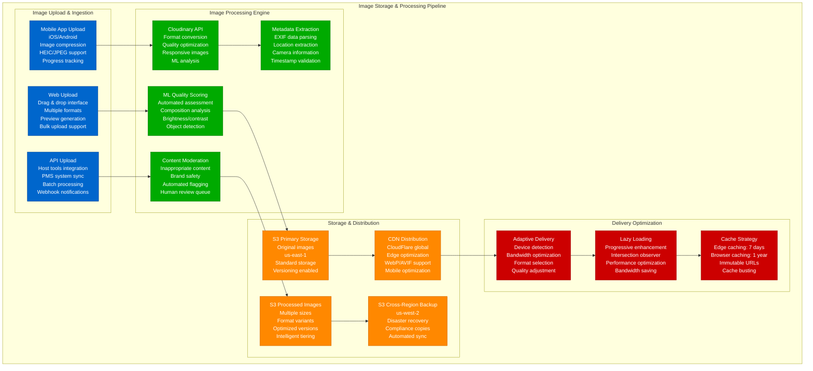
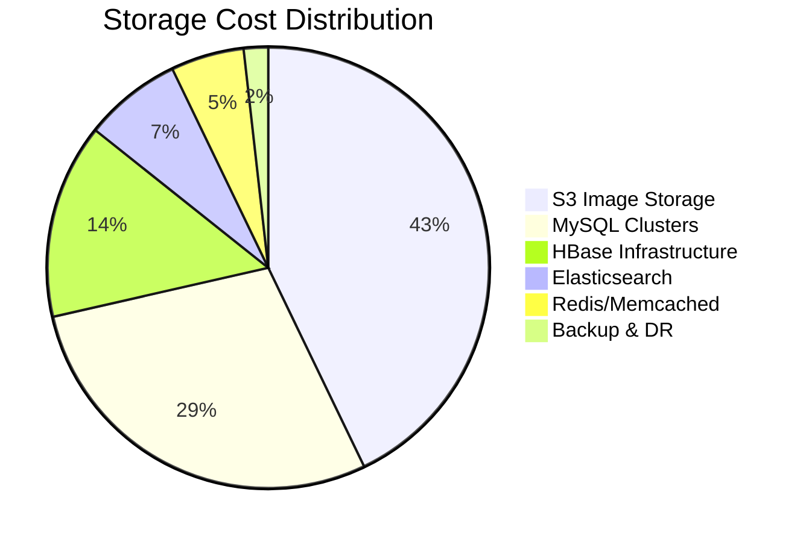

# Airbnb - Storage Architecture

## Multi-Petabyte Marketplace Data: 7M+ Listings, 200M+ Users, 10B+ Photos

Airbnb's storage architecture manages one of the world's largest accommodation datasets while supporting real-time bookings, search, and global marketplace operations.

```mermaid
graph TB
    subgraph EdgePlane[Edge Plane - Content Delivery]
        ImageCDN[CloudFlare Image CDN<br/>10B+ photos served<br/>Global optimization<br/>WebP/AVIF conversion<br/>200+ PoPs worldwide]

        StaticCDN[AWS CloudFront<br/>Static assets<br/>API response caching<br/>Edge optimization<br/>99.9% availability]

        DynamicCache[Fastly Dynamic CDN<br/>Search results<br/>API acceleration<br/>Real-time purging<br/>Geographic optimization]
    end

    subgraph ServicePlane[Service Plane - Data Access Layer]
        DataAccessLayer[Data Access Layer<br/>Connection pooling<br/>Query optimization<br/>Circuit breakers<br/>Retry mechanisms]

        CacheAside[Cache-Aside Pattern<br/>Redis cluster<br/>99% hit rate<br/>Multi-tier caching<br/>Intelligent expiration]

        SearchLayer[Search Layer<br/>Elasticsearch cluster<br/>Index management<br/>Query optimization<br/>Result caching]
    end

    subgraph StatePlane[State Plane - Core Storage Systems]
        subgraph TransactionalData[Transactional Data - ACID Compliance]
            MySQLPrimary[(MySQL Primary<br/>Core business logic<br/>Users: 200M+ profiles<br/>Listings: 7M+ properties<br/>Bookings: 500M+ transactions<br/>ACID compliance)]

            MySQLReplicas[(MySQL Read Replicas<br/>5x geographic replicas<br/>Read scaling<br/>Analytics queries<br/>Backup & recovery<br/>Cross-region sync)]

            MySQLShards[(MySQL Sharded Clusters<br/>User-based sharding<br/>Horizontal scaling<br/>1000+ databases<br/>Automated balancing)]
        end

        subgraph TimeSeriesData[Time-Series & Analytics]
            HBase[(HBase Cluster<br/>Massive scale NoSQL<br/>User events: 1B+ daily<br/>Search analytics<br/>Pricing history<br/>100TB+ monthly growth)]

            Druid[(Apache Druid<br/>Real-time analytics<br/>OLAP queries<br/>Business dashboards<br/>Host earnings<br/>Market insights)]

            InfluxDB[(InfluxDB<br/>Operational metrics<br/>Application performance<br/>Infrastructure monitoring<br/>Time-series optimization)]
        end

        subgraph SearchStorage[Search & Discovery]
            ElasticsearchMain[(Elasticsearch Primary<br/>Listing search index<br/>7M+ documents<br/>Complex geo-queries<br/>Real-time updates)]

            ElasticsearchReplicas[(Elasticsearch Replicas<br/>Multi-AZ deployment<br/>Read scaling<br/>Disaster recovery<br/>Search performance)]

            SolrLegacy[(Apache Solr<br/>Legacy search system<br/>Migration in progress<br/>Parallel processing<br/>Gradual deprecation)]
        end

        subgraph CacheStorage[High-Performance Caching]
            RedisCluster[(Redis Cluster<br/>Session management<br/>API response cache<br/>Search result cache<br/>100M+ active sessions)]

            MemcachedPool[(Memcached Pool<br/>Database query cache<br/>Object caching<br/>Legacy support<br/>High throughput)]

            ApplicationCache[Application-Level Cache<br/>In-memory caching<br/>JVM heap optimization<br/>Local cache layers<br/>Distributed invalidation]
        end

        subgraph ContentStorage[Content & Media Storage]
            S3Images[S3 - Image Storage<br/>10B+ photos<br/>Multiple resolutions<br/>Automated backups<br/>Lifecycle policies<br/>200TB+ monthly growth]

            S3Documents[S3 - Document Storage<br/>Legal documents<br/>Host verification<br/>Government IDs<br/>Contract storage<br/>Compliance retention]

            CloudinaryProcessing[Cloudinary<br/>Image processing<br/>Dynamic optimization<br/>Format conversion<br/>ML image analysis<br/>Quality scoring]

            VideoStorage[S3 - Video Storage<br/>Property videos<br/>Virtual tours<br/>Experience content<br/>Streaming optimization<br/>Adaptive bitrate]
        end

        subgraph ArchiveStorage[Archive & Compliance]
            GlacierArchive[S3 Glacier<br/>Long-term archival<br/>Compliance data<br/>7-year retention<br/>Legal discovery<br/>Cost optimization]

            BackupStorage[Cross-Region Backup<br/>Disaster recovery<br/>Point-in-time recovery<br/>Geographic distribution<br/>Automated testing]

            AuditLogs[Audit Log Storage<br/>Compliance tracking<br/>Access logs<br/>Change history<br/>Regulatory reporting]
        end
    end

    subgraph ControlPlane[Control Plane - Data Operations]
        DataPipelines[Data Pipeline Platform<br/>Apache Airflow<br/>ETL orchestration<br/>10K+ daily jobs<br/>Dependency management]

        MonitoringStack[Data Monitoring<br/>DataDog integration<br/>Query performance<br/>Storage metrics<br/>Cost optimization]

        BackupSystem[Backup & Recovery<br/>Automated backups<br/>Cross-region replication<br/>Recovery testing<br/>RTO/RPO compliance]

        SecurityControls[Data Security<br/>Encryption at rest<br/>Access controls<br/>Data masking<br/>PII protection]
    end

    %% Data Flow Connections
    Users[200M+ Users<br/>Global marketplace] --> ImageCDN
    ImageCDN --> StaticCDN
    StaticCDN --> DynamicCache
    DynamicCache --> DataAccessLayer

    DataAccessLayer --> CacheAside
    DataAccessLayer --> SearchLayer
    CacheAside --> RedisCluster

    %% Transactional Data Flow
    DataAccessLayer --> MySQLPrimary
    MySQLPrimary --> MySQLReplicas
    MySQLPrimary --> MySQLShards

    %% Analytics Data Flow
    DataAccessLayer --> HBase
    HBase --> Druid
    MySQLPrimary --> InfluxDB

    %% Search Data Flow
    SearchLayer --> ElasticsearchMain
    ElasticsearchMain --> ElasticsearchReplicas
    SearchLayer --> SolrLegacy

    %% Cache Layers
    CacheAside --> MemcachedPool
    CacheAside --> ApplicationCache

    %% Content Management
    DataAccessLayer --> S3Images
    S3Images --> CloudinaryProcessing
    DataAccessLayer --> S3Documents
    DataAccessLayer --> VideoStorage

    %% Archive & Compliance
    MySQLPrimary --> GlacierArchive
    S3Images --> BackupStorage
    DataAccessLayer --> AuditLogs

    %% Control Plane
    DataPipelines --> HBase
    DataPipelines --> Druid
    MonitoringStack --> MySQLPrimary
    BackupSystem --> MySQLReplicas
    SecurityControls --> S3Documents

    %% Apply four-plane colors
    classDef edgeStyle fill:#0066CC,stroke:#004499,color:#fff
    classDef serviceStyle fill:#00AA00,stroke:#007700,color:#fff
    classDef stateStyle fill:#FF8800,stroke:#CC6600,color:#fff
    classDef controlStyle fill:#CC0000,stroke:#990000,color:#fff

    class ImageCDN,StaticCDN,DynamicCache edgeStyle
    class DataAccessLayer,CacheAside,SearchLayer serviceStyle
    class MySQLPrimary,MySQLReplicas,MySQLShards,HBase,Druid,InfluxDB,ElasticsearchMain,ElasticsearchReplicas,SolrLegacy,RedisCluster,MemcachedPool,ApplicationCache,S3Images,S3Documents,CloudinaryProcessing,VideoStorage,GlacierArchive,BackupStorage,AuditLogs stateStyle
    class DataPipelines,MonitoringStack,BackupSystem,SecurityControls controlStyle
```

## Storage System Deep Dive

### MySQL Sharding Strategy

**MySQL Sharding Performance Metrics:**
- **Total Shards**: 448 shards across all data types
- **Shard Size**: 1-4TB per shard, auto-scaling based on growth
- **Query Performance**: p99 < 50ms for single-shard queries
- **Cross-Shard Queries**: p99 < 200ms for aggregation queries
- **Replication Lag**: <100ms for read replicas
- **Failover Time**: <60 seconds automated failover

### HBase Big Data Architecture

**HBase Performance Specifications:**
- **Cluster Size**: 500+ region servers across multiple data centers
- **Daily Ingestion**: 1B+ events, 100TB+ daily data ingestion
- **Query Performance**: p99 < 10ms for point lookups, p99 < 100ms for scans
- **Storage Efficiency**: 70% compression ratio with Snappy compression
- **Availability**: 99.99% uptime with automatic failover
- **Throughput**: 10M+ reads/writes per second peak capacity

### Image Storage & Processing Pipeline

## Storage Cost Analysis

### Annual Storage Costs - $280M Total

**Cost Breakdown by Category:**
- **S3 Image Storage**: $120M (43%) - 10B+ photos, multiple formats
- **MySQL Clusters**: $80M (29%) - Compute + storage for sharded databases
- **HBase Infrastructure**: $40M (14%) - Big data analytics platform
- **Elasticsearch**: $20M (7%) - Search indices and query processing
- **Redis/Memcached**: $15M (5%) - High-performance caching layers
- **Backup & DR**: $5M (2%) - Cross-region backup and compliance

### Storage Optimization Strategies

**Intelligent Tiering (30% cost savings):**
- Hot data (accessed daily): Standard storage
- Warm data (accessed weekly): Infrequent Access storage
- Cold data (accessed monthly): Glacier storage
- Archive data (compliance): Deep Archive storage

**Compression & Deduplication (25% savings):**
- Image compression: WebP format saves 30% vs JPEG
- Database compression: InnoDB compression saves 40%
- HBase compression: Snappy compression saves 70%
- Duplicate detection: 5% storage savings across all images

**Geographic Distribution (20% cost savings):**
- Regional storage placement reduces egress costs
- Local processing reduces cross-region transfer
- Edge caching reduces origin requests by 95%
- Smart routing minimizes expensive data paths

This storage architecture enables Airbnb to manage petabytes of data while maintaining sub-second query performance and supporting millions of concurrent users across the global marketplace platform.