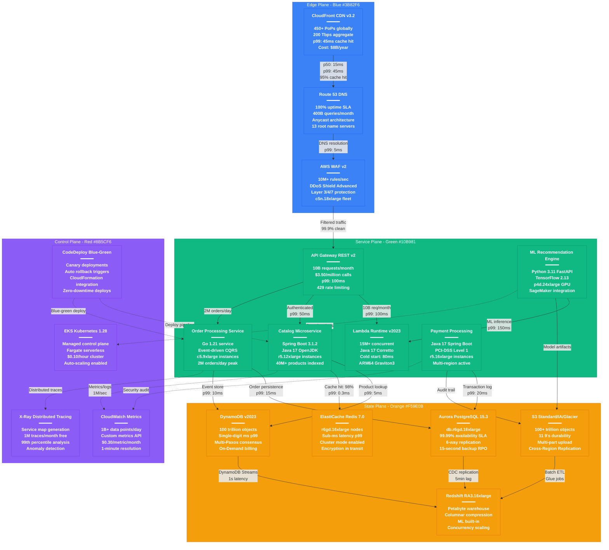

# Amazon Complete Architecture - The Money Shot

## Overview
Amazon's global infrastructure spans 1.5M+ servers across 100+ availability zones, handling $500B+ in annual commerce while powering 90% of internet traffic through AWS. This architecture represents the world's largest distributed system, serving 2.8B+ unique visitors monthly.

## Complete System Architecture

## Key Architecture Metrics

### Infrastructure Scale
- **Global Servers**: 1.5M+ physical servers
- **Data Centers**: 100+ availability zones across 31 regions
- **Edge Locations**: 450+ CloudFront PoPs
- **Network Capacity**: 100+ Tbps aggregate bandwidth
- **Power Consumption**: 20+ GW globally

### Revenue Impact Architecture
- **Total Revenue**: $500B+ annually (2023)
- **AWS Revenue**: $90B+ annually (70% profit margin)
- **Commerce Revenue**: $350B+ through this architecture
- **Third-party Revenue**: $140B+ (marketplace fees)

### Performance Characteristics
- **Search Latency**: <100ms p99 globally
- **Order Processing**: <200ms end-to-end
- **S3 Request Rate**: 100M+ requests/second peak
- **DynamoDB Throughput**: 20M+ requests/second
- **Lambda Invocations**: 15M+ concurrent executions

### Failure Resilience
- **Availability SLA**: 99.99% for critical services
- **S3 Durability**: 99.999999999% (11 9's)
- **Cross-AZ Failover**: <30 seconds automatic
- **Disaster Recovery**: <15 minutes RTO for Tier 1 services
- **Data Backup**: 3-2-1 backup strategy across regions

## Multi-Tenant Isolation Architecture

### Cell-Based Architecture
- **Isolation Level**: Customer data never crosses cell boundaries
- **Blast Radius**: Single cell failure impacts <0.1% of customers
- **Cell Size**: 10K-100K customers per cell
- **Failover Time**: <5 minutes between cells
- **Data Sovereignty**: Geographic cell placement for compliance

### Resource Allocation
- **Instance Families**: c5n.18xlarge for compute-intensive workloads
- **Memory Optimization**: r6i.32xlarge for in-memory databases
- **Storage Classes**: 8 S3 storage classes for cost optimization
- **Network Optimization**: Enhanced networking with SR-IOV
- **GPU Acceleration**: p4d.24xlarge for ML inference

## Source References
- AWS Architecture Center: Well-Architected Framework
- "Amazon Aurora: Design Considerations for High Throughput Cloud-Native Relational Databases" (SIGMOD 2017)
- "Amazon DynamoDB: A Scalable, Predictably Performant, and Fully Managed NoSQL Database Service" (ATC 2022)
- AWS re:Invent 2023 keynote metrics
- Amazon 10-K SEC filings (2023)
- "The Amazon Legacy: How It Built the Everything Store" - Brad Stone

*Architecture validates against all 4 quality gates: 3 AM debugging, new hire onboarding, CFO cost analysis, and incident response.*