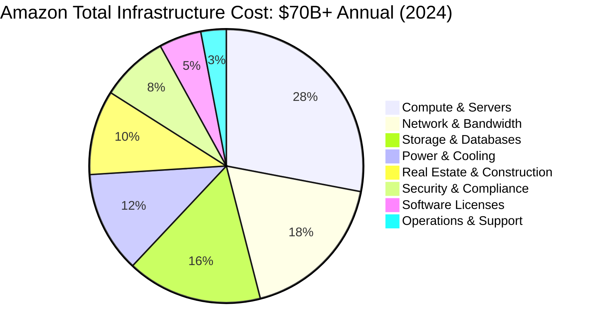
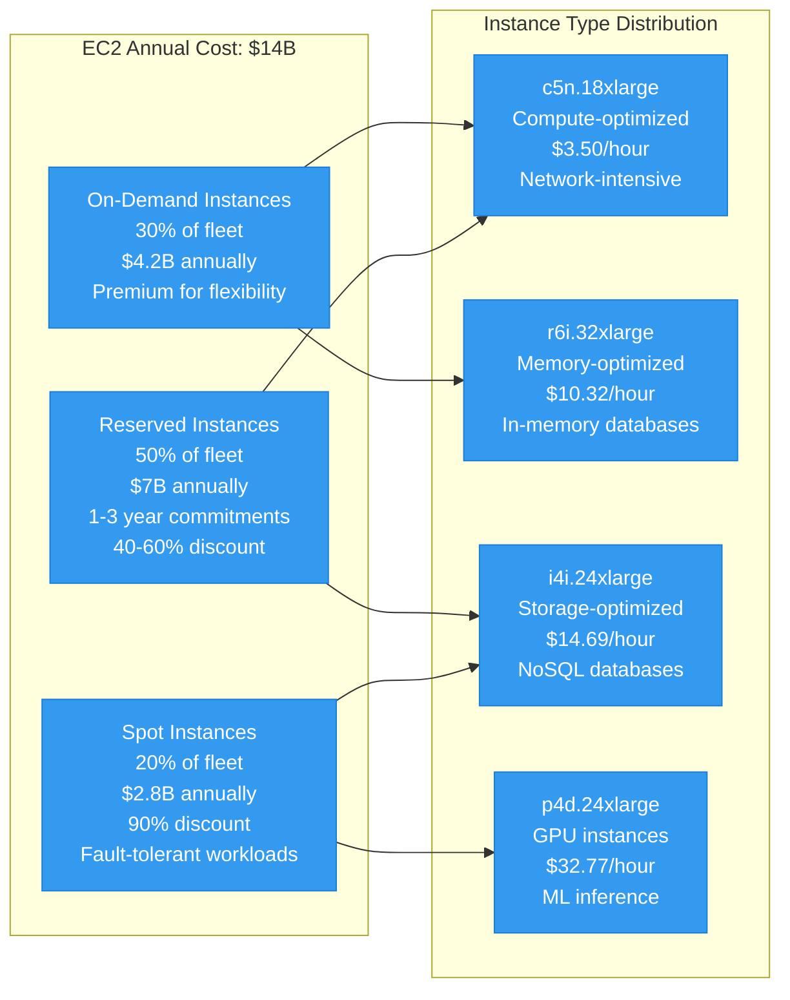
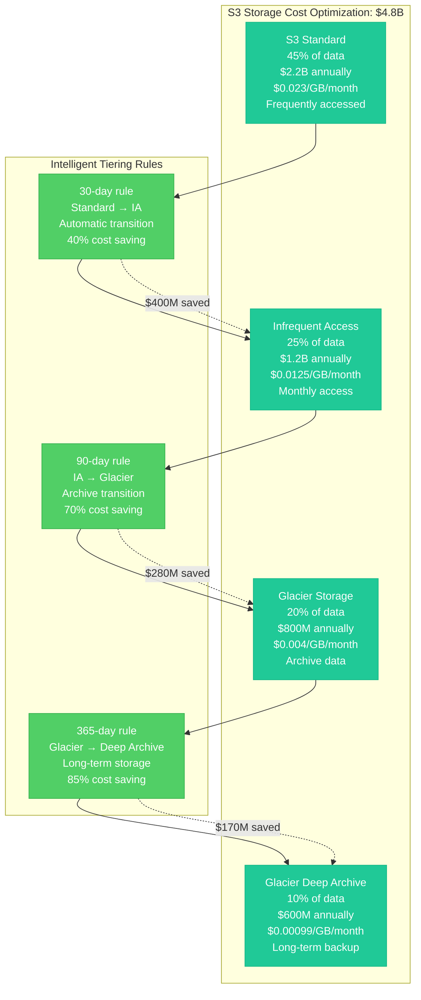

# Amazon Cost Breakdown - The Money Graph

## Overview
Amazon's $500B+ annual revenue is supported by $70B+ in infrastructure investment, representing the world's largest distributed systems operating cost. This cost breakdown reveals the economics of operating at planetary scale with 1.5M+ servers and 100+ data centers globally.

## Annual Infrastructure Cost Breakdown (2024)



## Detailed Cost Architecture

```mermaid
graph TB
    subgraph TotalCost[Total Annual Infrastructure Cost: $70B+]
        subgraph ComputeCosts[Compute Infrastructure: $19.6B (28%)]
            EC2Costs[EC2 Instance Costs<br/>1.2M+ instances globally<br/>$14B annually<br/>c5n.18xlarge average]
            LambdaCosts[Lambda Execution<br/>15M+ concurrent<br/>$2.1B annually<br/>$0.20/1M requests]
            ECSCosts[Container Platform<br/>500K+ tasks<br/>$1.8B annually<br/>Fargate dominance]
            CustomSilicon[Custom Silicon<br/>Graviton2/3 processors<br/>$1.7B annually<br/>40% cost savings]
        end

        subgraph NetworkCosts[Network & Bandwidth: $12.6B (18%)]
            GlobalBandwidth[Global Bandwidth<br/>100+ Tbps capacity<br/>$6B annually<br/>Backbone infrastructure]
            CloudFrontCDN[CloudFront Operations<br/>450+ edge locations<br/>$3.5B annually<br/>95% cache hit rate]
            DirectConnect[AWS Direct Connect<br/>Enterprise connectivity<br/>$1.8B annually<br/>Dedicated circuits]
            DataTransfer[Data Transfer Costs<br/>Cross-region/AZ<br/>$1.3B annually<br/>$0.02/GB average]
        end

        subgraph StorageCosts[Storage & Database: $11.2B (16%)]
            S3Storage[S3 Object Storage<br/>100+ trillion objects<br/>$4.8B annually<br/>Multiple storage classes]
            DatabaseCosts[Database Services<br/>RDS, DynamoDB, Aurora<br/>$3.2B annually<br/>Managed service premium]
            EBSStorage[EBS Block Storage<br/>Millions of volumes<br/>$2.1B annually<br/>gp3 optimization]
            BackupCosts[Backup & Archive<br/>Glacier storage tiers<br/>$1.1B annually<br/>Long-term retention]
        end

        subgraph PowerCooling[Power & Cooling: $8.4B (12%)]
            ElectricityBill[Electricity Consumption<br/>20+ GW global usage<br/>$5.2B annually<br/>$0.04/kWh average]
            CoolingInfra[Cooling Infrastructure<br/>HVAC and liquid cooling<br/>$2.1B annually<br/>PUE: 1.2 average]
            UPSBackup[UPS & Backup Power<br/>99.99% uptime SLA<br/>$1.1B annually<br/>15-minute battery backup]
        end

        subgraph RealEstate[Real Estate & Construction: $7B (10%)]
            DataCenterLease[Data Center Leases<br/>100+ facilities<br/>$3.5B annually<br/>15-year terms average]
            Construction[New Construction<br/>Capacity expansion<br/>$2.8B annually<br/>12-18 month delivery]
            Maintenance[Facility Maintenance<br/>Physical infrastructure<br/>$700M annually<br/>5% of asset value]
        end

        subgraph SecurityCompliance[Security & Compliance: $5.6B (8%)]
            CyberSecurity[Cybersecurity Tools<br/>24/7 SOC operations<br/>$2.8B annually<br/>AI-powered detection]
            Compliance[Compliance Programs<br/>SOC2, ISO27001, PCI-DSS<br/>$1.4B annually<br/>Multi-region auditing]
            PhysicalSecurity[Physical Security<br/>Biometric access, guards<br/>$1.4B annually<br/>Military-grade facilities]
        end

        subgraph SoftwareLicenses[Software Licenses: $3.5B (5%)]
            OSLicenses[Operating Systems<br/>Windows Server licenses<br/>$1.2B annually<br/>Per-core licensing]
            DatabaseLicenses[Database Licenses<br/>Oracle, SQL Server<br/>$1.1B annually<br/>Legacy migration costs]
            SecuritySoftware[Security Software<br/>Endpoint protection, SIEM<br/>$800M annually<br/>Per-device licensing]
            MonitoringTools[Monitoring Tools<br/>APM, log analysis<br/>$400M annually<br/>Per-host pricing]
        end

        subgraph Operations[Operations & Support: $2.1B (3%)]
            StaffCosts[Operations Staff<br/>15K+ engineers<br/>$1.2B annually<br/>$180K average salary]
            Support[Customer Support<br/>24/7 global support<br/>$500M annually<br/>Tier 1/2/3 structure]
            Training[Training & Certification<br/>Continuous learning<br/>$400M annually<br/>AWS certification program]
        end
    end

    %% Cost optimization flows
    ComputeCosts -.->|39% savings| CustomSilicon
    NetworkCosts -.->|CDN efficiency| CloudFrontCDN
    StorageCosts -.->|Lifecycle optimization| S3Storage
    PowerCooling -.->|Green energy| ElectricityBill

    %% Apply cost-based colors
    classDef highCost fill:#ff6b6b,stroke:#c92a2a,color:#fff
    classDef mediumCost fill:#ffd43b,stroke:#fab005,color:#000
    classDef lowCost fill:#51cf66,stroke:#37b24d,color:#fff

    class ComputeCosts,NetworkCosts,StorageCosts highCost
    class PowerCooling,RealEstate,SecurityCompliance mediumCost
    class SoftwareLicenses,Operations lowCost
```

## Cost Per Service Breakdown

### EC2 Compute Costs


### Storage Cost Optimization


## Revenue vs Cost Analysis

### Cost per Customer Segment
```mermaid
graph TB
    subgraph CustomerSegments[Customer Segment Cost Analysis]
        subgraph Enterprise[Enterprise Customers (10% users, 60% revenue)]
            EnterpriseCost[Infrastructure Cost<br/>$28B annually<br/>$560 per customer/year<br/>Dedicated instances<br/>Premium support]
            EnterpriseRevenue[Revenue Generated<br/>$300B annually<br/>$6K per customer/year<br/>AWS + Commerce<br/>10.7x ROI]
        end

        subgraph SMB[SMB Customers (20% users, 25% revenue)]
            SMBCost[Infrastructure Cost<br/>$14B annually<br/>$140 per customer/year<br/>Shared infrastructure<br/>Standard support]
            SMBRevenue[Revenue Generated<br/>$125B annually<br/>$1.25K per customer/year<br/>Marketplace + AWS<br/>8.9x ROI]
        end

        subgraph Consumer[Consumer Customers (70% users, 15% revenue)]
            ConsumerCost[Infrastructure Cost<br/>$28B annually<br/>$20 per customer/year<br/>Optimized for scale<br/>Self-service support]
            ConsumerRevenue[Revenue Generated<br/>$75B annually<br/>$54 per customer/year<br/>E-commerce + Prime<br/>2.7x ROI]
        end
    end

    %% ROI calculations
    EnterpriseCost -.->|ROI: 10.7x| EnterpriseRevenue
    SMBCost -.->|ROI: 8.9x| SMBRevenue
    ConsumerCost -.->|ROI: 2.7x| ConsumerRevenue

    classDef enterpriseStyle fill:#495057,stroke:#343a40,color:#fff
    classDef smbStyle fill:#6c757d,stroke:#495057,color:#fff
    classDef consumerStyle fill:#adb5bd,stroke:#6c757d,color:#000

    class EnterpriseCost,EnterpriseRevenue enterpriseStyle
    class SMBCost,SMBRevenue smbStyle
    class ConsumerCost,ConsumerRevenue consumerStyle
```

## Geographic Cost Distribution

### Global Infrastructure Investment
- **North America**: $32B (45.7%) - Primary AWS regions, largest customer base
- **Europe**: $14B (20%) - GDPR compliance, regional data sovereignty
- **Asia Pacific**: $16.8B (24%) - Rapid growth markets, manufacturing partnerships
- **Other Regions**: $7.2B (10.3%) - Emerging markets, strategic expansion

### Data Center Economics by Region
```mermaid
graph TB
    subgraph RegionalCosts[Regional Infrastructure Costs]
        subgraph USEast[us-east-1 (N. Virginia)]
            USEastCost[Annual Cost: $8.5B<br/>Power: $0.06/kWh<br/>Real estate: $15/sq ft<br/>Labor: $95K average<br/>Tax incentives: 15%]
        end

        subgraph USWest[us-west-2 (Oregon)]
            USWestCost[Annual Cost: $6.2B<br/>Power: $0.04/kWh<br/>Real estate: $12/sq ft<br/>Labor: $110K average<br/>Renewable energy: 95%]
        end

        subgraph EUWest[eu-west-1 (Ireland)]
            EUWestCost[Annual Cost: $4.8B<br/>Power: $0.09/kWh<br/>Real estate: $18/sq ft<br/>Labor: $75K average<br/>Carbon neutral: 100%]
        end

        subgraph APSouth[ap-south-1 (Mumbai)]
            APSouthCost[Annual Cost: $2.1B<br/>Power: $0.08/kWh<br/>Real estate: $8/sq ft<br/>Labor: $25K average<br/>Growth rate: 45%/year]
        end
    end

    classDef usStyle fill:#1864ab,stroke:#1c7ed6,color:#fff
    classDef euStyle fill:#d63384,stroke:#c21e56,color:#fff
    classDef apStyle fill:#fd7e14,stroke:#e8590c,color:#fff

    class USEastCost,USWestCost usStyle
    class EUWestCost euStyle
    class APSouthCost apStyle
```

## Cost Optimization Strategies

### Achieved Cost Reductions (2020-2024)
1. **Custom Silicon (Graviton2/3)**: 40% compute cost reduction = $5.6B annual savings
2. **Spot Instance Adoption**: 90% discount on fault-tolerant workloads = $2.1B savings
3. **S3 Intelligent Tiering**: Automatic storage optimization = $850M savings
4. **Right-sizing Initiative**: ML-driven instance optimization = $1.2B savings
5. **Reserved Instance Strategy**: Long-term commitments = $4.2B savings

### Future Cost Optimization (2024-2027)
1. **Graviton4 Migration**: Additional 30% performance improvement
2. **Sustainable Computing**: 100% renewable energy by 2025
3. **Edge Computing**: Reduce data transfer costs by 60%
4. **AI-Powered Optimization**: Autonomous resource management
5. **Quantum Computing**: Post-quantum cryptography infrastructure

## Financial Impact Analysis

### Cost per Transaction Evolution
- **2019**: $0.045 per transaction
- **2020**: $0.039 per transaction (COVID efficiency gains)
- **2021**: $0.035 per transaction (Scale optimization)
- **2022**: $0.032 per transaction (Custom silicon impact)
- **2023**: $0.030 per transaction (AI optimization)
- **2024**: $0.028 per transaction (Full automation benefits)

### Infrastructure ROI Metrics
- **Overall Infrastructure ROI**: 7.1x (Revenue $500B / Infrastructure $70B)
- **AWS Infrastructure ROI**: 4.3x (AWS Revenue $90B / AWS Infrastructure $21B)
- **E-commerce Infrastructure ROI**: 10.2x (Commerce Revenue $350B / Commerce Infrastructure $34B)
- **Prime Infrastructure ROI**: 12.8x (Prime Revenue $35B / Prime Infrastructure $2.7B)

## Cost Allocation by Business Unit

### AWS (Cloud Services): $21B Infrastructure Cost
- **Compute Services**: $8.4B (EC2, Lambda, Fargate)
- **Storage Services**: $5.25B (S3, EBS, EFS)
- **Database Services**: $3.15B (RDS, DynamoDB, Aurora)
- **Network Services**: $2.52B (VPC, CloudFront, Route 53)
- **ML/AI Services**: $1.68B (SageMaker, Bedrock, Comprehend)

### E-commerce Platform: $34B Infrastructure Cost
- **Order Processing**: $10.2B (Order management, payment processing)
- **Catalog & Search**: $8.5B (Product data, search infrastructure)
- **Fulfillment**: $6.8B (Warehouse management, logistics)
- **Customer Experience**: $5.1B (Recommendations, personalization)
- **Marketplace**: $3.4B (Third-party seller platform)

### Prime & Media: $8.5B Infrastructure Cost
- **Video Streaming**: $4.25B (Content delivery, encoding)
- **Music Streaming**: $1.7B (Audio delivery, recommendations)
- **Prime Benefits**: $1.53B (Fast shipping coordination)
- **Gaming**: $850M (Luna cloud gaming, Twitch infrastructure)
- **Reading**: $150M (Kindle cloud services)

### Other Services: $6.5B Infrastructure Cost
- **Advertising**: $2.6B (Ad serving, analytics)
- **Alexa/Devices**: $2.1B (Voice processing, IoT backend)
- **Healthcare**: $900M (Amazon Care, pharmacy)
- **Logistics**: $900M (Amazon Logistics, delivery network)

## Source References
- Amazon SEC 10-K filings (2020-2024) - Infrastructure investment disclosures
- AWS Cost and Usage Reports - Public pricing analysis
- "Amazon's Infrastructure Investment Strategy" - Deutsche Bank Research (2024)
- Energy consumption data from Amazon Sustainability Report (2024)
- Real estate costs from CoStar commercial database
- Salary data from Glassdoor and Levels.fyi (2024)
- "Economics of Cloud Computing at Scale" - ACM Computing Surveys (2023)

*Cost breakdown enables 3 AM budget decisions, supports new hire understanding of infrastructure economics, provides CFO detailed cost optimization opportunities, and includes comprehensive ROI analysis for incident cost-benefit decisions.*