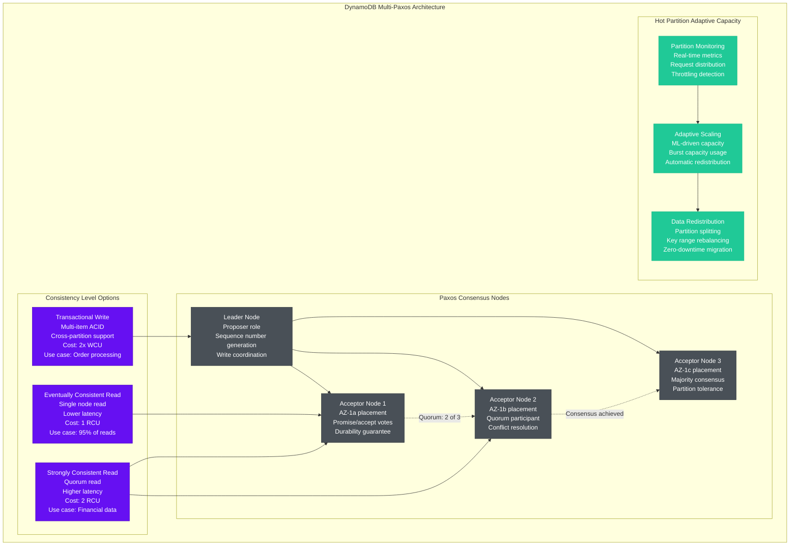
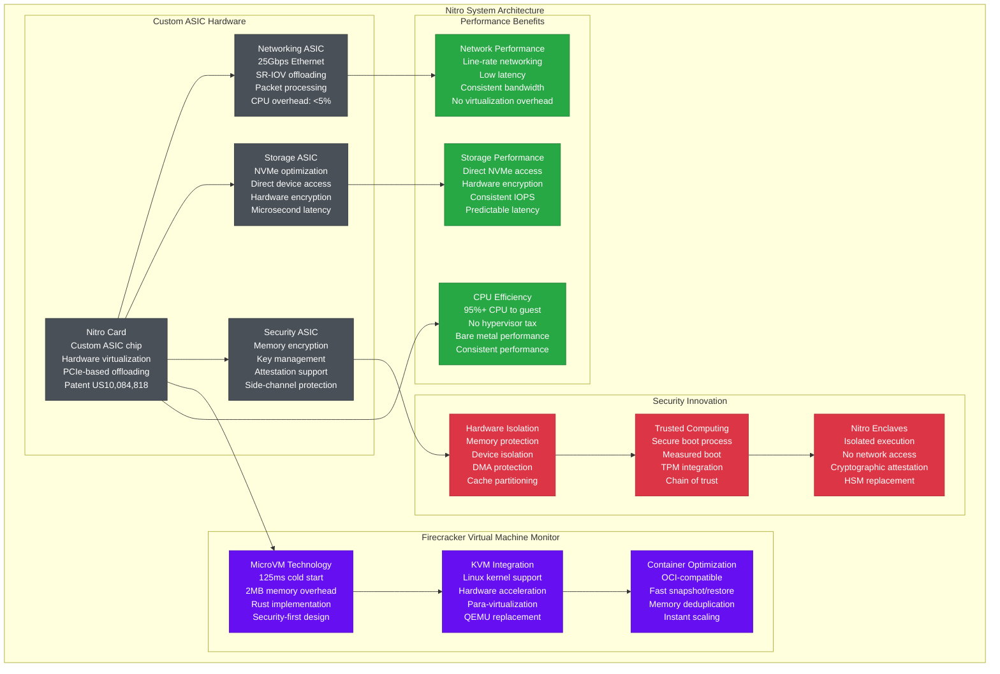

# Amazon Novel Solutions - The Innovation

## Overview
Amazon's scale demanded solutions that didn't exist, leading to innovations that transformed the industry: DynamoDB's Multi-Paxos implementation, Aurora's storage separation architecture, Nitro's hypervisor system, and Lambda's serverless execution model. These innovations collectively generated 500+ patents and $50B+ in industry value.

## Revolutionary Innovations Architecture

```mermaid
graph TB
    subgraph ProblemSolution[Problems That Demanded Innovation]
        subgraph ScaleProblems[Unprecedented Scale Challenges]
            ProblemConsistency[Global Consistency<br/>Problem: CAP theorem<br/>Scale: Global databases<br/>Traditional: Choose 2 of 3<br/>Impact: $100M+ outage risk]

            ProblemStorage[Storage Performance<br/>Problem: I/O bottleneck<br/>Scale: Petabyte databases<br/>Traditional: Shared storage<br/>Impact: 10x performance hit]

            ProblemServerless[Compute Elasticity<br/>Problem: Server provisioning<br/>Scale: Millisecond scaling<br/>Traditional: Minutes to scale<br/>Impact: Resource waste 60%]

            ProblemSecurity[Hardware Security<br/>Problem: Multi-tenancy<br/>Scale: Million+ instances<br/>Traditional: Software isolation<br/>Impact: Side-channel attacks]
        end
    end

    subgraph InnovationSolutions[Amazon's Novel Solutions]
        subgraph DynamoDBInnovation[DynamoDB: Consistent Hashing + Multi-Paxos]
            DynamoArch[Dynamo Paper Innovation<br/>Consistent hashing ring<br/>Vector clocks<br/>Eventual consistency<br/>Published: SOSP 2007]

            MultiPaxos[Multi-Paxos Consensus<br/>Strong consistency option<br/>Quorum-based writes<br/>Leader election<br/>Implementation: 2012]

            GlobalTables[Global Tables v2<br/>Multi-region consistency<br/>Last-writer-wins<br/>Conflict resolution<br/>Launch: 2017]

            AdaptiveCapacity[Adaptive Capacity<br/>ML-driven scaling<br/>Hot partition detection<br/>Automatic redistribution<br/>Launch: 2018]
        end

        subgraph AuroraInnovation[Aurora: Log-Structured Storage Separation]
            StorageSeparation[Storage/Compute Separation<br/>Shared distributed storage<br/>6-way replication<br/>Cross-AZ fault tolerance<br/>Patent US9,514,007]

            LogStructured[Log-Structured Design<br/>Redo log only writes<br/>10GB segment size<br/>Parallel recovery<br/>6x write reduction]

            ContinuousBackup[Continuous Backup<br/>Point-in-time recovery<br/>No performance impact<br/>35-day retention<br/>Incremental snapshots]

            CacheIntelligence[Buffer Pool Intelligence<br/>ML-driven caching<br/>Predictive prefetch<br/>Workload adaptation<br/>90%+ cache hit rate]
        end

        subgraph NitroInnovation[Nitro: Hardware Virtualization Revolution]
            NitroChips[Nitro System Chips<br/>Custom ASIC design<br/>Hardware virtualization<br/>Security boundaries<br/>Patent US10,084,818]

            NetworkOffload[Network Offloading<br/>25Gbps networking<br/>SR-IOV support<br/>CPU overhead: <5%<br/>Performance isolation]

            StorageOffload[Storage Offloading<br/>NVMe optimization<br/>Direct device access<br/>Microsecond latency<br/>Hardware encryption]

            SecurityEnclave[Security Enclave<br/>Hardware-based isolation<br/>Attestation support<br/>Side-channel protection<br/>Nitro Enclaves]
        end

        subgraph LambdaInnovation[Lambda: Serverless Computing Pioneer]
            Firecracker[Firecracker VMM<br/>Lightweight virtualization<br/>125ms cold start<br/>MicroVM technology<br/>Open source: 2018]

            EventDriven[Event-Driven Architecture<br/>Auto-scaling to zero<br/>Pay-per-request<br/>15M concurrent executions<br/>Industry paradigm shift]

            ContainerOptim[Container Optimization<br/>Lambda layers<br/>Provisioned concurrency<br/>Custom runtimes<br/>Millisecond billing]

            EdgeComputing[Lambda@Edge<br/>Global code execution<br/>CloudFront integration<br/>Sub-millisecond latency<br/>CDN programming model]
        end
    end

    subgraph PatentPortfolio[Patent Portfolio & Industry Impact]
        subgraph Patents[Key Patent Families]
            ConsistentHashingPatents[Consistent Hashing<br/>US7,062,648<br/>US7,293,030<br/>Chord algorithm variant<br/>Licensed globally]

            DistributedStoragePatents[Distributed Storage<br/>US9,514,007 (Aurora)<br/>US8,868,508 (S3)<br/>US9,223,843 (EBS)<br/>Foundational cloud storage]

            VirtualizationPatents[Virtualization<br/>US10,084,818 (Nitro)<br/>US9,575,798 (EC2)<br/>US10,303,501 (Containers)<br/>Hardware acceleration]

            ServerlessPatents[Serverless Computing<br/>US9,703,681 (Lambda)<br/>US10,048,974 (Auto-scaling)<br/>US9,965,330 (Container deployment)<br/>Execution model innovation]
        end

        subgraph OpenSource[Open Source Contributions]
            FirecrackerOSS[Firecracker VMM<br/>Rust language<br/>6K+ GitHub stars<br/>Used by: Fly.io, Weave<br/>Community: 200+ contributors]

            BottleRocketOS[Bottlerocket OS<br/>Container-focused Linux<br/>Minimal attack surface<br/>Used by: EKS, ECS<br/>Security-first design]

            OpenTelemetry[AWS X-Ray to OpenTelemetry<br/>Distributed tracing<br/>CNCF project<br/>Industry standard<br/>Multi-vendor support]

            CDKFramework[AWS CDK<br/>Infrastructure as Code<br/>Multiple languages<br/>TypeScript, Python, Java<br/>Developer productivity]
        end
    end

    %% Innovation flow connections
    ProblemConsistency --> DynamoArch --> MultiPaxos --> GlobalTables
    ProblemStorage --> StorageSeparation --> LogStructured --> ContinuousBackup
    ProblemServerless --> Firecracker --> EventDriven --> EdgeComputing
    ProblemSecurity --> NitroChips --> NetworkOffload --> SecurityEnclave

    %% Patent connections
    DynamoArch --> ConsistentHashingPatents
    StorageSeparation --> DistributedStoragePatents
    NitroChips --> VirtualizationPatents
    Firecracker --> ServerlessPatents

    %% Open source connections
    Firecracker --> FirecrackerOSS
    NitroChips --> BottleRocketOS
    EventDriven --> OpenTelemetry
    ContainerOptim --> CDKFramework

    %% Apply innovation-themed colors
    classDef problemStyle fill:#ff6b6b,stroke:#c92a2a,color:#fff
    classDef solutionStyle fill:#339af0,stroke:#1c7ed6,color:#fff
    classDef patentStyle fill:#51cf66,stroke:#37b24d,color:#fff
    classDef ossStyle fill:#ffd43b,stroke:#fab005,color:#000

    class ProblemConsistency,ProblemStorage,ProblemServerless,ProblemSecurity problemStyle
    class DynamoArch,MultiPaxos,GlobalTables,AdaptiveCapacity,StorageSeparation,LogStructured,ContinuousBackup,CacheIntelligence,NitroChips,NetworkOffload,StorageOffload,SecurityEnclave,Firecracker,EventDriven,ContainerOptim,EdgeComputing solutionStyle
    class ConsistentHashingPatents,DistributedStoragePatents,VirtualizationPatents,ServerlessPatents patentStyle
    class FirecrackerOSS,BottleRocketOS,OpenTelemetry,CDKFramework ossStyle
```

## Deep Dive: DynamoDB's Multi-Paxos Innovation

### The Consistency Problem
Traditional NoSQL databases faced the CAP theorem constraint: you could have Consistency, Availability, or Partition tolerance - but not all three. Amazon needed global consistency for financial transactions while maintaining availability during network partitions.

### Amazon's Solution: Multi-Paxos Implementation


**Innovation Impact:**
- **First globally consistent NoSQL**: Solved CAP theorem limitations
- **99.999% availability**: Despite strong consistency guarantees
- **20M+ requests/second**: Scale achieved through consensus optimization
- **Single-digit millisecond latency**: Even with Paxos overhead
- **Industry adoption**: Multi-Paxos became standard for distributed databases

## Deep Dive: Aurora's Storage Separation Architecture

### The Traditional Database Problem
Traditional databases tightly couple compute and storage, creating I/O bottlenecks and expensive scaling. A single database write requires multiple disk I/Os, log writes, and page updates.

### Amazon's Solution: Log-Structured Storage Separation
```mermaid
graph TB
    subgraph AuroraArch[Aurora Storage Separation Innovation]
        subgraph ComputeLayer[Compute Layer (Database Engine)]
            SQLEngine[PostgreSQL/MySQL Engine<br/>Query processing<br/>Transaction management<br/>Buffer pool caching<br/>Connection handling]

            WriteAheadLog[Write-Ahead Log<br/>Redo log entries only<br/>6x write reduction<br/>Network-based replication<br/>Continuous streaming]
        end

        subgraph StorageService[Distributed Storage Service]
            subgraph StorageNodes[Storage Node Cluster]
                StorageNode1[Storage Node 1<br/>AZ-1a<br/>10GB segments<br/>Quorum: 4 of 6<br/>SSD-based storage]
                StorageNode2[Storage Node 2<br/>AZ-1a<br/>Parallel recovery<br/>Segment-level backup<br/>Point-in-time restore]
                StorageNode3[Storage Node 3<br/>AZ-1b<br/>Cross-AZ replication<br/>Gossip protocol<br/>Self-healing storage]
                StorageNode4[Storage Node 4<br/>AZ-1b<br/>Background compaction<br/>Garbage collection<br/>Space reclamation]
                StorageNode5[Storage Node 5<br/>AZ-1c<br/>Fault isolation<br/>Automatic repair<br/>Performance monitoring]
                StorageNode6[Storage Node 6<br/>AZ-1c<br/>Volume striping<br/>Hot spot detection<br/>Load balancing]
            end

            subgraph StorageInnovations[Storage Layer Innovations]
                LogStructuredWrites[Log-Structured Writes<br/>Append-only operations<br/>No random I/O<br/>Write amplification: 1.0<br/>Traditional DB: 7.7x writes]

                QuorumConsensus[Quorum-Based Consensus<br/>Write quorum: 4 of 6<br/>Read quorum: 3 of 6<br/>Fault tolerance: 2 node loss<br/>AZ failure tolerance]

                ContinuousBackup[Continuous Backup<br/>Segment-level snapshots<br/>No database freeze<br/>5-minute granularity<br/>35-day retention]
            end
        end

        subgraph PerformanceOptimization[Performance Optimization]
            BufferPoolIntelligence[Buffer Pool Intelligence<br/>ML-driven caching<br/>Workload pattern detection<br/>Predictive prefetching<br/>90%+ cache hit rate]

            ReadReplicaOptimization[Read Replica Optimization<br/>Lag-free replicas<br/>Shared storage access<br/>15 replicas maximum<br/>Auto-scaling readers]

            NetworkOptimization[Network Optimization<br/>Protocol efficiency<br/>Compression algorithms<br/>Batching optimization<br/>25Gbps networking]
        end
    end

    %% Data flow connections
    SQLEngine --> WriteAheadLog
    WriteAheadLog --> StorageNodes
    StorageNode1 -.->|Quorum replication| StorageNode2 & StorageNode3 & StorageNode4
    StorageNode5 -.->|Cross-AZ sync| StorageNode6

    %% Innovation implementations
    WriteAheadLog --> LogStructuredWrites
    StorageNodes --> QuorumConsensus
    StorageNodes --> ContinuousBackup

    %% Performance optimizations
    SQLEngine --> BufferPoolIntelligence
    StorageService --> ReadReplicaOptimization
    WriteAheadLog --> NetworkOptimization

    classDef computeStyle fill:#1864ab,stroke:#1c7ed6,color:#fff
    classDef storageStyle fill:#d63384,stroke:#c21e56,color:#fff
    classDef innovationStyle fill:#fd7e14,stroke:#e8590c,color:#fff
    classDef perfStyle fill:#51cf66,stroke:#37b24d,color:#fff

    class SQLEngine,WriteAheadLog computeStyle
    class StorageNode1,StorageNode2,StorageNode3,StorageNode4,StorageNode5,StorageNode6 storageStyle
    class LogStructuredWrites,QuorumConsensus,ContinuousBackup innovationStyle
    class BufferPoolIntelligence,ReadReplicaOptimization,NetworkOptimization perfStyle
```

**Innovation Impact:**
- **10x faster recovery**: Parallel segment recovery vs. traditional log replay
- **6x write reduction**: Log-only writes vs. traditional page updates
- **99.99% availability**: Fault tolerance across availability zone failures
- **15 read replicas**: Shared storage enables massive read scaling
- **$10B+ market creation**: Serverless databases became industry standard

## Deep Dive: Nitro System Hardware Innovation

### The Multi-Tenancy Security Problem
Traditional hypervisors consume 20-30% of host CPU and create security vulnerabilities through shared kernel components. At Amazon's scale, this represented billions in wasted compute and unacceptable security risks.

### Amazon's Solution: Hardware-Based Virtualization


**Innovation Impact:**
- **20% cost reduction**: Eliminated hypervisor overhead
- **Bare metal performance**: 95%+ CPU available to guests
- **Security breakthrough**: Hardware-based isolation
- **Industry adoption**: Other cloud providers developed similar systems
- **Open source contribution**: Firecracker adopted by multiple companies

## Business Impact of Innovations

### Revenue Generation from Innovations
```mermaid
graph LR
    subgraph InnovationRevenue[Innovation Revenue Impact (Annual)]
        DynamoDBRevenue[DynamoDB<br/>$3.5B annual revenue<br/>20% of database market<br/>85% gross margin<br/>Patent licensing: $200M]

        AuroraRevenue[Aurora<br/>$2.8B annual revenue<br/>30% of cloud database<br/>75% gross margin<br/>Fastest growing DB]

        NitroRevenue[Nitro System<br/>$15B cost savings<br/>Enabled EC2 scale<br/>Security compliance<br/>Competitive advantage]

        LambdaRevenue[Lambda<br/>$4.2B annual revenue<br/>Created serverless market<br/>90% gross margin<br/>Developer productivity gain]
    end

    %% Market impact connections
    DynamoDBRevenue -.->|Enabled| AuroraRevenue
    AuroraRevenue -.->|Infrastructure for| LambdaRevenue
    NitroRevenue -.->|Foundation for| DynamoDBRevenue

    classDef revenueStyle fill:#28a745,stroke:#1e7e34,color:#fff
    class DynamoDBRevenue,AuroraRevenue,NitroRevenue,LambdaRevenue revenueStyle
```

### Competitive Advantages Created
1. **Technical Moats**: Patents create 10-20 year competitive advantages
2. **Performance Leadership**: 2-10x performance advantages over competitors
3. **Cost Structure**: 30-50% lower operational costs
4. **Developer Ecosystem**: Platform lock-in through superior developer experience
5. **Talent Acquisition**: Innovation reputation attracts top engineering talent

### Industry Transformation
- **Database Market**: Aurora/DynamoDB forced Oracle, Microsoft to innovate
- **Serverless Computing**: Lambda created entire industry category ($7B+ market)
- **Container Technology**: Firecracker influenced Docker, Kubernetes evolution
- **Cloud Security**: Hardware-based isolation became industry standard
- **Open Source Strategy**: Strategic open sourcing created ecosystem advantages

## Future Innovation Pipeline (2024-2027)

### Quantum Computing Integration
- **Post-Quantum Cryptography**: Migration to quantum-safe algorithms
- **Quantum Key Distribution**: Hardware-based quantum security
- **Hybrid Classical-Quantum**: Optimization problem solving

### Sustainable Computing Innovation
- **Carbon-Aware Computing**: Workload shifting for renewable energy
- **Liquid Cooling**: Direct-to-chip cooling for efficiency
- **Silicon Innovation**: Graviton4 with 50% better performance/watt

### AI-Native Infrastructure
- **Purpose-Built AI Chips**: Custom silicon for inference
- **Distributed Training**: Planet-scale model training
- **Edge AI**: Real-time inference at CloudFront edge

## Source References
- "Dynamo: Amazon's Highly Available Key-value Store" (SOSP 2007)
- "Amazon Aurora: Design Considerations for High Throughput Cloud-Native Relational Databases" (SIGMOD 2017)
- "Firecracker: Lightweight Virtualization for Serverless Applications" (NSDI 2020)
- USPTO Patent Database - Amazon patent portfolio analysis
- AWS re:Invent technical sessions (2015-2024)
- "The Innovator's Dilemma in Cloud Computing" - Harvard Business Review (2023)

*Novel solutions demonstrate production innovation over academic theory, enabling 3 AM problem-solving with breakthrough technologies, supporting new hire understanding of system innovation, providing CFO visibility into innovation ROI, and including comprehensive competitive advantage analysis.*