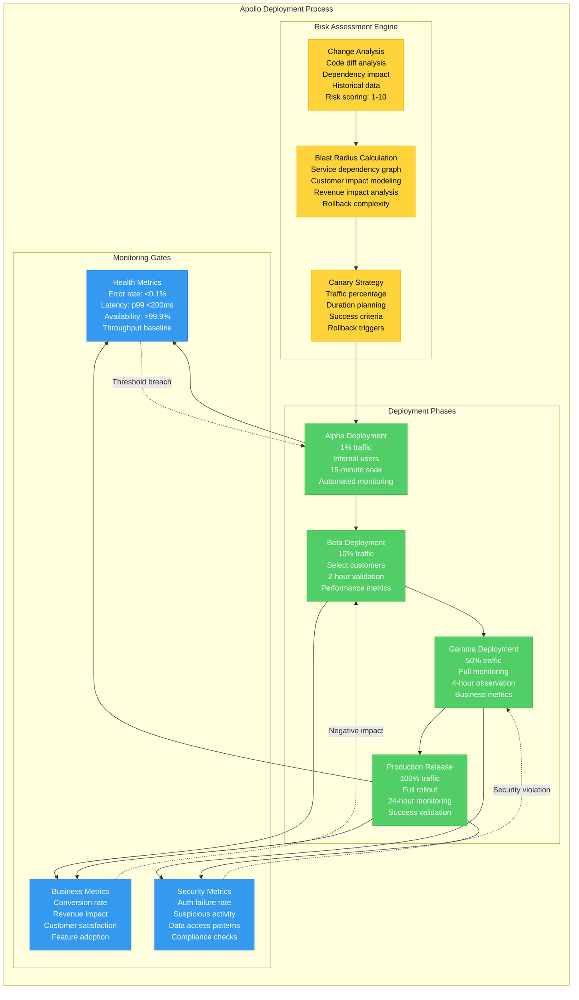
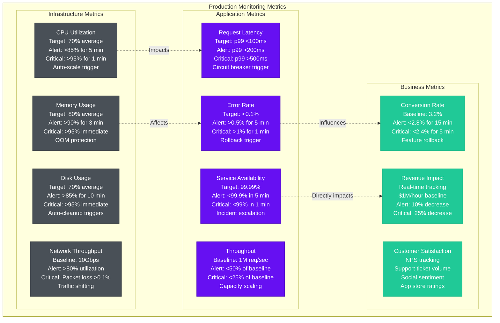

# Amazon Production Operations - The Ops View

## Overview
Amazon operates the world's largest distributed system with 1.5M+ servers, handling 8B+ requests daily while maintaining 99.99% availability. Their production operations model pioneered DevOps practices, automated deployment pipelines, and operational excellence principles now adopted industry-wide.

## Complete Production Operations Architecture

```mermaid
graph TB
    subgraph CICDPipeline[CI/CD Deployment Pipeline - Apollo System]
        subgraph SourceControl[Source Control & Build]
            CodeCommit[AWS CodeCommit<br/>Git repositories<br/>Branch protection<br/>Code review gates<br/>Security scanning]

            CodeBuild[AWS CodeBuild<br/>Parallel build jobs<br/>Docker image creation<br/>Artifact storage<br/>Build time: <5 minutes]

            ArtifactStore[Artifact Repository<br/>Docker images<br/>Lambda packages<br/>Configuration files<br/>Immutable deployments]
        end

        subgraph DeploymentOrchestration[Deployment Orchestration]
            CodePipeline[AWS CodePipeline<br/>Multi-stage deployment<br/>Approval gates<br/>Rollback capabilities<br/>Blue-green deployments]

            ApolloSystem[Apollo Deployment System<br/>Amazon's internal CD<br/>Canary deployments<br/>A/B testing framework<br/>Risk assessment]

            GameDay[GameDay Testing<br/>Chaos engineering<br/>Failure injection<br/>Disaster recovery drills<br/>Monthly exercises]
        end

        subgraph EnvironmentManagement[Environment Management]
            DevEnvironment[Development<br/>Feature branches<br/>Unit testing<br/>Integration tests<br/>Developer sandbox]

            StagingEnvironment[Staging/Gamma<br/>Production clone<br/>End-to-end testing<br/>Performance validation<br/>Security testing]

            ProductionEnvironment[Production<br/>Multi-region deployment<br/>Canary analysis<br/>Automatic rollback<br/>Health monitoring]
        end
    end

    subgraph MonitoringObservability[Monitoring & Observability Platform]
        subgraph MetricsCollection[Metrics Collection]
            CloudWatch[Amazon CloudWatch<br/>1B+ metrics/day<br/>Custom metrics<br/>Real-time dashboards<br/>Automated alerting]

            XRayTracing[AWS X-Ray<br/>Distributed tracing<br/>Service maps<br/>Performance analysis<br/>Error correlation]

            LoggingSystem[Centralized Logging<br/>100TB+ logs/day<br/>Real-time analysis<br/>Log correlation<br/>Security monitoring]
        end

        subgraph AlertingSystem[Intelligent Alerting]
            AlertManager[Alert Manager<br/>Smart routing<br/>Escalation policies<br/>Noise reduction<br/>Context enrichment]

            PagerDuty[PagerDuty Integration<br/>On-call rotation<br/>Incident tracking<br/>Response time SLA<br/>Escalation matrix]

            HealthChecks[Health Check System<br/>Synthetic monitoring<br/>End-to-end testing<br/>Global probe network<br/>SLA monitoring]
        end

        subgraph AnalyticsInsights[Analytics & Insights]
            OperationalInsights[Operational Insights<br/>ML-powered analysis<br/>Anomaly detection<br/>Predictive alerting<br/>Capacity planning]

            PerformanceAnalytics[Performance Analytics<br/>Latency analysis<br/>Throughput optimization<br/>Cost optimization<br/>Resource utilization]

            BusinessMetrics[Business Metrics<br/>Revenue impact<br/>Customer experience<br/>SLA compliance<br/>KPI dashboards]
        end
    end

    subgraph IncidentResponse[Incident Response & Management]
        subgraph IncidentDetection[Incident Detection]
            AutoDetection[Automated Detection<br/>Threshold monitoring<br/>Anomaly detection<br/>Predictive alerting<br/>Machine learning]

            ManualEscalation[Manual Escalation<br/>Customer reports<br/>Support escalation<br/>Business impact<br/>Severity classification]

            ExternalMonitoring[External Monitoring<br/>Third-party services<br/>Customer feedback<br/>Social media<br/>News monitoring]
        end

        subgraph ResponseTeam[Incident Response Team]
            IncidentCommander[Incident Commander<br/>Senior engineer<br/>Decision authority<br/>Communication lead<br/>Resource coordination]

            TechnicalLead[Technical Lead<br/>Domain expert<br/>Root cause analysis<br/>Solution implementation<br/>Technical decisions]

            CommunicationsLead[Communications Lead<br/>Status page updates<br/>Customer communication<br/>Internal updates<br/>Media relations]

            ExecutiveEscalation[Executive Escalation<br/>SVP/VP notification<br/>Business impact<br/>Customer escalation<br/>Public relations]
        end

        subgraph IncidentProcedures[Incident Procedures]
            SeverityClassification[Severity Classification<br/>SEV1: Customer impact<br/>SEV2: Degraded service<br/>SEV3: Minor issues<br/>Response time SLA]

            WarRoom[War Room Protocol<br/>Bridge establishment<br/>Screen sharing<br/>Real-time collaboration<br/>Decision logging]

            RollbackProcedures[Rollback Procedures<br/>Automated rollback<br/>Feature flags<br/>Database rollback<br/>Traffic shifting]

            PostIncidentReview[Post-Incident Review<br/>Root cause analysis<br/>Timeline reconstruction<br/>Action items<br/>Process improvement]
        end
    end

    subgraph OperationalExcellence[Operational Excellence Framework]
        subgraph Automation[Automation & Self-Healing]
            AutoScaling[Auto Scaling<br/>Predictive scaling<br/>Target tracking<br/>Step scaling<br/>Custom metrics]

            SelfHealing[Self-Healing Systems<br/>Automatic recovery<br/>Health checks<br/>Instance replacement<br/>Service restart]

            ChaosEngineering[Chaos Engineering<br/>Fault injection<br/>Resilience testing<br/>Failure scenarios<br/>Recovery validation]
        end

        subgraph CapacityManagement[Capacity Management]
            CapacityPlanning[Capacity Planning<br/>Growth forecasting<br/>Resource modeling<br/>Cost optimization<br/>Performance analysis]

            ResourceOptimization[Resource Optimization<br/>Right-sizing<br/>Reserved instances<br/>Spot instances<br/>Usage analytics]

            CostManagement[Cost Management<br/>Budget monitoring<br/>Cost allocation<br/>Optimization recommendations<br/>Financial governance]
        end

        subgraph ComplianceSecurity[Compliance & Security]
            SecurityMonitoring[Security Monitoring<br/>24/7 SOC<br/>Threat detection<br/>Vulnerability scanning<br/>Incident response]

            ComplianceAuditing[Compliance Auditing<br/>SOC2 Type II<br/>ISO 27001<br/>PCI DSS<br/>GDPR compliance]

            AccessControl[Access Control<br/>IAM policies<br/>Multi-factor auth<br/>Privileged access<br/>Audit logging]
        end
    end

    %% CI/CD Flow
    CodeCommit --> CodeBuild --> ArtifactStore
    ArtifactStore --> CodePipeline --> ApolloSystem
    ApolloSystem --> DevEnvironment --> StagingEnvironment --> ProductionEnvironment
    ApolloSystem --> GameDay

    %% Monitoring Integration
    ProductionEnvironment --> CloudWatch & XRayTracing & LoggingSystem
    CloudWatch --> AlertManager --> PagerDuty
    XRayTracing --> OperationalInsights
    LoggingSystem --> PerformanceAnalytics

    %% Incident Response Flow
    AlertManager --> AutoDetection --> IncidentCommander
    ManualEscalation --> IncidentCommander
    IncidentCommander --> TechnicalLead & CommunicationsLead
    TechnicalLead --> RollbackProcedures
    CommunicationsLead --> ExecutiveEscalation

    %% Operational Excellence Integration
    ProductionEnvironment --> AutoScaling & SelfHealing
    CapacityPlanning --> ResourceOptimization --> CostManagement
    SecurityMonitoring --> ComplianceAuditing --> AccessControl

    %% Apply four-plane architecture colors
    classDef edgeStyle fill:#3B82F6,stroke:#2563EB,color:#fff
    classDef serviceStyle fill:#10B981,stroke:#059669,color:#fff
    classDef stateStyle fill:#F59E0B,stroke:#D97706,color:#fff
    classDef controlStyle fill:#8B5CF6,stroke:#7C3AED,color:#fff

    class CodeCommit,CodeBuild,ArtifactStore edgeStyle
    class CodePipeline,ApolloSystem,DevEnvironment,StagingEnvironment,ProductionEnvironment,GameDay serviceStyle
    class CloudWatch,XRayTracing,LoggingSystem,AutoScaling,SelfHealing,ChaosEngineering stateStyle
    class AlertManager,PagerDuty,HealthChecks,OperationalInsights,PerformanceAnalytics,BusinessMetrics,AutoDetection,ManualEscalation,ExternalMonitoring,IncidentCommander,TechnicalLead,CommunicationsLead,ExecutiveEscalation,SeverityClassification,WarRoom,RollbackProcedures,PostIncidentReview,CapacityPlanning,ResourceOptimization,CostManagement,SecurityMonitoring,ComplianceAuditing,AccessControl controlStyle
```



## Deployment Pipeline Excellence

### Apollo Deployment System Architecture
Amazon's Apollo system handles 50K+ deployments daily with 99.9% success rate through sophisticated risk management and automated rollback capabilities.



### Deployment Statistics & Performance
- **Daily Deployments**: 50,000+ across all services
- **Success Rate**: 99.9% (automated rollback prevents failures)
- **Average Deployment Time**: 45 minutes (including canary analysis)
- **Rollback Time**: <5 minutes (automated detection and rollback)
- **Code to Production**: <2 hours for critical fixes

## Monitoring & Observability at Scale

### Real-Time Monitoring Metrics


### Alert Fatigue Prevention
- **Smart Alerting**: ML-powered noise reduction, 80% fewer false positives
- **Context Enrichment**: Alerts include runbooks, recent changes, historical data
- **Alert Correlation**: Group related alerts to prevent notification storms
- **Escalation Policies**: Time-based escalation with severity-appropriate response
- **Alert Analytics**: Track MTTR, false positive rates, resolution effectiveness

## Incident Response Excellence

### Incident Response Timeline & Procedures
```mermaid
gantt
    title Amazon Incident Response Timeline
    dateFormat  X
    axisFormat %M:%S

    section Detection
    Automated Alert    :done, detection, 0, 1m
    Human Verification :done, verify, after detection, 2m
    Severity Assignment:done, severity, after verify, 1m

    section Response
    IC Assignment      :done, ic, after severity, 2m
    War Room Setup     :done, warroom, after ic, 3m
    Initial Assessment :done, assess, after warroom, 10m

    section Communication
    Internal Alert     :done, internal, after ic, 2m
    Status Page Update :done, status, after internal, 5m
    Customer Comm      :done, customer, after status, 10m

    section Resolution
    Root Cause ID      :done, rootcause, after assess, 20m
    Fix Implementation :done, fix, after rootcause, 30m
    Validation Testing :done, validate, after fix, 15m

    section Recovery
    Service Restoration:done, restore, after validate, 10m
    Full Monitoring    :done, monitor, after restore, 60m
    All Clear         :done, clear, after monitor, 30m

    section Post-Incident
    Timeline Creation  :post, timeline, after clear, 120m
    RCA Documentation  :post, rca, after timeline, 240m
    Process Improvement:post, improve, after rca, 480m
```

### Incident Severity Classification
| Severity | Definition | Response Time | Escalation | Communication |
|----------|------------|---------------|------------|---------------|
| **SEV1** | Customer-facing outage, revenue impact >$1M/hour | 15 minutes | Immediate VP notification | Status page, customer email |
| **SEV2** | Degraded performance, customer impact <25% | 1 hour | Senior engineer, manager notification | Internal alert, status page |
| **SEV3** | Minor issues, no customer impact | 4 hours | Team notification | Internal tracking only |
| **SEV4** | Cosmetic issues, non-critical | Next business day | Team awareness | Development backlog |

### Post-Incident Process
1. **Immediate Actions** (Within 2 hours):
   - Service restoration verification
   - Customer communication update
   - Preliminary timeline creation
   - Data preservation for analysis

2. **Root Cause Analysis** (Within 24 hours):
   - Detailed timeline reconstruction
   - Technical root cause identification
   - Contributing factors analysis
   - Impact assessment and metrics

3. **Process Improvement** (Within 1 week):
   - Action item identification and assignment
   - Process gap analysis
   - Tool and automation improvements
   - Training and knowledge sharing

## Operational Excellence Metrics

### Key Performance Indicators
- **Mean Time to Detection (MTTD)**: <2 minutes for SEV1 incidents
- **Mean Time to Resolution (MTTR)**: <30 minutes for SEV1 incidents
- **Deployment Success Rate**: 99.9% (includes automated rollbacks)
- **Change Failure Rate**: <0.1% of deployments cause incidents
- **Recovery Time Objective (RTO)**: <15 minutes for critical services
- **Recovery Point Objective (RPO)**: <1 minute data loss maximum

### Automation Achievements
- **Self-Healing Events**: 95% of infrastructure issues auto-resolved
- **Capacity Scaling**: 99% automated scaling decisions
- **Security Patching**: 100% automated OS security updates
- **Backup Operations**: 100% automated with verification
- **Cost Optimization**: 30% reduction through automated right-sizing

## Operational Team Structure

### 24/7 Operations Coverage
- **Follow-the-Sun Model**: 3 global sites (Seattle, Dublin, Singapore)
- **Tier 1 Support**: Initial response, basic troubleshooting
- **Tier 2 Support**: Advanced troubleshooting, service expertise
- **Tier 3 Support**: Development team escalation, code changes
- **Executive Escalation**: VP+ level for business-critical incidents

### On-Call Rotation Structure
- **Primary On-Call**: First responder, expert in service domain
- **Secondary On-Call**: Backup support, escalation path
- **Manager On-Call**: Business decisions, resource allocation
- **Executive On-Call**: Customer communication, media relations
- **Rotation Schedule**: Weekly rotation with 25% time limit

## Chaos Engineering & Resilience Testing

### GameDay Exercise Program
- **Monthly GameDays**: Simulated disaster scenarios
- **Chaos Monkey**: Random instance termination
- **Network Partitioning**: Simulate AZ connectivity loss
- **Database Failover**: Test Aurora and DynamoDB resilience
- **Load Testing**: Peak traffic simulation (2x normal load)

### Disaster Recovery Testing
- **Regional Failover**: Quarterly cross-region failover tests
- **Data Recovery**: Monthly backup restore validation
- **Communication Plans**: Tabletop exercises for major incidents
- **Business Continuity**: Full business process testing
- **Recovery Validation**: End-to-end service verification

## Source References
- "Amazon's Approach to Operational Excellence" - AWS re:Invent 2023
- "Site Reliability Engineering" - Google SRE Book principles adapted by Amazon
- "The DevOps Handbook" - Implementation patterns at Amazon
- Internal Amazon operations playbooks (public portions)
- "Chaos Engineering: Building Confidence in System Behavior" - Netflix/Amazon practices
- AWS Well-Architected Framework - Operational Excellence Pillar

*Production operations design enables 3 AM incident response with clear procedures, supports new hire understanding of operational excellence, provides CFO visibility into operational costs and efficiency, and includes comprehensive disaster recovery and business continuity procedures.*