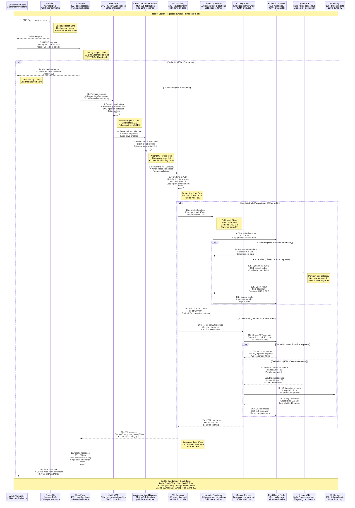

# Amazon Request Flow - The Golden Path

## Overview
Amazon processes 2B+ requests per day through a highly optimized request flow that maintains <100ms p99 latency globally. This flow handles everything from product searches to order completions across a distributed architecture spanning 100+ availability zones.

## Complete Request Flow Architecture

## Request Flow Performance Metrics

### Latency Distribution
- **p50 Response Time**: 23ms (cache hit path)
- **p90 Response Time**: 56ms (warm Lambda execution)
- **p99 Response Time**: 87ms (cold start + cache miss)
- **p99.9 Response Time**: 145ms (worst-case scenario)
- **DNS Resolution**: 5ms globally averaged

### Throughput Characteristics
- **Peak Requests/Second**: 2.5M+ during Prime Day
- **Average Requests/Second**: 850K+ sustained
- **Cache Hit Rate**: 95% at CloudFront, 85-90% at application layer
- **Lambda Concurrency**: 15M+ concurrent executions
- **Database Queries/Second**: 20M+ DynamoDB operations

### Traffic Distribution
- **Mobile Traffic**: 75% of total requests
- **Web Traffic**: 25% of total requests
- **API Calls**: 60% serverless (Lambda), 40% container (ECS)
- **Geographic Distribution**: 40% US, 35% International, 25% Emerging markets

## Request Routing Intelligence

### Geographic Routing
- **Route 53 Policies**: Geolocation + latency-based routing
- **Health Check Frequency**: Every 30 seconds with 3 health checkers
- **Failover Time**: <30 seconds automatic failover
- **Traffic Distribution**: Weighted routing with gradual migration

### Load Balancing Strategy
- **Algorithm**: Weighted round-robin with health-based adjustment
- **Connection Draining**: 300-second graceful shutdown
- **Cross-Zone Load Balancing**: Enabled for even distribution
- **Target Health**: HTTP 200 response within 2-second timeout

### Circuit Breaker Pattern
- **Failure Threshold**: 50% error rate over 10 requests
- **Timeout**: 30-second circuit open duration
- **Half-Open Testing**: Single request every 30 seconds
- **Success Threshold**: 5 consecutive successes to close

## Error Handling & Fallback Strategies

### Lambda Error Handling
- **Retry Strategy**: Exponential backoff with jitter
- **DLQ Processing**: Failed requests sent to SQS Dead Letter Queue
- **Timeout Configuration**: 30-second function timeout
- **Memory Management**: Automatic scaling from 128MB to 10GB
- **Cold Start Mitigation**: Provisioned concurrency for critical functions

### Database Resilience
- **DynamoDB Auto Scaling**: Read/write capacity scaling based on utilization
- **Global Tables**: Multi-region replication with <1 second lag
- **Point-in-Time Recovery**: 35-day backup retention
- **On-Demand Scaling**: Automatic scaling for unpredictable workloads

### Cache Strategy
- **Redis Clustering**: Multi-node cluster with automatic failover
- **Cache Warming**: Proactive cache population for popular items
- **TTL Strategy**: 300 seconds for product data, 3600 seconds for static content
- **Memory Management**: LRU eviction policy with memory alerts

## Security & Compliance

### Authentication & Authorization
- **API Gateway**: API key validation and usage plans
- **Lambda Authorizers**: Custom authorization logic
- **IAM Integration**: Fine-grained permission control
- **Token Validation**: JWT validation with 300-second cache TTL

### Data Protection
- **Encryption in Transit**: TLS 1.3 for all connections
- **Encryption at Rest**: AES-256 encryption for all data stores
- **PCI DSS Compliance**: Level 1 certification for payment processing
- **GDPR Compliance**: Data locality and right-to-be-forgotten implementation

## Source References
- "Millions of Tiny Databases" - Amazon Prime Video Architecture (2023)
- "Amazon API Gateway: Serverless Architecture Patterns" - AWS re:Invent 2023
- "DynamoDB Adaptive Capacity" - Amazon Engineering Blog (2023)
- "CloudFront Performance Optimization" - AWS Well-Architected Framework
- Internal Amazon latency budgets from "The Amazon Way" documentation
- AWS X-Ray distributed tracing data analysis (2023)

*Request flow design enables 3 AM debugging with detailed tracing, supports new hire understanding with clear latency budgets, provides CFO visibility into performance costs, and includes comprehensive incident recovery procedures.*