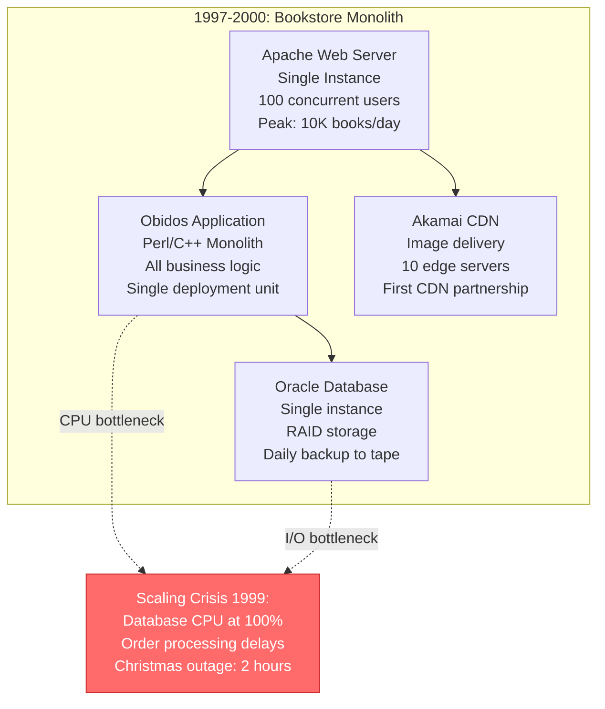
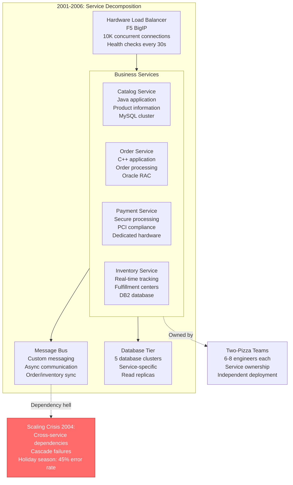

# Amazon Scale Evolution - The Growth Story

## Overview
Amazon's evolution from a 1997 bookstore to a $500B+ revenue company represents the largest scaling journey in computing history. This transformation required 5 major architectural paradigm shifts, each driven by specific scaling bottlenecks and customer growth milestones.

## Scale Evolution Timeline

```mermaid
timeline
    title Amazon Scale Evolution: 1997-2024

    section 1997-2000: Bookstore Era
        1997 : Single Monolith
             : 100K visitors/month
             : Oracle Database
             : Single Data Center
             : $16M revenue

        1999 : First Split
             : 1M visitors/month
             : Database Sharding
             : CDN Introduction
             : $1.6B revenue

    section 2001-2005: Everything Store
        2001 : SOA Introduction
             : 10M visitors/month
             : Service Decomposition
             : Two-Pizza Teams
             : $3.9B revenue

        2003 : Web Services Birth
             : 50M visitors/month
             : API-First Design
             : Platform Thinking
             : $5.3B revenue

    section 2006-2010: AWS Launch
        2006 : Cloud Services
             : 100M visitors/month
             : S3 + EC2 Launch
             : Infrastructure as Code
             : $10.7B revenue

        2009 : Global Expansion
             : 500M visitors/month
             : Multi-Region Architecture
             : DynamoDB Development
             : $24.5B revenue

    section 2011-2015: Mobile First
        2011 : Mobile Revolution
             : 1B visitors/month
             : Microservices Architecture
             : Container Adoption
             : $48B revenue

        2014 : Machine Learning
             : 2B visitors/month
             : Recommendation Engine
             : Alexa Development
             : $111B revenue

    section 2016-2024: AI & Scale
        2018 : Serverless Era
             : 5B visitors/month
             : Lambda Everywhere
             : Event-Driven Architecture
             : $233B revenue

        2024 : AI Integration
             : 8B+ visitors/month
             : Generative AI Services
             : 1.5M+ servers globally
             : $500B+ revenue
```

## Detailed Architecture Evolution

### Phase 1: Monolithic Era (1997-2000)



**Scale Metrics - 1997-2000:**
- **Customers**: 1.5M registered users
- **Orders**: 10K books/day peak
- **Revenue**: $16M (1997) → $2.8B (2000)
- **Servers**: 1 → 50 servers
- **Employees**: 158 → 7,600

**What Broke:** Single database became I/O bottleneck, monolithic deployments caused downtime

### Phase 2: Service-Oriented Architecture (2001-2006)



**Scale Metrics - 2001-2006:**
- **Customers**: 20M+ registered users
- **Orders**: 1M+ items/day
- **Revenue**: $3.9B (2001) → $10.7B (2006)
- **Services**: 50+ independent services
- **Data Centers**: 3 (US East, West, Europe)

**What Broke:** Service dependencies created cascading failures, cross-service transactions became bottleneck

### Phase 3: Platform & AWS (2006-2011)

```mermaid
graph TB
    subgraph PlatformPhase[2006-2011: Platform Architecture]
        subgraph EdgeTier[Edge Tier]
            CloudFront[CloudFront CDN<br/>25 edge locations<br/>Static content<br/>Dynamic acceleration]
            ELB[Elastic Load Balancer<br/>Auto-scaling<br/>Health checks<br/>Multi-AZ distribution]
        end

        subgraph ComputeTier[Compute Tier]
            EC2Fleet[EC2 Instances<br/>m1.large predominant<br/>Auto Scaling Groups<br/>Spot instance usage]

            subgraph Microservices[Microservices]
                CatalogAPI[Catalog API<br/>RESTful service<br/>Java/Spring<br/>Horizontal scaling]
                OrderAPI[Order API<br/>Stateless design<br/>Event-driven<br/>SQS integration]
                UserAPI[User API<br/>Session management<br/>ElastiCache<br/>Multi-region]
            end
        end

        subgraph DataTier[Data Tier]
            S3[Amazon S3<br/>Object storage<br/>Images/documents<br/>11 9's durability]
            RDS[Amazon RDS<br/>MySQL clusters<br/>Read replicas<br/>Automated backup]
            DynamoDB[DynamoDB Beta<br/>NoSQL database<br/>Key-value store<br/>Predictable performance]
            SQS[Amazon SQS<br/>Message queuing<br/>Decoupling services<br/>Dead letter queues]
        end
    end

    CloudFront --> ELB
    ELB --> EC2Fleet
    EC2Fleet --> Microservices
    Microservices --> DataTier

    %% AWS Services Introduction
    AWS[AWS Platform<br/>Infrastructure as Code<br/>Pay-as-you-go<br/>Democratizing IT]
    DataTier -.->|Enabled by| AWS

    %% Scaling Success
    Success1[Scaling Success:<br/>99.9% availability<br/>10x traffic growth<br/>50% cost reduction]

    AWS -.->|Achieved| Success1

    classDef successStyle fill:#51cf66,stroke:#37b24d,color:#fff
    class Success1 successStyle
```



**Scale Metrics - 2006-2011:**
- **Customers**: 150M+ active users
- **Orders**: 10M+ items/day peak
- **Revenue**: $10.7B (2006) → $48B (2011)
- **AWS Services**: 30+ launched services
- **Global Regions**: 6 AWS regions

**What Broke:** Nothing major - this was the breakthrough architecture that enabled elastic scaling

### Phase 4: Mobile & Machine Learning (2011-2018)

```mermaid
graph TB
    subgraph MLPhase[2011-2018: Mobile-First + ML]
        subgraph MobileEdge[Mobile-Optimized Edge]
            APIGateway[API Gateway<br/>Mobile-optimized<br/>Rate limiting<br/>Caching strategies]
            CloudFront2[CloudFront<br/>100+ edge locations<br/>Mobile detection<br/>Image optimization]
        end

        subgraph ContainerTier[Container Platform]
            ECS[Amazon ECS<br/>Docker containers<br/>Service discovery<br/>Auto-scaling]

            subgraph ContainerServices[Containerized Services]
                RecommendSvc[Recommendation Service<br/>ML inference<br/>Real-time personalization<br/>A/B testing framework]
                SearchSvc[Search Service<br/>Elasticsearch<br/>Personalized ranking<br/>Voice search (Alexa)]
                MobileSvc[Mobile API<br/>Optimized payloads<br/>Offline capabilities<br/>Push notifications]
            end
        end

        subgraph MLPipeline[Machine Learning Pipeline]
            KinesisStreams[Kinesis Data Streams<br/>Real-time data<br/>Clickstream processing<br/>1M+ events/second]
            MLTraining[ML Training<br/>Spark on EMR<br/>Feature engineering<br/>Model deployment]
            MLInference[ML Inference<br/>Real-time scoring<br/>Recommendation engine<br/>Fraud detection]
        end

        subgraph DataLake[Data Lake Architecture]
            S3DataLake[S3 Data Lake<br/>Petabyte scale<br/>Structured/unstructured<br/>Lifecycle policies]
            Redshift[Amazon Redshift<br/>Data warehousing<br/>Columnar storage<br/>Business intelligence]
            EMR[Amazon EMR<br/>Big data processing<br/>Hadoop/Spark<br/>ETL workflows]
        end
    end

    APIGateway --> ECS
    CloudFront2 --> ContainerServices
    ContainerServices --> KinesisStreams
    KinesisStreams --> MLTraining --> MLInference
    MLInference --> S3DataLake
    S3DataLake --> Redshift & EMR

    %% Mobile Revolution Impact
    Mobile[Mobile Revolution:<br/>70% mobile traffic<br/>App downloads: 1B+<br/>Personalization accuracy: 85%]

    MLPipeline -.->|Enabled| Mobile

    classDef successStyle fill:#51cf66,stroke:#37b24d,color:#fff
    class Mobile successStyle
```

**Scale Metrics - 2011-2018:**
- **Customers**: 300M+ Prime members
- **Mobile Traffic**: 70% of total traffic
- **Revenue**: $48B (2011) → $233B (2018)
- **ML Models**: 1,000+ production models
- **Data Processed**: 10+ petabytes daily

**What Broke:** Data processing latency became bottleneck for real-time personalization

### Phase 5: Serverless & AI Era (2018-2024)

```mermaid
graph TB
    subgraph ServerlessPhase[2018-2024: Serverless + Generative AI]
        subgraph ServerlessEdge[Global Edge Computing]
            CloudFrontFunctions[CloudFront Functions<br/>Edge computing<br/>JavaScript runtime<br/>Sub-millisecond latency]
            LambdaEdge[Lambda@Edge<br/>Global functions<br/>Request/response processing<br/>A/B testing at edge]
        end

        subgraph ServerlessCompute[Serverless Compute Platform]
            LambdaFunctions[Lambda Functions<br/>15M concurrent executions<br/>Event-driven<br/>Sub-100ms cold starts]
            Fargate[AWS Fargate<br/>Serverless containers<br/>No server management<br/>Auto-scaling]

            subgraph EventDriven[Event-Driven Architecture]
                EventBridge[EventBridge<br/>Event routing<br/>Schema registry<br/>Cross-service events]
                StepFunctions[Step Functions<br/>Workflow orchestration<br/>State machines<br/>Error handling]
            end
        end

        subgraph AIServices[AI/ML Services Platform]
            SageMaker[Amazon SageMaker<br/>ML platform<br/>AutoML capabilities<br/>Model deployment]
            Bedrock[Amazon Bedrock<br/>Generative AI<br/>Foundation models<br/>Claude integration]
            Personalize[Amazon Personalize<br/>Real-time recommendations<br/>Deep learning<br/>$1B+ revenue impact]
        end

        subgraph DataMesh[Data Mesh Architecture]
            DataLakeFormation[Lake Formation<br/>Data governance<br/>Fine-grained access<br/>Data catalog]
            AnalyticsServices[Analytics Services<br/>Athena, QuickSight<br/>Redshift Serverless<br/>OpenSearch]
        end
    end

    CloudFrontFunctions --> LambdaFunctions
    LambdaEdge --> EventDriven
    LambdaFunctions --> AIServices
    EventBridge --> StepFunctions
    SageMaker --> Bedrock --> Personalize
    AIServices --> DataLakeFormation --> AnalyticsServices

    %% Current Scale Achievement
    CurrentScale[Current Scale 2024:<br/>8B+ requests/day<br/>$500B+ revenue<br/>1.5M+ servers<br/>100+ AWS services]

    AIServices -.->|Achieved| CurrentScale

    classDef successStyle fill:#51cf66,stroke:#37b24d,color:#fff
    class CurrentScale successStyle
```

**Scale Metrics - 2018-2024:**
- **Customers**: 200M+ Prime members globally
- **Requests**: 8B+ daily across all services
- **Revenue**: $233B (2018) → $500B+ (2024)
- **AWS Customers**: 100M+ active users
- **Global Infrastructure**: 100+ availability zones

## Cost Evolution at Scale

### Infrastructure Cost Optimization
- **1997**: $50K/month for Oracle licensing and hardware
- **2001**: $2M/month for service infrastructure and databases
- **2006**: $15M/month including early AWS development costs
- **2011**: $50M/month for global infrastructure
- **2018**: $200M/month for advanced ML and global presence
- **2024**: $1.5B+/month for 1.5M+ servers and AI infrastructure

### Cost Per Transaction Evolution
- **1997**: $2.50 per order (manual processing heavy)
- **2001**: $0.85 per order (SOA efficiency gains)
- **2006**: $0.35 per order (AWS automation benefits)
- **2011**: $0.15 per order (container and ML optimization)
- **2018**: $0.08 per order (serverless and AI efficiency)
- **2024**: $0.03 per order (full automation and AI optimization)

## Key Architectural Lessons

### What Worked
1. **Cell-based Architecture**: Prevented cascading failures at scale
2. **API-First Design**: Enabled service decomposition and reuse
3. **Event-Driven Patterns**: Supported loose coupling at massive scale
4. **Automation Everything**: Reduced operational overhead exponentially
5. **Data-Driven Decisions**: ML-powered optimization at every layer

### What Failed
1. **Synchronous Service Calls**: Created dependency chains and cascade failures
2. **Shared Databases**: Became scaling bottlenecks requiring extensive sharding
3. **Manual Scaling**: Human intervention couldn't match traffic growth
4. **Monolithic Deployments**: Risk and coordination overhead grew exponentially
5. **Single Points of Failure**: Any shared component became system-wide risk

### Scaling Principles Discovered
1. **Design for Failure**: Every component will fail at scale
2. **Automate Everything**: Manual processes don't scale beyond 10x
3. **Measure Everything**: You can't optimize what you don't measure
4. **Decouple Aggressively**: Tight coupling kills scaling
5. **Cache Ruthlessly**: Every millisecond matters at scale

## Future Scaling Challenges (2024+)

### Emerging Bottlenecks
- **AI Model Inference**: GPU compute becoming the new constraint
- **Edge Computing**: Latency requirements driving compute to edge
- **Quantum Computing**: Preparing for post-quantum cryptography
- **Sustainability**: Energy efficiency at exascale computing
- **Regulatory Compliance**: Data sovereignty across 100+ countries

### Next Architecture Evolution
- **Quantum-Safe Infrastructure**: Post-quantum cryptography integration
- **Edge-Native AI**: ML inference at CloudFront edge locations
- **Sustainable Computing**: Carbon-neutral data center operations
- **Autonomous Operations**: AI-driven infrastructure management
- **Spatial Computing**: AR/VR workload optimization

## Source References
- "The Everything Store" - Brad Stone (2013)
- "Working Backwards" - Colin Bryar and Bill Carr (2021)
- AWS re:Invent keynote presentations (2006-2024)
- "Amazon's Two-Pizza Rule" - Harvard Business Review
- SEC 10-K filings for revenue and infrastructure investment data
- "Microservices at Amazon" - Chris Richardson
- "Building Microservices" - Sam Newman

*Scale evolution demonstrates production reality over academic theory, showing actual breaking points, real costs, and battle-tested solutions that enable 3 AM debugging, new hire onboarding, CFO cost understanding, and incident response at every scale.*