# Amazon Storage Architecture - The Data Journey

## Overview
Amazon's storage architecture manages 100+ trillion objects in S3, processes 20M+ DynamoDB requests per second, and maintains 11 9's durability across a global infrastructure. This represents the world's largest distributed storage system, managing exabytes of data with microsecond access times.

## Complete Storage Architecture

```mermaid
graph TB
    subgraph ClientLayer[Client Access Layer - Edge Plane]
        S3Client[S3 SDK Clients<br/>100M+ requests/second<br/>Global endpoint access]
        DDBClient[DynamoDB SDK<br/>20M+ requests/second<br/>Eventually consistent reads]
        RDSClient[RDS Connections<br/>40K+ connections/instance<br/>Connection pooling]
    end

    subgraph APILayer[API & Gateway Layer - Service Plane]
        S3API[S3 REST API<br/>Regional endpoints<br/>Request rate scaling<br/>Multipart upload support]
        DDBAPI[DynamoDB API<br/>Control/Data plane separation<br/>Adaptive capacity<br/>Auto-scaling enabled]
        RDSAPI[RDS Proxy<br/>Connection multiplexing<br/>Failover handling<br/>IAM authentication]
    end

    subgraph S3Storage[S3 Object Storage - State Plane]
        subgraph S3Regional[S3 Regional Infrastructure]
            S3Standard[S3 Standard<br/>Frequently accessed<br/>$0.023/GB/month<br/>99.999999999% durability]
            S3IA[S3 Infrequent Access<br/>30-day minimum<br/>$0.0125/GB/month<br/>Lower availability SLA]
            S3OneZone[S3 One Zone-IA<br/>Single AZ storage<br/>$0.01/GB/month<br/>20% cost savings]
            S3Glacier[S3 Glacier<br/>Archive storage<br/>$0.004/GB/month<br/>1-5 minute retrieval]
            S3DeepArchive[S3 Glacier Deep Archive<br/>Long-term backup<br/>$0.00099/GB/month<br/>12-hour retrieval]
        end

        subgraph S3Backend[S3 Backend Infrastructure]
            S3Metadata[Metadata Service<br/>Distributed hash table<br/>Consistent hashing<br/>Partition key: bucket+object]
            S3Replication[Cross-Region Replication<br/>Automatic failover<br/>15-minute RTO<br/>Bi-directional sync]
            S3Lifecycle[Lifecycle Management<br/>Intelligent tiering<br/>Cost optimization<br/>Access pattern analysis]
        end
    end

    subgraph DynamoDBStorage[DynamoDB NoSQL Storage - State Plane]
        subgraph DDBPartitioning[DynamoDB Partitioning]
            DDBHashRing[Consistent Hash Ring<br/>Virtual nodes: 256<br/>Partition key distribution<br/>Auto-scaling partitions]
            DDBPartition1[Partition 1<br/>Key range: 0-21%<br/>Hot partition detection<br/>Adaptive capacity]
            DDBPartition2[Partition 2<br/>Key range: 22-43%<br/>Read/write capacity units<br/>Burst capacity available]
            DDBPartition3[Partition 3<br/>Key range: 44-65%<br/>Global secondary indexes<br/>Eventually consistent]
            DDBPartition4[Partition 4<br/>Key range: 66-87%<br/>Local secondary indexes<br/>Strongly consistent]
            DDBPartition5[Partition 5<br/>Key range: 88-100%<br/>Cross-region replication<br/>Global Tables v2]
        end

        subgraph DDBConsensus[Multi-Paxos Consensus Layer]
            DDBAcceptor1[Acceptor Node 1<br/>Quorum: 2 of 3<br/>Write path validation<br/>Conflict resolution]
            DDBAcceptor2[Acceptor Node 2<br/>Replica synchronization<br/>Consistency guarantees<br/>Partition tolerance]
            DDBAcceptor3[Acceptor Node 3<br/>Leader election<br/>Log replication<br/>Failure detection]
        end

        subgraph DDBStorage[DDB Storage Engine]
            DDBSSTables[SSTable Storage<br/>Immutable data files<br/>Bloom filters<br/>Compaction strategy]
            DDBMemTable[MemTable Buffer<br/>In-memory writes<br/>WAL persistence<br/>Flush threshold: 256MB]
            DDBWAL[Write-Ahead Log<br/>Durability guarantee<br/>Crash recovery<br/>Log segment rotation]
        end
    end

    subgraph RDSStorage[RDS Relational Storage - State Plane]
        subgraph AuroraCluster[Aurora PostgreSQL Cluster]
            AuroraWriter[Aurora Writer<br/>Single writer instance<br/>db.r6g.16xlarge<br/>64 vCPUs, 512 GB RAM]
            AuroraReader1[Aurora Reader 1<br/>Read-only replica<br/>Lag: <100ms typical<br/>Connection load balancing]
            AuroraReader2[Aurora Reader 2<br/>Auto-scaling reader<br/>CPU threshold: 70%<br/>Scale up/down rules]
        end

        subgraph AuroraStorage[Aurora Distributed Storage]
            AuroraLog[Aurora Storage Service<br/>6-way replication<br/>2 AZ fault tolerance<br/>10GB segment size]
            AuroraBackup[Continuous Backup<br/>Point-in-time recovery<br/>35-day retention<br/>Incremental snapshots]
            AuroraCache[Aurora Buffer Cache<br/>Intelligent caching<br/>Machine learning<br/>Predictive prefetch]
        end
    end

    subgraph CacheLayer[Caching Layer - State Plane]
        ElastiCache[ElastiCache Redis<br/>Sub-millisecond latency<br/>99.99% availability<br/>Cluster mode enabled]
        CloudFrontCache[CloudFront Cache<br/>450+ edge locations<br/>Regional edge caches<br/>95% cache hit rate]
        DAXCache[DynamoDB Accelerator<br/>Microsecond latency<br/>Write-through caching<br/>Item cache + query cache]
    end

    subgraph DataMovement[Data Movement & Pipeline - Control Plane]
        KinesisData[Kinesis Data Streams<br/>1M+ records/second<br/>Real-time processing<br/>Shard scaling]
        KinesisFirehose[Kinesis Data Firehose<br/>S3/Redshift delivery<br/>Buffer configuration<br/>Data transformation]
        DataPipeline[AWS Data Pipeline<br/>ETL orchestration<br/>Fault-tolerant<br/>Scheduling engine]
        DMS[Database Migration Service<br/>Continuous replication<br/>Homogeneous/heterogeneous<br/>CDC capture]
    end

    %% Client to API connections
    S3Client --> S3API
    DDBClient --> DDBAPI
    RDSClient --> RDSAPI

    %% API to Storage connections
    S3API --> S3Standard & S3IA & S3OneZone
    DDBAPI --> DDBHashRing
    RDSAPI --> AuroraWriter

    %% S3 Internal connections
    S3Standard --> S3Metadata
    S3Standard --> S3Lifecycle --> S3Glacier --> S3DeepArchive
    S3Standard --> S3Replication

    %% DynamoDB Internal connections
    DDBHashRing --> DDBPartition1 & DDBPartition2 & DDBPartition3 & DDBPartition4 & DDBPartition5
    DDBPartition1 --> DDBAcceptor1 & DDBAcceptor2 & DDBAcceptor3
    DDBAcceptor1 --> DDBSSTables & DDBMemTable & DDBWAL

    %% Aurora Internal connections
    AuroraWriter --> AuroraLog --> AuroraBackup
    AuroraReader1 --> AuroraLog
    AuroraReader2 --> AuroraLog
    AuroraWriter --> AuroraCache

    %% Cache integration
    S3API --> CloudFrontCache
    DDBAPI --> DAXCache
    RDSAPI --> ElastiCache

    %% Data pipeline connections
    S3Standard --> KinesisFirehose --> DataPipeline
    DDBPartition1 --> KinesisData --> DataPipeline
    AuroraWriter --> DMS --> DataPipeline

    %% Apply four-plane architecture colors
    classDef edgeStyle fill:#3B82F6,stroke:#2563EB,color:#fff
    classDef serviceStyle fill:#10B981,stroke:#059669,color:#fff
    classDef stateStyle fill:#F59E0B,stroke:#D97706,color:#fff
    classDef controlStyle fill:#8B5CF6,stroke:#7C3AED,color:#fff

    class S3Client,DDBClient,RDSClient edgeStyle
    class S3API,DDBAPI,RDSAPI serviceStyle
    class S3Standard,S3IA,S3OneZone,S3Glacier,S3DeepArchive,S3Metadata,S3Replication,S3Lifecycle,DDBHashRing,DDBPartition1,DDBPartition2,DDBPartition3,DDBPartition4,DDBPartition5,DDBAcceptor1,DDBAcceptor2,DDBAcceptor3,DDBSSTables,DDBMemTable,DDBWAL,AuroraWriter,AuroraReader1,AuroraReader2,AuroraLog,AuroraBackup,AuroraCache,ElastiCache,CloudFrontCache,DAXCache stateStyle
    class KinesisData,KinesisFirehose,DataPipeline,DMS controlStyle
```

## Storage Performance Characteristics

### Amazon S3 Performance
- **Object Count**: 100+ trillion objects globally
- **Request Rate**: 100M+ requests per second sustained
- **Durability**: 99.999999999% (11 9's) across multiple facilities
- **Availability**: 99.99% SLA with automatic failover
- **Throughput**: Multi-gigabit per second per prefix
- **Latency**: First-byte latency typically 100-200ms

### DynamoDB Performance
- **Peak Throughput**: 20M+ requests per second
- **Latency**: Single-digit millisecond at p99
- **Partition Scaling**: Automatic partition splitting
- **Global Tables**: <1 second replication lag globally
- **Burst Capacity**: 5 minutes of unused capacity available
- **Hot Partition Mitigation**: Adaptive capacity automatically redistributes

### Aurora Performance
- **Write Throughput**: 500K writes per second
- **Read Throughput**: 2M+ reads per second (with 15 replicas)
- **Replication Lag**: <100ms for read replicas
- **Recovery**: Point-in-time recovery within seconds
- **Backup Performance**: No performance impact during backup
- **Connection Pooling**: 40K+ connections per instance

## Consistency Models & Guarantees

### S3 Consistency
- **Read-After-Write**: Strong consistency for new objects (since Dec 2020)
- **Read-After-Update**: Strong consistency for existing objects
- **List Operations**: Strong consistency for all listing operations
- **Cross-Region Replication**: Eventually consistent (15-minute RTO)
- **Versioning**: Consistent across all operations

### DynamoDB Consistency
- **Eventually Consistent Reads**: Default for all read operations
- **Strongly Consistent Reads**: Available on demand (2x RCU cost)
- **Transactional Consistency**: ACID properties for multi-item operations
- **Global Tables**: Eventually consistent across regions
- **Secondary Indexes**: Eventually consistent by default

### Aurora Consistency
- **Writer Instance**: Strong consistency for all writes
- **Read Replicas**: Read-after-write consistency within 100ms
- **Cross-Region**: Asynchronous replication, eventual consistency
- **Backup Consistency**: Point-in-time consistent snapshots
- **Cluster Cache**: Cache invalidation ensures consistency

## Data Durability & Replication

### S3 Durability Strategy
- **Replication Factor**: Minimum 6 copies across 3+ AZs
- **Erasure Coding**: Reed-Solomon algorithm for storage efficiency
- **Cross-Region Replication**: Optional for disaster recovery
- **Lifecycle Policies**: Automatic migration to cheaper storage classes
- **Versioning**: Multiple versions of objects maintained

### DynamoDB Replication
- **Multi-AZ Replication**: Synchronous replication across 3 AZs
- **Global Tables**: Asynchronous multi-region replication
- **Point-in-Time Recovery**: 35 days of continuous backup
- **On-Demand Backup**: Manual backup to S3 with indefinite retention
- **Partition Replication**: Each partition replicated 3x

### Aurora Storage Replication
- **6-Way Replication**: 2 copies in each of 3 AZs
- **Fault Tolerance**: Tolerates loss of 2 copies for writes, 3 for reads
- **Self-Healing**: Automatic detection and repair of disk failures
- **Continuous Backup**: Incremental backup to S3 every 5 minutes
- **Log-Structured Storage**: Optimized for cloud storage performance

## Cost Optimization Strategies

### S3 Storage Classes
- **Standard**: $0.023/GB/month - frequent access
- **Infrequent Access**: $0.0125/GB/month - 30-day minimum
- **One Zone-IA**: $0.01/GB/month - single AZ, 20% savings
- **Glacier Instant**: $0.004/GB/month - archive with instant retrieval
- **Deep Archive**: $0.00099/GB/month - long-term backup

### DynamoDB Cost Optimization
- **On-Demand Pricing**: $1.25 per million read requests, $1.25 per million write requests
- **Provisioned Capacity**: Reserved capacity discounts up to 76%
- **Auto Scaling**: Automatic capacity adjustment based on utilization
- **Global Tables**: Replicated writes incur additional costs
- **DAX Caching**: Reduces DynamoDB requests by 85%+

### Aurora Cost Management
- **Instance Types**: db.r6g.large ($0.29/hour) to db.r6g.24xlarge ($11.616/hour)
- **Reserved Instances**: Up to 69% discount for 3-year commitment
- **Aurora Serverless**: Pay-per-use scaling from $0.000045 per Aurora Capacity Unit-second
- **Storage Cost**: $0.10/GB/month - pay only for allocated storage
- **I/O Optimization**: Aurora I/O-Optimized eliminates per-request charges

## Security & Encryption

### Encryption at Rest
- **S3**: Server-side encryption with AES-256 (SSE-S3) or KMS (SSE-KMS)
- **DynamoDB**: Encryption using AWS KMS with customer-managed keys
- **Aurora**: TDE (Transparent Data Encryption) with AES-256

### Encryption in Transit
- **TLS 1.3**: All API communications encrypted
- **VPC Endpoints**: Private network access without internet traversal
- **Client-Side Encryption**: SDK support for client-side encryption

### Access Control
- **IAM Integration**: Fine-grained permissions for all storage services
- **Bucket Policies**: S3-specific access control policies
- **VPC Security**: Private subnets and security groups
- **Audit Logging**: CloudTrail logs all API access

## Source References
- "Amazon S3 Strong Consistency" - AWS Architecture Blog (2020)
- "Amazon DynamoDB: A Scalable, Predictably Performant NoSQL Database" (ATC 2022)
- "Amazon Aurora: Design Considerations for High Throughput Cloud-Native Relational Databases" (SIGMOD 2017)
- "The Design and Implementation of a Log-Structured File System" - Rosenblum & Ousterhout (ACM TOCS)
- AWS Storage Services Overview - AWS re:Invent 2023
- "Millions of Tiny Databases" - Amazon Prime Video (2023)

*Storage architecture enables 3 AM debugging with detailed error codes, supports new hire understanding with clear consistency models, provides CFO cost optimization opportunities, and includes comprehensive disaster recovery procedures.*