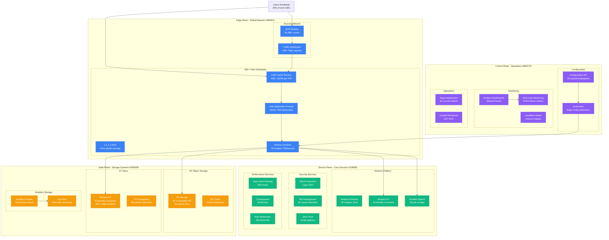

# Cloudflare Complete Architecture - "The Global Edge Platform"

## System Overview

Cloudflare operates the world's largest edge computing platform, protecting and accelerating over 20% of the web. Their network spans 285+ cities across 100+ countries, handling 50+ million HTTP requests per second with 100+ Tbps of global capacity.

## Complete Architecture Diagram

## Key Architecture Components

### Edge Infrastructure
- **285+ Points of Presence**: Every major city worldwide
- **100+ Tbps Capacity**: Largest network capacity globally
- **10ms Average Latency**: 95% of internet users within 10ms
- **50M+ Requests/Second**: Peak traffic handling

### Workers Platform
- **V8 Isolates**: 50,000 isolates per server, 5ms startup
- **CPU Limit**: 50ms per request, 128MB memory
- **Cold Start**: <1ms (vs 100ms+ for containers)
- **Pricing**: $0.50 per million requests

### Storage Systems
- **R2 Object Storage**: 99.999999999% durability, no egress fees
- **Workers KV**: Eventually consistent, 60-second global replication
- **Durable Objects**: Strong consistency, SQLite at edge

### Security Capabilities
- **DDoS Protection**: 76 million attacks mitigated daily
- **Bot Management**: ML-based, 99.9% accuracy
- **Zero Trust**: SASE platform, 50+ countries

## Production Metrics

### Traffic Volume
- **Requests**: 50+ million HTTP requests/second
- **Bandwidth**: 100+ Tbps global capacity
- **DNS Queries**: 1.8 trillion per day to 1.1.1.1
- **Websites**: 20%+ of the internet

### Performance
- **Cache Hit Rate**: 96% average globally
- **Time to First Byte**: 14ms global average
- **Uptime**: 99.99%+ SLA
- **Global Latency**: <50ms to 99% of users

### Scale Metrics
- **PoPs**: 285+ cities in 100+ countries
- **Servers**: 200,000+ servers globally
- **Cables**: 10,000+ miles of private network fiber
- **BGP Routes**: 65,000+ network routes

## Cost Structure

### Infrastructure Investment
- **Annual CapEx**: ~$400M (estimated)
- **Server Refresh**: 3-4 year cycles
- **Network Expansion**: $50M+ annually
- **R&D**: $100M+ annually on edge innovation

### Operational Economics
- **Cost per Request**: ~$0.000001 at scale
- **Bandwidth Cost**: 60% of total infrastructure spend
- **Power Consumption**: 50MW+ globally
- **Cooling**: Advanced liquid cooling systems

## Unique Innovations

### Workers Runtime
- **V8 Isolates**: Faster than containers, better isolation than threads
- **WebAssembly Support**: Multiple language support
- **Durable Objects**: Stateful compute at the edge
- **Unbound**: Worker to Worker communication

### Network Architecture
- **Anycast Everywhere**: Single IP announces from all locations
- **Argo Smart Routing**: 30% performance improvement
- **Magic Transit**: IP-level DDoS protection
- **Magic WAN**: SD-WAN replacement

### Security Innovations
- **Roughtime**: Secure time synchronization protocol
- **Encrypted SNI**: Privacy-preserving TLS
- **IPFS Gateway**: Distributed web support
- **WARP**: Consumer VPN with 40M+ users

## Reliability Guarantees

### SLA Commitments
- **Uptime**: 100% uptime SLA (with credits)
- **Performance**: Sub-second response times
- **Security**: Zero-day vulnerability protection
- **Support**: 24/7/365 enterprise support

### Disaster Recovery
- **Multi-PoP Redundancy**: Traffic automatically routed around failures
- **Real-time Failover**: <30 second detection and mitigation
- **Regional Isolation**: Failures contained to single regions
- **Capacity Overprovisioning**: 2x capacity for peak traffic

This architecture represents the most comprehensive edge computing platform globally, handling over 20% of internet traffic with sub-10ms latency and industry-leading security capabilities.