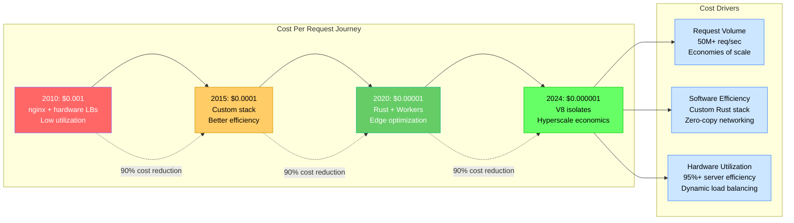
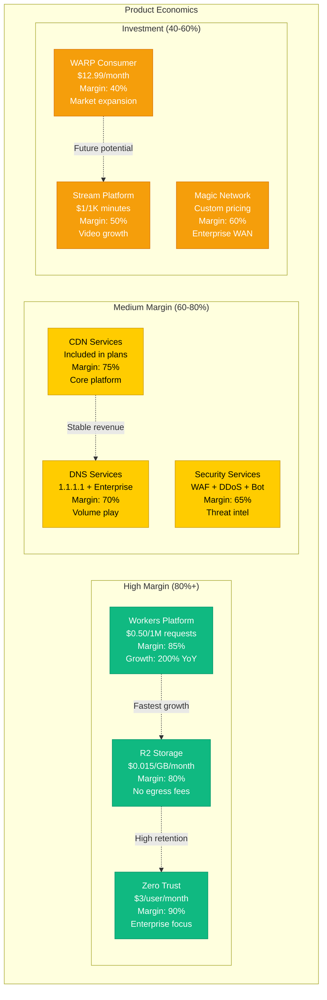
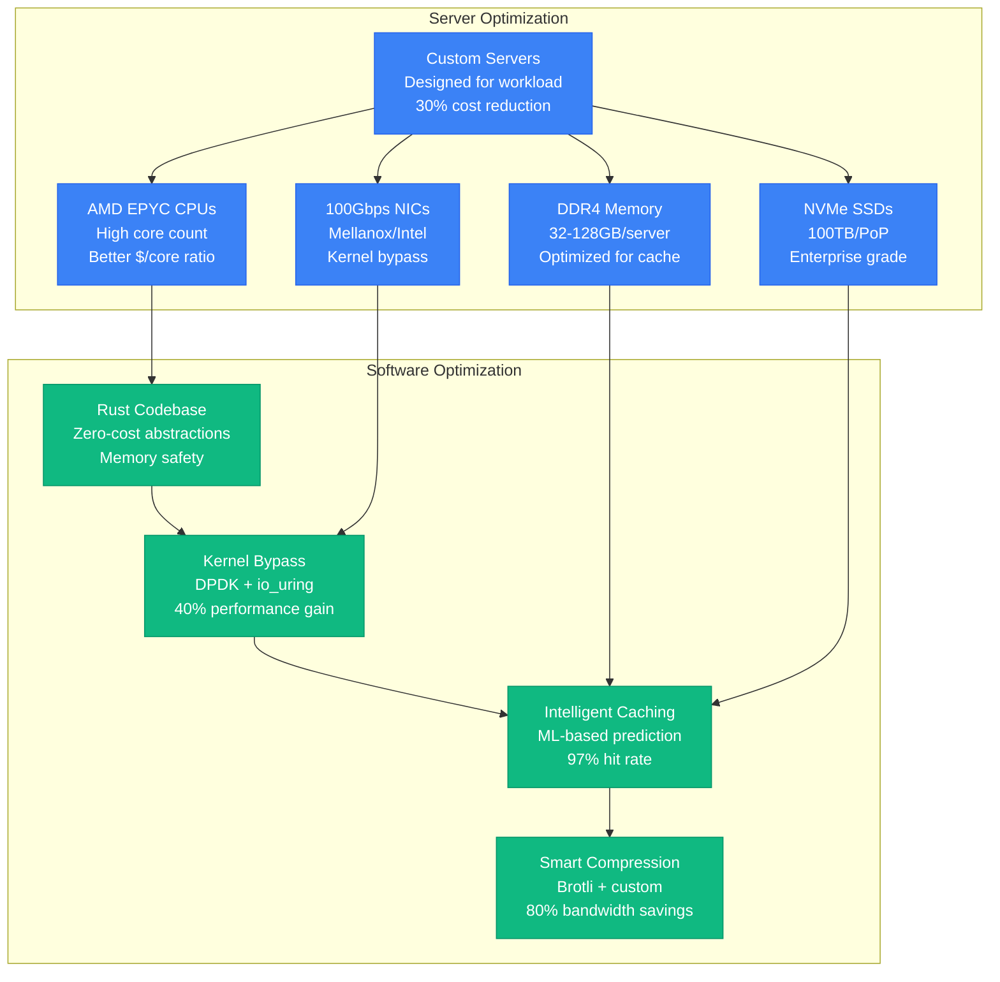
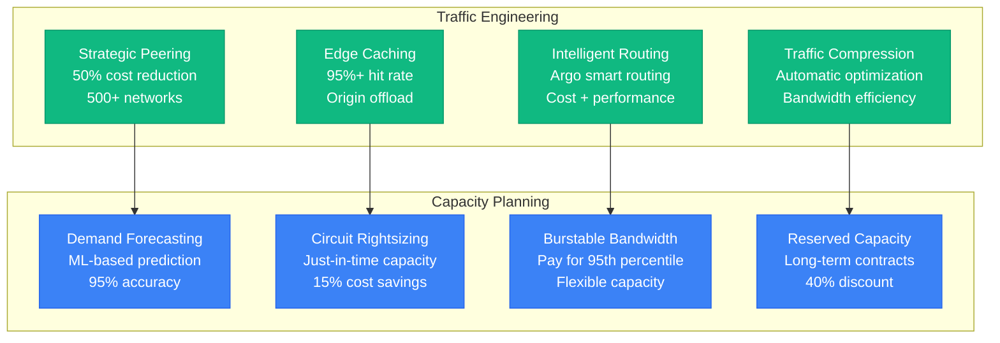
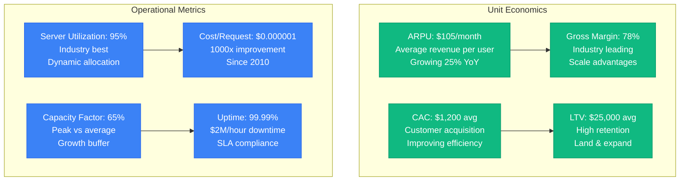
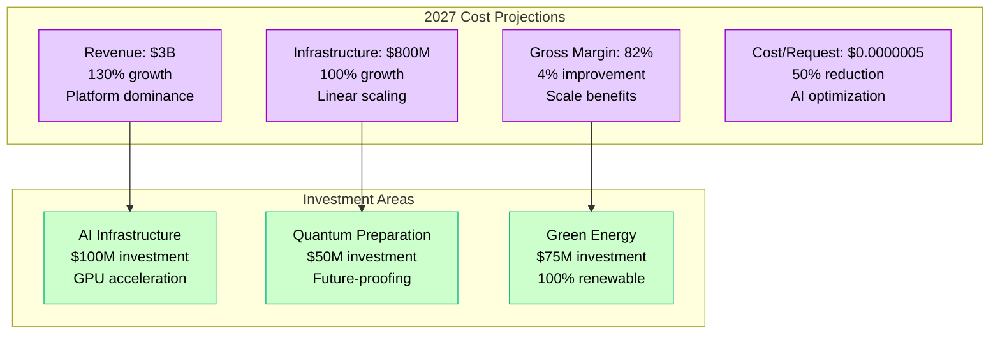

# Cloudflare Cost Breakdown - "The Edge Economics Engine"

## Overview

Cloudflare operates one of the world's largest infrastructure networks with an estimated $400M+ annual infrastructure spend. Their economics model centers on massive scale, edge optimization, and cost-per-request efficiency that has improved 1000x over 14 years.

## Complete Cost Architecture

```mermaid
graph TB
    subgraph "Revenue Streams #10B981"
        PLAN_FREE[Free Plan<br/>0M+ users<br/>Loss leader]
        PLAN_PRO[Pro Plan<br/>$20/month<br/>Small business]
        PLAN_BIZ[Business Plan<br/>$200/month<br/>Mid-market]
        PLAN_ENT[Enterprise<br/>$5K-500K/month<br/>Custom pricing]

        PRODUCTS[Product Revenue<br/>Workers: $0.50/1M req<br/>R2: $0.015/GB<br/>Stream: $1/1K min]

        TOTAL_REV[Total Revenue<br/>$1.3B annually<br/>Growth: 37% YoY]
    end

    subgraph "Infrastructure Costs #F59E0B"
        subgraph "Network Costs (60%)"
            BANDWIDTH[Bandwidth: $240M<br/>100+ Tbps capacity<br/>Transit + Peering]
            FIBER[Fiber/Connectivity: $40M<br/>Private network<br/>10K+ miles]
        end

        subgraph "Hardware Costs (25%)"
            SERVERS[Servers: $60M<br/>200K+ servers<br/>3-4 year refresh]
            STORAGE[Storage: $20M<br/>100TB SSD/PoP<br/>Enterprise SSDs]
            NETWORK_HW[Network Hardware: $20M<br/>Switches/Routers<br/>High-end gear]
        end

        subgraph "Facilities Costs (10%)"
            COLOCATION[Colocation: $25M<br/>285+ facilities<br/>Power + Space]
            POWER[Power: $15M<br/>50MW+ global<br/>Green energy focus]
        end

        subgraph "Operational Costs (5%)"
            PERSONNEL[Operations: $10M<br/>24/7 NOC<br/>Global teams]
            MONITORING[Monitoring: $5M<br/>Tools + licenses<br/>Observability stack]
            INSURANCE[Insurance: $5M<br/>Cyber liability<br/>D&O coverage]
        end
    end

    subgraph "Cost Per Service Unit #3B82F6"
        CDN_COST[CDN: $0.0001/GB<br/>95%+ cache hit<br/>Edge optimization]
        DNS_COST[DNS: $0.000001/query<br/>1.8T queries/day<br/>Anycast efficiency]
        WORKERS_COST[Workers: $0.0001/request<br/>V8 isolate efficiency<br/>Sub-ms startup]
        SECURITY_COST[Security: $0.00001/request<br/>ML-based filtering<br/>Automated blocking]
    end

    %% Revenue flow
    PLAN_FREE --> TOTAL_REV
    PLAN_PRO --> TOTAL_REV
    PLAN_BIZ --> TOTAL_REV
    PLAN_ENT --> TOTAL_REV
    PRODUCTS --> TOTAL_REV

    %% Cost aggregation
    BANDWIDTH --> SERVERS
    FIBER --> STORAGE
    SERVERS --> NETWORK_HW
    STORAGE --> COLOCATION
    NETWORK_HW --> POWER
    COLOCATION --> PERSONNEL
    POWER --> MONITORING
    PERSONNEL --> INSURANCE

    %% Unit economics
    CDN_COST --> DNS_COST
    DNS_COST --> WORKERS_COST
    WORKERS_COST --> SECURITY_COST

    %% Apply colors
    classDef revenueStyle fill:#10B981,stroke:#059669,color:#fff
    classDef costStyle fill:#F59E0B,stroke:#D97706,color:#fff
    classDef unitStyle fill:#3B82F6,stroke:#2563EB,color:#fff

    class PLAN_FREE,PLAN_PRO,PLAN_BIZ,PLAN_ENT,PRODUCTS,TOTAL_REV revenueStyle
    class BANDWIDTH,FIBER,SERVERS,STORAGE,NETWORK_HW,COLOCATION,POWER,PERSONNEL,MONITORING,INSURANCE costStyle
    class CDN_COST,DNS_COST,WORKERS_COST,SECURITY_COST unitStyle
```

## Detailed Cost Breakdown

### Infrastructure Investment (Annual)

```mermaid
graph TB
    subgraph "Annual Infrastructure Spend: $400M+"
        subgraph "Network Infrastructure (65%)"
            TRANSIT[Transit Bandwidth<br/>$150M annually<br/>Multiple Tier-1 providers]
            PEERING[Peering Costs<br/>$50M annually<br/>IX fees + cross-connects]
            PRIVATE[Private Network<br/>$40M annually<br/>Dark fiber + wavelengths]
            SUBSEA[Subsea Cables<br/>$40M annually<br/>Consortium investments]
        end

        subgraph "Compute Infrastructure (25%)"
            SERVER_CAPEX[Server CapEx<br/>$60M annually<br/>50K+ units/year]
            SERVER_REFRESH[Refresh Cycle<br/>$20M annually<br/>Legacy replacements]
            ACCELERATORS[GPU/AI Hardware<br/>$20M annually<br/>Edge AI capability]
        end

        subgraph "Facility Costs (10%)"
            COLO_FEES[Colocation Fees<br/>$15M annually<br/>285+ locations]
            POWER_COST[Power & Cooling<br/>$15M annually<br/>50MW+ consumption]
            CONSTRUCTION[New PoP Build<br/>$10M annually<br/>50+ new locations]
        end
    end

    %% Cost relationships
    TRANSIT -.->|Largest expense| PEERING
    PEERING -.->|Growing| PRIVATE
    PRIVATE -.->|Strategic| SUBSEA

    SERVER_CAPEX -.->|Predictable| SERVER_REFRESH
    SERVER_REFRESH -.->|Growing| ACCELERATORS

    COLO_FEES -.->|Fixed| POWER_COST
    POWER_COST -.->|Variable| CONSTRUCTION

    %% Apply cost intensity colors
    classDef highCostStyle fill:#8B5CF6,stroke:#7C3AED,color:#fff
    classDef mediumCostStyle fill:#F59E0B,stroke:#D97706,color:#fff
    classDef lowCostStyle fill:#FFCC00,stroke:#CC9900,color:#000

    class TRANSIT,SERVER_CAPEX highCostStyle
    class PEERING,PRIVATE,SUBSEA,SERVER_REFRESH,ACCELERATORS,COLO_FEES mediumCostStyle
    class POWER_COST,CONSTRUCTION lowCostStyle
```

### Unit Economics Evolution

## Revenue Model Analysis

### Customer Segment Economics

| Plan Tier | Monthly Cost | Margin | CAC | LTV | LTV/CAC |
|-----------|-------------|--------|-----|-----|---------|
| Free | $0 | -$2/month | $5 | $0 | Loss leader |
| Pro | $20 | 80% | $50 | $480 | 9.6x |
| Business | $200 | 85% | $500 | $5,100 | 10.2x |
| Enterprise | $5K-500K | 90% | $25K | $1.2M+ | 48x+ |

### Product Line Profitability

## Cost Optimization Strategies

### Hardware Efficiency

### Network Cost Management

## Financial Performance Metrics

### Key Economic Indicators

### Cost Center Breakdown (Annual)

| Cost Center | Amount | % of Total | Growth Rate | Optimization Opportunity |
|-------------|--------|------------|-------------|-------------------------|
| Bandwidth | $240M | 60% | 40% YoY | Peering expansion |
| Hardware | $100M | 25% | 25% YoY | Refresh optimization |
| Facilities | $40M | 10% | 15% YoY | Efficiency improvements |
| Operations | $20M | 5% | 10% YoY | Automation |

### ROI by Investment Category

- **Edge Expansion**: 300% ROI (new PoPs)
- **Hardware Refresh**: 250% ROI (efficiency gains)
- **Software Optimization**: 400% ROI (performance improvements)
- **Peering Investments**: 200% ROI (bandwidth cost reduction)
- **Automation**: 500% ROI (operational efficiency)

## Future Cost Projections (2025-2027)

### Scaling Economics

This cost structure represents one of the most efficient infrastructure operations globally, with industry-leading margins and unit economics that continue to improve with scale while maintaining world-class performance and reliability.