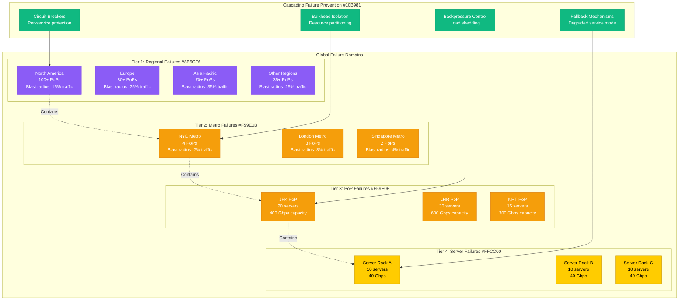
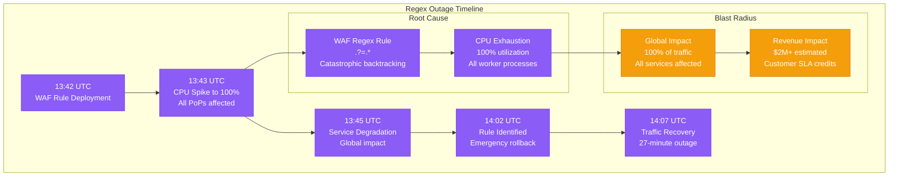
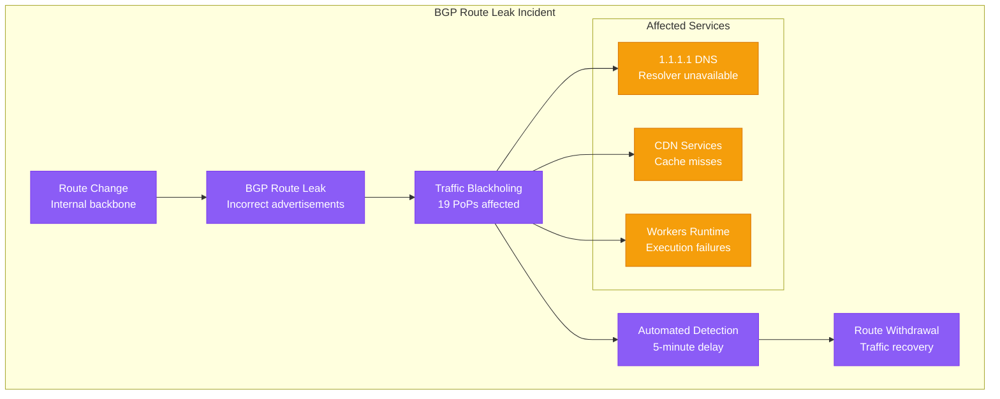
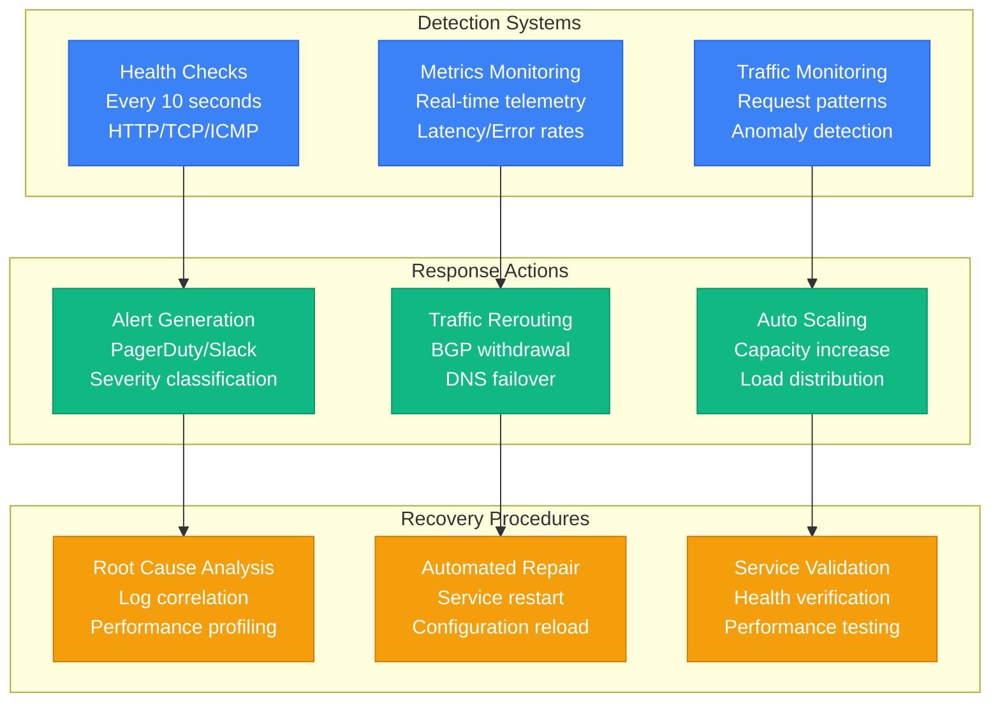
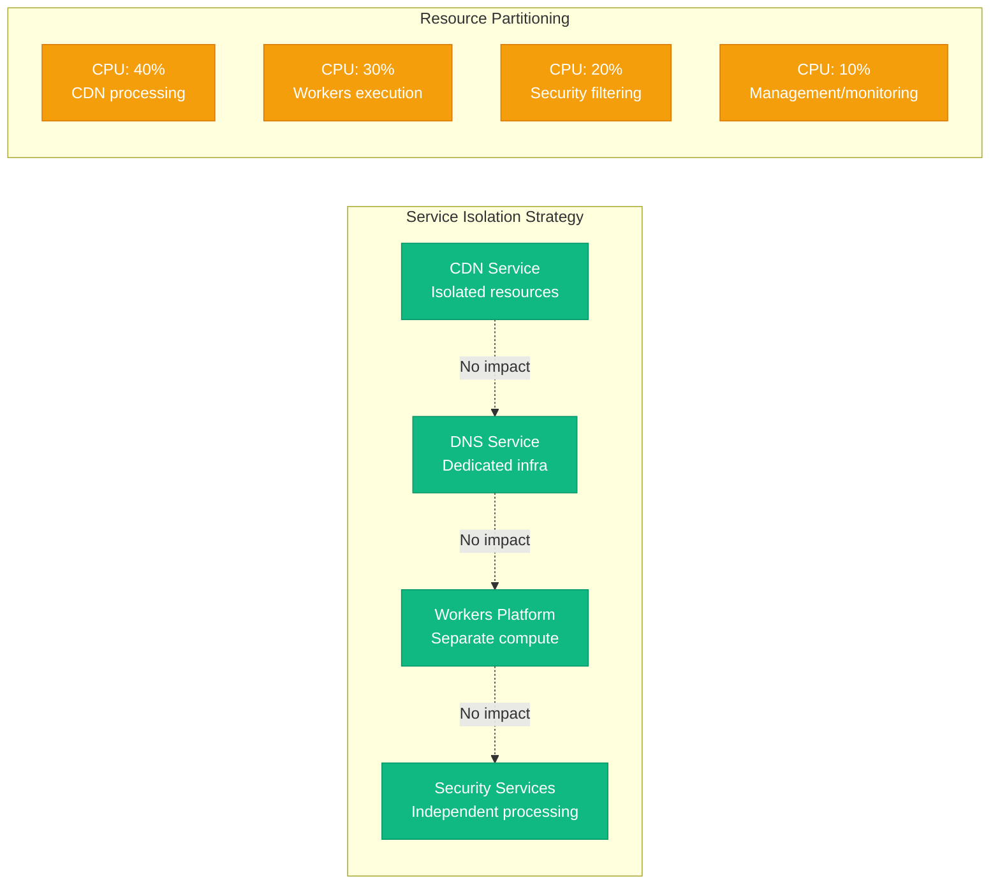
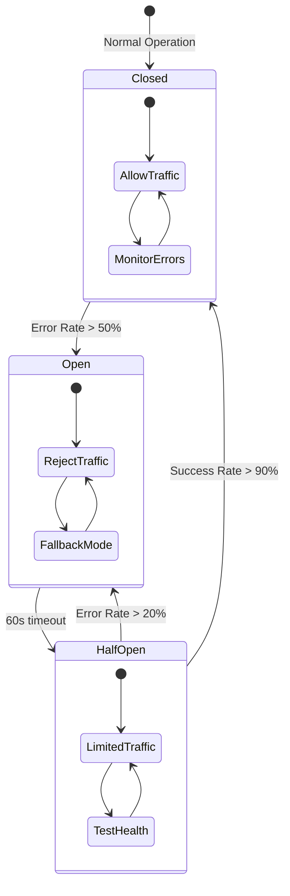

# Cloudflare Failure Domains - "The Incident Blast Radius Map"

## Overview

Cloudflare's global architecture is designed with multiple failure domains to ensure that localized failures don't cascade into global outages. With 285+ PoPs worldwide, the platform automatically routes around failures within 30 seconds while maintaining service availability.

## Global Failure Domain Architecture



## Historical Incident Analysis

### July 2, 2019 - The Regex Outage



**Lessons Learned:**
- **Testing**: Regex patterns must be tested for performance impact
- **Gradual Rollout**: Security rules need staged deployment
- **Circuit Breakers**: CPU-based protection for runaway processes
- **Monitoring**: Real-time alerting for resource exhaustion

### June 21, 2022 - BGP Route Leak



**Impact Metrics:**
- **Duration**: 47 minutes total
- **Affected PoPs**: 19 out of 285+ locations
- **Traffic Impact**: 7% of global traffic
- **Recovery Time**: 15 minutes after detection

## Failure Detection and Response

### Automated Failure Detection



### Failover Mechanisms

```mermaid
graph TB
    subgraph "Anycast Failover"
        PRIMARY[Primary PoP<br/>Normal operation] --> FAILURE[PoP Failure<br/>Health check fails]
        FAILURE --> BGP_WITHDRAW[BGP Route Withdrawal<br/>30-second timeout]
        BGP_WITHDRAW --> REROUTE[Traffic Rerouting<br/>Next closest PoP]
        REROUTE --> SECONDARY[Secondary PoP<br/>Increased load]
    end

    subgraph "Service Failover"
        SERVICE_A[Service Instance A] --> CIRCUIT_OPEN[Circuit Breaker Open<br/>Error threshold exceeded]
        CIRCUIT_OPEN --> SERVICE_B[Service Instance B<br/>Healthy backup]
        SERVICE_B --> LOAD_SHED[Load Shedding<br/>Priority traffic only]
    end

    %% Apply colors
    classDef normalStyle fill:#10B981,stroke:#059669,color:#fff
    classDef failureStyle fill:#8B5CF6,stroke:#7C3AED,color:#fff
    classDef recoveryStyle fill:#F59E0B,stroke:#D97706,color:#fff

    class PRIMARY,SERVICE_A normalStyle
    class FAILURE,CIRCUIT_OPEN failureStyle
    class BGP_WITHDRAW,REROUTE,SECONDARY,SERVICE_B,LOAD_SHED recoveryStyle
```



## Blast Radius Containment

### Geographic Isolation

| Failure Type | Affected Area | Traffic Impact | Recovery Time | Mitigation |
|--------------|---------------|----------------|---------------|------------|
| Server Failure | Single rack | 0.01% | 10 seconds | Load balancer failover |
| PoP Failure | City/Metro | 0.1-2% | 30 seconds | BGP rerouting |
| Metro Failure | Metropolitan area | 1-5% | 2 minutes | Regional failover |
| Regional Failure | Continent | 15-35% | 5 minutes | Cross-region failover |
| Cable Cut | Ocean region | 5-15% | 15 minutes | Satellite backup |

### Service Isolation



## Circuit Breaker Implementation

### Per-Service Protection



### Fallback Strategies

- **CDN Fallback**: Direct origin connection when edge fails
- **DNS Fallback**: Secondary resolver when primary unavailable
- **Workers Fallback**: Static response when compute fails
- **Security Fallback**: Allow traffic when WAF unavailable

## Recovery Procedures

### Incident Response Timeline

```mermaid
gantt
    title Cloudflare Incident Response
    dateFormat X
    axisFormat %M:%S

    section Detection
    Automated monitoring :done, monitoring, 0, 30s
    Alert generation :done, alert, 30s, 60s
    On-call notification :done, oncall, 60s, 90s

    section Assessment
    Initial triage :done, triage, 90s, 3m
    Impact assessment :done, impact, 3m, 5m
    Escalation decision :done, escalate, 5m, 7m

    section Mitigation
    Traffic rerouting :done, reroute, 7m, 9m
    Service isolation :done, isolate, 9m, 12m
    Fallback activation :done, fallback, 12m, 15m

    section Recovery
    Root cause fix :done, fix, 15m, 25m
    Service restoration :done, restore, 25m, 30m
    Post-incident review :done, review, 30m, 60m
```

### Recovery Time Objectives (RTO)

- **Detection**: <30 seconds for critical failures
- **Notification**: <60 seconds to on-call team
- **Mitigation**: <5 minutes for traffic rerouting
- **Recovery**: <15 minutes for service restoration
- **Communication**: <10 minutes for status page update

This failure domain architecture ensures that Cloudflare maintains 99.99%+ uptime despite operating one of the world's largest distributed systems, with automatic failover and recovery capabilities that minimize the blast radius of any single failure.