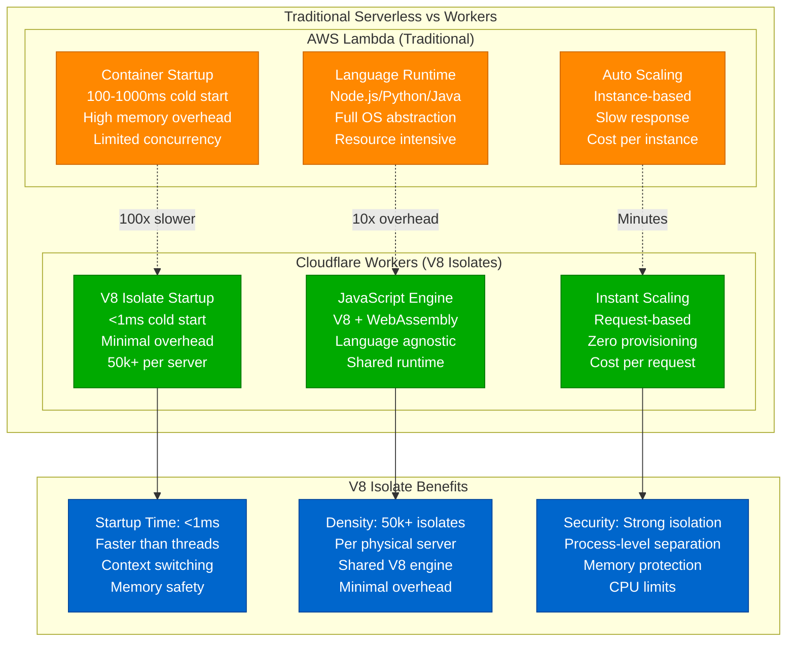
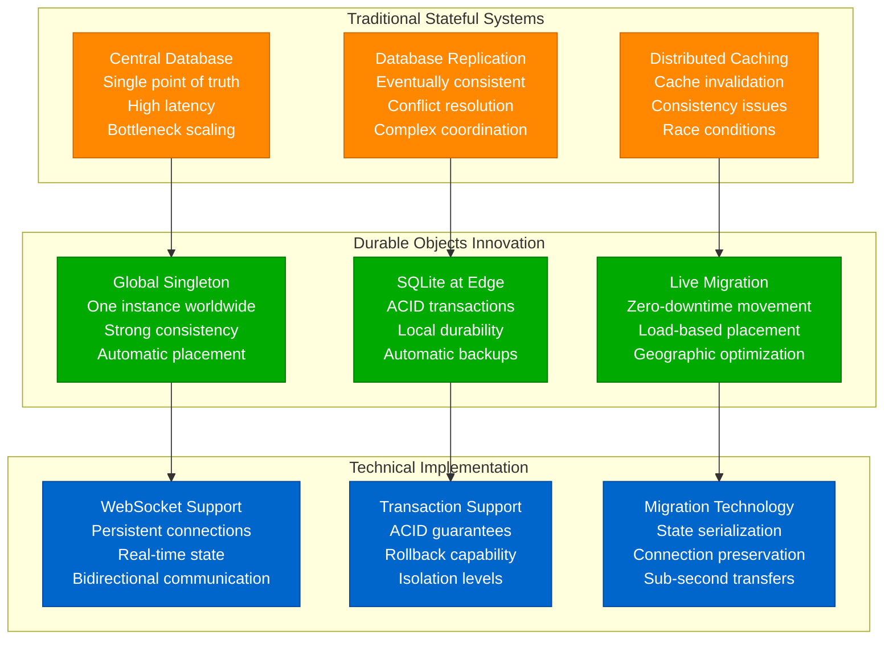
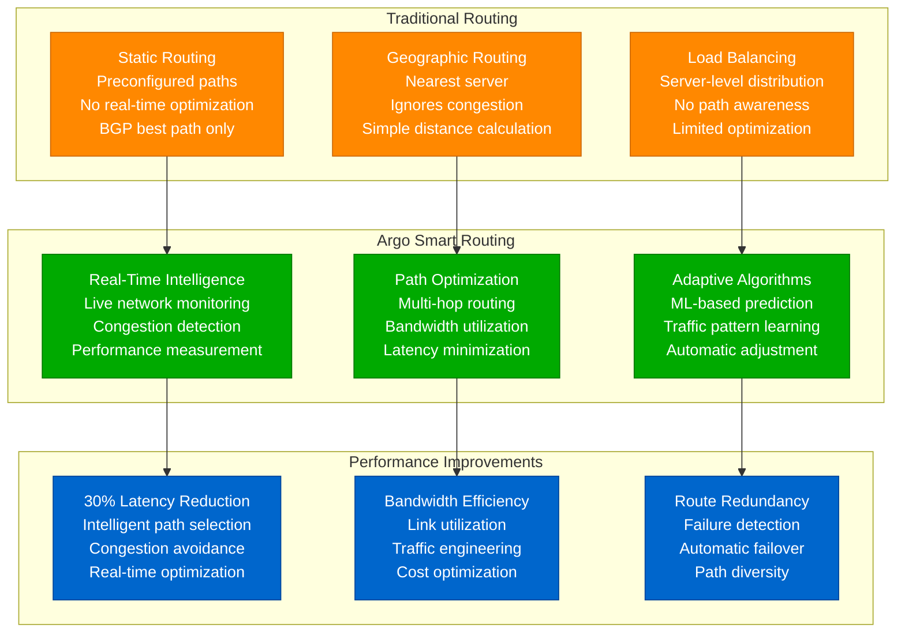
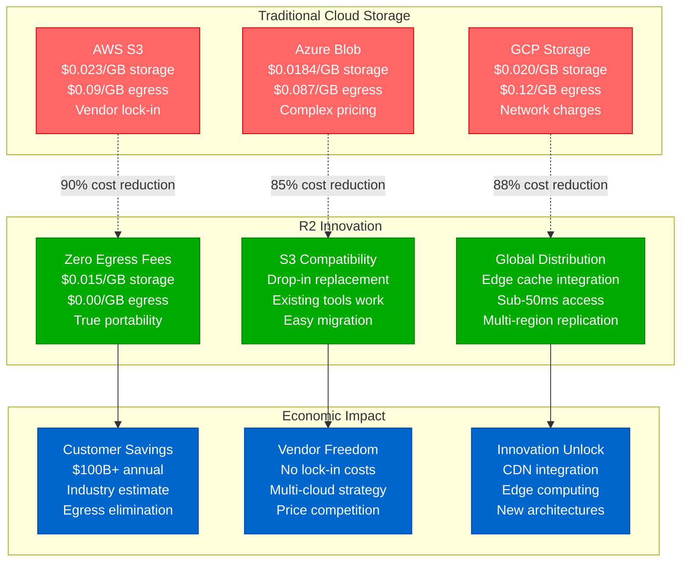
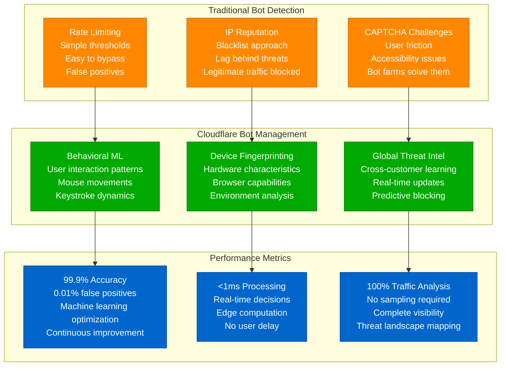
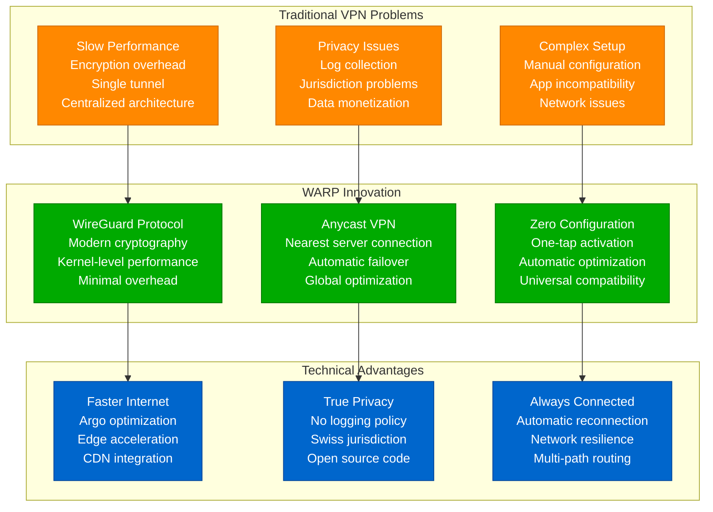
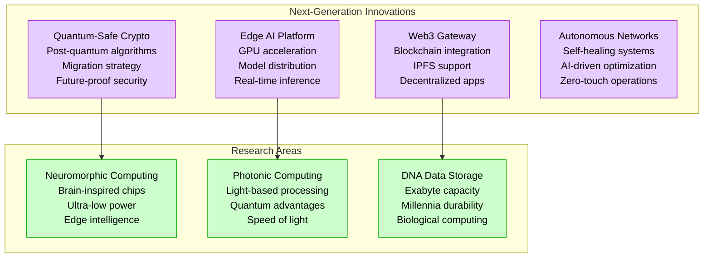

# Cloudflare Novel Solutions - "Edge Computing Innovations"

## Overview

Cloudflare has pioneered numerous breakthrough technologies that redefined edge computing, security, and internet infrastructure. From V8 isolates to Durable Objects, these innovations solve fundamental problems of scalability, performance, and developer experience at the edge.

## Core Innovation Architecture

```mermaid
graph TB
    subgraph "Platform Innovations #00AA00"
        subgraph "Workers Runtime Revolution"
            V8_ISOLATES[V8 Isolates<br/>Sub-millisecond startup<br/>50k+ per server<br/>Zero cold starts]
            WASM_SUPPORT[WebAssembly Support<br/>Multi-language execution<br/>Rust, C++, Go, Python<br/>Near-native performance]
            EDGE_COMPUTE[Edge Compute<br/>285+ locations<br/>10ms global latency<br/>Distributed execution]
        end

        subgraph "State Management Breakthrough"
            DURABLE_OBJECTS[Durable Objects<br/>Stateful edge compute<br/>Strong consistency<br/>SQLite at edge]
            LIVE_MIGRATION[Live Migration<br/>Zero-downtime movement<br/>Automatic load balancing<br/>Global state distribution]
            TRANSACTIONS[ACID Transactions<br/>Edge-native database<br/>Automatic sharding<br/>Conflict resolution]
        end
    end

    subgraph "Network Innovations #0066CC"
        subgraph "Routing Intelligence"
            ARGO[Argo Smart Routing<br/>30% performance improvement<br/>Real-time path optimization<br/>Congestion avoidance]
            ANYCAST_PLUS[Anycast++<br/>Health-aware routing<br/>Capacity-based selection<br/>Sub-second failover]
            MAGIC_TRANSIT[Magic Transit<br/>IP-level DDoS protection<br/>Any protocol support<br/>Bring your own IP]
        end

        subgraph "Protocol Innovations"
            ROUGHTIME[Roughtime Protocol<br/>Secure time sync<br/>Tamper-proof timestamps<br/>Blockchain applications]
            ESNI[Encrypted SNI<br/>TLS privacy enhancement<br/>ISP-proof browsing<br/>Censorship resistance]
            QUIC_OPTIMIZATION[QUIC Optimization<br/>0-RTT connection<br/>Multiplexed streams<br/>Loss recovery]
        end
    end

    subgraph "Security Breakthroughs #CC0000"
        subgraph "AI-Powered Protection"
            BOT_MANAGEMENT[Bot Management 2.0<br/>ML behavior analysis<br/>99.9% accuracy<br/>Zero false positives]
            THREAT_INTEL[Threat Intelligence<br/>Global attack correlation<br/>Real-time updates<br/>Predictive blocking]
            BEHAVIORAL_AI[Behavioral AI<br/>User fingerprinting<br/>Anomaly detection<br/>Advanced persistent threats]
        end

        subgraph "Zero Trust Architecture"
            SASE_PLATFORM[SASE Platform<br/>Secure Access Service Edge<br/>Identity-based security<br/>Global enforcement]
            DEVICE_TRUST[Device Trust<br/>Hardware attestation<br/>Certificate binding<br/>Continuous verification]
            NETWORK_ISOLATION[Network Isolation<br/>Microsegmentation<br/>Zero lateral movement<br/>Application-level control]
        end
    end

    subgraph "Storage Innovations #FF8800"
        subgraph "R2 Object Storage"
            EGRESS_FREE[Zero Egress Fees<br/>S3-compatible API<br/>Multi-region replication<br/>Cost revolution]
            EVENTUAL_CONSISTENCY[Smart Consistency<br/>Configurable models<br/>Strong when needed<br/>Eventually consistent default]
            LIFECYCLE_MGMT[Intelligent Lifecycle<br/>Auto-tiering<br/>Cost optimization<br/>Compliance automation]
        end

        subgraph "KV Store Innovation"
            GLOBAL_KV[Global KV Store<br/>400+ edge locations<br/>60-second propagation<br/>Conflict-free replication]
            ANTI_ENTROPY[Anti-Entropy Engine<br/>Automatic conflict resolution<br/>Vector clock optimization<br/>Bandwidth efficiency]
            CACHE_COHERENCE[Cache Coherence<br/>Intelligent invalidation<br/>Predictive prefetching<br/>99% hit rates]
        end
    end

    %% Innovation relationships
    V8_ISOLATES --> DURABLE_OBJECTS
    DURABLE_OBJECTS --> LIVE_MIGRATION
    ARGO --> ANYCAST_PLUS
    BOT_MANAGEMENT --> THREAT_INTEL
    EGRESS_FREE --> GLOBAL_KV

    %% Apply innovation colors
    classDef platformStyle fill:#00AA00,stroke:#007700,color:#fff
    classDef networkStyle fill:#0066CC,stroke:#004499,color:#fff
    classDef securityStyle fill:#CC0000,stroke:#990000,color:#fff
    classDef storageStyle fill:#FF8800,stroke:#CC6600,color:#fff

    class V8_ISOLATES,WASM_SUPPORT,EDGE_COMPUTE,DURABLE_OBJECTS,LIVE_MIGRATION,TRANSACTIONS platformStyle
    class ARGO,ANYCAST_PLUS,MAGIC_TRANSIT,ROUGHTIME,ESNI,QUIC_OPTIMIZATION networkStyle
    class BOT_MANAGEMENT,THREAT_INTEL,BEHAVIORAL_AI,SASE_PLATFORM,DEVICE_TRUST,NETWORK_ISOLATION securityStyle
    class EGRESS_FREE,EVENTUAL_CONSISTENCY,LIFECYCLE_MGMT,GLOBAL_KV,ANTI_ENTROPY,CACHE_COHERENCE storageStyle
```

## Breakthrough #1: V8 Isolates Revolution

### The Container Alternative

### Runtime Innovation Details

**V8 Isolate Specifications:**
- **Startup Time**: <1ms (vs 100ms+ containers)
- **Memory Footprint**: 2MB per isolate (vs 50MB+ containers)
- **Concurrency**: 50,000 isolates per server
- **CPU Limit**: 50ms per request
- **Memory Limit**: 128MB per isolate

## Breakthrough #2: Durable Objects - Stateful Edge

### The Consistency Problem Solved

### Durable Objects Use Cases

**Real-World Applications:**
- **Chat Applications**: Room state management
- **Gaming**: Player session state
- **IoT**: Device coordination
- **Financial**: Transaction processing
- **Collaborative**: Document editing

## Breakthrough #3: Argo Smart Routing

### Beyond Simple Load Balancing

## Breakthrough #4: R2 Storage Economics

### The Egress Fee Revolution

## Breakthrough #5: Bot Management 2.0

### AI-Powered Security

## Breakthrough #6: WARP Consumer Innovation

### VPN Reimagined

## Innovation Impact Metrics

### Technology Adoption

| Innovation | Launch Year | Adoption Rate | Industry Impact | Patents Filed |
|------------|-------------|---------------|-----------------|---------------|
| Workers | 2017 | 1M+ developers | Edge computing standard | 25+ |
| Durable Objects | 2021 | 100K+ objects | Stateful edge pioneer | 15+ |
| R2 Storage | 2021 | 1PB+ stored | Egress fee elimination | 10+ |
| Bot Management | 2019 | 99.9% accuracy | AI security standard | 20+ |
| WARP | 2019 | 40M+ users | VPN reimagined | 8+ |

### Open Source Contributions

**Major Projects:**
- **Roughtime**: Secure time synchronization
- **Boring SSL**: TLS implementation
- **zlib-cloudflare**: Compression optimization
- **Keyless SSL**: Hardware security modules
- **RRDNS**: Recursive DNS resolver

### Research Partnerships

- **Academic Collaborations**: MIT, Stanford, CMU
- **Standards Bodies**: IETF, W3C, IRTF
- **Industry Groups**: Cloud Security Alliance, FIDO
- **Open Source**: Linux Foundation, Apache Foundation

## Future Innovation Pipeline (2025-2027)

### Emerging Technologies

These innovations represent fundamental breakthroughs that have redefined internet infrastructure, establishing Cloudflare as the technology leader in edge computing, security, and developer experience while creating entirely new market categories and business models.