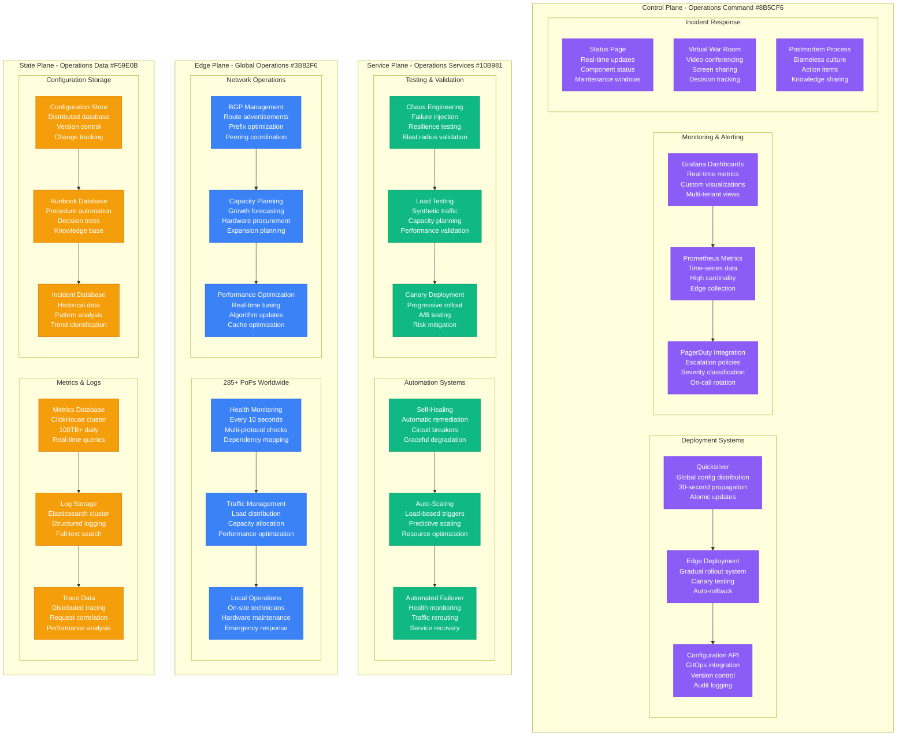
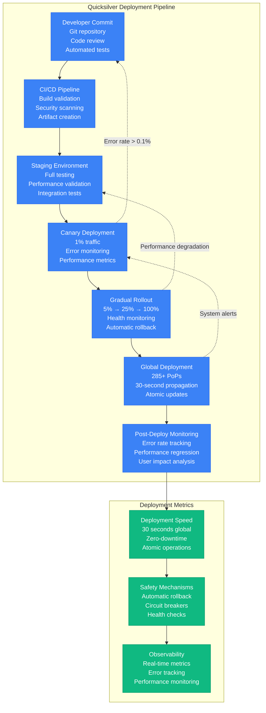
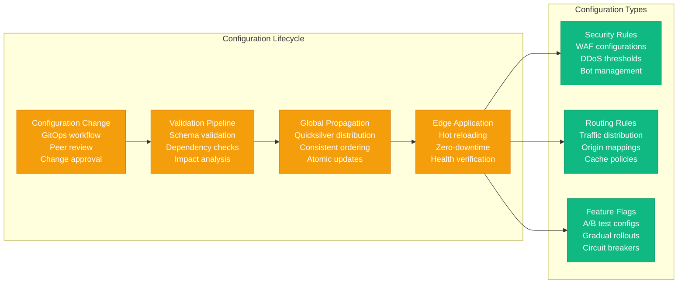
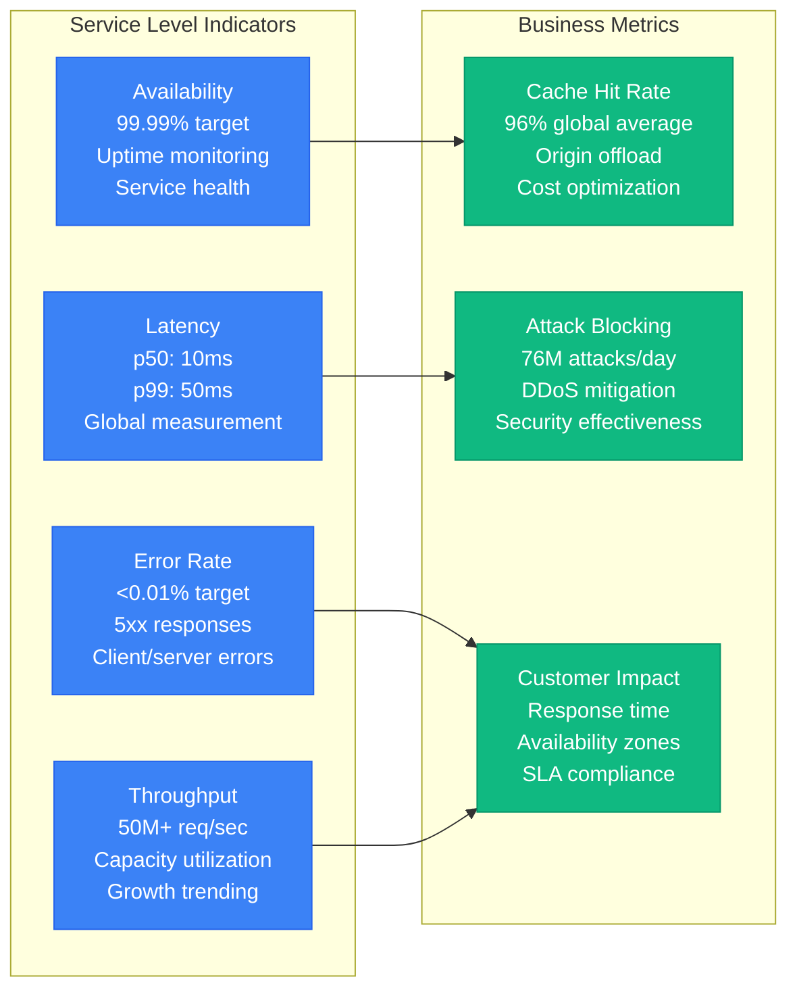
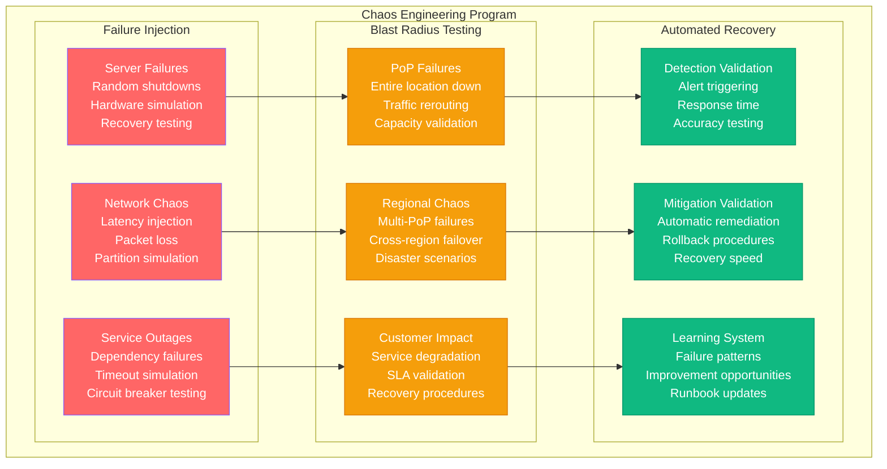

# Cloudflare Production Operations - "The Global Operations Command Center"

## Overview

Cloudflare operates one of the world's most complex distributed systems with 285+ PoPs, 50M+ requests per second, and 99.99%+ uptime requirements. Their operational excellence comes from automated deployment systems, real-time monitoring, and battle-tested incident response procedures.

## Operations Architecture



## Deployment Pipeline - Quicksilver

### 30-Second Global Deployment



### Configuration Management



## Real-Time Monitoring

### Global Metrics Dashboard

```mermaid
graph TB
    subgraph Monitoring Architecture
        subgraph Data Collection (Edge)
            EDGE_METRICS[Edge Metrics<br/>Request latency<br/>Error rates<br/>Cache performance]
            SYSTEM_METRICS[System Metrics<br/>CPU utilization<br/>Memory usage<br/>Network traffic]
            APP_METRICS[Application Metrics<br/>Workers execution<br/>Database queries<br/>External API calls]
        end

        subgraph Data Aggregation
            STREAM_PROC[Stream Processing<br/>Real-time aggregation<br/>Alerting rules<br/>Anomaly detection]
            TIME_SERIES[Time Series DB<br/>High-resolution data<br/>Long-term storage<br/>Query optimization]
            DASHBOARDS[Grafana Dashboards<br/>Real-time visualization<br/>Custom views<br/>Alerting integration]
        end

        subgraph Alerting System
            ALERT_RULES[Alert Rules<br/>Threshold-based<br/>Anomaly detection<br/>Predictive alerts]
            NOTIFICATION[Notification Engine<br/>PagerDuty integration<br/>Slack alerts<br/>SMS/Email]
            ESCALATION[Escalation Policies<br/>On-call rotation<br/>Severity levels<br/>Auto-escalation]
        end
    end

    %% Data flow
    EDGE_METRICS --> STREAM_PROC
    SYSTEM_METRICS --> TIME_SERIES
    APP_METRICS --> DASHBOARDS

    STREAM_PROC --> ALERT_RULES
    TIME_SERIES --> NOTIFICATION
    DASHBOARDS --> ESCALATION

    %% Apply monitoring colors
    classDef collectionStyle fill:#3B82F6,stroke:#2563EB,color:#fff
    classDef aggregationStyle fill:#10B981,stroke:#059669,color:#fff
    classDef alertingStyle fill:#8B5CF6,stroke:#7C3AED,color:#fff

    class EDGE_METRICS,SYSTEM_METRICS,APP_METRICS collectionStyle
    class STREAM_PROC,TIME_SERIES,DASHBOARDS aggregationStyle
    class ALERT_RULES,NOTIFICATION,ESCALATION alertingStyle
```

### Key Performance Indicators



## Incident Response Process

### War Room Procedures

```mermaid
graph TB
    subgraph Incident Response Timeline
        DETECTION[Incident Detection<br/>Automated alerts<br/>Customer reports<br/>Monitoring systems]

        TRIAGE[Initial Triage<br/>Severity assessment<br/>Impact evaluation<br/>Team notification]

        WAR_ROOM_START[War Room Activation<br/>Video conference<br/>Incident commander<br/>SME coordination]

        INVESTIGATION[Root Cause Analysis<br/>Log correlation<br/>Metrics analysis<br/>Hypothesis testing]

        MITIGATION[Mitigation Actions<br/>Service restoration<br/>Traffic rerouting<br/>Workaround deployment]

        RECOVERY[Full Recovery<br/>Service validation<br/>Performance testing<br/>Monitoring verification]

        POSTMORTEM[Post-Incident Review<br/>Timeline reconstruction<br/>Action items<br/>Process improvements]
    end

    %% Timeline flow
    DETECTION --> TRIAGE
    TRIAGE --> WAR_ROOM_START
    WAR_ROOM_START --> INVESTIGATION
    INVESTIGATION --> MITIGATION
    MITIGATION --> RECOVERY
    RECOVERY --> POSTMORTEM

    %% Parallel activities
    INVESTIGATION -.->|Continuous| MITIGATION
    MITIGATION -.->|Monitoring| RECOVERY

    subgraph Response Times (SLA)
        DETECT_TIME[Detection: <1 minute<br/>Automated monitoring<br/>Real-time alerts<br/>Customer feedback]

        RESPONSE_TIME[Response: <5 minutes<br/>On-call notification<br/>Team assembly<br/>Initial assessment]

        MITIGATION_TIME[Mitigation: <15 minutes<br/>Traffic rerouting<br/>Service isolation<br/>Workaround deployment]

        RECOVERY_TIME[Recovery: <60 minutes<br/>Root cause fix<br/>Service restoration<br/>Full validation]
    end

    DETECTION --> DETECT_TIME
    TRIAGE --> RESPONSE_TIME
    MITIGATION --> MITIGATION_TIME
    RECOVERY --> RECOVERY_TIME

    %% Apply incident colors
    classDef processStyle fill:#8B5CF6,stroke:#7C3AED,color:#fff
    classDef slaStyle fill:#10B981,stroke:#059669,color:#fff

    class DETECTION,TRIAGE,WAR_ROOM_START,INVESTIGATION,MITIGATION,RECOVERY,POSTMORTEM processStyle
    class DETECT_TIME,RESPONSE_TIME,MITIGATION_TIME,RECOVERY_TIME slaStyle
```

### Incident Classification

| Severity | Definition | Response Time | Escalation | Examples |
|----------|------------|---------------|------------|----------|
| P0 | Complete outage | 1 minute | C-level | Global DNS failure |
| P1 | Major degradation | 5 minutes | VP-level | Regional PoP outage |
| P2 | Minor impact | 15 minutes | Director | Single service degradation |
| P3 | Isolated issues | 1 hour | Manager | Individual customer impact |
| P4 | Monitoring alerts | 4 hours | Engineer | Performance anomalies |

## Chaos Engineering

### Resilience Testing



## Operations Team Structure

### 24/7 Global Operations

```mermaid
graph TB
    subgraph Global Operations Centers
        subgraph San Francisco (Primary)
            SF_NOC[San Francisco NOC<br/>Primary operations<br/>8 AM - 8 PM PST<br/>Tier 3 engineers]
            SF_ONCALL[On-Call Engineers<br/>24/7 availability<br/>Escalation procedures<br/>Remote access]
        end

        subgraph London (EMEA)
            LON_NOC[London NOC<br/>EMEA operations<br/>8 AM - 8 PM GMT<br/>Regional expertise]
            LON_SUPPORT[EMEA Support<br/>Customer escalations<br/>Local partnerships<br/>Compliance team]
        end

        subgraph Singapore (APAC)
            SIN_NOC[Singapore NOC<br/>APAC operations<br/>8 AM - 8 PM SGT<br/>Growth markets]
            SIN_EXPANSION[APAC Expansion<br/>New PoP deployment<br/>Partner relations<br/>Local operations]
        end
    end

    subgraph Specialized Teams
        SECURITY_OPS[Security Operations<br/>Threat hunting<br/>Incident response<br/>Forensic analysis]

        NETWORK_OPS[Network Operations<br/>BGP management<br/>Peering coordination<br/>Capacity planning]

        PLATFORM_OPS[Platform Operations<br/>Workers deployment<br/>Storage management<br/>Performance optimization]

        CUSTOMER_OPS[Customer Operations<br/>Enterprise support<br/>SLA management<br/>Escalation handling]
    end

    %% Operations coordination
    SF_NOC --> LON_NOC
    LON_NOC --> SIN_NOC
    SIN_NOC --> SF_NOC

    SF_ONCALL --> SECURITY_OPS
    LON_SUPPORT --> NETWORK_OPS
    SIN_EXPANSION --> PLATFORM_OPS
    SECURITY_OPS --> CUSTOMER_OPS

    %% Apply team colors
    classDef nocStyle fill:#3B82F6,stroke:#2563EB,color:#fff
    classDef specialistStyle fill:#10B981,stroke:#059669,color:#fff

    class SF_NOC,SF_ONCALL,LON_NOC,LON_SUPPORT,SIN_NOC,SIN_EXPANSION nocStyle
    class SECURITY_OPS,NETWORK_OPS,PLATFORM_OPS,CUSTOMER_OPS specialistStyle
```

## Operational Excellence Metrics

### Performance Targets

- **Mean Time to Detection (MTTD)**: <1 minute
- **Mean Time to Response (MTTR)**: <5 minutes
- **Mean Time to Recovery (MTTR)**: <15 minutes
- **Change Failure Rate**: <0.1%
- **Deployment Frequency**: 100+ per day
- **Lead Time**: <30 minutes (commit to production)

### Reliability Achievements

- **Uptime**: 99.99%+ (4 nines SLA)
- **Global Availability**: 99.999% (5 nines achieved)
- **Incident Response**: <5 minute escalation
- **Recovery Automation**: 95% self-healing
- **False Positive Rate**: <0.01% alerts
- **Customer Impact**: <0.001% of requests affected

This operational excellence framework enables Cloudflare to maintain world-class reliability while operating at unprecedented global scale, serving 20%+ of internet traffic with sub-10ms latency and industry-leading security protection.