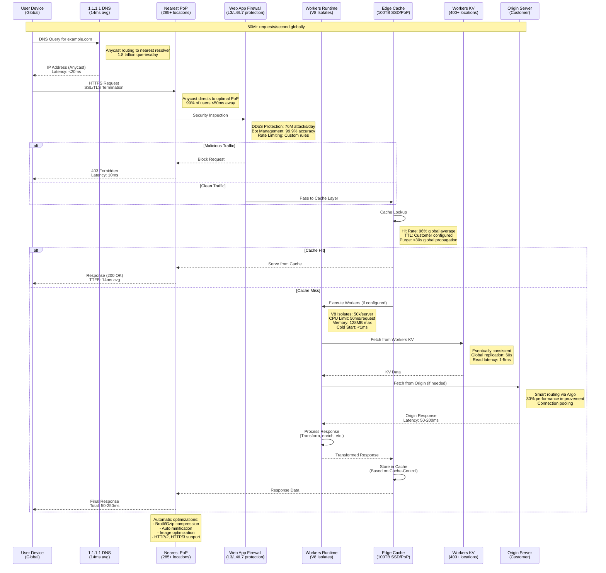
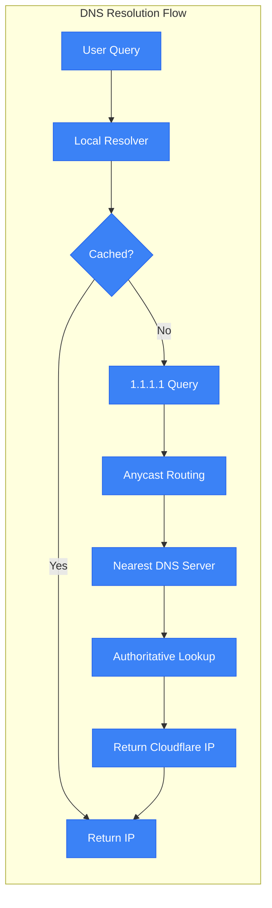
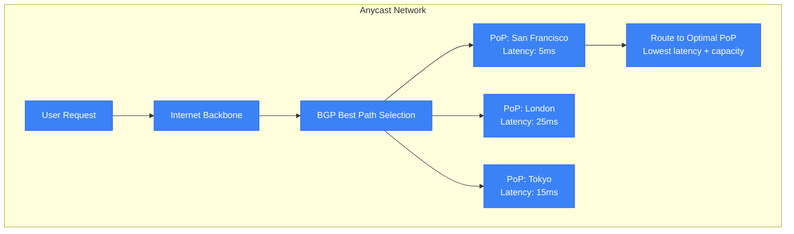
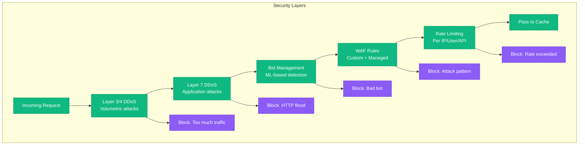
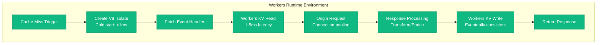
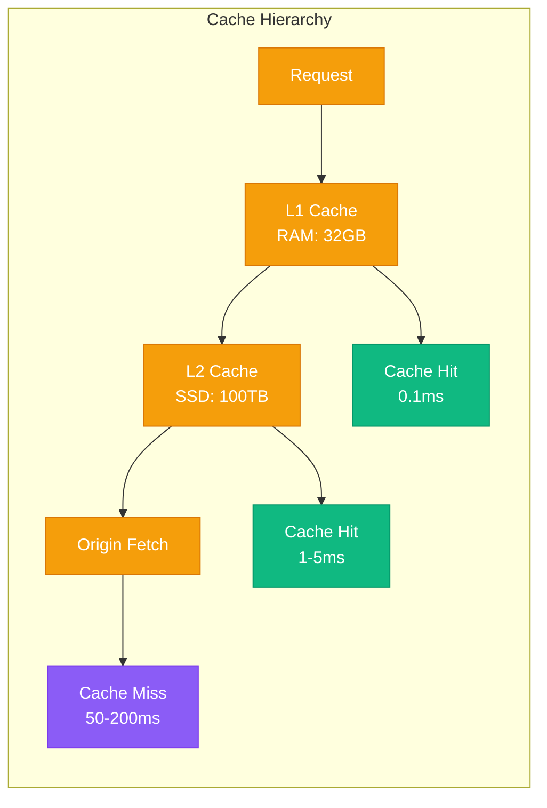

# Cloudflare Request Flow - "The Global Golden Path"

## Overview

Cloudflare processes 50+ million HTTP requests per second through their global edge network. This diagram shows the complete request journey from user to origin, including anycast routing, DDoS mitigation, Workers execution, and cache hierarchy.

## Request Flow Diagram

## Detailed Request Processing

### 1. DNS Resolution (20ms budget)

**Key Metrics:**
- **Response Time**: 14ms global average
- **Cache Hit Rate**: 95%+ for popular domains
- **Daily Queries**: 1.8 trillion to 1.1.1.1
- **Global Coverage**: 99% of users <20ms away

### 2. Anycast Routing (5ms budget)

**Routing Factors:**
- **Latency**: RTT measurement
- **Capacity**: Server utilization
- **Health**: PoP availability
- **Policy**: Customer preferences

### 3. Security Processing (10ms budget)

**Security Metrics:**
- **DDoS Attacks**: 76 million mitigated daily
- **Bot Traffic**: 40% of all internet traffic
- **Block Rate**: <0.01% false positives
- **Processing Time**: 5-10ms additional latency

### 4. Workers Execution (50ms budget)

**Workers Performance:**
- **Cold Start**: <1ms (vs 100ms+ containers)
- **Memory Limit**: 128MB per isolate
- **CPU Time**: 50ms per request
- **Concurrency**: 50,000 isolates per server

### 5. Cache Processing (5ms budget)

**Cache Performance:**
- **Hit Rate**: 96% global average
- **Storage**: 100TB SSD per PoP
- **Bandwidth**: 400Gbps+ per server
- **Purge Time**: <30 seconds globally

## Performance Guarantees

### Latency SLAs
- **Global TTFB**: <50ms for 99% of requests
- **Cache Hit**: <10ms response time
- **Workers Execution**: <100ms total including origin
- **DNS Resolution**: <20ms globally

### Throughput Capabilities
- **Peak Traffic**: 100+ Tbps global capacity
- **Requests/Second**: 50M+ HTTP requests
- **Concurrent Connections**: 100M+ active
- **New Connections**: 10M+ per second

### Reliability Metrics
- **Uptime**: 99.99%+ (4 9s SLA)
- **Error Rate**: <0.01% platform errors
- **Failover Time**: <30 seconds
- **Recovery Time**: <5 minutes for major incidents

This request flow represents the most optimized path for web traffic globally, with sub-second response times and industry-leading security protection at massive scale.