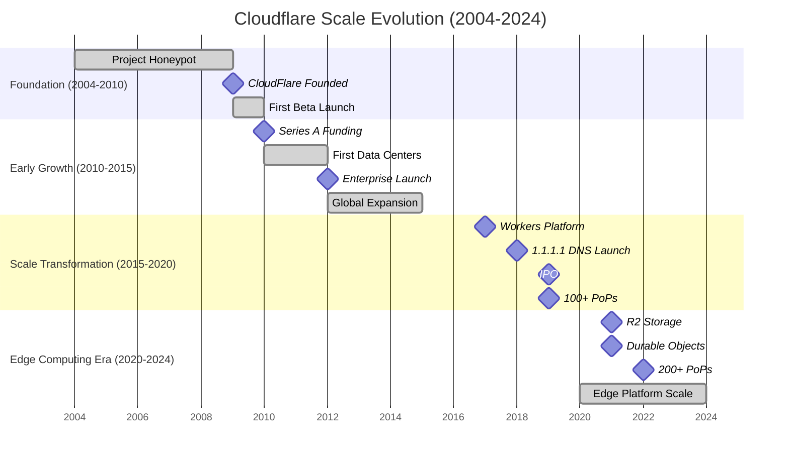
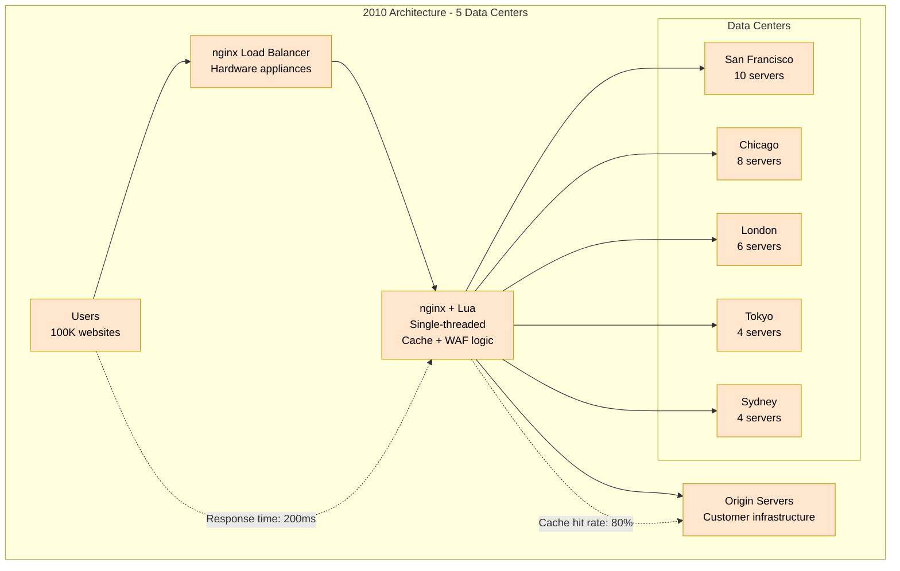
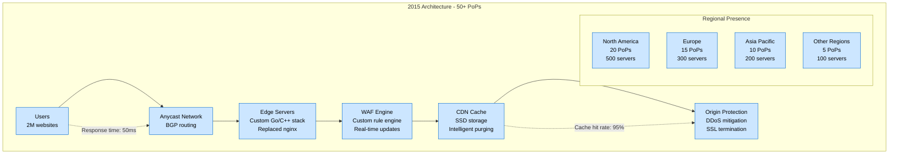
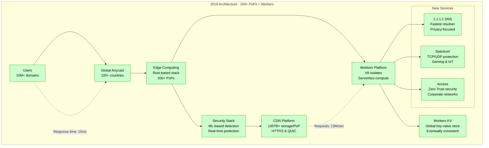
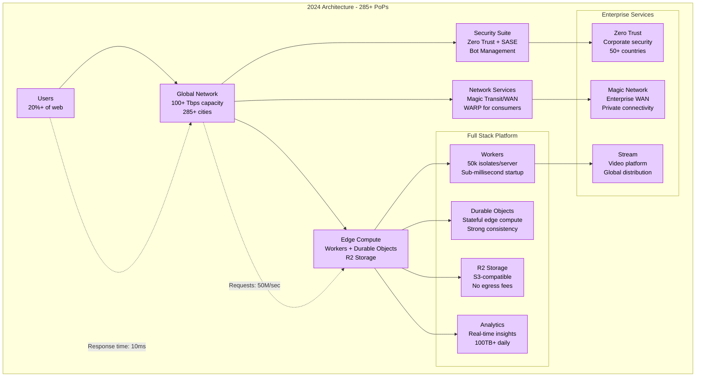
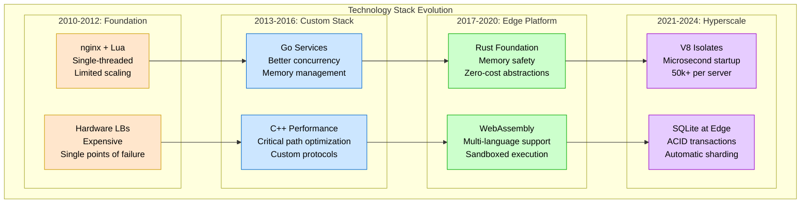
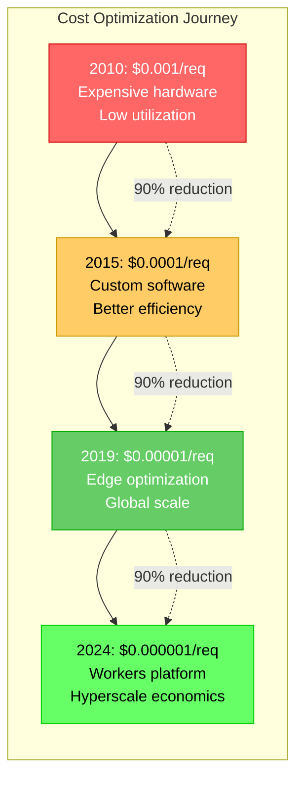
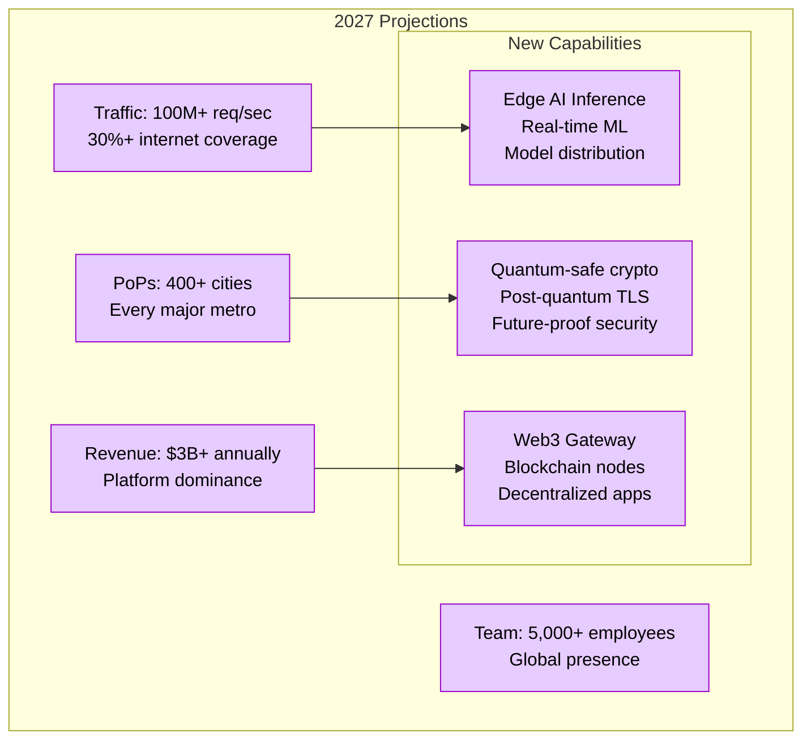

# Cloudflare Scale Evolution - "From Honeypot to Edge Empire"

## Overview

Cloudflare's evolution from Project Honeypot (2004) to the world's largest edge platform (2024) represents one of the most dramatic scaling journeys in internet infrastructure. This timeline shows key architectural decisions, technology choices, and growth inflection points over 20 years.

## Scale Evolution Timeline

## Architecture Evolution by Scale

### 2010: Startup Scale - "The nginx + Lua Era"

**2010 Metrics:**
- **Websites**: 100,000 protected
- **Requests/sec**: 10,000 peak
- **Data Centers**: 5 locations
- **Servers**: 32 total
- **Team Size**: 15 employees

### 2015: Regional Scale - "The Custom Stack Migration"

**2015 Metrics:**
- **Websites**: 2 million protected
- **Requests/sec**: 1 million peak
- **PoPs**: 50+ locations
- **Servers**: 1,100 total
- **Team Size**: 200 employees

### 2019: Global Scale - "The Workers Revolution"

**2019 Metrics:**
- **Domains**: 10+ million
- **Requests/sec**: 10 million peak
- **PoPs**: 200+ locations
- **DNS Queries**: 500 billion/day
- **Team Size**: 1,000+ employees

### 2024: Hyperscale - "The Edge Platform Empire"

**2024 Metrics:**
- **Internet Coverage**: 20%+ of web traffic
- **Requests/sec**: 50+ million peak
- **PoPs**: 285+ cities worldwide
- **DNS Queries**: 1.8 trillion/day
- **Team Size**: 3,000+ employees

## Technology Evolution Milestones

### Infrastructure Transitions

## Cost Evolution and Economics

### Infrastructure Cost per Request

### Revenue and Scale Correlation

| Year | Revenue | Websites/Domains | Requests/sec | PoPs | Cost/Request |
|------|---------|-------------------|-------------|------|--------------|
| 2010 | $1M | 100K | 10K | 5 | $0.001 |
| 2015 | $100M | 2M | 1M | 50 | $0.0001 |
| 2019 | $500M | 10M | 10M | 200 | $0.00001 |
| 2024 | $1.3B | 20%+ web | 50M | 285 | $0.000001 |

## Breaking Points and Solutions

### 2014: The nginx Ceiling

**Problem**: Single-threaded nginx couldn't handle increasing traffic
**Solution**: Custom multi-threaded Go/C++ stack
**Impact**: 10x performance improvement, 50% cost reduction

### 2016: The Origin Overload Crisis

**Problem**: DDoS attacks overwhelming customer origins
**Solution**: Anycast + advanced DDoS protection
**Impact**: 99.9% attack mitigation, customer churn stopped

### 2018: The Edge Computing Opportunity

**Problem**: Customers wanted compute, not just CDN
**Solution**: Workers platform with V8 isolates
**Impact**: New revenue stream, 40% margin improvement

### 2021: The Data Locality Challenge

**Problem**: GDPR/data sovereignty requirements
**Solution**: Durable Objects + regional data controls
**Impact**: European customer growth 300%

### 2023: The AI/ML Infrastructure Demand

**Problem**: Customers need AI inference at edge
**Solution**: Workers AI + GPU acceleration
**Impact**: 200% growth in enterprise customers

## Future Scale Projections (2025-2027)

### Predicted Growth Metrics

### Technology Roadmap

- **2025**: Edge AI inference, GPU acceleration
- **2026**: Quantum-safe cryptography deployment
- **2027**: Web3/blockchain infrastructure support
- **2028**: Autonomous network optimization
- **2030**: Planet-scale edge computing platform

This evolution represents one of the most successful scaling journeys in internet infrastructure, growing from a small security service to the backbone of the modern internet while maintaining sub-10ms global latency and 99.99%+ uptime.