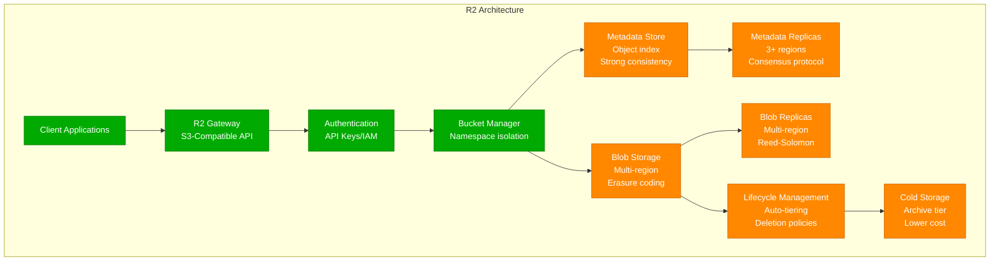
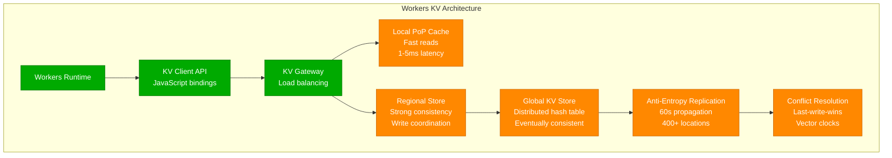
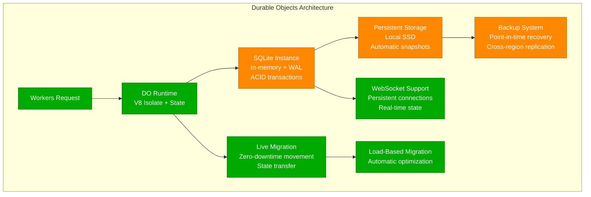
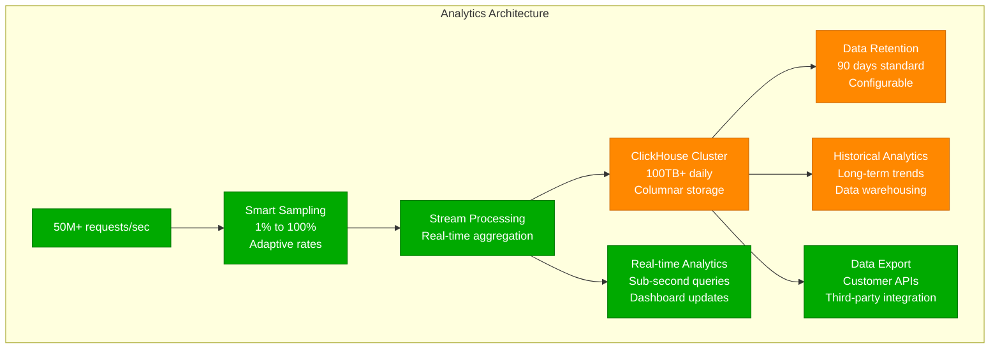
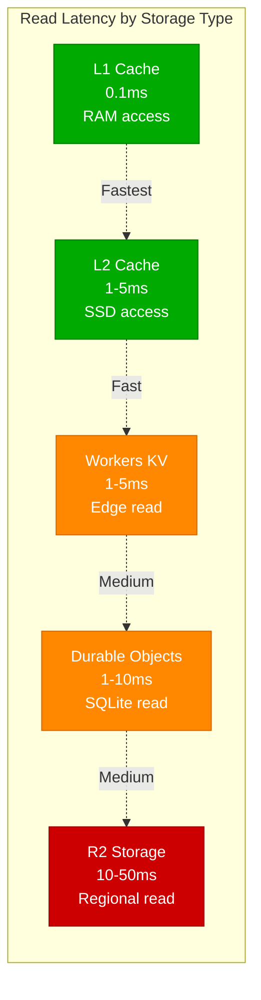
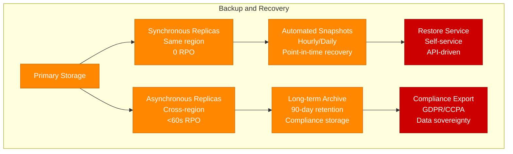

# Cloudflare Storage Architecture - "The Edge Data Journey"

## Overview

Cloudflare's storage architecture is designed for edge computing at global scale, featuring multiple storage systems optimized for different consistency and performance requirements. The architecture includes R2 object storage, Workers KV, Durable Objects, and a sophisticated caching hierarchy.

## Complete Storage Architecture

```mermaid
graph TB
    subgraph "Edge Plane - Data Access Layer #0066CC"
        subgraph "285+ Global PoPs"
            CACHE_L1[L1 Cache<br/>RAM: 32GB/server<br/>Latency: 0.1ms]
            CACHE_L2[L2 Cache<br/>SSD: 100TB/PoP<br/>Latency: 1-5ms]
            WORKER_MEM[Workers Memory<br/>128MB/isolate<br/>V8 heap]
        end

        subgraph "Edge Storage"
            DURABLE_EDGE[Durable Objects<br/>SQLite at Edge<br/>Strong consistency]
            KV_EDGE[KV Cache<br/>Local copies<br/>Eventually consistent]
        end
    end

    subgraph "Service Plane - Storage Services #00AA00"
        subgraph "Workers Storage APIs"
            KV_API[Workers KV API<br/>REST + JavaScript]
            R2_API[R2 S3-Compatible API<br/>GetObject/PutObject]
            DURABLE_API[Durable Objects API<br/>WebSocket + HTTP]
        end

        subgraph "Data Processing"
            ANALYTICS_PROC[Analytics Processing<br/>Stream processing]
            COMPRESS[Compression Service<br/>Brotli/Gzip/LZ4]
            ENCRYPT[Encryption Service<br/>AES-256-GCM]
        end
    end

    subgraph "State Plane - Persistent Storage #FF8800"
        subgraph "R2 Object Storage"
            R2_GLOBAL[R2 Global Storage<br/>Multi-region replication<br/>99.999999999% durability]
            R2_METADATA[R2 Metadata Store<br/>Object index<br/>Strong consistency]
            R2_LIFECYCLE[R2 Lifecycle<br/>Auto-tiering<br/>Deletion policies]
        end

        subgraph "Workers KV Global"
            KV_GLOBAL[KV Global Store<br/>400+ edge locations<br/>Eventually consistent]
            KV_REPLICATION[KV Replication<br/>60s propagation<br/>Anti-entropy]
        end

        subgraph "Durable Objects Global"
            DO_PERSISTENCE[DO Persistent Storage<br/>SQLite + WAL<br/>Automatic snapshots]
            DO_MIGRATION[DO Migration System<br/>Live object movement<br/>Zero-downtime]
        end

        subgraph "Analytics Storage"
            CLICKHOUSE[ClickHouse Cluster<br/>Time-series data<br/>100TB+ daily]
            LOGS_STORAGE[Log Storage<br/>Compressed archives<br/>90-day retention]
        end
    end

    subgraph "Control Plane - Storage Management #CC0000"
        subgraph "Replication Control"
            REPLICA_MGR[Replication Manager<br/>Multi-region coordination]
            CONSISTENCY[Consistency Manager<br/>Conflict resolution]
            BACKUP[Backup Controller<br/>Point-in-time recovery]
        end

        subgraph "Performance Monitoring"
            STORAGE_METRICS[Storage Metrics<br/>Latency/Throughput]
            QUOTA_MGR[Quota Management<br/>Per-account limits]
            HEALTH_CHECK[Health Monitoring<br/>Storage node status]
        end
    end

    %% Data Flow Connections
    WORKER_MEM --> KV_API
    WORKER_MEM --> R2_API
    WORKER_MEM --> DURABLE_API

    KV_API --> KV_EDGE
    KV_EDGE --> KV_GLOBAL
    KV_GLOBAL --> KV_REPLICATION

    R2_API --> R2_GLOBAL
    R2_GLOBAL --> R2_METADATA
    R2_GLOBAL --> R2_LIFECYCLE

    DURABLE_API --> DURABLE_EDGE
    DURABLE_EDGE --> DO_PERSISTENCE
    DO_PERSISTENCE --> DO_MIGRATION

    CACHE_L1 --> CACHE_L2
    CACHE_L2 --> R2_GLOBAL

    ANALYTICS_PROC --> CLICKHOUSE
    CLICKHOUSE --> LOGS_STORAGE

    %% Control Connections
    REPLICA_MGR --> KV_REPLICATION
    REPLICA_MGR --> R2_GLOBAL
    CONSISTENCY --> DO_PERSISTENCE
    BACKUP --> R2_GLOBAL

    %% Apply four-plane colors
    classDef edgeStyle fill:#0066CC,stroke:#004499,color:#fff
    classDef serviceStyle fill:#00AA00,stroke:#007700,color:#fff
    classDef stateStyle fill:#FF8800,stroke:#CC6600,color:#fff
    classDef controlStyle fill:#CC0000,stroke:#990000,color:#fff

    class CACHE_L1,CACHE_L2,WORKER_MEM,DURABLE_EDGE,KV_EDGE edgeStyle
    class KV_API,R2_API,DURABLE_API,ANALYTICS_PROC,COMPRESS,ENCRYPT serviceStyle
    class R2_GLOBAL,R2_METADATA,R2_LIFECYCLE,KV_GLOBAL,KV_REPLICATION,DO_PERSISTENCE,DO_MIGRATION,CLICKHOUSE,LOGS_STORAGE stateStyle
    class REPLICA_MGR,CONSISTENCY,BACKUP,STORAGE_METRICS,QUOTA_MGR,HEALTH_CHECK controlStyle
```

## Storage System Deep Dive

### 1. R2 Object Storage

**R2 Specifications:**
- **Durability**: 99.999999999% (11 9s)
- **Availability**: 99.9% SLA
- **Max Object Size**: 5TB
- **API Compatibility**: S3-compatible
- **Pricing**: $0.015/GB/month, no egress fees

### 2. Workers KV Store

**KV Performance:**
- **Read Latency**: 1-5ms from edge
- **Write Latency**: 50-200ms (global propagation)
- **Consistency**: Eventually consistent
- **Storage Limit**: 25MB per key, 1GB per namespace

### 3. Durable Objects

**Durable Objects Features:**
- **Consistency**: Strong consistency per object
- **State**: Persistent JavaScript heap + SQLite
- **Isolation**: One object instance globally
- **Migration**: Live migration with zero downtime

### 4. Analytics Data Pipeline

## Storage Performance Metrics

### Latency Characteristics

### Consistency Models
- **Strong Consistency**: Durable Objects, R2 metadata
- **Eventually Consistent**: Workers KV (60s propagation)
- **Cache Consistency**: TTL-based with purge capabilities
- **Cross-Region**: Async replication with conflict resolution

### Storage Limits and Quotas
- **Workers KV**: 1GB per namespace, 25MB per key
- **R2 Storage**: Unlimited, 5TB max object size
- **Durable Objects**: 128MB heap, unlimited SQLite storage
- **Cache Storage**: 100TB SSD per PoP

## Data Durability and Backup

### Backup Strategies

### Recovery Time Objectives
- **Cache Recovery**: Immediate (traffic rerouting)
- **KV Recovery**: <5 minutes (replica promotion)
- **R2 Recovery**: <15 minutes (metadata reconstruction)
- **Durable Objects**: <30 seconds (migration to healthy node)

This storage architecture provides the foundation for Cloudflare's edge computing platform, delivering sub-10ms data access globally while maintaining enterprise-grade durability and consistency guarantees.