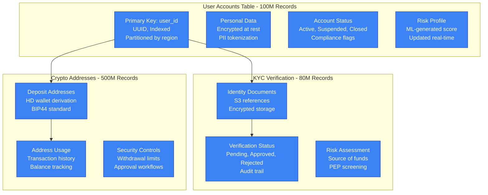
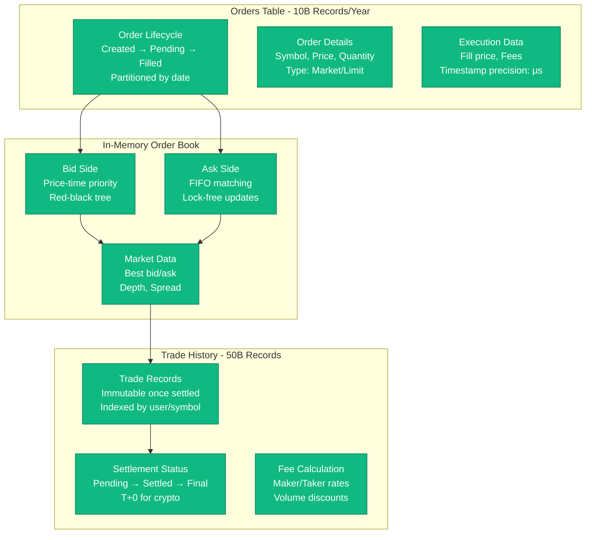
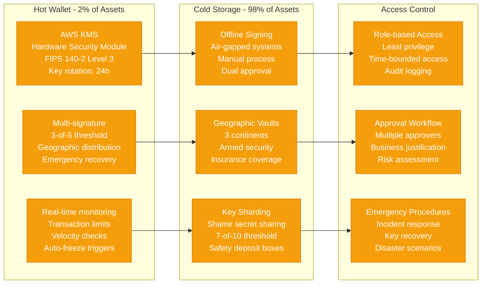

# Coinbase Storage Architecture - The Data Journey

## Multi-Layered Security Storage Model
**Hot Wallets**: 2% of assets ($500M) for immediate liquidity
**Cold Storage**: 98% of assets ($50B+) in offline, geographically distributed vaults
**Database**: 100TB+ financial records with ACID guarantees and audit trails

```mermaid
graph TB
    subgraph UserData[User Data Layer - Encrypted PII]
        USER_DB[(PostgreSQL Primary<br/>User Accounts & KYC<br/>Instance: db.r6g.8xlarge<br/>Storage: 5TB<br/>IOPS: 20K<br/>Encryption: AES-256)]

        USER_REPLICA[(PostgreSQL Replica<br/>Read-only Queries<br/>Instance: db.r6g.4xlarge × 3<br/>Lag: < 1 second<br/>Cross-AZ Replication)]

        KYC_DOCS[S3 Bucket<br/>KYC Documents<br/>Storage: 500TB<br/>Encryption: SSE-KMS<br/>Retention: 7 years<br/>Access: Audit logged]
    end

    subgraph TradingData[Trading Data Layer - High Performance]
        ORDER_DB[(PostgreSQL Trading<br/>Orders & Executions<br/>Instance: db.r6g.12xlarge<br/>Storage: 10TB<br/>IOPS: 40K<br/>Sharded by symbol)]

        ORDER_CACHE[Redis Cluster<br/>Active Order Book<br/>Instance: cache.r6g.2xlarge × 6<br/>Memory: 1TB total<br/>Persistence: AOF<br/>Latency: < 1ms]

        MARKET_STREAM[Apache Kafka<br/>Market Data Stream<br/>Instance: m6i.2xlarge × 9<br/>Retention: 30 days<br/>Throughput: 2M msg/sec<br/>Partitions: 1000]

        PRICE_HISTORY[(ClickHouse OLAP<br/>Historical Prices<br/>Instance: c6gn.4xlarge × 6<br/>Storage: 50TB<br/>Compression: 10:1<br/>Query: < 100ms)]
    end

    subgraph WalletLayer[Wallet Layer - Maximum Security]
        HOT_WALLET[Hot Wallet Storage<br/>AWS KMS + HSM<br/>FIPS 140-2 Level 3<br/>Balance: $500M<br/>Multi-sig: 3-of-5<br/>Rotation: 24 hours]

        WARM_WALLET[Warm Storage<br/>Semi-automated<br/>Balance: $2B<br/>Withdrawal delay: 4 hours<br/>Multi-approval required]

        COLD_VAULT[Cold Storage Vaults<br/>Offline Hardware HSM<br/>Geographic distribution: 3 sites<br/>Balance: $50B+<br/>Access: Manual process<br/>Security: Armed guards]

        CUSTODY_KEYS[Key Management<br/>Shamir Secret Sharing<br/>Threshold: 7-of-10<br/>Geographic distribution<br/>Backup: Safety deposit boxes<br/>Recovery: 72 hours]
    end

    subgraph BlockchainData[Blockchain Data Layer]
        BTC_NODE[Bitcoin Full Node<br/>Instance: c6g.2xlarge × 4<br/>Storage: 2TB<br/>Sync: Real-time<br/>Pruning: Disabled<br/>Backup: Daily]

        ETH_NODE[Ethereum Full Node<br/>Instance: c6g.4xlarge × 6<br/>Storage: 8TB<br/>Sync: Real-time<br/>Archive: Full state<br/>Geth + Lighthouse]

        ALT_NODES[Alt Coin Nodes<br/>500+ Cryptocurrencies<br/>Instance: c6g.xlarge × 50<br/>Light clients for small caps<br/>Full nodes for top 50]

        BLOCKCHAIN_INDEX[(PostgreSQL Index<br/>Transaction Indexing<br/>Instance: db.r6g.4xlarge<br/>Storage: 20TB<br/>Query optimization<br/>Address mapping)]
    end

    subgraph ComplianceData[Compliance & Audit Layer]
        AUDIT_LOG[(PostgreSQL Audit<br/>Immutable Audit Trail<br/>Instance: db.r6g.2xlarge<br/>Storage: 15TB<br/>Write-only<br/>Retention: Permanent)]

        COMPLIANCE_STORE[S3 Compliance<br/>Regulatory Reports<br/>Storage: 100TB<br/>Encryption: Customer keys<br/>Retention: 10 years<br/>Compliance: SOX, SOC2]

        TRANSACTION_LEDGER[(Accounting Ledger<br/>Double-entry bookkeeping<br/>Instance: db.r6g.4xlarge<br/>Real-time reconciliation<br/>GAAP compliant)]
    end

    subgraph AnalyticsLayer[Analytics & ML Layer]
        DATA_WAREHOUSE[(Amazon Redshift<br/>Analytics Warehouse<br/>Instance: ra3.4xlarge × 6<br/>Storage: 100TB<br/>ETL: Hourly batch<br/>Query: Business intelligence)]

        ML_FEATURES[Feature Store<br/>Redis + S3<br/>Real-time features<br/>Fraud detection models<br/>Risk scoring<br/>Update: Streaming)]

        TIME_SERIES[(InfluxDB<br/>Metrics & Monitoring<br/>Instance: m6i.2xlarge × 3<br/>Retention: 2 years<br/>Resolution: 1 second<br/>Dashboards: Grafana)]
    end

    subgraph BackupLayer[Backup & DR Layer]
        BACKUP_PRIMARY[AWS S3 Primary<br/>Daily Snapshots<br/>Region: us-east-1<br/>Retention: 7 years<br/>Encryption: AES-256<br/>Cost: $200K/year]

        BACKUP_DR[AWS S3 DR<br/>Cross-region Replication<br/>Region: us-west-2<br/>RTO: 4 hours<br/>RPO: 15 minutes<br/>Cost: $150K/year]

        BACKUP_OFFSITE[Glacier Deep Archive<br/>Long-term Archival<br/>Retention: 25 years<br/>Retrieval: 12 hours<br/>Compliance: Required<br/>Cost: $50K/year]
    end

    %% Data Flow Connections
    USER_DB --> USER_REPLICA
    USER_DB --> KYC_DOCS

    ORDER_DB --> ORDER_CACHE
    ORDER_DB --> MARKET_STREAM
    MARKET_STREAM --> PRICE_HISTORY

    HOT_WALLET --> WARM_WALLET
    WARM_WALLET --> COLD_VAULT
    COLD_VAULT --> CUSTODY_KEYS

    BTC_NODE --> BLOCKCHAIN_INDEX
    ETH_NODE --> BLOCKCHAIN_INDEX
    ALT_NODES --> BLOCKCHAIN_INDEX

    ORDER_DB --> AUDIT_LOG
    USER_DB --> AUDIT_LOG
    AUDIT_LOG --> COMPLIANCE_STORE
    ORDER_DB --> TRANSACTION_LEDGER

    ORDER_DB --> DATA_WAREHOUSE
    USER_DB --> DATA_WAREHOUSE
    MARKET_STREAM --> ML_FEATURES
    PRICE_HISTORY --> TIME_SERIES

    USER_DB --> BACKUP_PRIMARY
    ORDER_DB --> BACKUP_PRIMARY
    BACKUP_PRIMARY --> BACKUP_DR
    BACKUP_PRIMARY --> BACKUP_OFFSITE

    %% Apply storage-specific colors
    classDef userStyle fill:#3B82F6,stroke:#1E40AF,color:#fff,font-weight:bold
    classDef tradingStyle fill:#10B981,stroke:#047857,color:#fff,font-weight:bold
    classDef walletStyle fill:#F59E0B,stroke:#D97706,color:#fff,font-weight:bold
    classDef blockchainStyle fill:#8B5CF6,stroke:#6D28D9,color:#fff,font-weight:bold
    classDef complianceStyle fill:#EF4444,stroke:#DC2626,color:#fff,font-weight:bold
    classDef analyticsStyle fill:#06B6D4,stroke:#0891B2,color:#fff,font-weight:bold
    classDef backupStyle fill:#6B7280,stroke:#374151,color:#fff,font-weight:bold

    class USER_DB,USER_REPLICA,KYC_DOCS userStyle
    class ORDER_DB,ORDER_CACHE,MARKET_STREAM,PRICE_HISTORY tradingStyle
    class HOT_WALLET,WARM_WALLET,COLD_VAULT,CUSTODY_KEYS walletStyle
    class BTC_NODE,ETH_NODE,ALT_NODES,BLOCKCHAIN_INDEX blockchainStyle
    class AUDIT_LOG,COMPLIANCE_STORE,TRANSACTION_LEDGER complianceStyle
    class DATA_WAREHOUSE,ML_FEATURES,TIME_SERIES analyticsStyle
    class BACKUP_PRIMARY,BACKUP_DR,BACKUP_OFFSITE backupStyle
```

## Storage Layer Deep Dive

### 1. User Data Layer - Customer Information


### 2. Trading Data Layer - High-Frequency Operations


### 3. Wallet Security Architecture


## Data Consistency Guarantees

### ACID Properties for Financial Data
- **Atomicity**: All trade components complete or none (order, balance update, settlement)
- **Consistency**: Account balances always equal sum of transactions
- **Isolation**: Concurrent trades don't interfere with each other
- **Durability**: Once confirmed, trades survive system failures

### Eventual Consistency for Non-Critical Data
- **Market Data**: Real-time price feeds with 10ms lag tolerance
- **Analytics**: Hourly ETL for business intelligence queries
- **Audit Logs**: Async replication with 1-minute delay acceptable

### Strong Consistency Requirements
- **Account Balances**: Synchronous updates across all replicas
- **Order Book**: Atomic updates with pessimistic locking
- **Wallet Operations**: Two-phase commit for multi-account transfers

## Storage Performance Metrics

### Database Performance
- **Transaction Rate**: 100K TPS sustained, 500K TPS peak
- **Query Latency**: p50 < 5ms, p95 < 20ms, p99 < 50ms
- **Connection Pool**: 1000 connections per instance, 95% utilization max
- **Index Efficiency**: 99%+ index usage for trading queries

### Cache Hit Rates
- **Order Book Cache**: 99.9% hit rate (Redis)
- **User Session Cache**: 95% hit rate (login state)
- **Market Data Cache**: 90% hit rate (price queries)
- **CDN Cache**: 95% hit rate (static assets)

### Storage Costs (Annual)
- **Production Databases**: $1.38M (PostgreSQL, Redis, ClickHouse)
- **Backup & DR**: $400K (S3, cross-region replication)
- **Compliance Storage**: $200K (long-term audit retention)
- **Blockchain Infrastructure**: $600K (full nodes, indexing)

## Security Measures

### Encryption Standards
- **Data at Rest**: AES-256 encryption for all storage systems
- **Data in Transit**: TLS 1.3 for all network communication
- **Key Management**: AWS KMS with customer-managed keys
- **Database Encryption**: Transparent Data Encryption (TDE)

### Access Controls
- **Database Access**: VPC-only, no public endpoints
- **Privileged Access**: Just-in-time access with approval workflow
- **Audit Logging**: All database queries logged and monitored
- **Data Masking**: PII redacted in non-production environments

### Backup Security
- **Backup Encryption**: Separate encryption keys from primary data
- **Geographic Distribution**: Backups stored in multiple regions
- **Access Logging**: All backup access tracked and alerted
- **Recovery Testing**: Monthly disaster recovery drills

This storage architecture ensures that Coinbase can handle billions in cryptocurrency transactions while maintaining the security, compliance, and performance standards required for a global financial institution operating 24/7 across multiple regulatory jurisdictions.