# Coinbase Failure Domains - The Incident Map

## Blast Radius Analysis & Recovery Procedures
**Critical Systems**: Trading engine, hot wallets, user authentication
**RTO Target**: 4 hours for full service restoration
**RPO Target**: 1 minute maximum data loss for financial transactions

```mermaid
graph TB
    subgraph Domain1[Domain 1: User Access Layer - Graceful Degradation]
        CDN[CloudFlare CDN<br/>❌ Impact: Global access<br/>🔄 Failover: Multi-CDN<br/>⏱️ Recovery: 5 minutes<br/>💰 Lost revenue: $50K/hour]

        LB[Load Balancer<br/>❌ Impact: Regional access<br/>🔄 Failover: Cross-AZ<br/>⏱️ Recovery: 2 minutes<br/>💰 Lost revenue: $25K/hour]

        API[API Gateway<br/>❌ Impact: All API calls<br/>🔄 Failover: Auto-scaling<br/>⏱️ Recovery: 1 minute<br/>💰 Lost revenue: $100K/hour]
    end

    subgraph Domain2[Domain 2: Authentication - Degraded Service]
        AUTH[Auth Service<br/>❌ Impact: New logins blocked<br/>🔄 Mitigation: Session extension<br/>⏱️ Recovery: 5 minutes<br/>💰 Lost users: 50K/hour]

        REDIS[Redis Session Store<br/>❌ Impact: All user sessions<br/>🔄 Failover: Backup cluster<br/>⏱️ Recovery: 2 minutes<br/>💰 Lost revenue: $200K/hour]

        KYC[KYC Service<br/>❌ Impact: New account verification<br/>🔄 Mitigation: Manual review<br/>⏱️ Recovery: 30 minutes<br/>💰 New user loss: 10K/day]
    end

    subgraph Domain3[Domain 3: Trading Engine - CRITICAL]
        MATCH[Matching Engine<br/>❌ Impact: All trading halted<br/>🔄 Failover: Secondary instance<br/>⏱️ Recovery: 30 seconds<br/>💰 Lost revenue: $5M/hour]

        ORDER_DB[Order Database<br/>❌ Impact: Order placement blocked<br/>🔄 Failover: Read replica promote<br/>⏱️ Recovery: 2 minutes<br/>💰 Lost revenue: $2M/hour]

        MARKET[Market Data<br/>❌ Impact: Price feeds delayed<br/>🔄 Failover: Backup providers<br/>⏱️ Recovery: 10 seconds<br/>💰 Lost confidence: High]
    end

    subgraph Domain4[Domain 4: Wallet Operations - HIGHEST RISK]
        HOT_WALLET[Hot Wallet<br/>❌ Impact: Withdrawals halted<br/>🔄 Failover: Warm wallet<br/>⏱️ Recovery: 4 hours<br/>💰 Security risk: $500M]

        COLD_STORAGE[Cold Storage Access<br/>❌ Impact: Large withdrawals<br/>🔄 Mitigation: Manual process<br/>⏱️ Recovery: 24 hours<br/>💰 Liquidity impact: $10M]

        HSM[Hardware Security Module<br/>❌ Impact: Key operations<br/>🔄 Failover: Backup HSM<br/>⏱️ Recovery: 1 hour<br/>💰 Security risk: Critical]
    end

    subgraph Domain5[Domain 5: Data Layer - Corruption Risk]
        POSTGRES[PostgreSQL Primary<br/>❌ Impact: Data corruption<br/>🔄 Failover: Read replica<br/>⏱️ Recovery: 10 minutes<br/>💰 Data loss risk: High]

        KAFKA[Kafka Cluster<br/>❌ Impact: Event processing<br/>🔄 Failover: Standby cluster<br/>⏱️ Recovery: 5 minutes<br/>💰 Audit trail gap: Risk]

        BACKUP[Backup Systems<br/>❌ Impact: Recovery capability<br/>🔄 Mitigation: Multiple copies<br/>⏱️ Recovery: 4 hours<br/>💰 Business continuity: Risk]
    end

    subgraph Domain6[Domain 6: External Dependencies]
        BLOCKCHAIN[Blockchain Networks<br/>❌ Impact: Deposits/withdrawals<br/>🔄 Mitigation: Multiple nodes<br/>⏱️ Recovery: Network dependent<br/>💰 User frustration: High]

        BANKS[Banking Partners<br/>❌ Impact: Fiat operations<br/>🔄 Mitigation: Multiple banks<br/>⏱️ Recovery: 24-48 hours<br/>💰 Lost deposits: $50M/day]

        COMPLIANCE[Regulatory Systems<br/>❌ Impact: Compliance reporting<br/>🔄 Mitigation: Manual process<br/>⏱️ Recovery: 8 hours<br/>💰 Regulatory risk: Critical]
    end

    %% Failure Propagation Paths
    CDN -.->|Cascading failure| API
    API -.->|Auth dependency| AUTH
    AUTH -.->|Session loss| REDIS

    MATCH -.->|Trading halt| ORDER_DB
    ORDER_DB -.->|Data loss| POSTGRES
    MARKET -.->|Price uncertainty| MATCH

    HOT_WALLET -.->|Security breach| COLD_STORAGE
    HSM -.->|Key compromise| HOT_WALLET

    POSTGRES -.->|Data dependency| KAFKA
    KAFKA -.->|Event loss| BACKUP

    BLOCKCHAIN -.->|Network partition| HOT_WALLET
    BANKS -.->|Liquidity crisis| HOT_WALLET
    COMPLIANCE -.->|Regulatory action| MATCH

    %% Risk Level Styling
    classDef lowRisk fill:#10B981,stroke:#047857,color:#fff,font-weight:bold
    classDef mediumRisk fill:#F59E0B,stroke:#D97706,color:#fff,font-weight:bold
    classDef highRisk fill:#EF4444,stroke:#DC2626,color:#fff,font-weight:bold
    classDef criticalRisk fill:#7C2D12,stroke:#451A03,color:#fff,font-weight:bold

    class CDN,LB lowRisk
    class API,AUTH,KYC,MARKET,KAFKA mediumRisk
    class REDIS,ORDER_DB,POSTGRES,BLOCKCHAIN,BANKS highRisk
    class MATCH,HOT_WALLET,COLD_STORAGE,HSM,BACKUP,COMPLIANCE criticalRisk
```

## Failure Scenarios & Response Procedures

### 1. Trading Engine Failure - Critical Incident

```mermaid
graph TB
    subgraph Incident[Matching Engine Failure - P0 Severity]
        A[Detection<br/>Health check failure<br/>Response time: 30 seconds<br/>Alert: PagerDuty P0]

        B[Immediate Response<br/>Halt new orders<br/>Preserve order book state<br/>Notify users: Maintenance]

        C[Failover Decision<br/>Primary → Secondary instance<br/>Order book restoration<br/>Time: 30-60 seconds]

        D[Service Restoration<br/>Resume order matching<br/>Process queued orders<br/>Monitor for anomalies]

        E[Post-Incident<br/>Root cause analysis<br/>Customer communication<br/>Regulatory reporting]
    end

    subgraph Impact[Business Impact]
        F[Revenue Loss<br/>$5M/hour trading halt<br/>Customer confidence<br/>Regulatory scrutiny]

        G[Market Impact<br/>Price volatility<br/>Arbitrage opportunities<br/>Competitor advantage]

        H[Recovery Metrics<br/>Order book accuracy: 100%<br/>Lost trades: 0<br/>Customer retention: 99%+]
    end

    A --> B --> C --> D --> E
    C --> F
    F --> G
    G --> H

    classDef incidentStyle fill:#EF4444,stroke:#DC2626,color:#fff
    classDef impactStyle fill:#F59E0B,stroke:#D97706,color:#fff

    class A,B,C,D,E incidentStyle
    class F,G,H impactStyle
```

### 2. Hot Wallet Security Breach - Maximum Severity

### 3. Database Corruption - Data Integrity Failure

## Circuit Breakers & Bulkheads

### Trading Engine Protection
- **Order Rate Limiting**: 1000 orders/second per user
- **Position Limits**: Maximum $10M position per user
- **Price Deviation**: Circuit breaker at 10% price movement
- **System Load**: Graceful degradation at 80% CPU utilization

### Wallet Operation Safeguards
- **Daily Withdrawal Limits**: $100K for retail, $10M for institutional
- **Velocity Checks**: Maximum 5 withdrawals per hour
- **Multi-signature Threshold**: 3-of-5 approval for >$1M transfers
- **Geographic Controls**: Restrict access from high-risk countries

### Database Protection
- **Connection Limits**: Maximum 1000 connections per instance
- **Query Timeouts**: 30-second timeout for complex queries
- **Read Replica Routing**: Automatically route to healthy replicas
- **Transaction Size Limits**: Maximum 10MB transaction size

## Recovery Time Objectives (RTO)

### Service Tier 1 - Critical (RTO: 1 minute)
- **Matching Engine**: Primary to secondary failover
- **Market Data**: Backup provider activation
- **Authentication**: Session validation bypass

### Service Tier 2 - Important (RTO: 5 minutes)
- **Order Database**: Read replica promotion
- **User Database**: Standby instance activation
- **Wallet Services**: Hot to warm wallet transition

### Service Tier 3 - Standard (RTO: 30 minutes)
- **Analytics Services**: Batch processing restart
- **Compliance Reporting**: Manual process activation
- **Customer Support Tools**: Alternative interface

### Service Tier 4 - Deferrable (RTO: 4 hours)
- **Cold Storage Access**: Manual intervention required
- **Historical Data**: Archive system restoration
- **Non-critical APIs**: Lower priority restoration

## Historical Incident Analysis

### Major Outages (2019-2024)
1. **March 2020**: 12-hour trading halt during market crash
   - **Cause**: Database overload during high volume
   - **Impact**: $50M lost revenue, customer complaints
   - **Fix**: Database sharding, auto-scaling improvements

2. **February 2021**: 6-hour partial outage
   - **Cause**: Kubernetes cluster misconfiguration
   - **Impact**: Mobile app access limited
   - **Fix**: Blue-green deployment process

3. **May 2022**: 2-hour withdrawal suspension
   - **Cause**: Hot wallet key rotation failure
   - **Impact**: Customer withdrawals delayed
   - **Fix**: Automated key rotation process

### Security Incidents
1. **2019**: $40M insurance claim for wallet breach
2. **2021**: Phishing attack on customer accounts
3. **2023**: DDoS attack mitigated by CloudFlare

### Lessons Learned
- **Redundancy**: No single point of failure in critical path
- **Monitoring**: Sub-second detection for financial operations
- **Communication**: Proactive customer notification essential
- **Testing**: Monthly disaster recovery drills mandatory

This failure domain analysis demonstrates how Coinbase has built resilience into every layer of their architecture, with particular focus on protecting customer funds and maintaining trading operations even during major infrastructure failures.