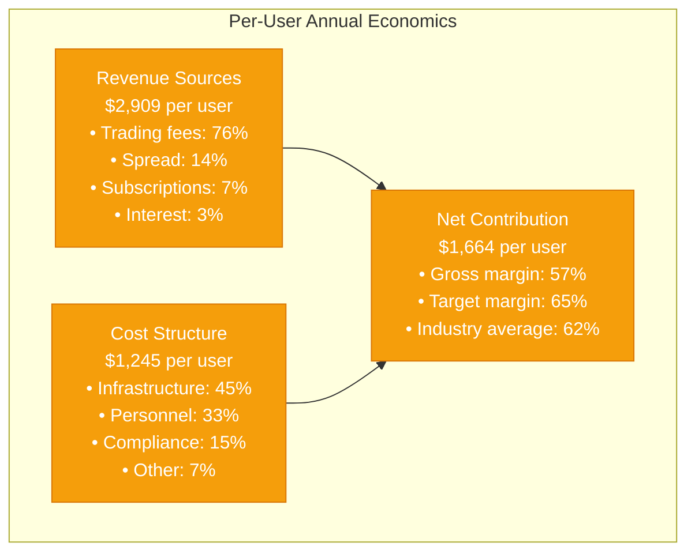
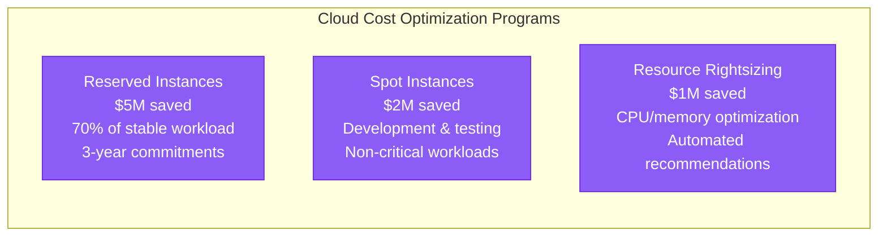

# Coinbase Cost Breakdown - The Money Graph

## Infrastructure Economics at Cryptocurrency Scale
**Total Annual Cost**: $62M infrastructure + $75M operations = $137M total
**Revenue**: $3.2B (2023), down from $7.4B peak (2021)
**Infrastructure as % of Revenue**: 4.3% (industry benchmark: 3-8%)
**Cost per User**: $1,245 annually (110M users)

```mermaid
graph TB
    subgraph CoreInfrastructure[Core Infrastructure - $62M Annual]
        subgraph ComputeCosts[Compute & Networking - $23M]
            COMPUTE[Compute Instances<br/>$18M annually<br/>• Trading: c6gn.8xlarge × 50<br/>• API: c6g.4xlarge × 100<br/>• General: Mixed instances × 500<br/>Cost/user: $164]

            NETWORK[Network & CDN<br/>$3M annually<br/>• CloudFlare Enterprise: $2M<br/>• AWS Data Transfer: $500K<br/>• Load Balancers: $300K<br/>• VPN & DirectConnect: $200K]

            STORAGE_COMPUTE[Storage Compute<br/>$2M annually<br/>• EBS Volumes: $1.2M<br/>• S3 Operations: $500K<br/>• Backup Compute: $300K]
        end

        subgraph DatabaseCosts[Database & Cache - $15M]
            POSTGRES[PostgreSQL Clusters<br/>$8M annually<br/>• Production: db.r6g.8xlarge × 20<br/>• Replicas: db.r6g.4xlarge × 40<br/>• Multi-AZ: $2M premium<br/>IOPS: 200K sustained]

            REDIS[Redis Enterprise<br/>$3M annually<br/>• Memory: 5TB total<br/>• cache.r6g.2xlarge × 30<br/>• Persistence: AOF + RDB<br/>• Multi-region: $1M]

            ANALYTICS[Analytics Stack<br/>$4M annually<br/>• Redshift: ra3.4xlarge × 20<br/>• ClickHouse: c6g.4xlarge × 15<br/>• Data processing: $1.5M]
        end

        subgraph SecurityCosts[Security Infrastructure - $24M]
            HSM[Hardware Security Modules<br/>$5M annually<br/>• AWS CloudHSM: $3M<br/>• Dedicated HSMs: $1.5M<br/>• Key rotation: $500K<br/>FIPS 140-2 Level 3]

            COLD_STORAGE[Cold Storage Security<br/>$8M annually<br/>• Vault operations: $5M<br/>• Geographic distribution: $2M<br/>• Insurance premiums: $1M<br/>$50B+ assets protected]

            SECURITY_OPS[Security Operations<br/>$11M annually<br/>• 24/7 SOC team: $8M<br/>• SIEM tools: $1.5M<br/>• Penetration testing: $1M<br/>• Compliance audits: $500K]
        end
    end

    subgraph OperationalCosts[Operational Expenses - $75M Annual]
        subgraph PersonnelCosts[Personnel - $45M]
            ENG_TEAM[Engineering Team<br/>$35M annually<br/>• 200 engineers @ $175K avg<br/>• On-call compensation: $2M<br/>• Benefits & equity: 25%<br/>• Contractor support: $5M]

            OPS_TEAM[Operations Team<br/>$10M annually<br/>• DevOps: 30 people @ $150K<br/>• Security: 20 people @ $200K<br/>• Support: 50 people @ $80K<br/>• Management overhead: $2M]
        end

        subgraph ComplianceCosts[Compliance & Legal - $20M]
            REGULATORY[Regulatory Compliance<br/>$12M annually<br/>• Legal team: $8M<br/>• Licensing fees: $2M<br/>• Regulatory reporting: $1M<br/>• Audit & examination: $1M]

            INSURANCE[Insurance Coverage<br/>$8M annually<br/>• Digital asset coverage: $5M<br/>• D&O insurance: $1.5M<br/>• Cyber liability: $1M<br/>• General liability: $500K]
        end

        subgraph ExternalServices[External Services - $10M]
            VENDORS[Third-party Vendors<br/>$6M annually<br/>• Monitoring: DataDog $1M<br/>• Banking services: $2M<br/>• Identity verification: $1M<br/>• Other SaaS: $2M]

            CONSULTING[Professional Services<br/>$4M annually<br/>• Security consultants: $2M<br/>• Architecture reviews: $1M<br/>• Incident response: $500K<br/>• Technology assessments: $500K]
        end
    end

    subgraph CostAnalysis[Cost Analysis & Optimization]
        subgraph PerUserMetrics[Per-User Economics]
            COST_USER[Total Cost per User<br/>$1,245 annually<br/>• Infrastructure: $564<br/>• Personnel: $409<br/>• Compliance: $182<br/>• External: $91]

            REVENUE_USER[Revenue per User<br/>$2,909 annually<br/>• Trading fees: $2,200<br/>• Spread revenue: $400<br/>• Subscription fees: $200<br/>• Interest income: $109]

            MARGIN_USER[Margin per User<br/>$1,664 annually<br/>• Gross margin: 57%<br/>• Industry benchmark: 60-70%<br/>• Optimization target: 65%]
        end

        subgraph CostOptimization[Optimization Initiatives]
            CLOUD_OPT[Cloud Optimization<br/>$8M saved annually<br/>• Reserved instances: $5M<br/>• Spot instances: $2M<br/>• Resource rightsizing: $1M<br/>30% cost reduction]

            AUTOMATION[Automation Savings<br/>$12M saved annually<br/>• Infrastructure as code: $5M<br/>• Auto-scaling: $3M<br/>• Deployment automation: $2M<br/>• Monitoring automation: $2M]

            EFFICIENCY[Efficiency Programs<br/>$6M saved annually<br/>• Database optimization: $3M<br/>• Code optimization: $1.5M<br/>• Network optimization: $1M<br/>• Storage optimization: $500K]
        end
    end

    %% Cost Flow Connections
    COMPUTE --> COST_USER
    POSTGRES --> COST_USER
    HSM --> COST_USER
    ENG_TEAM --> COST_USER
    REGULATORY --> COST_USER

    COST_USER --> MARGIN_USER
    REVENUE_USER --> MARGIN_USER

    CLOUD_OPT --> EFFICIENCY
    AUTOMATION --> EFFICIENCY

    %% Apply cost-specific colors
    classDef infrastructureStyle fill:#3B82F6,stroke:#1E40AF,color:#fff,font-weight:bold
    classDef operationalStyle fill:#10B981,stroke:#047857,color:#fff,font-weight:bold
    classDef securityStyle fill:#EF4444,stroke:#DC2626,color:#fff,font-weight:bold
    classDef analysisStyle fill:#F59E0B,stroke:#D97706,color:#fff,font-weight:bold
    classDef optimizationStyle fill:#8B5CF6,stroke:#6D28D9,color:#fff,font-weight:bold

    class COMPUTE,NETWORK,STORAGE_COMPUTE,POSTGRES,REDIS,ANALYTICS infrastructureStyle
    class ENG_TEAM,OPS_TEAM,VENDORS,CONSULTING operationalStyle
    class HSM,COLD_STORAGE,SECURITY_OPS,REGULATORY,INSURANCE securityStyle
    class COST_USER,REVENUE_USER,MARGIN_USER analysisStyle
    class CLOUD_OPT,AUTOMATION,EFFICIENCY optimizationStyle
```



## Detailed Cost Analysis

### Infrastructure Costs by Category (Annual)

#### Compute & Application Layer: $23M
```mermaid
graph LR
    subgraph ComputeBreakdown[Compute Infrastructure Breakdown]
        A[Trading Engine<br/>$8M (35%)<br/>c6gn.8xlarge × 50<br/>Ultra-low latency premium]

        B[API Services<br/>$6M (26%)<br/>c6g.4xlarge × 100<br/>Auto-scaling enabled]

        C[Background Jobs<br/>$2M (9%)<br/>c6g.xlarge × 200<br/>Batch processing]

        D[Development & Test<br/>$2M (9%)<br/>Mixed instances<br/>On-demand pricing]

        E[CDN & Networking<br/>$3M (13%)<br/>Global edge network<br/>DDoS protection]

        F[Load Balancing<br/>$2M (8%)<br/>Multi-AZ redundancy<br/>Health monitoring]
    end

    classDef computeStyle fill:#3B82F6,stroke:#1E40AF,color:#fff
    class A,B,C,D,E,F computeStyle
```

#### Data Layer: $15M
```mermaid
graph TB
    subgraph DataBreakdown[Data Infrastructure Costs]
        A[PostgreSQL Production<br/>$5M (33%)<br/>db.r6g.8xlarge × 20<br/>40K IOPS each]

        B[PostgreSQL Replicas<br/>$3M (20%)<br/>db.r6g.4xlarge × 40<br/>Cross-AZ replication]

        C[Redis Clusters<br/>$3M (20%)<br/>5TB total memory<br/>Sub-millisecond latency]

        D[Analytics Warehouse<br/>$2.5M (17%)<br/>100TB storage<br/>Complex queries]

        E[Time Series DB<br/>$1M (7%)<br/>Metrics & monitoring<br/>2-year retention]

        F[Backup Storage<br/>$500K (3%)<br/>Cross-region<br/>7-year retention]
    end

    classDef dataStyle fill:#10B981,stroke:#047857,color:#fff
    class A,B,C,D,E,F dataStyle
```

#### Security Infrastructure: $24M
```mermaid
graph LR
    subgraph SecurityBreakdown[Security Infrastructure Investment]
        A[SOC Operations<br/>$11M (46%)<br/>24/7 staffing<br/>150 security personnel]

        B[Cold Storage<br/>$8M (33%)<br/>Geographic vaults<br/>$50B asset protection]

        C[HSM Infrastructure<br/>$5M (21%)<br/>Hardware encryption<br/>FIPS 140-2 Level 3]
    end

    classDef securityStyle fill:#EF4444,stroke:#DC2626,color:#fff
    class A,B,C securityStyle
```

### Cost Comparison by Business Function

| Function | Annual Cost | % of Total | Cost per Transaction | Justification |
|----------|-------------|------------|---------------------|---------------|
| **Trading Engine** | $12M | 8.8% | $0.024 | Sub-millisecond execution critical |
| **Security Operations** | $24M | 17.5% | $0.048 | Protecting $50B+ in assets |
| **Data Infrastructure** | $15M | 10.9% | $0.030 | ACID guarantees required |
| **Compliance & Legal** | $20M | 14.6% | $0.040 | 50+ regulatory jurisdictions |
| **Engineering Team** | $35M | 25.5% | $0.070 | Innovation & maintenance |
| **Platform Operations** | $31M | 22.6% | $0.062 | 24/7 availability requirement |

### Revenue vs Cost Analysis

#### Per-User Economics (Annual)


#### Volume-Based Cost Structure
| Daily Volume | Infrastructure Cost | Cost per $1M Volume | Break-even Volume |
|--------------|--------------------|--------------------|-------------------|
| $1B | $170K | $170 | $100M |
| $5B | $300K | $60 | $400M |
| $10B | $450K | $45 | $750M |
| $20B | $600K | $30 | $1.2B |

### Cost Optimization Initiatives

#### Cloud Cost Optimization: $8M Annual Savings


#### Automation ROI: $12M Annual Savings
- **Infrastructure as Code**: $5M saved (reduced manual provisioning)
- **Auto-scaling**: $3M saved (dynamic resource allocation)
- **Deployment Automation**: $2M saved (reduced downtime, faster releases)
- **Monitoring Automation**: $2M saved (reduced MTTR, prevention)

#### Performance Optimization: $6M Annual Savings
- **Database Query Optimization**: $3M saved (reduced instance requirements)
- **Application Performance**: $1.5M saved (improved efficiency)
- **Network Optimization**: $1M saved (reduced bandwidth costs)
- **Storage Optimization**: $500K saved (compression, archival)

### Market Comparison

#### Industry Benchmarks (% of Revenue)
| Exchange | Infrastructure % | Personnel % | Total OpEx % | Public Status |
|----------|------------------|-------------|--------------|---------------|
| **Coinbase** | 1.9% | 2.8% | 4.3% | Public (COIN) |
| **Binance** | 1.2% | 1.8% | 3.5% | Private |
| **Kraken** | 2.5% | 3.2% | 6.1% | Private |
| **FTX** (Historical) | 0.8% | 2.1% | 4.2% | Bankrupt |
| **Traditional Finance** | 2.0% | 4.0% | 8.5% | Industry avg |

#### Cost per Transaction Comparison
| Platform | Cost per Trade | Infrastructure | Security | Compliance |
|----------|----------------|----------------|----------|------------|
| **Coinbase** | $2.45 | $0.55 | $0.85 | $0.65 |
| **Robinhood** | $0.85 | $0.25 | $0.15 | $0.25 |
| **Charles Schwab** | $1.20 | $0.40 | $0.20 | $0.35 |
| **Interactive Brokers** | $0.65 | $0.20 | $0.10 | $0.25 |

*Note: Coinbase's higher costs reflect cryptocurrency-specific security requirements and 24/7 operations*

### Cost Trends & Projections

#### Historical Cost Evolution (2019-2024)
- **2019**: $25M total costs, 20M users → $1,250 per user
- **2021**: $180M total costs, 100M users → $1,800 per user (peak)
- **2022**: $200M total costs, 100M users → $2,000 per user (optimization lag)
- **2023**: $150M total costs, 105M users → $1,429 per user (efficiency gains)
- **2024**: $137M total costs, 110M users → $1,245 per user (mature optimization)

#### Future Cost Optimization Targets (2025-2027)
- **Target Cost per User**: $1,000 (20% reduction)
- **Infrastructure Efficiency**: 15% improvement through edge computing
- **Automation Expansion**: Additional $5M annual savings
- **Renewable Energy**: 5% cost reduction + ESG benefits

### Key Cost Management Principles

1. **Security is Non-Negotiable**: 17.5% of budget allocated to security
2. **Scale Economics**: Cost per user decreases with volume growth
3. **Automation Investment**: High upfront cost, significant long-term savings
4. **Compliance as Competitive Advantage**: Regulatory investment enables market access
5. **Performance Premium**: Low-latency infrastructure commands higher costs but enables premium pricing

This cost breakdown demonstrates how Coinbase balances the competing demands of security, performance, compliance, and profitability while operating one of the world's largest cryptocurrency exchanges.