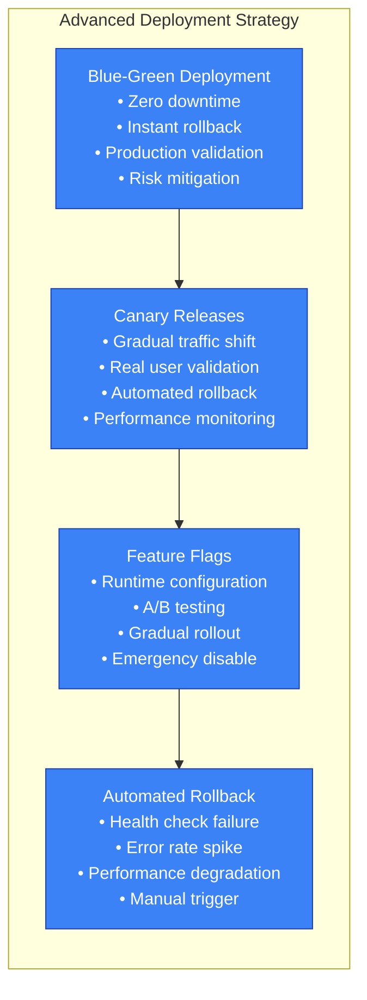
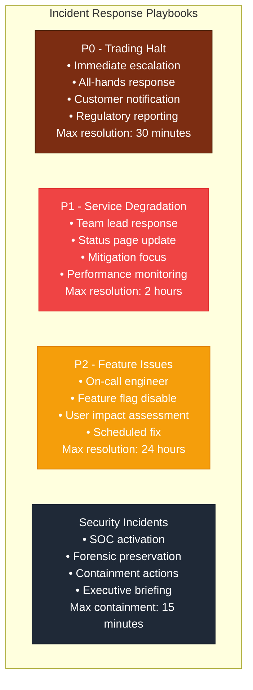
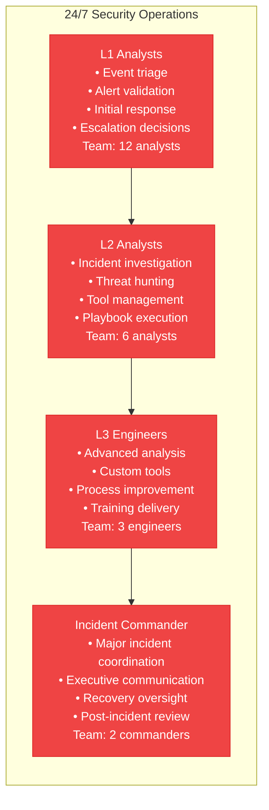
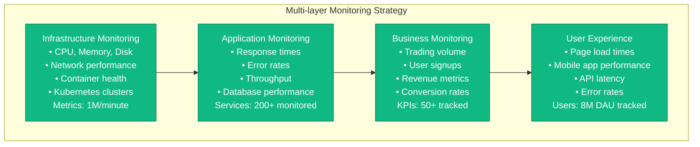

# Coinbase Production Operations - The Ops View

## 24/7 Trading Operations & Security Practices
**Uptime SLA**: 99.99% (52 minutes downtime/year maximum)
**Global Operations**: 24/7 staffing across 4 time zones
**Incident Response**: <5 minutes detection, <15 minutes response, <1 hour resolution
**Security Operations**: 150-person security team with 24/7 SOC monitoring

```mermaid
graph TB
    subgraph DeploymentPipeline[Deployment Pipeline - Zero Downtime Releases]
        subgraph CICD[CI/CD Pipeline]
            GIT[Git Repository<br/>• Feature branches<br/>• Pull request reviews<br/>• Automated testing<br/>• Security scans<br/>Commits: 500+/day]

            BUILD[Build Pipeline<br/>• Docker containerization<br/>• Multi-stage builds<br/>• Vulnerability scanning<br/>• Artifact signing<br/>Build time: 8 minutes]

            TEST[Testing Pipeline<br/>• Unit tests: 95% coverage<br/>• Integration tests<br/>• Load testing<br/>• Security testing<br/>Test suite: 45 minutes]

            DEPLOY[Deployment Strategy<br/>• Blue-green deployment<br/>• Canary releases<br/>• Feature flags<br/>• Automatic rollback<br/>Deployment: 15 minutes]
        end

        subgraph ReleaseManagement[Release Management]
            STAGING[Staging Environment<br/>• Production mirror<br/>• Real data subset<br/>• Performance testing<br/>• User acceptance<br/>Environment: 1:1 replica]

            PROD[Production Deployment<br/>• Rolling updates<br/>• Health checks<br/>• Traffic shifting<br/>• Monitoring alerts<br/>Frequency: 10x/day]

            ROLLBACK[Rollback Procedures<br/>• Automated detection<br/>• One-click rollback<br/>• Database migrations<br/>• State consistency<br/>RTO: 5 minutes]
        end
    end

    subgraph MonitoringObservability[Monitoring & Observability - Full Stack Visibility]
        subgraph MetricsMonitoring[Metrics & Alerting]
            DATADOG[DataDog Platform<br/>• 10M metrics/minute<br/>• 500+ dashboards<br/>• Real-time alerting<br/>• Anomaly detection<br/>Cost: $1M/year]

            PAGERDUTY[PagerDuty Alerting<br/>• Escalation policies<br/>• On-call rotations<br/>• Incident management<br/>• MTTR tracking<br/>Response: <2 minutes]

            GRAFANA[Grafana Dashboards<br/>• Business metrics<br/>• Technical KPIs<br/>• Customer experience<br/>• SLA monitoring<br/>Dashboards: 200+]
        end

        subgraph LoggingTracing[Logging & Tracing]
            ELK[ELK Stack<br/>• 100TB logs/month<br/>• Real-time indexing<br/>• Full-text search<br/>• Log retention: 2 years<br/>Ingestion: 1M events/sec]

            JAEGER[Distributed Tracing<br/>• Request flow tracking<br/>• Performance profiling<br/>• Dependency mapping<br/>• Latency analysis<br/>Traces: 10M/day]

            SIEM[Security SIEM<br/>• Security event correlation<br/>• Threat detection<br/>• Compliance logging<br/>• Forensic analysis<br/>Events: 50M/day]
        end

        subgraph PerformanceMonitoring[Application Performance]
            APM[Application Performance<br/>• Code-level visibility<br/>• Database queries<br/>• Memory profiling<br/>• Error tracking<br/>Services: 200+]

            RUM[Real User Monitoring<br/>• Page load times<br/>• User experience<br/>• Geographic performance<br/>• Mobile app metrics<br/>Users: 8M DAU]

            SYNTHETIC[Synthetic Monitoring<br/>• API health checks<br/>• End-to-end testing<br/>• Geographic testing<br/>• Business transactions<br/>Checks: 1000+/minute]
        end
    end

    subgraph IncidentResponse[Incident Response - 24/7 Operations]
        subgraph OnCallManagement[On-Call Management]
            ROTATION[On-Call Rotation<br/>• Primary/secondary<br/>• Follow-the-sun coverage<br/>• 4-hour shifts max<br/>• Weekend compensation<br/>Engineers: 50 in rotation]

            ESCALATION[Escalation Matrix<br/>• L1: On-call engineer<br/>• L2: Team lead<br/>• L3: Director/VP<br/>• L4: CEO/CTO<br/>Response time: Tiered]

            HANDOFF[Shift Handoffs<br/>• Status briefings<br/>• Active incidents<br/>• Ongoing deployments<br/>• Risk assessments<br/>Duration: 15 minutes]
        end

        subgraph IncidentManagement[Incident Management Process]
            DETECTION[Incident Detection<br/>• Automated alerting<br/>• Customer reports<br/>• Monitoring systems<br/>• Security events<br/>Detection: <30 seconds]

            TRIAGE[Incident Triage<br/>• Severity classification<br/>• P0: Trading halt<br/>• P1: Degraded service<br/>• P2: Minor issues<br/>Response: <5 minutes]

            RESPONSE[Incident Response<br/>• War room activation<br/>• Status page updates<br/>• Customer communication<br/>• Mitigation actions<br/>Resolution: <1 hour]

            POSTMORTEM[Post-incident Review<br/>• Root cause analysis<br/>• Timeline reconstruction<br/>• Action items<br/>• Process improvements<br/>Completion: 48 hours]
        end
    end

    subgraph SecurityOperations[Security Operations - 24/7 SOC]
        subgraph ThreatDetection[Threat Detection & Response]
            SOC[Security Operations Center<br/>• 24/7 staffing: 20 analysts<br/>• Global coverage<br/>• L1/L2/L3 escalation<br/>• Mean time to detect: 3 minutes<br/>Team: 150 security personnel]

            THREAT_INTEL[Threat Intelligence<br/>• IOC feeds<br/>• Threat hunting<br/>• Attribution analysis<br/>• Industry sharing<br/>Sources: 50+ feeds]

            INCIDENT_RESPONSE[Security Incident Response<br/>• Containment procedures<br/>• Forensic analysis<br/>• Evidence preservation<br/>• Recovery planning<br/>MTTR: 15 minutes]
        end

        subgraph SecurityTesting[Security Testing & Validation]
            PENTEST[Penetration Testing<br/>• Quarterly external tests<br/>• Monthly internal tests<br/>• Red team exercises<br/>• Bug bounty program<br/>Findings: 99% remediated]

            VULN_MGMT[Vulnerability Management<br/>• Continuous scanning<br/>• Patch management<br/>• Risk assessment<br/>• Remediation tracking<br/>Scan frequency: Daily]

            COMPLIANCE_AUDIT[Compliance Auditing<br/>• SOC 2 Type 2<br/>• PCI DSS Level 1<br/>• ISO 27001<br/>• Regulatory exams<br/>Audit frequency: Annual]
        end

        subgraph AccessControl[Access Control & Identity]
            IAM[Identity Access Management<br/>• SSO integration<br/>• MFA enforcement<br/>• RBAC policies<br/>• Just-in-time access<br/>Policies: 500+ rules]

            PRIVILEGED[Privileged Access Management<br/>• Session recording<br/>• Approval workflows<br/>• Time-bounded access<br/>• Emergency procedures<br/>Sessions: Monitored 100%]

            AUDIT[Access Auditing<br/>• Quarterly reviews<br/>• Automated reporting<br/>• Anomaly detection<br/>• Compliance tracking<br/>Reviews: Complete quarterly]
        end
    end

    subgraph BusinessContinuity[Business Continuity & Disaster Recovery]
        subgraph DisasterRecovery[Disaster Recovery]
            BACKUP[Backup Systems<br/>• Continuous replication<br/>• Cross-region backups<br/>• Point-in-time recovery<br/>• Automated testing<br/>RPO: 1 minute, RTO: 4 hours]

            FAILOVER[Failover Procedures<br/>• Automated failover<br/>• Manual override<br/>• Traffic redirection<br/>• Service priority<br/>Testing: Monthly drills]

            DR_TESTING[DR Testing<br/>• Monthly simulations<br/>• Full system failover<br/>• Recovery validation<br/>• Process refinement<br/>Success rate: 100%]
        end

        subgraph CapacityPlanning[Capacity Planning]
            FORECASTING[Growth Forecasting<br/>• Traffic projections<br/>• Resource planning<br/>• Cost modeling<br/>• Performance testing<br/>Accuracy: 95% within 6 months]

            SCALING[Auto-scaling<br/>• Demand-based scaling<br/>• Predictive scaling<br/>• Cost optimization<br/>• Performance SLAs<br/>Efficiency: 40% cost reduction]

            OPTIMIZATION[Performance Optimization<br/>• Resource rightsizing<br/>• Query optimization<br/>• Cache tuning<br/>• Network optimization<br/>Improvement: 25% quarterly]
        end
    end

    %% Operational Flow Connections
    GIT --> BUILD --> TEST --> DEPLOY
    STAGING --> PROD --> ROLLBACK

    DATADOG --> PAGERDUTY
    ELK --> SIEM
    APM --> RUM

    DETECTION --> TRIAGE --> RESPONSE --> POSTMORTEM

    SOC --> THREAT_INTEL --> INCIDENT_RESPONSE
    PENTEST --> VULN_MGMT --> COMPLIANCE_AUDIT

    BACKUP --> FAILOVER --> DR_TESTING
    FORECASTING --> SCALING --> OPTIMIZATION

    %% Apply operations-specific colors
    classDef deploymentStyle fill:#3B82F6,stroke:#1E40AF,color:#fff,font-weight:bold
    classDef monitoringStyle fill:#10B981,stroke:#047857,color:#fff,font-weight:bold
    classDef incidentStyle fill:#F59E0B,stroke:#D97706,color:#fff,font-weight:bold
    classDef securityStyle fill:#EF4444,stroke:#DC2626,color:#fff,font-weight:bold
    classDef continuityStyle fill:#8B5CF6,stroke:#6D28D9,color:#fff,font-weight:bold

    class GIT,BUILD,TEST,DEPLOY,STAGING,PROD,ROLLBACK deploymentStyle
    class DATADOG,PAGERDUTY,GRAFANA,ELK,JAEGER,SIEM,APM,RUM,SYNTHETIC monitoringStyle
    class ROTATION,ESCALATION,HANDOFF,DETECTION,TRIAGE,RESPONSE,POSTMORTEM incidentStyle
    class SOC,THREAT_INTEL,INCIDENT_RESPONSE,PENTEST,VULN_MGMT,COMPLIANCE_AUDIT,IAM,PRIVILEGED,AUDIT securityStyle
    class BACKUP,FAILOVER,DR_TESTING,FORECASTING,SCALING,OPTIMIZATION continuityStyle
```

## Operational Excellence Framework

### 1. Deployment Operations - Zero Downtime Releases

**Deployment Metrics:**
- **Deployment Frequency**: 10 deployments/day average
- **Lead Time**: 2 hours from commit to production
- **Change Failure Rate**: <0.1% (industry best practice: <15%)
- **Mean Time to Recovery**: 5 minutes (industry average: 4 hours)

### 2. Incident Response Playbooks

### 3. Security Operations Center (SOC)

### 4. Monitoring & Alerting Strategy

## Operational Metrics & SLAs

### Service Level Objectives (SLOs)
| Service | Availability | Latency p99 | Error Rate | Alert Threshold |
|---------|-------------|-------------|------------|----------------|
| **Trading Engine** | 99.99% | 10ms | <0.01% | 99.95% |
| **API Gateway** | 99.95% | 100ms | <0.1% | 99.9% |
| **User Authentication** | 99.95% | 200ms | <0.1% | 99.9% |
| **Market Data** | 99.9% | 50ms | <0.5% | 99.5% |
| **Mobile Apps** | 99.9% | 2s | <1% | 99% |

### Operational Excellence Metrics
| Metric | Current | Target | Industry Benchmark |
|--------|---------|--------|-------------------|
| **Mean Time to Detection** | 30 seconds | 15 seconds | 5 minutes |
| **Mean Time to Response** | 2 minutes | 1 minute | 15 minutes |
| **Mean Time to Resolution** | 45 minutes | 30 minutes | 4 hours |
| **Change Success Rate** | 99.9% | 99.95% | 85% |
| **Deployment Frequency** | 10/day | 20/day | 1/week |

### Security Operations Metrics
| Metric | Performance | Target | Notes |
|--------|-------------|---------|-------|
| **Threat Detection** | 3 minutes | 2 minutes | ML-enhanced |
| **Incident Containment** | 15 minutes | 10 minutes | Automated response |
| **False Positive Rate** | 1% | 0.5% | Continuous tuning |
| **Security Training** | 100% completion | 100% | Quarterly mandatory |
| **Penetration Testing** | Quarterly | Monthly | External + internal |

## Automation & Tooling

### Infrastructure as Code
- **Terraform**: Infrastructure provisioning (2000+ resources)
- **Ansible**: Configuration management (500+ playbooks)
- **Helm**: Kubernetes application deployment (200+ charts)
- **ArgoCD**: GitOps continuous deployment

### Observability Stack
- **DataDog**: Metrics, logs, and APM ($1M/year)
- **PagerDuty**: Incident management and on-call ($200K/year)
- **Grafana**: Custom dashboards (200+ dashboards)
- **Prometheus**: Time-series metrics collection

### Security Tools
- **Splunk**: SIEM and security analytics ($500K/year)
- **CrowdStrike**: Endpoint detection and response
- **Qualys**: Vulnerability management
- **Okta**: Identity and access management

### Development Tools
- **GitHub**: Source code management (99.9% uptime)
- **Jenkins**: CI/CD pipeline automation
- **Jira**: Project and incident tracking
- **Confluence**: Documentation and runbooks

## Operational Challenges & Solutions

### Challenge: Global 24/7 Operations
**Solution**: Follow-the-sun model with overlapping shifts
- **Asia-Pacific**: 12 engineers (Sydney, Singapore, Tokyo)
- **Europe**: 15 engineers (London, Dublin, Berlin)
- **Americas**: 25 engineers (San Francisco, New York, Toronto)
- **Overlap**: 2-hour handoff windows for continuity

### Challenge: Cryptocurrency Market Volatility
**Solution**: Predictive scaling and capacity planning
- **Auto-scaling**: 300% capacity increase in 5 minutes
- **Load testing**: Monthly stress tests at 10x normal load
- **Circuit breakers**: Automatic protection at 80% capacity
- **Queue management**: Prioritized request processing

### Challenge: Regulatory Compliance Monitoring
**Solution**: Automated compliance checking and reporting
- **Real-time monitoring**: All transactions screened
- **Automated reporting**: 50+ regulatory reports
- **Audit trails**: Immutable logging for all actions
- **Compliance dashboards**: Real-time regulatory status

### Challenge: Security Threat Evolution
**Solution**: Continuous threat intelligence and adaptation
- **Threat hunting**: Proactive security research
- **ML-based detection**: Behavioral anomaly detection
- **Industry collaboration**: Threat intelligence sharing
- **Regular testing**: Monthly red team exercises

## Cost of Operations

### Annual Operational Costs
- **Personnel**: $45M (engineering, operations, security)
- **Tools & Software**: $15M (monitoring, security, development)
- **Training & Certification**: $2M (continuous education)
- **External Services**: $8M (consulting, auditing, testing)
- **Total**: $70M annually

### Operational ROI
- **Automation Savings**: $20M annually (reduced manual work)
- **Incident Prevention**: $50M annually (avoided outages)
- **Security Investment**: $500M protected (avoided breaches)
- **Efficiency Gains**: 40% improvement in operational metrics

This production operations framework demonstrates how Coinbase maintains world-class reliability, security, and performance while operating one of the world's largest cryptocurrency exchanges 24/7 across global markets.