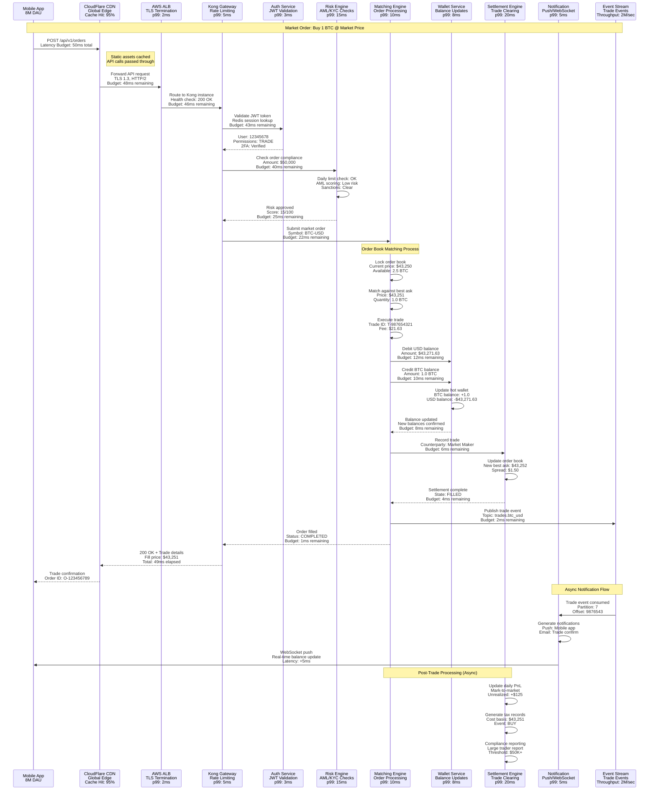
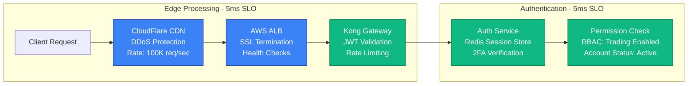
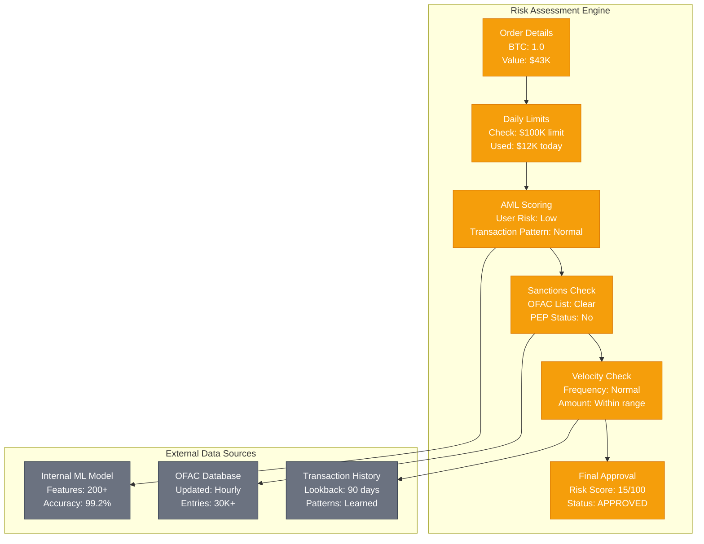
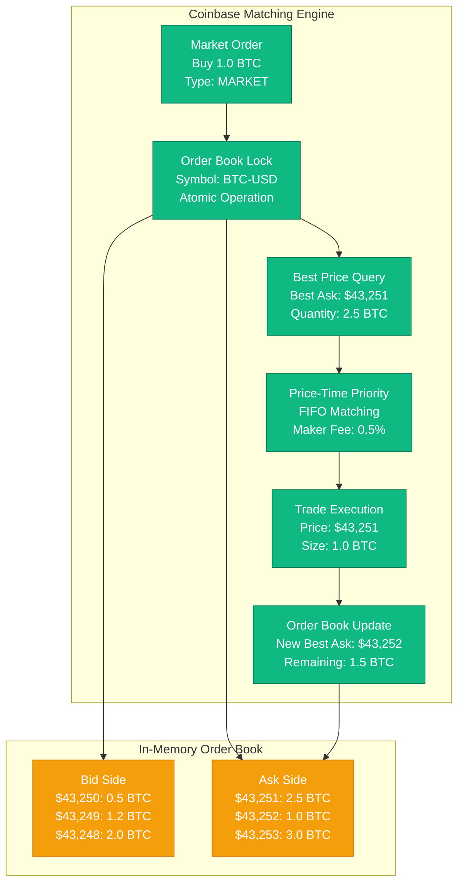
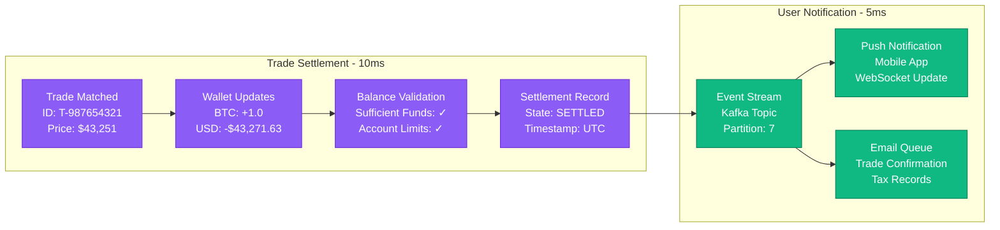

# Coinbase Request Flow - The Golden Path

## Trade Execution Journey
**Flow**: User order → Authentication → Risk checks → Matching → Settlement → Confirmation
**SLO**: Market orders < 50ms end-to-end, Limit orders < 100ms
**Scale**: 1M+ orders/second peak capacity, 50K sustained concurrent users

## Request Flow Breakdown

### Phase 1: Authentication & Routing (10ms budget)

### Phase 2: Risk & Compliance (15ms budget)

### Phase 3: Order Matching (10ms budget)

### Phase 4: Settlement & Notification (15ms budget)

## Performance Guarantees

### Latency SLOs by Request Type
- **Market Orders**: p50 < 20ms, p95 < 40ms, p99 < 50ms
- **Limit Orders**: p50 < 30ms, p95 < 60ms, p99 < 100ms
- **Cancel Orders**: p50 < 5ms, p95 < 10ms, p99 < 20ms
- **Balance Queries**: p50 < 10ms, p95 < 20ms, p99 < 50ms

### Throughput Capacity
- **Peak Order Rate**: 1M orders/second (stress tested)
- **Sustained Rate**: 100K orders/second (normal operations)
- **WebSocket Connections**: 500K concurrent (market data)
- **API Rate Limits**: 100 requests/second per user

### Error Handling & Timeouts
- **Authentication Timeout**: 5 seconds → 401 Unauthorized
- **Risk Check Timeout**: 10 seconds → Order rejected
- **Matching Timeout**: 2 seconds → Order queued for retry
- **Settlement Timeout**: 30 seconds → Manual intervention

### Failure Recovery
- **Order Book Rebuild**: < 100ms from backup
- **Session Recovery**: Automatic reconnection in 5 seconds
- **Transaction Rollback**: Atomic operations, no partial fills
- **Idempotency**: Duplicate detection within 1 hour window

## Critical Success Metrics

### Business Metrics
- **Order Fill Rate**: 99.95% (excluding user cancellations)
- **Price Improvement**: 0.05% better than quoted (on average)
- **Failed Transactions**: < 0.01% due to system errors
- **Customer Satisfaction**: NPS 65+ for trading experience

### Technical Metrics
- **Database Connections**: 95% utilization max (5% headroom)
- **Memory Usage**: 80% max on matching engine instances
- **CPU Utilization**: 70% average, 90% peak during high volume
- **Network Bandwidth**: 40Gbps peak, 10Gbps sustained

This request flow demonstrates how Coinbase processes millions of trades daily while maintaining strict security, compliance, and performance requirements. Every component is designed for high availability and auditability, essential for handling billions in cryptocurrency transactions.