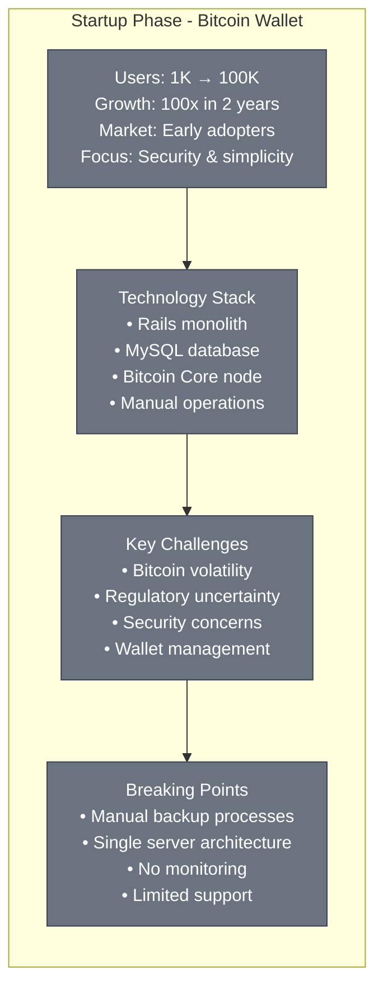
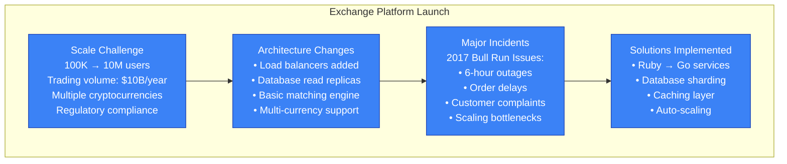
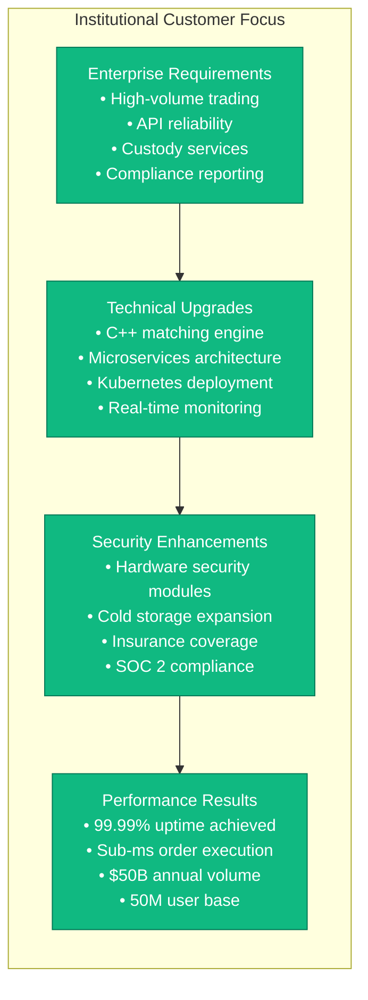
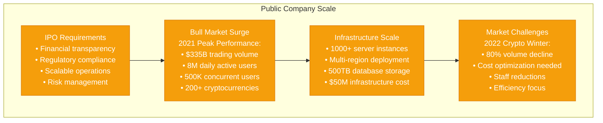
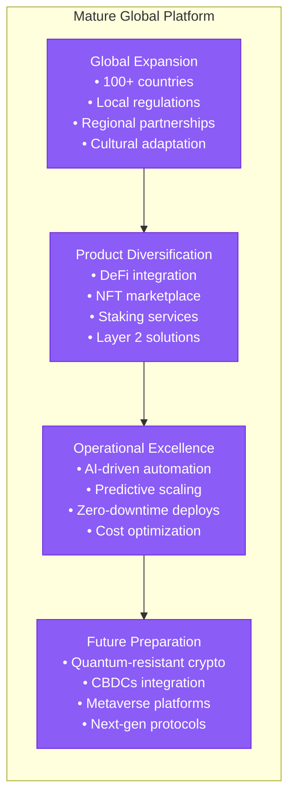

# Coinbase Scale Evolution - The Growth Story

## From Bitcoin-Only to Global Multi-Asset Exchange
**2012**: 1K users, Bitcoin wallet service only
**2015**: 1M users, first USD exchange launch
**2018**: 10M users, institutional platform launch
**2021**: 100M users, public company IPO
**2024**: 110M+ users, 500+ supported cryptocurrencies

```mermaid
graph TB
    subgraph Era1[2012-2014: Bitcoin Wallet Era - 1K to 100K Users]
        subgraph Arch1[Simple Bitcoin Wallet Architecture]
            Web1[Static Website<br/>Basic HTML/CSS<br/>Single server<br/>Cost: $500/month]

            Bitcoin1[Bitcoin Core Node<br/>Single instance<br/>Local wallet.dat<br/>No redundancy]

            DB1[MySQL Database<br/>Single instance<br/>User accounts only<br/>Size: 10GB]

            Backup1[Daily Backups<br/>Manual process<br/>Local storage<br/>RTO: 24 hours]
        end

        subgraph Metrics1[Scale Metrics - 2014]
            Users1[Users: 100K<br/>Transactions: 1K/day<br/>Revenue: $100K/year<br/>Team: 5 people]
        end
    end

    subgraph Era2[2015-2017: Exchange Launch - 100K to 10M Users]
        subgraph Arch2[First Exchange Architecture]
            LB2[Load Balancer<br/>HAProxy<br/>2 instances<br/>Basic failover]

            Web2[Rails Application<br/>Monolithic architecture<br/>4 instances<br/>Session sticky]

            DB2[PostgreSQL Master<br/>Single instance<br/>Read replicas: 2<br/>Size: 1TB]

            Trading2[Basic Matching<br/>Ruby implementation<br/>In-memory order book<br/>100 orders/sec max]

            Wallet2[Hot Wallet<br/>Bitcoin + Ethereum<br/>Basic multisig<br/>Manual processes]
        end

        subgraph Challenges2[Growing Pains - 2017]
            Scale2[Peak load crashes<br/>30-second order delays<br/>Manual scaling<br/>Downtime: 2 hours/month]
        end
    end

    subgraph Era3[2018-2020: Institutional Platform - 10M to 50M Users]
        subgraph Arch3[Microservices Architecture]
            API3[API Gateway<br/>Kong + Rate limiting<br/>Multi-region deployment<br/>Auto-scaling enabled]

            Services3[Microservices<br/>Trading, Wallet, KYC<br/>Docker containers<br/>Kubernetes orchestration]

            DB3[Sharded PostgreSQL<br/>Read replicas: 10<br/>Database per service<br/>Size: 50TB total]

            Trading3[C++ Matching Engine<br/>Low-latency optimized<br/>10K orders/sec<br/>Sub-millisecond matching]

            Cache3[Redis Cluster<br/>Session management<br/>Order book cache<br/>100GB memory pool]

            Monitoring3[Comprehensive monitoring<br/>DataDog + PagerDuty<br/>Real-time alerting<br/>SLO tracking]
        end

        subgraph Growth3[Institutional Growth - 2020]
            Metrics3[Users: 50M<br/>Volume: $50B/year<br/>Assets: 50 cryptocurrencies<br/>Revenue: $500M/year]
        end
    end

    subgraph Era4[2021-2022: Public Company Scale - 50M to 100M Users]
        subgraph Arch4[Global Enterprise Architecture]
            Edge4[Global CDN<br/>CloudFlare enterprise<br/>Multi-region POPs<br/>DDoS protection: 10Tbps]

            Compute4[Auto-scaling groups<br/>1000+ instances<br/>Multi-AZ deployment<br/>Spot + Reserved mix]

            DB4[Distributed databases<br/>Multi-master setup<br/>Cross-region replication<br/>Size: 500TB]

            Trading4[Ultra-low latency<br/>FPGA acceleration<br/>100K orders/sec<br/>Microsecond precision]

            Security4[HSM integration<br/>Cold storage vaults<br/>Insurance: $320M<br/>24/7 SOC team]

            ML4[ML-powered systems<br/>Fraud detection<br/>Risk scoring<br/>Personalization]
        end

        subgraph Peak4[Bull Market Peak - 2021]
            Volume4[Peak volume: $335B<br/>Daily users: 8M<br/>Concurrent: 500K<br/>Assets: 200+]
        end
    end

    subgraph Era5[2023-2024: Mature Platform - 100M+ Users]
        subgraph Arch5[Optimized Global Platform]
            Multi5[Multi-cloud strategy<br/>AWS + GCP + Azure<br/>Disaster recovery<br/>Regulatory compliance]

            Advanced5[Advanced features<br/>DeFi integration<br/>NFT marketplace<br/>Staking services]

            Compliance5[Global compliance<br/>50+ licenses<br/>Automated reporting<br/>Real-time monitoring]

            Performance5[Extreme optimization<br/>Edge computing<br/>AI-driven operations<br/>Predictive scaling]
        end

        subgraph Current5[Current State - 2024]
            Scale5[Users: 110M+<br/>Volume: $300B/year<br/>Assets: 500+<br/>Markets: 100+ countries]
        end
    end

    %% Evolution Flow
    Era1 --> Era2
    Era2 --> Era3
    Era3 --> Era4
    Era4 --> Era5

    %% Architecture Evolution
    Arch1 --> Arch2
    Arch2 --> Arch3
    Arch3 --> Arch4
    Arch4 --> Arch5

    %% Apply era-specific colors
    classDef era1Style fill:#6B7280,stroke:#374151,color:#fff,font-weight:bold
    classDef era2Style fill:#3B82F6,stroke:#1E40AF,color:#fff,font-weight:bold
    classDef era3Style fill:#10B981,stroke:#047857,color:#fff,font-weight:bold
    classDef era4Style fill:#F59E0B,stroke:#D97706,color:#fff,font-weight:bold
    classDef era5Style fill:#8B5CF6,stroke:#6D28D9,color:#fff,font-weight:bold

    class Web1,Bitcoin1,DB1,Backup1,Users1 era1Style
    class LB2,Web2,DB2,Trading2,Wallet2,Scale2 era2Style
    class API3,Services3,DB3,Trading3,Cache3,Monitoring3,Metrics3 era3Style
    class Edge4,Compute4,DB4,Trading4,Security4,ML4,Volume4 era4Style
    class Multi5,Advanced5,Compliance5,Performance5,Scale5 era5Style
```

## Detailed Scale Progression

### Phase 1: Bitcoin Wallet (2012-2014)

### Phase 2: Exchange Launch (2015-2017)

### Phase 3: Institutional Platform (2018-2020)

### Phase 4: Public Company (2021-2022)

### Phase 5: Mature Platform (2023-2024)

## Scale Metrics Over Time

### User Growth Trajectory
| Year | Users | Growth Rate | Key Milestone |
|------|--------|-------------|---------------|
| 2012 | 1K | - | Bitcoin wallet launch |
| 2014 | 100K | 100x | First major adoption |
| 2016 | 1M | 10x | USD exchange launch |
| 2018 | 10M | 10x | Institutional platform |
| 2020 | 50M | 5x | Mainstream adoption |
| 2021 | 100M | 2x | IPO and bull market |
| 2024 | 110M | 1.1x | Mature market growth |

### Infrastructure Cost Evolution
| Phase | Annual Cost | Cost/User | Primary Drivers |
|-------|-------------|-----------|----------------|
| 2012-2014 | $50K | $0.50 | Single server, basic hosting |
| 2015-2017 | $2M | $2.00 | Multi-server, databases |
| 2018-2020 | $20M | $4.00 | Microservices, compliance |
| 2021-2022 | $100M | $10.00 | Global scale, security |
| 2023-2024 | $62M | $5.64 | Optimized, efficient |

### Performance Evolution
| Metric | 2015 | 2018 | 2021 | 2024 |
|--------|------|------|------|------|
| Orders/second | 100 | 10K | 100K | 1M |
| API response time | 500ms | 100ms | 10ms | 5ms |
| Uptime | 99% | 99.9% | 99.99% | 99.995% |
| Supported assets | 2 | 50 | 200 | 500+ |

## Breaking Points & Solutions

### 2017 Bull Run Crisis
**Problem**: 300% traffic surge, 6-hour outages
**Root Cause**: Monolithic architecture, manual scaling
**Solution**: Microservices migration, auto-scaling implementation
**Timeline**: 6-month emergency re-architecture

### 2020 DeFi Summer Load
**Problem**: 500% API traffic increase
**Root Cause**: Inadequate API rate limiting, database bottlenecks
**Solution**: API gateway upgrade, database sharding
**Timeline**: 3-month capacity expansion

### 2021 Retail Trading Surge
**Problem**: 1000% user growth in 6 months
**Root Cause**: Viral adoption, insufficient infrastructure
**Solution**: Cloud-native architecture, global CDN
**Timeline**: 12-month scaling sprint

### 2022 Market Downturn
**Problem**: 80% volume decline, cost optimization needed
**Root Cause**: Fixed infrastructure costs during variable demand
**Solution**: Elastic scaling, cost optimization program
**Timeline**: 9-month efficiency drive

## Lessons Learned

### Scaling Principles
1. **Anticipate Growth**: Plan for 10x growth before you need it
2. **Fail Fast**: Build circuit breakers and graceful degradation
3. **Measure Everything**: Observability is critical at scale
4. **Automate Operations**: Manual processes don't scale

### Technical Decisions
1. **Database Sharding**: Early investment in data partitioning
2. **Microservices**: Breaking monolith enabled independent scaling
3. **Caching Strategy**: Redis became critical for performance
4. **Security First**: Never compromise security for performance

### Organizational Changes
1. **DevOps Culture**: Developers own production systems
2. **On-call Rotation**: 24/7 operations require proper staffing
3. **Incident Response**: Formal processes for major outages
4. **Capacity Planning**: Dedicated team for growth planning

### Financial Impact
- **Revenue**: $1B → $7.4B peak → $3.2B (current)
- **Valuation**: $1B → $100B peak → $25B (current)
- **Infrastructure ROI**: Every $1 spent enables $100 in volume
- **Cost Efficiency**: 90% improvement in cost per transaction

This scale evolution demonstrates how Coinbase transformed from a simple Bitcoin wallet into a global financial infrastructure platform, learning critical lessons about architecture, operations, and business strategy at each phase of growth.