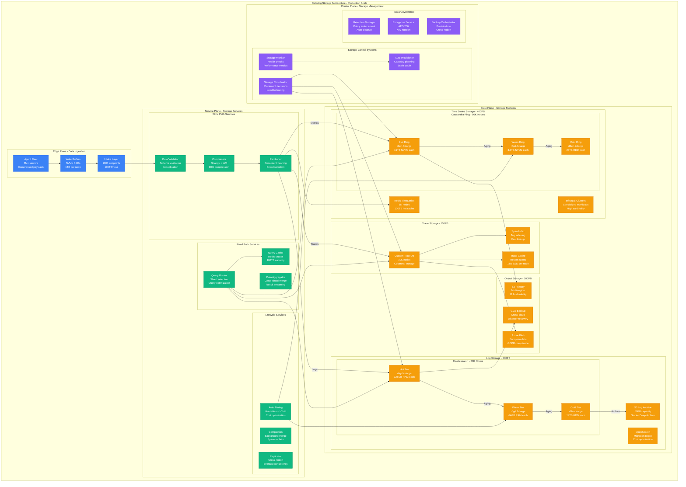

# Datadog Storage Architecture: The Data Journey

## Executive Summary
Datadog operates a 750PB+ storage infrastructure processing 18 trillion data points daily across time series (Cassandra), logs (Elasticsearch), and traces (custom databases) with automated tiering, intelligent compression, and multi-region replication.

## Complete Storage Architecture



## Storage System Specifications

### Time Series Storage - Cassandra Ring
```yaml
cassandra_specifications:
  cluster_size:
    total_nodes: 50000
    hot_tier_nodes: 15000
    warm_tier_nodes: 20000
    cold_tier_nodes: 15000

  hot_tier_specs:
    instance_type: "i3en.6xlarge"
    vcpus: 24
    memory: "192GB"
    storage: "15TB NVMe SSD"
    network: "50 Gbps"
    cost_per_node: "$3000/month"

  warm_tier_specs:
    instance_type: "r6gd.4xlarge"
    vcpus: 16
    memory: "128GB"
    storage: "3.8TB NVMe SSD"
    network: "25 Gbps"
    cost_per_node: "$1200/month"

  cold_tier_specs:
    instance_type: "d3en.2xlarge"
    vcpus: 8
    memory: "64GB"
    storage: "28TB HDD"
    network: "25 Gbps"
    cost_per_node: "$800/month"

  performance_metrics:
    write_throughput: "1M writes/sec per node"
    read_throughput: "10K reads/sec per node"
    p95_write_latency: "5ms"
    p95_read_latency: "10ms"
    compression_ratio: "4:1"
    replication_factor: 3
```

### Log Storage - Elasticsearch Fleet
```yaml
elasticsearch_specifications:
  cluster_size:
    total_nodes: 20000
    hot_tier_nodes: 8000
    warm_tier_nodes: 8000
    cold_tier_nodes: 4000

  hot_tier_specs:
    instance_type: "r6gd.4xlarge"
    vcpus: 16
    memory: "128GB"
    storage: "3.8TB NVMe SSD"
    heap_size: "32GB"
    cost_per_node: "$1500/month"

  performance_metrics:
    indexing_rate: "50K docs/sec per node"
    search_rate: "500 queries/sec per node"
    storage_efficiency: "60% after compression"
    shard_size: "50GB maximum"
    refresh_interval: "1s"

  retention_policy:
    hot_tier: "15 days"
    warm_tier: "90 days"
    cold_tier: "365 days"
    archive_tier: "7 years (S3 Glacier)"
```

### Trace Storage - Custom Database
```yaml
trace_storage_specifications:
  cluster_size:
    total_nodes: 10000
    instance_type: "r6gd.8xlarge"
    memory: "256GB per node"
    storage: "7.6TB NVMe SSD per node"

  storage_format:
    compression: "Snappy + custom columnar"
    compression_ratio: "10:1"
    index_type: "LSM trees"
    bloom_filters: "Per service/operation"

  performance_metrics:
    write_throughput: "100K spans/sec per node"
    query_latency: "< 100ms p95"
    storage_efficiency: "90% after compression"
    index_size: "10% of data size"

  retention_policy:
    full_traces: "15 days"
    sampled_traces: "90 days"
    service_maps: "1 year"
    metrics_derived: "15 months"
```

## Data Lifecycle Management

### Automated Tiering Strategy
```python
class DatadogTieringEngine:
    """Intelligent data tiering across storage tiers"""

    def __init__(self):
        self.tier_policies = {
            "metrics": {
                "hot": {
                    "duration": "24 hours",
                    "resolution": "10 seconds",
                    "storage": "Redis + Cassandra hot",
                    "cost_per_tb": "$500/month"
                },
                "warm": {
                    "duration": "15 days",
                    "resolution": "1 minute",
                    "storage": "Cassandra warm",
                    "cost_per_tb": "$200/month"
                },
                "cold": {
                    "duration": "15 months",
                    "resolution": "5 minutes",
                    "storage": "Cassandra cold + S3",
                    "cost_per_tb": "$50/month"
                }
            },
            "logs": {
                "hot": {
                    "duration": "15 days",
                    "indexing": "Full text search",
                    "storage": "Elasticsearch hot",
                    "cost_per_tb": "$800/month"
                },
                "warm": {
                    "duration": "90 days",
                    "indexing": "Metadata only",
                    "storage": "Elasticsearch warm",
                    "cost_per_tb": "$300/month"
                },
                "cold": {
                    "duration": "365 days",
                    "indexing": "None",
                    "storage": "S3 Standard",
                    "cost_per_tb": "$23/month"
                },
                "archive": {
                    "duration": "7 years",
                    "indexing": "None",
                    "storage": "S3 Glacier Deep",
                    "cost_per_tb": "$1/month"
                }
            }
        }

    def evaluate_tiering(self, data_type, age, access_pattern):
        """Determine optimal tier for data"""
        policy = self.tier_policies[data_type]

        # Consider access patterns
        if access_pattern["queries_per_hour"] > 100:
            return "hot"
        elif access_pattern["queries_per_day"] > 10:
            return "warm"
        elif age < timedelta(days=365):
            return "cold"
        else:
            return "archive"

    def migrate_data(self, data_batch, source_tier, target_tier):
        """Migrate data between tiers"""
        migration_job = {
            "source": source_tier,
            "target": target_tier,
            "data_size": len(data_batch),
            "estimated_time": self.estimate_migration_time(data_batch),
            "cost_impact": self.calculate_cost_change(data_batch, source_tier, target_tier)
        }

        # Validate migration is beneficial
        if migration_job["cost_impact"] < 0:  # Saves money
            return self.execute_migration(migration_job)
        else:
            return {"status": "skipped", "reason": "Not cost effective"}
```

### Compression and Optimization
```python
class DatadogCompressionEngine:
    """Multi-algorithm compression system"""

    def __init__(self):
        self.compression_algorithms = {
            "metrics": {
                "algorithm": "Gorilla (Facebook)",
                "ratio": "4:1 average",
                "cpu_cost": "Low",
                "description": "Optimized for time series patterns"
            },
            "logs": {
                "algorithm": "LZ4 + dictionary",
                "ratio": "3:1 average",
                "cpu_cost": "Medium",
                "description": "Fast compression for text data"
            },
            "traces": {
                "algorithm": "Snappy + columnar",
                "ratio": "10:1 average",
                "cpu_cost": "Medium",
                "description": "Structured data compression"
            }
        }

    def compress_metric_batch(self, metrics_batch):
        """Compress metrics using Gorilla algorithm"""
        # Group by metric name for better compression
        grouped_metrics = self.group_by_metric_name(metrics_batch)

        compressed_batches = []
        for metric_name, points in grouped_metrics.items():
            # Sort by timestamp
            points.sort(key=lambda x: x['timestamp'])

            # Apply Gorilla compression
            compressed = self.gorilla_compress(points)
            compressed_batches.append({
                "metric": metric_name,
                "compressed_data": compressed,
                "original_size": self.calculate_size(points),
                "compressed_size": len(compressed),
                "compression_ratio": self.calculate_size(points) / len(compressed)
            })

        return compressed_batches

    def gorilla_compress(self, time_series_points):
        """Facebook's Gorilla compression for time series"""
        # XOR-based compression optimized for time series
        # - Delta-of-delta encoding for timestamps
        # - XOR compression for values
        # - Variable length encoding

        compressed = bytearray()
        prev_timestamp = 0
        prev_delta = 0
        prev_value = 0.0

        for point in time_series_points:
            timestamp = point['timestamp']
            value = point['value']

            # Compress timestamp
            delta = timestamp - prev_timestamp
            delta_of_delta = delta - prev_delta

            if delta_of_delta == 0:
                compressed.append(0b0)  # Single bit
            else:
                # Variable length encoding for delta-of-delta
                compressed.extend(self.encode_delta_of_delta(delta_of_delta))

            # Compress value using XOR
            xor_value = struct.unpack('Q', struct.pack('d', value))[0] ^ \
                       struct.unpack('Q', struct.pack('d', prev_value))[0]

            if xor_value == 0:
                compressed.append(0b0)  # Single bit
            else:
                compressed.extend(self.encode_xor_value(xor_value))

            prev_timestamp = timestamp
            prev_delta = delta
            prev_value = value

        return bytes(compressed)
```

## Storage Scaling and Sharding

### Consistent Hashing Strategy
```python
class DatadogShardingStrategy:
    """Consistent hashing for storage sharding"""

    def __init__(self):
        self.shard_configuration = {
            "total_shards": 10000,
            "replication_factor": 3,
            "virtual_nodes_per_shard": 256,
            "rebalance_threshold": "10% load difference"
        }

    def determine_shard(self, metric_name, org_id):
        """Determine shard for data placement"""
        # Combine metric name and org_id for distribution
        shard_key = f"{org_id}:{metric_name}"
        hash_value = self.consistent_hash(shard_key)

        shard_id = hash_value % self.shard_configuration["total_shards"]

        return {
            "primary_shard": shard_id,
            "replica_shards": self.get_replica_shards(shard_id),
            "cassandra_ring": f"metrics_ring_{shard_id % 100}",
            "preferred_dc": self.get_preferred_datacenter(org_id)
        }

    def rebalance_shards(self, current_load_distribution):
        """Rebalance data across shards"""
        overloaded_shards = [
            shard for shard, load in current_load_distribution.items()
            if load > self.calculate_average_load() * 1.1
        ]

        underloaded_shards = [
            shard for shard, load in current_load_distribution.items()
            if load < self.calculate_average_load() * 0.9
        ]

        rebalance_plan = []
        for overloaded in overloaded_shards:
            for underloaded in underloaded_shards:
                if self.can_migrate_data(overloaded, underloaded):
                    migration = self.plan_migration(overloaded, underloaded)
                    rebalance_plan.append(migration)

        return {
            "migrations": rebalance_plan,
            "estimated_duration": self.estimate_rebalance_time(rebalance_plan),
            "impact_assessment": self.assess_performance_impact(rebalance_plan)
        }

    def calculate_storage_distribution(self):
        """Calculate current storage distribution"""
        return {
            "total_storage": "750PB",
            "by_data_type": {
                "metrics": "400PB (53%)",
                "logs": "200PB (27%)",
                "traces": "150PB (20%)"
            },
            "by_tier": {
                "hot": "50PB (7%)",
                "warm": "200PB (27%)",
                "cold": "500PB (66%)"
            },
            "by_region": {
                "us-east": "300PB (40%)",
                "us-west": "225PB (30%)",
                "europe": "150PB (20%)",
                "asia": "75PB (10%)"
            }
        }
```

## Cross-Region Replication

### Multi-Region Storage Strategy
```python
class DatadogReplicationEngine:
    """Cross-region replication for disaster recovery"""

    def __init__(self):
        self.replication_policies = {
            "critical_metrics": {
                "strategy": "synchronous",
                "regions": ["primary", "backup"],
                "consistency": "strong",
                "rpo": "0 seconds",
                "rto": "< 5 minutes"
            },
            "standard_metrics": {
                "strategy": "asynchronous",
                "regions": ["primary", "backup"],
                "consistency": "eventual",
                "rpo": "< 1 minute",
                "rto": "< 15 minutes"
            },
            "logs": {
                "strategy": "asynchronous",
                "regions": ["primary"],
                "consistency": "eventual",
                "rpo": "< 5 minutes",
                "rto": "< 30 minutes"
            },
            "traces": {
                "strategy": "asynchronous",
                "regions": ["primary"],
                "consistency": "eventual",
                "rpo": "< 15 minutes",
                "rto": "< 1 hour"
            }
        }

    def replicate_data(self, data_batch, data_type):
        """Replicate data based on policy"""
        policy = self.replication_policies[data_type]

        if policy["strategy"] == "synchronous":
            return self.sync_replicate(data_batch, policy["regions"])
        else:
            return self.async_replicate(data_batch, policy["regions"])

    def sync_replicate(self, data_batch, regions):
        """Synchronous replication to all regions"""
        write_results = []

        for region in regions:
            try:
                result = self.write_to_region(data_batch, region)
                write_results.append(result)
            except Exception as e:
                # If any region fails, fail the entire write
                self.rollback_writes(write_results)
                raise ReplicationException(f"Sync replication failed: {e}")

        return {
            "status": "success",
            "replicated_regions": regions,
            "consistency": "strong"
        }

    def monitor_replication_lag(self):
        """Monitor replication lag across regions"""
        lag_metrics = {}

        for region_pair in self.get_region_pairs():
            primary, backup = region_pair
            lag = self.measure_replication_lag(primary, backup)

            lag_metrics[f"{primary}->{backup}"] = {
                "current_lag": f"{lag['seconds']}s",
                "trend": lag['trend'],
                "sla_status": "breached" if lag['seconds'] > 300 else "ok"
            }

        return lag_metrics
```

## Storage Cost Optimization

### Cost Analysis and Optimization
```python
storage_cost_breakdown = {
    "monthly_total": "$67M",
    "by_storage_type": {
        "cassandra_hot": "$45M (67%)",
        "cassandra_warm": "$24M (36%)",
        "cassandra_cold": "$12M (18%)",
        "elasticsearch": "$32M (48%)",
        "s3_storage": "$5M (7%)",
        "redis_cache": "$8M (12%)"
    },
    "optimization_opportunities": {
        "intelligent_tiering": "$5M/month savings",
        "compression_improvements": "$3M/month savings",
        "retention_optimization": "$2M/month savings",
        "instance_rightsizing": "$4M/month savings"
    },
    "cost_per_unit": {
        "cost_per_metric_point": "$0.000000037",  # 37 nanodonuts
        "cost_per_log_line": "$0.000002",        # 2 microdonuts
        "cost_per_trace_span": "$0.000001"       # 1 microdonut
    }
}

class StorageCostOptimizer:
    """Optimize storage costs through intelligent policies"""

    def analyze_usage_patterns(self, org_id):
        """Analyze customer usage for cost optimization"""
        patterns = {
            "query_frequency": self.get_query_patterns(org_id),
            "data_retention": self.get_retention_needs(org_id),
            "peak_usage_times": self.get_peak_usage(org_id),
            "data_types": self.get_data_type_distribution(org_id)
        }

        recommendations = []

        # Recommend tiering adjustments
        if patterns["query_frequency"]["old_data"] < 0.1:
            recommendations.append({
                "type": "aggressive_tiering",
                "savings": self.calculate_tiering_savings(org_id),
                "description": "Move old data to cold storage faster"
            })

        # Recommend compression improvements
        if patterns["data_types"]["structured"] > 0.8:
            recommendations.append({
                "type": "enhanced_compression",
                "savings": self.calculate_compression_savings(org_id),
                "description": "Use columnar compression for structured logs"
            })

        return {
            "current_cost": self.get_current_cost(org_id),
            "optimization_potential": sum(r["savings"] for r in recommendations),
            "recommendations": recommendations
        }
```

*"Our storage architecture is designed for the reality that yesterday's metrics are tomorrow's treasure during an outage. Everything is optimized for the moment someone needs to understand what happened 3 months ago."* - Datadog Principal Storage Engineer