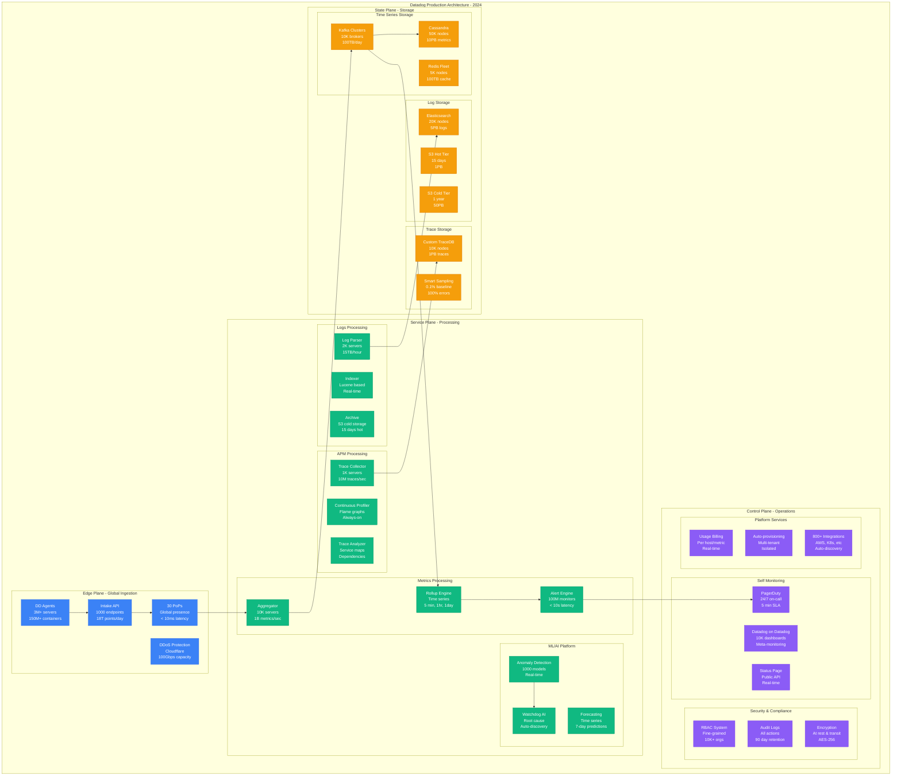
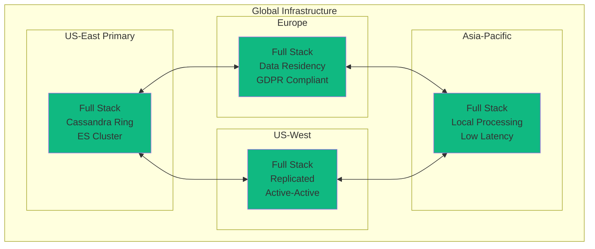

# Datadog Complete Architecture: Observability at Internet Scale

## Executive Summary
Datadog processes 18 trillion data points/day, monitors 3M+ servers, serves 25K+ customers, with 99.98% availability on $150M/month infrastructure.

## Complete System Architecture



## Infrastructure Scale Metrics

### Data Ingestion Volume
```yaml
ingestion_metrics:
  total_data_points: 18T/day  # 18 trillion
  metrics_per_second: 1B
  logs_volume: 15TB/hour
  traces_per_second: 10M
  events_per_second: 100M

customer_scale:
  enterprise_customers: 3000+
  total_customers: 25000+
  monitored_servers: 3M+
  monitored_containers: 150M+
  custom_metrics: 1B+

infrastructure:
  total_servers: 100K+
  kafka_brokers: 10K
  cassandra_nodes: 50K
  elasticsearch_nodes: 20K
  redis_nodes: 5K
```

### Hardware Specifications
```python
infrastructure_specs = {
    "intake_layer": {
        "server_type": "c5n.9xlarge",
        "network": "50 Gbps",
        "count": 1000,
        "location": "30 global PoPs",
        "monthly_cost": "$1.5M"
    },
    "cassandra_cluster": {
        "nodes": 50000,
        "instance_type": "i3en.6xlarge",
        "storage": "15TB NVMe per node",
        "total_storage": "750PB raw",
        "monthly_cost": "$15M"
    },
    "elasticsearch_fleet": {
        "nodes": 20000,
        "instance_type": "r6gd.4xlarge",
        "memory": "128GB per node",
        "storage": "3.8TB NVMe",
        "monthly_cost": "$8M"
    },
    "kafka_infrastructure": {
        "brokers": 10000,
        "instance_type": "m5d.12xlarge",
        "throughput": "100TB/day",
        "retention": "7 days",
        "monthly_cost": "$5M"
    }
}
```

## Unique Architectural Components

### Multi-Tenant Isolation
```python
class DatadogMultiTenancy:
    """Enterprise-grade multi-tenant architecture"""

    def __init__(self):
        self.isolation_levels = {
            "data": "Complete logical separation",
            "compute": "Resource quotas per org",
            "network": "VPC isolation available",
            "storage": "Encrypted per-tenant keys"
        }

    def handle_customer_data(self, org_id, data_point):
        # Tenant isolation at ingestion
        tenant_context = {
            "org_id": org_id,
            "shard": self.get_org_shard(org_id),
            "encryption_key": self.get_org_key(org_id),
            "quota": self.get_org_quota(org_id)
        }

        # Check quotas
        if self.exceeds_quota(org_id, data_point):
            return self.handle_quota_exceeded(org_id)

        # Route to tenant-specific pipeline
        pipeline = self.get_tenant_pipeline(org_id)
        return pipeline.process(data_point, tenant_context)

    def query_tenant_data(self, org_id, query):
        # Enforce tenant boundaries in queries
        query_context = {
            "org_filter": f"org_id = {org_id}",
            "max_series": self.get_org_limit(org_id, "series"),
            "timeout": self.get_org_limit(org_id, "query_timeout"),
            "priority": self.get_org_priority(org_id)
        }

        return self.execute_query(query, query_context)
```

### Intelligent Sampling System
```yaml
sampling_strategy:
  metrics:
    default_interval: 10s
    high_cardinality_rollup: 1min
    aggregation_methods:
      - avg
      - max
      - min
      - count
      - percentiles

  logs:
    sampling_rules:
      - error_logs: 100%  # Keep all errors
      - warning_logs: 10%  # Sample warnings
      - info_logs: 1%     # Sample info
      - debug_logs: 0.1%  # Minimal debug

  traces:
    head_based_sampling:
      default_rate: 0.1%
      error_traces: 100%
      slow_traces: 100%  # > p95 latency

    tail_based_sampling:
      interesting_traces: 100%
      normal_traces: 0.01%
```

### Time Series Optimization
```python
class DatadogTimeSeriesEngine:
    """Custom time series storage and query engine"""

    def __init__(self):
        self.storage_tiers = {
            "hot": {
                "duration": "24 hours",
                "resolution": "10 seconds",
                "storage": "NVMe SSD",
                "query_speed": "< 100ms"
            },
            "warm": {
                "duration": "15 days",
                "resolution": "1 minute",
                "storage": "SSD",
                "query_speed": "< 500ms"
            },
            "cold": {
                "duration": "15 months",
                "resolution": "5 minutes",
                "storage": "HDD + S3",
                "query_speed": "< 5s"
            }
        }

    def ingest_metric(self, metric):
        # Write to all relevant rollups
        rollups = [
            self.write_10s_rollup(metric),
            self.write_1m_rollup(metric),
            self.write_5m_rollup(metric),
            self.write_1h_rollup(metric)
        ]

        # Async write to storage tiers
        return asyncio.gather(*rollups)

    def query_metrics(self, query, time_range):
        # Intelligent rollup selection
        if time_range < timedelta(hours=24):
            return self.query_hot_tier(query)
        elif time_range < timedelta(days=15):
            return self.query_warm_tier(query)
        else:
            return self.query_cold_tier(query)
```

## Performance Characteristics

### Latency Targets
| Operation | p50 | p95 | p99 | SLO |
|-----------|-----|-----|-----|-----|
| Metric Ingestion | 5ms | 20ms | 50ms | < 100ms |
| Log Ingestion | 10ms | 50ms | 200ms | < 500ms |
| Trace Ingestion | 10ms | 40ms | 100ms | < 200ms |
| Metric Query | 100ms | 500ms | 2s | < 5s |
| Log Search | 200ms | 1s | 5s | < 10s |
| Alert Evaluation | 5s | 10s | 30s | < 60s |
| Dashboard Load | 500ms | 2s | 5s | < 10s |

### Throughput Capabilities
```python
throughput_metrics = {
    "ingestion": {
        "metrics": "1B/second sustained",
        "logs": "15TB/hour",
        "traces": "10M/second",
        "events": "100M/second"
    },
    "processing": {
        "alert_evaluations": "100M/minute",
        "dashboard_queries": "1M/second",
        "api_requests": "10M/minute"
    },
    "storage": {
        "write_throughput": "10GB/second",
        "read_throughput": "100GB/second",
        "query_concurrent": "100K queries"
    }
}
```

## Reliability Engineering

### Multi-Region Architecture


## Cost Breakdown Summary

```python
monthly_infrastructure_costs = {
    "compute": {
        "intake_servers": "$1.5M",
        "processing": "$8M",
        "ml_platform": "$5M"
    },
    "storage": {
        "cassandra": "$15M",
        "elasticsearch": "$8M",
        "s3_storage": "$5M"
    },
    "network": {
        "bandwidth": "$10M",
        "cdn": "$2M",
        "cross_region": "$3M"
    },
    "services": {
        "monitoring_self": "$2M",  # Dogfooding
        "security": "$3M",
        "ml_training": "$4M"
    },
    "total": "$150M/month",
    "revenue": "$2.5B/year",
    "infrastructure_margin": "93%"
}
```

## Key Innovations

1. **Unified Observability Platform**: Metrics, logs, APM, RUM, synthetics in one
2. **Watchdog AI**: Automatic anomaly detection and root cause analysis
3. **Live Tail**: Real-time log streaming at massive scale
4. **Service Map**: Auto-discovered application topology
5. **Continuous Profiler**: Always-on production profiling
6. **Incident Management**: Integrated on-call and incident response
7. **Cloud Cost Management**: FinOps platform integration

## Monitoring the Monitors

### Self-Observability
```yaml
dogfooding:
  internal_usage:
    dashboards: 10000+
    alerts: 50000+
    custom_metrics: 1M+

  meta_monitoring:
    latency_tracking: "Every API endpoint"
    error_tracking: "Every service"
    cost_tracking: "Per customer per feature"

  incident_detection:
    internal_alerts: "< 30 seconds"
    customer_impact: "< 1 minute"
    auto_rollback: "< 5 minutes"
```

*"We run Datadog on Datadog - if we go down, we really go down. That's why we don't."* - Datadog SRE Lead