# Datadog Failure Domains: The Incident Map

## Executive Summary
Datadog's failure domain architecture isolates blast radius to maintain 99.98% availability across ingestion, storage, and query systems, with automated failover, circuit breakers, and bulkheads protecting against cascading failures.

## Complete Failure Domains Architecture

```mermaid
graph TB
    subgraph "Datadog Failure Domains - Blast Radius Analysis"
        subgraph EdgePlane[Edge Plane - Ingestion Failures]
            subgraph AgentFailures[Agent Failure Domain]
                AGENT_CRASH[Agent Crash<br/>Host-level impact<br/>Auto-restart]
                AGENT_NETWORK[Network Partition<br/>Regional impact<br/>Local buffer]
                AGENT_AUTH[Auth Failure<br/>Org-level impact<br/>Key rotation]
            end

            subgraph IntakeFailures[Intake Failure Domain]
                INTAKE_OVERLOAD[Intake Overload<br/>PoP-level impact<br/>Rate limiting]
                INTAKE_DEPLOY[Bad Deployment<br/>Region-level impact<br/>Blue-green]
                INTAKE_DDoS[DDoS Attack<br/>Global impact<br/>Cloudflare]
            end
        end

        subgraph ServicePlane[Service Plane - Processing Failures]
            subgraph StreamProcessing[Stream Processing Failures]
                KAFKA_PARTITION[Kafka Partition Fail<br/>Shard-level impact<br/>Multi-replica]
                AGGREGATOR_OOM[Aggregator OOM<br/>Node-level impact<br/>Circuit breaker]
                PIPELINE_POISON[Poison Message<br/>Pipeline-level impact<br/>Dead letter queue]
            end

            subgraph QueryFailures[Query Processing Failures]
                QUERY_TIMEOUT[Query Timeout<br/>Request-level impact<br/>Circuit breaker]
                SHARD_UNAVAIL[Shard Unavailable<br/>Data subset impact<br/>Partial results]
                CACHE_EVICTION[Cache Eviction<br/>Performance impact<br/>Cache warming]
            end
        end

        subgraph StatePlane[State Plane - Storage Failures]
            subgraph CassandraFailures[Cassandra Failure Domain]
                NODE_FAILURE[Node Failure<br/>Minimal impact<br/>RF=3]
                RACK_FAILURE[Rack Failure<br/>AZ-level impact<br/>Multi-AZ]
                RING_SPLIT[Ring Split<br/>Consistency impact<br/>Quorum]
            end

            subgraph ElasticsearchFailures[Elasticsearch Failure Domain]
                ES_NODE_DOWN[ES Node Down<br/>Shard impact<br/>Auto-rebalance]
                CLUSTER_YELLOW[Cluster Yellow<br/>Performance impact<br/>Monitoring]
                INDEX_CORRUPTION[Index Corruption<br/>Time range impact<br/>Restore]
            end

            subgraph StorageInfrastructure[Storage Infrastructure Failures]
                DISK_FAILURE[Disk Failure<br/>Node-level impact<br/>RAID + replica]
                NETWORK_SPLIT[Network Split<br/>DC-level impact<br/>Multi-region]
                STORAGE_FULL[Storage Full<br/>Cluster impact<br/>Auto-scaling]
            end
        end

        subgraph ControlPlane[Control Plane - Control System Failures]
            subgraph MonitoringFailures[Monitoring System Failures]
                ALERT_DELAY[Alert Delay<br/>Detection impact<br/>Redundant systems]
                DASHBOARD_DOWN[Dashboard Down<br/>Visibility impact<br/>Status page]
                METRICS_LOSS[Metrics Loss<br/>Blind spot impact<br/>Multiple sources]
            end

            subgraph SecurityFailures[Security System Failures]
                AUTH_SYSTEM_DOWN[Auth System Down<br/>Access impact<br/>Emergency access]
                KEY_ROTATION_FAIL[Key Rotation Fail<br/>Crypto impact<br/>Rollback plan]
                RBAC_CORRUPTION[RBAC Corruption<br/>Permission impact<br/>Admin override]
            end
        end
    end

    %% Failure Propagation Paths
    AGENT_CRASH -.->|No impact| INTAKE_OVERLOAD
    INTAKE_OVERLOAD -.->|Backpressure| AGENT_NETWORK
    KAFKA_PARTITION -.->|Queue backup| INTAKE_OVERLOAD
    AGGREGATOR_OOM -.->|Circuit open| QUERY_TIMEOUT
    NODE_FAILURE -.->|Load shift| RACK_FAILURE
    ES_NODE_DOWN -.->|Rebalance stress| CLUSTER_YELLOW
    DISK_FAILURE -.->|Node replacement| NODE_FAILURE
    ALERT_DELAY -.->|Late detection| All_Systems

    %% Circuit Breakers
    INTAKE_OVERLOAD --> CB1[Circuit Breaker<br/>95% error rate<br/>30s timeout]
    QUERY_TIMEOUT --> CB2[Circuit Breaker<br/>50% timeout rate<br/>10s timeout]
    AGGREGATOR_OOM --> CB3[Circuit Breaker<br/>Memory > 90%<br/>5s timeout]

    %% Bulkheads
    KAFKA_PARTITION --> BH1[Bulkhead<br/>Isolated topics<br/>Per org/service]
    ES_NODE_DOWN --> BH2[Bulkhead<br/>Isolated indices<br/>Per time range]
    CASSANDRA_NODE --> BH3[Bulkhead<br/>Isolated keyspaces<br/>Per data type]

    %% Apply four-plane colors
    classDef edgeStyle fill:#3B82F6,stroke:#2563EB,color:#fff
    classDef serviceStyle fill:#10B981,stroke:#059669,color:#fff
    classDef stateStyle fill:#F59E0B,stroke:#D97706,color:#fff
    classDef controlStyle fill:#8B5CF6,stroke:#7C3AED,color:#fff
    classDef failureStyle fill:#EF4444,stroke:#DC2626,color:#fff

    class AGENT_CRASH,AGENT_NETWORK,AGENT_AUTH,INTAKE_OVERLOAD,INTAKE_DEPLOY,INTAKE_DDoS edgeStyle
    class KAFKA_PARTITION,AGGREGATOR_OOM,PIPELINE_POISON,QUERY_TIMEOUT,SHARD_UNAVAIL,CACHE_EVICTION serviceStyle
    class NODE_FAILURE,RACK_FAILURE,RING_SPLIT,ES_NODE_DOWN,CLUSTER_YELLOW,INDEX_CORRUPTION,DISK_FAILURE,NETWORK_SPLIT,STORAGE_FULL stateStyle
    class ALERT_DELAY,DASHBOARD_DOWN,METRICS_LOSS,AUTH_SYSTEM_DOWN,KEY_ROTATION_FAIL,RBAC_CORRUPTION controlStyle
    class CB1,CB2,CB3,BH1,BH2,BH3 failureStyle
```



## Real Incident Analysis

### Major Production Incidents (2020-2024)
```yaml
incident_history:
  "2024-03-15_cassandra_split_brain":
    duration: "47 minutes"
    impact: "18% of metrics queries failed"
    root_cause: "Network partition between AWS AZs"
    blast_radius: "US-East region, 3000 customers"
    detection_time: "3 minutes"
    mitigation: "Failed over to US-West region"
    lessons_learned:
      - "Improved cross-region failover automation"
      - "Added network partition detection"
      - "Reduced failover time to 2 minutes"

  "2023-11-08_elasticsearch_cascade":
    duration: "2 hours 15 minutes"
    impact: "85% of log searches degraded"
    root_cause: "Memory leak in custom plugin"
    blast_radius: "Global, all log customers"
    detection_time: "8 minutes"
    mitigation: "Rolled back plugin, restarted clusters"
    lessons_learned:
      - "Enhanced plugin testing framework"
      - "Added memory monitoring per plugin"
      - "Implemented gradual plugin rollouts"

  "2023-06-22_intake_ddos":
    duration: "25 minutes"
    impact: "30% of metrics ingestion dropped"
    root_cause: "Coordinated DDoS attack"
    blast_radius: "Global intake endpoints"
    detection_time: "1 minute"
    mitigation: "Activated Cloudflare DDoS protection"
    lessons_learned:
      - "Pre-positioned DDoS countermeasures"
      - "Improved rate limiting algorithms"
      - "Added geographic load balancing"

  "2022-12-01_kafka_rebalance_storm":
    duration: "1 hour 32 minutes"
    impact: "50% increase in ingestion latency"
    root_cause: "Kafka rebalance triggered by deployment"
    blast_radius: "US regions, metrics pipeline"
    detection_time: "5 minutes"
    mitigation: "Tuned rebalance parameters"
    lessons_learned:
      - "Improved deployment coordination"
      - "Added rebalance impact monitoring"
      - "Staggered consumer group deployments"
```

## Circuit Breaker Implementation

### Multi-Layer Circuit Breaker System
```python
class DatadogCircuitBreaker:
    """Multi-layer circuit breaker for failure isolation"""

    def __init__(self):
        self.circuit_configs = {
            "intake_api": {
                "failure_threshold": 50,  # failures out of 100 requests
                "success_threshold": 10,  # successes to close circuit
                "timeout": 30,            # seconds in open state
                "half_open_max_calls": 5  # test calls in half-open
            },
            "cassandra_cluster": {
                "failure_threshold": 20,
                "success_threshold": 5,
                "timeout": 60,
                "half_open_max_calls": 3
            },
            "elasticsearch_query": {
                "failure_threshold": 30,
                "success_threshold": 8,
                "timeout": 45,
                "half_open_max_calls": 4
            },
            "aggregation_pipeline": {
                "failure_threshold": 25,
                "success_threshold": 5,
                "timeout": 20,
                "half_open_max_calls": 2
            }
        }

    def check_circuit_state(self, service_name, request_context):
        """Check if circuit breaker should trip"""
        config = self.circuit_configs[service_name]
        current_state = self.get_current_state(service_name)

        if current_state == "CLOSED":
            # Normal operation
            return self.handle_closed_state(service_name, config)
        elif current_state == "OPEN":
            # Circuit is open, reject requests
            return self.handle_open_state(service_name, config)
        else:  # HALF_OPEN
            # Testing if service recovered
            return self.handle_half_open_state(service_name, config)

    def handle_failure(self, service_name, error_type, latency):
        """Handle service failure"""
        circuit_state = self.get_current_state(service_name)

        # Record failure metrics
        self.record_failure_metric(service_name, error_type, latency)

        # Check if circuit should trip
        recent_failures = self.get_recent_failures(service_name, window=60)
        config = self.circuit_configs[service_name]

        if recent_failures >= config["failure_threshold"]:
            self.trip_circuit(service_name, error_type)

            # Notify on-call team
            self.send_circuit_breaker_alert(service_name, {
                "failure_count": recent_failures,
                "error_type": error_type,
                "blast_radius": self.estimate_blast_radius(service_name),
                "estimated_impact": self.estimate_customer_impact(service_name)
            })

    def estimate_blast_radius(self, service_name):
        """Estimate blast radius of service failure"""
        blast_radius_map = {
            "intake_api": {
                "affected_components": ["All ingestion", "Agent connections"],
                "customer_impact": "100% - cannot ingest data",
                "recovery_time": "30-60 seconds",
                "mitigation": "Failover to backup region"
            },
            "cassandra_cluster": {
                "affected_components": ["Metrics queries", "Historical data"],
                "customer_impact": "60% - metrics unavailable",
                "recovery_time": "2-5 minutes",
                "mitigation": "Use read replicas + cache"
            },
            "elasticsearch_query": {
                "affected_components": ["Log search", "Live tail"],
                "customer_impact": "40% - log queries fail",
                "recovery_time": "1-3 minutes",
                "mitigation": "Use backup ES cluster"
            }
        }
        return blast_radius_map.get(service_name, {"impact": "Unknown"})
```

## Bulkhead Pattern Implementation

### Resource Isolation Strategy
```python
class DatadogBulkheadManager:
    """Implement bulkhead pattern for resource isolation"""

    def __init__(self):
        self.resource_pools = {
            "ingestion_threads": {
                "total_capacity": 10000,
                "allocations": {
                    "enterprise_customers": 4000,
                    "pro_customers": 3000,
                    "free_customers": 2000,
                    "system_overhead": 1000
                }
            },
            "query_threads": {
                "total_capacity": 5000,
                "allocations": {
                    "real_time_queries": 2000,
                    "dashboard_queries": 1500,
                    "api_queries": 1000,
                    "system_queries": 500
                }
            },
            "storage_bandwidth": {
                "total_capacity": "100 Gbps",
                "allocations": {
                    "metrics_ingestion": "60 Gbps",
                    "logs_ingestion": "25 Gbps",
                    "traces_ingestion": "10 Gbps",
                    "replication": "5 Gbps"
                }
            }
        }

    def allocate_resources(self, request_type, customer_tier):
        """Allocate resources based on customer tier and request type"""
        resource_pool = self.get_resource_pool(request_type)

        if customer_tier == "enterprise":
            allocated = resource_pool["allocations"]["enterprise_customers"]
            priority = "high"
        elif customer_tier == "pro":
            allocated = resource_pool["allocations"]["pro_customers"]
            priority = "medium"
        else:
            allocated = resource_pool["allocations"]["free_customers"]
            priority = "low"

        # Check if resources are available
        current_usage = self.get_current_usage(resource_pool)
        if current_usage + allocated > resource_pool["total_capacity"]:
            return self.handle_resource_exhaustion(request_type, customer_tier)

        return {
            "allocated": allocated,
            "priority": priority,
            "pool": resource_pool,
            "isolation_level": self.get_isolation_level(customer_tier)
        }

    def handle_resource_exhaustion(self, request_type, customer_tier):
        """Handle resource exhaustion scenarios"""
        # Bulkhead behavior - fail requests from lower tiers first
        if customer_tier == "free":
            return {
                "status": "rejected",
                "reason": "Resource exhaustion - free tier",
                "retry_after": "30 seconds",
                "fallback": "Use cached data"
            }
        elif customer_tier == "pro":
            # Degrade gracefully for pro customers
            return {
                "status": "degraded",
                "reason": "Resource pressure - reduced quality",
                "allocated": self.get_emergency_allocation(request_type),
                "quality": "reduced"
            }
        else:  # enterprise
            # Always serve enterprise customers
            self.reclaim_resources_from_lower_tiers()
            return self.allocate_resources(request_type, customer_tier)
```

## Chaos Engineering Implementation

### Production Resilience Testing
```python
class DatadogChaosEngineering:
    """Chaos engineering for production resilience"""

    def __init__(self):
        self.chaos_experiments = {
            "network_partition": {
                "description": "Simulate network partition between DCs",
                "blast_radius": "Single DC",
                "safety_checks": ["Backup DC available", "Traffic < 50%"],
                "duration": "10 minutes",
                "frequency": "Weekly"
            },
            "cassandra_node_failure": {
                "description": "Terminate random Cassandra nodes",
                "blast_radius": "Single node",
                "safety_checks": ["RF >= 3", "Cluster health OK"],
                "duration": "30 minutes",
                "frequency": "Daily"
            },
            "elasticsearch_memory_pressure": {
                "description": "Induce memory pressure on ES nodes",
                "blast_radius": "Single ES cluster",
                "safety_checks": ["Backup cluster available"],
                "duration": "15 minutes",
                "frequency": "Bi-weekly"
            },
            "kafka_broker_failure": {
                "description": "Kill Kafka brokers randomly",
                "blast_radius": "Single broker",
                "safety_checks": ["Min brokers > threshold"],
                "duration": "5 minutes",
                "frequency": "Daily"
            }
        }

    def execute_chaos_experiment(self, experiment_name):
        """Execute chaos experiment with safety checks"""
        experiment = self.chaos_experiments[experiment_name]

        # Pre-flight safety checks
        safety_passed = all(
            self.check_safety_condition(condition)
            for condition in experiment["safety_checks"]
        )

        if not safety_passed:
            return {
                "status": "aborted",
                "reason": "Safety checks failed",
                "timestamp": datetime.utcnow()
            }

        # Execute experiment
        try:
            result = self.run_experiment(experiment)

            # Monitor impact
            impact_metrics = self.monitor_experiment_impact(
                experiment_name,
                experiment["duration"]
            )

            # Automatic rollback if impact too high
            if impact_metrics["customer_impact"] > 5:  # 5% threshold
                self.abort_experiment(experiment_name)
                return {
                    "status": "aborted",
                    "reason": "Impact exceeded threshold",
                    "impact": impact_metrics
                }

            return {
                "status": "completed",
                "duration": experiment["duration"],
                "impact": impact_metrics,
                "lessons_learned": self.extract_lessons(impact_metrics)
            }

        except Exception as e:
            self.emergency_recovery(experiment_name)
            raise ChaosExperimentException(f"Experiment failed: {e}")

    def analyze_system_resilience(self):
        """Analyze overall system resilience"""
        resilience_score = {
            "ingestion_resilience": self.calculate_ingestion_resilience(),
            "query_resilience": self.calculate_query_resilience(),
            "storage_resilience": self.calculate_storage_resilience(),
            "recovery_speed": self.calculate_recovery_speed(),
            "blast_radius_containment": self.calculate_containment_score()
        }

        return {
            "overall_score": sum(resilience_score.values()) / len(resilience_score),
            "detailed_scores": resilience_score,
            "improvement_recommendations": self.generate_recommendations(resilience_score)
        }
```

## Failure Detection and Alerting

### Multi-Signal Anomaly Detection
```python
class DatadogFailureDetector:
    """Advanced failure detection using multiple signals"""

    def __init__(self):
        self.detection_algorithms = {
            "latency_spike": {
                "threshold": "p99 > 3x baseline",
                "window": "5 minutes",
                "confidence": 0.95
            },
            "error_rate_increase": {
                "threshold": "error_rate > 2x baseline",
                "window": "2 minutes",
                "confidence": 0.99
            },
            "throughput_drop": {
                "threshold": "throughput < 0.7x baseline",
                "window": "3 minutes",
                "confidence": 0.90
            },
            "resource_exhaustion": {
                "threshold": "cpu|memory|disk > 90%",
                "window": "1 minute",
                "confidence": 0.95
            }
        }

    def detect_anomalies(self, service_metrics):
        """Detect anomalies using multiple signals"""
        anomalies = []

        for metric_name, values in service_metrics.items():
            # Statistical anomaly detection
            baseline = self.calculate_baseline(metric_name, lookback_hours=24)
            current_value = values[-1]

            z_score = abs((current_value - baseline["mean"]) / baseline["std"])

            if z_score > 3:  # 3-sigma rule
                anomalies.append({
                    "metric": metric_name,
                    "type": "statistical_anomaly",
                    "severity": "high" if z_score > 4 else "medium",
                    "current_value": current_value,
                    "baseline": baseline,
                    "confidence": min(0.99, z_score / 5)
                })

            # Pattern-based detection
            pattern_anomaly = self.detect_pattern_anomaly(metric_name, values)
            if pattern_anomaly:
                anomalies.append(pattern_anomaly)

        # Correlation analysis
        correlated_anomalies = self.find_correlated_anomalies(anomalies)

        return {
            "individual_anomalies": anomalies,
            "correlated_anomalies": correlated_anomalies,
            "incident_probability": self.calculate_incident_probability(anomalies),
            "recommended_actions": self.recommend_actions(anomalies)
        }

    def predict_failure_cascade(self, initial_failure):
        """Predict potential failure cascades"""
        cascade_model = {
            "cassandra_node_failure": [
                {"component": "other_cassandra_nodes", "probability": 0.15, "delay": "5-10 minutes"},
                {"component": "application_errors", "probability": 0.30, "delay": "2-5 minutes"},
                {"component": "query_timeouts", "probability": 0.60, "delay": "1-2 minutes"}
            ],
            "elasticsearch_cluster_yellow": [
                {"component": "query_latency_increase", "probability": 0.80, "delay": "immediate"},
                {"component": "shard_reallocation", "probability": 0.90, "delay": "1-5 minutes"},
                {"component": "cluster_red", "probability": 0.25, "delay": "10-30 minutes"}
            ],
            "kafka_partition_failure": [
                {"component": "consumer_lag", "probability": 0.95, "delay": "immediate"},
                {"component": "ingestion_backpressure", "probability": 0.70, "delay": "2-5 minutes"},
                {"component": "data_loss", "probability": 0.05, "delay": "if no replicas"}
            ]
        }

        predicted_cascade = cascade_model.get(initial_failure["type"], [])

        return {
            "initial_failure": initial_failure,
            "predicted_impacts": predicted_cascade,
            "containment_actions": self.get_containment_actions(initial_failure),
            "blast_radius_estimate": self.estimate_blast_radius(initial_failure)
        }
```

## Recovery and Remediation

### Automated Recovery Procedures
```yaml
recovery_procedures:
  cassandra_node_failure:
    detection_time: "< 30 seconds"
    steps:
      - "Remove failed node from ring"
      - "Trigger automatic replacement"
      - "Stream data to replacement"
      - "Update monitoring endpoints"
    estimated_recovery: "15-30 minutes"
    human_intervention: "Only if 3+ nodes fail"

  elasticsearch_index_corruption:
    detection_time: "< 2 minutes"
    steps:
      - "Close corrupted index"
      - "Restore from snapshot"
      - "Re-index missing data"
      - "Update index aliases"
    estimated_recovery: "30-60 minutes"
    human_intervention: "Always required"

  kafka_cluster_partition:
    detection_time: "< 1 minute"
    steps:
      - "Activate cross-region replication"
      - "Redirect producers to backup"
      - "Handle consumer rebalancing"
      - "Resume normal operations"
    estimated_recovery: "5-10 minutes"
    human_intervention: "For data validation"

  ingestion_pipeline_blockage:
    detection_time: "< 30 seconds"
    steps:
      - "Activate circuit breakers"
      - "Drain blocked queues"
      - "Restart processing services"
      - "Verify data integrity"
    estimated_recovery: "2-5 minutes"
    human_intervention: "If data corruption detected"
```

*"Failure is not an option - it's a feature. Every component in our system is designed to fail gracefully and recover automatically. The question isn't if something will fail, but how quickly we can detect it, contain it, and recover from it."* - Datadog SRE Principal