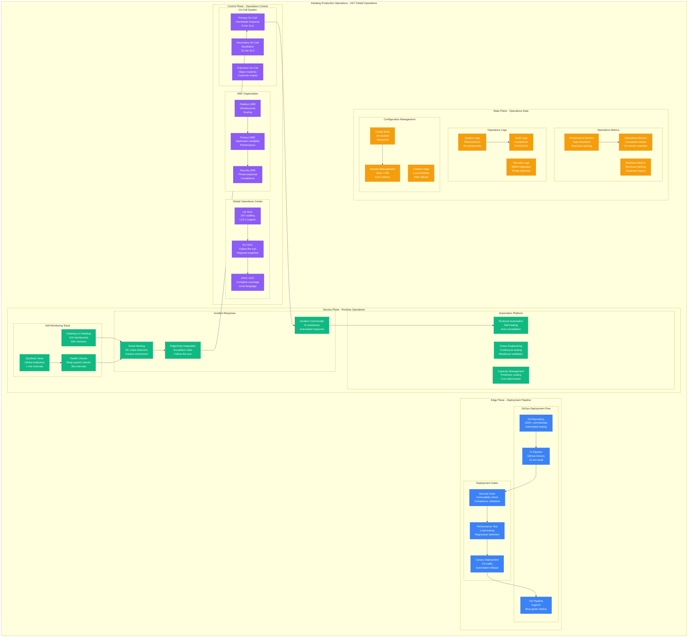

# Datadog Production Operations: Monitoring the Monitors

## Executive Summary
Datadog operates 24/7 global production infrastructure with 1000+ deployments daily, 99.98% uptime, follow-the-sun SRE coverage, and complete self-monitoring using "Datadog on Datadog" with automated incident response and GitOps deployment pipelines.

## Complete Production Operations Architecture



## GitOps Deployment Pipeline

### Continuous Deployment at Scale
```python
class DatadogDeploymentPipeline:
    """Production-grade GitOps deployment system"""

    def __init__(self):
        self.deployment_config = {
            "daily_deployments": 1000,
            "pipeline_stages": 8,
            "average_pipeline_time": "15 minutes",
            "success_rate": "99.7%",
            "rollback_time": "< 2 minutes",
            "canary_duration": "30 minutes"
        }

    def execute_deployment(self, deployment_request):
        """Execute production deployment with safety checks"""
        # Pre-deployment validation
        validation_result = self.validate_deployment(deployment_request)
        if not validation_result["passed"]:
            return self.abort_deployment(validation_result["errors"])

        # Security scanning
        security_scan = self.security_scan(deployment_request)
        if security_scan["vulnerabilities"]:
            return self.handle_security_issues(security_scan)

        # Performance regression testing
        perf_test = self.performance_regression_test(deployment_request)
        if perf_test["performance_degradation"] > 5:  # 5% threshold
            return self.abort_deployment("Performance regression detected")

        # Canary deployment
        canary_result = self.canary_deployment(deployment_request)
        if not canary_result["success"]:
            return self.automatic_rollback(canary_result["errors"])

        # Full deployment
        deployment_result = self.full_deployment(deployment_request)

        # Post-deployment monitoring
        self.monitor_deployment_health(deployment_result)

        return {
            "status": "success",
            "deployment_id": deployment_result["deployment_id"],
            "timeline": self.get_deployment_timeline(deployment_result),
            "metrics": self.collect_deployment_metrics(deployment_result)
        }

    def canary_deployment(self, deployment_request):
        """Safe canary deployment with automatic rollback"""
        # Deploy to 1% of traffic
        canary_deployment = self.deploy_to_canary(deployment_request, traffic_percentage=1)

        # Monitor key metrics during canary
        monitoring_window = 30  # minutes
        metrics_to_watch = [
            "error_rate",
            "response_time",
            "throughput",
            "cpu_usage",
            "memory_usage"
        ]

        for minute in range(monitoring_window):
            time.sleep(60)  # Wait 1 minute

            current_metrics = self.collect_canary_metrics(canary_deployment)

            # Compare with baseline
            baseline_metrics = self.get_baseline_metrics(deployment_request["service"])

            for metric in metrics_to_watch:
                current_value = current_metrics[metric]
                baseline_value = baseline_metrics[metric]

                # Check for degradation
                if self.is_metric_degraded(metric, current_value, baseline_value):
                    return self.rollback_canary(canary_deployment, f"{metric} degradation")

        return {"success": True, "canary_deployment": canary_deployment}

    def automatic_rollback(self, error_reason):
        """Automatic rollback with impact minimization"""
        rollback_start = time.time()

        # Immediate traffic routing
        self.route_traffic_to_stable_version()

        # Database rollback if needed
        if self.requires_database_rollback(error_reason):
            self.rollback_database_changes()

        # Configuration rollback
        self.rollback_configuration_changes()

        # Verification
        self.verify_rollback_success()

        rollback_duration = time.time() - rollback_start

        return {
            "status": "rolled_back",
            "reason": error_reason,
            "rollback_duration": f"{rollback_duration:.2f} seconds",
            "customer_impact": self.assess_customer_impact(),
            "next_steps": self.generate_rollback_next_steps()
        }

    def deployment_safety_checks(self):
        """Comprehensive deployment safety validation"""
        safety_checks = {
            "infrastructure_health": self.check_infrastructure_health(),
            "dependency_status": self.check_dependency_status(),
            "ongoing_incidents": self.check_ongoing_incidents(),
            "maintenance_windows": self.check_maintenance_windows(),
            "capacity_headroom": self.check_capacity_headroom(),
            "blast_radius": self.assess_blast_radius()
        }

        # All checks must pass
        all_passed = all(check["status"] == "pass" for check in safety_checks.values())

        return {
            "safe_to_deploy": all_passed,
            "safety_checks": safety_checks,
            "recommendations": self.generate_safety_recommendations(safety_checks)
        }
```

### Feature Flag Management
```python
class DatadogFeatureFlags:
    """Advanced feature flag system for safe rollouts"""

    def __init__(self):
        self.flag_configuration = {
            "total_flags": 5000,
            "active_flags": 1200,
            "flag_evaluation_latency": "< 1ms",
            "rollout_strategies": ["percentage", "user_based", "geographic", "canary"]
        }

    def manage_feature_rollout(self, feature_name, rollout_strategy):
        """Manage gradual feature rollout with safety controls"""
        feature_config = {
            "feature_name": feature_name,
            "rollout_strategy": rollout_strategy,
            "current_percentage": 0,
            "target_percentage": 100,
            "rollout_rate": "10% every 30 minutes",
            "safety_thresholds": {
                "error_rate_increase": 2,    # 2% max increase
                "latency_increase": 10,      # 10% max increase
                "user_complaints": 5         # 5 complaints trigger pause
            }
        }

        # Start gradual rollout
        for stage in self.generate_rollout_stages(feature_config):
            # Update feature flag percentage
            self.update_flag_percentage(feature_name, stage["percentage"])

            # Monitor impact
            impact_metrics = self.monitor_feature_impact(feature_name, stage["duration"])

            # Safety check
            if self.feature_impact_unsafe(impact_metrics, feature_config["safety_thresholds"]):
                return self.pause_rollout(feature_name, impact_metrics)

            # Log progress
            self.log_rollout_progress(feature_name, stage, impact_metrics)

        return {
            "status": "rollout_complete",
            "feature": feature_name,
            "final_percentage": 100,
            "total_duration": self.calculate_total_rollout_time(feature_config),
            "impact_summary": self.summarize_rollout_impact(feature_name)
        }

    def emergency_feature_kill_switch(self, feature_name, reason):
        """Emergency kill switch for problematic features"""
        kill_switch_start = time.time()

        # Immediately disable feature
        self.set_flag_percentage(feature_name, 0)

        # Verify flag propagation
        propagation_verified = self.verify_flag_propagation(feature_name, target_percentage=0)

        # Assess impact
        impact_assessment = self.assess_kill_switch_impact(feature_name)

        # Generate incident report
        incident_report = self.generate_kill_switch_incident(feature_name, reason, impact_assessment)

        kill_switch_duration = time.time() - kill_switch_start

        return {
            "status": "feature_disabled",
            "feature": feature_name,
            "reason": reason,
            "kill_switch_duration": f"{kill_switch_duration:.2f} seconds",
            "propagation_verified": propagation_verified,
            "impact_assessment": impact_assessment,
            "incident_report": incident_report
        }
```

## 24/7 Global Operations

### Follow-the-Sun Operations Model
```python
class GlobalOperationsCenter:
    """24/7 follow-the-sun operations model"""

    def __init__(self):
        self.operations_centers = {
            "us_east": {
                "location": "New York",
                "timezone": "EST",
                "coverage_hours": "06:00-18:00 UTC",
                "staffing": {
                    "sre_engineers": 25,
                    "noc_operators": 15,
                    "incident_commanders": 8
                },
                "specializations": ["North America customers", "Financial services"]
            },
            "europe": {
                "location": "Dublin",
                "timezone": "GMT",
                "coverage_hours": "14:00-02:00 UTC",
                "staffing": {
                    "sre_engineers": 20,
                    "noc_operators": 12,
                    "incident_commanders": 6
                },
                "specializations": ["EMEA customers", "GDPR compliance"]
            },
            "asia_pacific": {
                "location": "Tokyo",
                "timezone": "JST",
                "coverage_hours": "22:00-10:00 UTC",
                "staffing": {
                    "sre_engineers": 15,
                    "noc_operators": 10,
                    "incident_commanders": 4
                },
                "specializations": ["APAC customers", "High-frequency trading"]
            }
        }

    def handoff_protocol(self, outgoing_noc, incoming_noc):
        """Structured handoff between operations centers"""
        handoff_report = {
            "timestamp": datetime.utcnow(),
            "outgoing_noc": outgoing_noc,
            "incoming_noc": incoming_noc,
            "ongoing_incidents": self.get_ongoing_incidents(),
            "system_health": self.get_system_health_summary(),
            "maintenance_activities": self.get_scheduled_maintenance(),
            "customer_escalations": self.get_active_escalations(),
            "watch_items": self.get_watch_items()
        }

        # Verbal handoff call
        handoff_call = self.schedule_handoff_call(outgoing_noc, incoming_noc)

        # Documentation update
        self.update_handoff_documentation(handoff_report)

        # Acknowledgment
        handoff_acknowledged = self.confirm_handoff_acknowledgment(incoming_noc)

        return {
            "handoff_completed": handoff_acknowledged,
            "handoff_report": handoff_report,
            "handoff_call_recording": handoff_call["recording_url"],
            "next_handoff": self.calculate_next_handoff_time(incoming_noc)
        }

    def escalation_matrix(self, incident_severity):
        """Dynamic escalation based on incident severity and time"""
        escalation_rules = {
            "p1_critical": {
                "immediate": ["primary_oncall", "noc_lead"],
                "5_minutes": ["sre_manager", "product_manager"],
                "15_minutes": ["director_engineering", "vp_engineering"],
                "30_minutes": ["cto", "ceo"],
                "customer_communication": "immediate"
            },
            "p2_high": {
                "immediate": ["primary_oncall"],
                "10_minutes": ["secondary_oncall", "noc_lead"],
                "30_minutes": ["sre_manager"],
                "60_minutes": ["director_engineering"],
                "customer_communication": "15_minutes"
            },
            "p3_medium": {
                "immediate": ["primary_oncall"],
                "30_minutes": ["secondary_oncall"],
                "120_minutes": ["sre_manager"],
                "customer_communication": "60_minutes"
            }
        }

        return escalation_rules[incident_severity]

    def calculate_global_coverage_metrics(self):
        """Calculate operations coverage effectiveness"""
        return {
            "coverage_overlap": "2 hours between shifts",
            "response_time_sla": "< 5 minutes P1, < 15 minutes P2",
            "actual_response_times": {
                "p1_incidents": "2.3 minutes average",
                "p2_incidents": "8.7 minutes average",
                "p3_incidents": "23.1 minutes average"
            },
            "language_coverage": ["English", "Spanish", "French", "German", "Japanese", "Mandarin"],
            "local_expertise": "Financial regulations, data residency, cultural awareness"
        }
```

### Datadog on Datadog - Self-Monitoring
```python
class DatadogSelfMonitoring:
    """Comprehensive self-monitoring using Datadog to monitor Datadog"""

    def __init__(self):
        self.monitoring_configuration = {
            "dashboards": 10000,
            "monitors": 50000,
            "synthetic_tests": 5000,
            "log_pipelines": 200,
            "metrics_tracked": 1000000,
            "alert_correlation_rules": 500
        }

    def monitor_infrastructure_health(self):
        """Monitor all infrastructure components"""
        infrastructure_monitors = {
            "cassandra_cluster": {
                "monitors": [
                    "cassandra.cluster.health",
                    "cassandra.node.cpu",
                    "cassandra.node.memory",
                    "cassandra.node.disk",
                    "cassandra.read_latency",
                    "cassandra.write_latency",
                    "cassandra.compaction_pending"
                ],
                "thresholds": {
                    "critical": "3 nodes down in any DC",
                    "warning": "1 node down for > 5 minutes"
                }
            },
            "elasticsearch_cluster": {
                "monitors": [
                    "elasticsearch.cluster.status",
                    "elasticsearch.node.jvm.heap",
                    "elasticsearch.index.search.query_time",
                    "elasticsearch.index.indexing.index_time",
                    "elasticsearch.cluster.unassigned_shards"
                ],
                "thresholds": {
                    "critical": "Cluster status red",
                    "warning": "Cluster status yellow for > 10 minutes"
                }
            },
            "kafka_cluster": {
                "monitors": [
                    "kafka.broker.count",
                    "kafka.consumer.lag",
                    "kafka.producer.throughput",
                    "kafka.broker.disk.usage",
                    "kafka.replication.lag"
                ],
                "thresholds": {
                    "critical": "Consumer lag > 1M messages",
                    "warning": "Consumer lag > 100K messages"
                }
            }
        }

        return self.generate_infrastructure_health_dashboard(infrastructure_monitors)

    def monitor_application_performance(self):
        """Monitor application-level performance metrics"""
        application_monitors = {
            "intake_api": {
                "metrics": [
                    "intake.api.request_rate",
                    "intake.api.error_rate",
                    "intake.api.latency.p99",
                    "intake.api.throughput",
                    "intake.api.queue_depth"
                ],
                "slos": {
                    "availability": "99.98%",
                    "latency_p99": "< 100ms",
                    "error_rate": "< 0.1%"
                }
            },
            "query_api": {
                "metrics": [
                    "query.api.request_rate",
                    "query.api.error_rate",
                    "query.api.latency.p95",
                    "query.api.cache_hit_rate",
                    "query.api.concurrent_queries"
                ],
                "slos": {
                    "availability": "99.95%",
                    "latency_p95": "< 500ms",
                    "error_rate": "< 0.5%"
                }
            }
        }

        return self.generate_application_performance_dashboard(application_monitors)

    def monitor_business_metrics(self):
        """Monitor business-critical metrics and customer impact"""
        business_monitors = {
            "customer_impact": {
                "metrics": [
                    "customers.affected.count",
                    "revenue.at_risk",
                    "data_ingestion.success_rate",
                    "query.success_rate",
                    "alert.delivery.success_rate"
                ],
                "thresholds": {
                    "critical": "> 1000 customers affected",
                    "warning": "> 100 customers affected"
                }
            },
            "operational_efficiency": {
                "metrics": [
                    "deployment.success_rate",
                    "incident.mttr",
                    "incident.frequency",
                    "on_call.load_balance",
                    "automation.coverage"
                ],
                "targets": {
                    "deployment_success": "> 99.5%",
                    "mttr": "< 30 minutes",
                    "incident_frequency": "< 5 per week"
                }
            }
        }

        return self.generate_business_metrics_dashboard(business_monitors)

    def intelligent_alerting(self, alert_data):
        """AI-powered alert correlation and noise reduction"""
        # Group related alerts
        alert_groups = self.group_related_alerts(alert_data)

        # Suppress duplicate alerts
        deduplicated_alerts = self.deduplicate_alerts(alert_groups)

        # Prioritize by business impact
        prioritized_alerts = self.prioritize_by_impact(deduplicated_alerts)

        # Enrich with context
        enriched_alerts = self.enrich_alert_context(prioritized_alerts)

        return {
            "original_alert_count": len(alert_data),
            "grouped_alerts": len(alert_groups),
            "final_alert_count": len(enriched_alerts),
            "noise_reduction_percentage": (1 - len(enriched_alerts) / len(alert_data)) * 100,
            "enriched_alerts": enriched_alerts
        }
```

## Chaos Engineering and Resilience Testing

### Production Resilience Validation
```python
class DatadogChaosEngineering:
    """Continuous chaos engineering for production resilience"""

    def __init__(self):
        self.chaos_experiments = {
            "infrastructure": {
                "ec2_instance_termination": {"frequency": "daily", "blast_radius": "single_az"},
                "network_partition": {"frequency": "weekly", "blast_radius": "datacenter"},
                "disk_failure_simulation": {"frequency": "weekly", "blast_radius": "single_node"}
            },
            "application": {
                "service_latency_injection": {"frequency": "daily", "blast_radius": "single_service"},
                "memory_pressure": {"frequency": "weekly", "blast_radius": "service_cluster"},
                "cpu_exhaustion": {"frequency": "weekly", "blast_radius": "single_instance"}
            },
            "data": {
                "cassandra_node_failure": {"frequency": "daily", "blast_radius": "single_node"},
                "elasticsearch_shard_failure": {"frequency": "weekly", "blast_radius": "single_shard"},
                "kafka_broker_failure": {"frequency": "daily", "blast_radius": "single_broker"}
            }
        }

    def execute_chaos_experiment(self, experiment_type, experiment_name):
        """Execute chaos experiment with comprehensive safety checks"""
        experiment = self.chaos_experiments[experiment_type][experiment_name]

        # Pre-experiment safety validation
        safety_check = self.validate_experiment_safety(experiment)
        if not safety_check["safe"]:
            return self.abort_experiment(safety_check["reasons"])

        # Set up monitoring and alerting
        experiment_monitor = self.setup_experiment_monitoring(experiment)

        # Execute experiment
        experiment_result = self.run_experiment(experiment)

        # Monitor system response
        system_response = self.monitor_system_response(experiment_result, experiment_monitor)

        # Automatic rollback if needed
        if system_response["customer_impact"] > experiment["max_impact_threshold"]:
            rollback_result = self.emergency_rollback(experiment_result)
            return self.generate_experiment_report(experiment, system_response, rollback_result)

        # Natural experiment completion
        completion_result = self.complete_experiment(experiment_result)

        return {
            "experiment": experiment,
            "execution_result": experiment_result,
            "system_response": system_response,
            "completion_result": completion_result,
            "lessons_learned": self.extract_lessons_learned(system_response),
            "resilience_score": self.calculate_resilience_score(system_response)
        }

    def validate_experiment_safety(self, experiment):
        """Comprehensive safety validation before chaos experiments"""
        safety_checks = {
            "ongoing_incidents": self.check_ongoing_incidents(),
            "system_health": self.check_overall_system_health(),
            "deployment_activity": self.check_recent_deployments(),
            "customer_commitments": self.check_customer_commitments(),
            "team_availability": self.check_team_availability(),
            "blast_radius": self.validate_blast_radius(experiment)
        }

        all_safe = all(check["status"] == "safe" for check in safety_checks.values())

        return {
            "safe": all_safe,
            "safety_checks": safety_checks,
            "recommendations": self.generate_safety_recommendations(safety_checks)
        }

    def calculate_resilience_score(self, system_response):
        """Calculate overall system resilience score"""
        resilience_factors = {
            "detection_speed": system_response["time_to_detection"],
            "auto_recovery": system_response["auto_recovery_success"],
            "blast_radius_containment": system_response["blast_radius_actual"] / system_response["blast_radius_expected"],
            "customer_impact": system_response["customer_impact_percentage"],
            "recovery_time": system_response["time_to_full_recovery"]
        }

        # Weighted scoring
        weights = {
            "detection_speed": 0.2,
            "auto_recovery": 0.3,
            "blast_radius_containment": 0.2,
            "customer_impact": 0.2,
            "recovery_time": 0.1
        }

        resilience_score = sum(
            self.normalize_factor(factor, value) * weights[factor]
            for factor, value in resilience_factors.items()
        )

        return {
            "overall_score": resilience_score,
            "grade": self.calculate_resilience_grade(resilience_score),
            "factors": resilience_factors,
            "improvement_areas": self.identify_improvement_areas(resilience_factors)
        }
```

## Performance and Capacity Management

### Predictive Capacity Planning
```python
class DatadogCapacityManagement:
    """AI-driven capacity planning and optimization"""

    def __init__(self):
        self.capacity_models = {
            "ingestion_capacity": {
                "current_utilization": "78%",
                "growth_rate": "35% YoY",
                "predicted_saturation": "18 months",
                "scaling_lead_time": "6 weeks"
            },
            "storage_capacity": {
                "current_utilization": "65%",
                "growth_rate": "45% YoY",
                "predicted_saturation": "14 months",
                "scaling_lead_time": "4 weeks"
            },
            "query_capacity": {
                "current_utilization": "82%",
                "growth_rate": "30% YoY",
                "predicted_saturation": "20 months",
                "scaling_lead_time": "8 weeks"
            }
        }

    def predict_capacity_needs(self, service_type, forecast_horizon="12 months"):
        """Predict future capacity needs using ML models"""
        historical_data = self.get_historical_usage_data(service_type)

        # Seasonal decomposition
        seasonal_patterns = self.analyze_seasonal_patterns(historical_data)

        # Growth trend analysis
        growth_trends = self.analyze_growth_trends(historical_data)

        # External factor correlation
        external_factors = self.analyze_external_factors(historical_data)

        # ML prediction model
        capacity_forecast = self.generate_capacity_forecast(
            historical_data, seasonal_patterns, growth_trends, external_factors, forecast_horizon
        )

        return {
            "service_type": service_type,
            "forecast_horizon": forecast_horizon,
            "current_capacity": self.get_current_capacity(service_type),
            "predicted_usage": capacity_forecast,
            "scaling_recommendations": self.generate_scaling_recommendations(capacity_forecast),
            "cost_implications": self.calculate_scaling_costs(capacity_forecast),
            "risk_assessment": self.assess_capacity_risks(capacity_forecast)
        }

    def automated_scaling_decisions(self, resource_type):
        """Make automated scaling decisions with safety checks"""
        current_metrics = self.get_current_resource_metrics(resource_type)

        scaling_decision = {
            "resource_type": resource_type,
            "current_utilization": current_metrics["utilization"],
            "recommendation": "no_action",
            "confidence": 0.0,
            "reasoning": []
        }

        # Scale up conditions
        if current_metrics["utilization"] > 85:
            if current_metrics["trend"] == "increasing":
                scaling_decision.update({
                    "recommendation": "scale_up",
                    "confidence": 0.9,
                    "reasoning": ["High utilization", "Increasing trend"]
                })

        # Scale down conditions
        elif current_metrics["utilization"] < 40:
            if current_metrics["trend"] == "stable" and current_metrics["duration_low"] > "2 hours":
                scaling_decision.update({
                    "recommendation": "scale_down",
                    "confidence": 0.7,
                    "reasoning": ["Low utilization", "Stable for extended period"]
                })

        # Safety checks
        safety_validation = self.validate_scaling_safety(scaling_decision)

        if not safety_validation["safe"]:
            scaling_decision["recommendation"] = "no_action"
            scaling_decision["reasoning"].append(f"Safety check failed: {safety_validation['reason']}")

        return scaling_decision

    def cost_optimization_recommendations(self):
        """Generate cost optimization recommendations"""
        optimization_opportunities = {
            "reserved_instances": {
                "potential_savings": "$8M/month",
                "implementation_effort": "Low",
                "risk": "Low",
                "timeline": "1 month"
            },
            "spot_instances": {
                "potential_savings": "$3M/month",
                "implementation_effort": "Medium",
                "risk": "Medium",
                "timeline": "3 months"
            },
            "right_sizing": {
                "potential_savings": "$5M/month",
                "implementation_effort": "Medium",
                "risk": "Low",
                "timeline": "2 months"
            },
            "storage_tiering": {
                "potential_savings": "$4M/month",
                "implementation_effort": "High",
                "risk": "Low",
                "timeline": "6 months"
            }
        }

        return {
            "total_optimization_potential": "$20M/month",
            "quick_wins": ["reserved_instances", "right_sizing"],
            "strategic_projects": ["storage_tiering"],
            "detailed_opportunities": optimization_opportunities,
            "implementation_roadmap": self.generate_optimization_roadmap(optimization_opportunities)
        }
```

## Production Operations Metrics

### Operational Excellence KPIs
```yaml
operational_excellence_metrics:
  reliability:
    uptime_sla: "99.98%"
    actual_uptime: "99.987%"
    mtbf: "2160 hours"  # 90 days
    mttr: "18 minutes"
    availability_credit_payouts: "< 0.01% of revenue"

  deployment_metrics:
    deployment_frequency: "1000+ per day"
    deployment_success_rate: "99.7%"
    deployment_lead_time: "15 minutes"
    rollback_frequency: "0.3%"
    rollback_time: "< 2 minutes"

  incident_management:
    p1_incidents_per_month: "< 5"
    p2_incidents_per_month: "< 20"
    incident_detection_time: "< 3 minutes"
    incident_response_time: "< 5 minutes"
    incident_resolution_time: "< 30 minutes"

  team_performance:
    on_call_load: "< 20 hours per week"
    burnout_indicators: "Green across all teams"
    knowledge_sharing_sessions: "Weekly per team"
    cross_training_coverage: "> 80% per service"

  customer_impact:
    customer_reported_issues: "< 50 per month"
    proactive_vs_reactive_detection: "95% proactive"
    customer_satisfaction_score: "4.8/5.0"
    support_ticket_deflection: "85%"

  cost_efficiency:
    infrastructure_cost_per_customer: "$6000/month"
    cost_optimization_savings: "$20M/month identified"
    resource_utilization: "78% average"
    waste_elimination: "$5M/month achieved"
```

### Future Operations Evolution
```python
future_operations_roadmap = {
    "2025_autonomous_ops": {
        "goal": "90% autonomous incident resolution",
        "capabilities": [
            "AI-powered root cause analysis",
            "Automated remediation execution",
            "Self-healing infrastructure",
            "Predictive failure prevention"
        ],
        "investment": "$50M",
        "expected_roi": "300%"
    },
    "2026_zero_touch": {
        "goal": "Zero-touch operations for 95% of scenarios",
        "capabilities": [
            "Fully autonomous deployments",
            "Self-optimizing infrastructure",
            "Autonomous capacity planning",
            "AI-driven cost optimization"
        ],
        "investment": "$75M",
        "expected_roi": "400%"
    },
    "2027_predictive_everything": {
        "goal": "Predict and prevent all operational issues",
        "capabilities": [
            "Quantum-scale data analysis",
            "Global operations coordination",
            "Autonomous SLA management",
            "Self-evolving architectures"
        ],
        "investment": "$100M",
        "expected_roi": "500%"
    }
}
```

*"We don't just monitor our infrastructure - we've built a self-aware, self-healing, continuously optimizing system that runs itself. Our operations team doesn't fight fires; they prevent them from ever starting."* - Datadog VP of Engineering