# Datadog Request Flow: The Golden Path

## Executive Summary
Datadog processes 18 trillion data points daily through a highly optimized ingestion pipeline that handles 1 billion metrics/second, 15TB/hour of logs, and 10 million traces/second with p99 latency under 100ms.

## Complete Request Flow Architecture

```mermaid
graph TB
    subgraph "Datadog Request Flow - Production Scale"
        subgraph EdgePlane[Edge Plane - Global Intake]
            CLIENT[Client Applications<br/>3M+ servers<br/>150M+ containers]
            AGENT[Datadog Agent<br/>6.x series<br/>Go + Python]
            INTAKE[Intake API<br/>intake.logs.datadoghq.com<br/>1000 endpoints]
            LB[Global Load Balancer<br/>HAProxy + NGINX<br/>30 PoPs worldwide]
        end

        subgraph ServicePlane[Service Plane - Stream Processing]
            subgraph MetricsFlow[Metrics Request Flow]
                MVALIDATE[Metrics Validator<br/>Schema validation<br/>Rate limiting]
                MENRICH[Metrics Enricher<br/>Tags + metadata<br/>Host mapping]
                MAGG[Aggregator<br/>10s rollups<br/>1B/sec capacity]
            end

            subgraph LogsFlow[Logs Request Flow]
                LVALIDATE[Logs Validator<br/>JSON parsing<br/>Size limits 1MB]
                LPARSE[Log Parser<br/>Grok patterns<br/>2K servers]
                LINDEX[Log Indexer<br/>Elasticsearch<br/>Real-time]
            end

            subgraph TracesFlow[Traces Request Flow]
                TVALIDATE[Trace Validator<br/>Span validation<br/>Parent-child]
                TSAMPLE[Smart Sampler<br/>Head + tail based<br/>0.1% baseline]
                TANALYZE[Trace Analyzer<br/>Service maps<br/>Dependencies]
            end

            subgraph QueryFlow[Query Request Flow]
                QAPI[Query API<br/>GraphQL + REST<br/>Rate limited]
                QROUTER[Query Router<br/>Shard selection<br/>Cross-region]
                QEXEC[Query Executor<br/>Parallel execution<br/>Result merging]
            end
        end

        subgraph StatePlane[State Plane - Data Storage]
            subgraph MetricsStorage[Metrics Storage Path]
                KAFKA[Kafka Clusters<br/>10K brokers<br/>7 day retention]
                CASSANDRA[Cassandra Ring<br/>50K nodes<br/>Consistent hash]
                REDIS[Redis Cache<br/>5K nodes<br/>Hot data]
            end

            subgraph LogsStorage[Logs Storage Path]
                ES[Elasticsearch<br/>20K nodes<br/>15 days hot]
                S3HOT[S3 Hot Tier<br/>Intelligent tiering<br/>1PB capacity]
                S3COLD[S3 Cold Tier<br/>Glacier<br/>50PB archive]
            end

            subgraph TracesStorage[Traces Storage Path]
                TRACEDB[Custom TraceDB<br/>10K nodes<br/>Compressed spans]
                SPANINDEX[Span Index<br/>Search by tags<br/>Service + operation]
            end
        end

        subgraph ControlPlane[Control Plane - Request Control]
            RATELIMIT[Rate Limiter<br/>Per org limits<br/>Token bucket]
            AUTH[Authentication<br/>API keys + RBAC<br/>Multi-tenant]
            MONITOR[Request Monitor<br/>SLO tracking<br/>Alert on breach]
            QUOTA[Quota Manager<br/>Usage tracking<br/>Billing integration]
        end
    end

    %% Request Flow Connections
    CLIENT --> AGENT
    AGENT -->|Metrics| INTAKE
    AGENT -->|Logs| INTAKE
    AGENT -->|Traces| INTAKE

    INTAKE --> LB
    LB --> AUTH
    AUTH --> RATELIMIT

    %% Metrics Flow
    RATELIMIT -->|Metrics| MVALIDATE
    MVALIDATE --> MENRICH
    MENRICH --> MAGG
    MAGG --> KAFKA
    KAFKA --> CASSANDRA
    KAFKA --> REDIS

    %% Logs Flow
    RATELIMIT -->|Logs| LVALIDATE
    LVALIDATE --> LPARSE
    LPARSE --> LINDEX
    LINDEX --> ES
    ES --> S3HOT
    S3HOT --> S3COLD

    %% Traces Flow
    RATELIMIT -->|Traces| TVALIDATE
    TVALIDATE --> TSAMPLE
    TSAMPLE --> TANALYZE
    TANALYZE --> TRACEDB
    TRACEDB --> SPANINDEX

    %% Query Flow
    CLIENT -->|Queries| QAPI
    QAPI --> AUTH
    AUTH --> QROUTER
    QROUTER --> QEXEC
    QEXEC --> CASSANDRA
    QEXEC --> ES
    QEXEC --> TRACEDB

    %% Monitoring
    MVALIDATE --> MONITOR
    LVALIDATE --> MONITOR
    TVALIDATE --> MONITOR
    QAPI --> QUOTA

    %% Apply four-plane colors
    classDef edgeStyle fill:#3B82F6,stroke:#2563EB,color:#fff
    classDef serviceStyle fill:#10B981,stroke:#059669,color:#fff
    classDef stateStyle fill:#F59E0B,stroke:#D97706,color:#fff
    classDef controlStyle fill:#8B5CF6,stroke:#7C3AED,color:#fff

    class CLIENT,AGENT,INTAKE,LB edgeStyle
    class MVALIDATE,MENRICH,MAGG,LVALIDATE,LPARSE,LINDEX,TVALIDATE,TSAMPLE,TANALYZE,QAPI,QROUTER,QEXEC serviceStyle
    class KAFKA,CASSANDRA,REDIS,ES,S3HOT,S3COLD,TRACEDB,SPANINDEX stateStyle
    class RATELIMIT,AUTH,MONITOR,QUOTA controlStyle
```



## Request Flow Performance Metrics

### Ingestion Latency Breakdown
```yaml
ingestion_latency:
  metrics_pipeline:
    agent_to_intake: "5ms p50, 20ms p99"
    validation: "1ms p50, 5ms p99"
    enrichment: "2ms p50, 10ms p99"
    aggregation: "5ms p50, 25ms p99"
    kafka_write: "3ms p50, 15ms p99"
    total_e2e: "16ms p50, 75ms p99"
    slo: "< 100ms p99"

  logs_pipeline:
    agent_to_intake: "10ms p50, 50ms p99"
    validation: "2ms p50, 10ms p99"
    parsing: "5ms p50, 30ms p99"
    indexing: "15ms p50, 100ms p99"
    total_e2e: "32ms p50, 190ms p99"
    slo: "< 500ms p99"

  traces_pipeline:
    agent_to_intake: "8ms p50, 40ms p99"
    validation: "1ms p50, 5ms p99"
    sampling: "3ms p50, 15ms p99"
    analysis: "10ms p50, 50ms p99"
    storage_write: "5ms p50, 25ms p99"
    total_e2e: "27ms p50, 135ms p99"
    slo: "< 200ms p99"
```

### Query Latency Breakdown
```yaml
query_latency:
  metrics_queries:
    simple_timeseries: "50ms p50, 200ms p99"
    complex_aggregation: "200ms p50, 1s p99"
    cross_shard: "500ms p50, 2s p99"
    dashboard_load: "300ms p50, 1.5s p99"
    slo: "< 5s p99"

  logs_queries:
    simple_search: "100ms p50, 500ms p99"
    complex_regex: "500ms p50, 2s p99"
    aggregation: "1s p50, 5s p99"
    live_tail: "50ms p50, 200ms p99"
    slo: "< 10s p99"

  trace_queries:
    service_map: "200ms p50, 1s p99"
    trace_search: "300ms p50, 1.5s p99"
    dependency_graph: "500ms p50, 2s p99"
    flamegraph: "1s p50, 3s p99"
    slo: "< 5s p99"
```

## Request Routing and Load Balancing

### Geographic Request Routing
```python
class DatadogRequestRouter:
    """Global request routing with latency optimization"""

    def __init__(self):
        self.regions = {
            "us1": {
                "endpoint": "https://api.datadoghq.com",
                "capacity": "60% of global traffic",
                "latency_target": "< 10ms US customers",
                "failover": ["us2", "us3"]
            },
            "eu1": {
                "endpoint": "https://api.datadoghq.eu",
                "capacity": "25% of global traffic",
                "latency_target": "< 15ms EU customers",
                "failover": ["us1", "us2"]
            },
            "ap1": {
                "endpoint": "https://api.ap1.datadoghq.com",
                "capacity": "15% of global traffic",
                "latency_target": "< 20ms APAC customers",
                "failover": ["us1", "eu1"]
            }
        }

    def route_request(self, client_ip, request_type):
        """Route request to optimal region"""
        region = self.get_closest_region(client_ip)

        # Check region health
        if not self.is_region_healthy(region):
            region = self.get_failover_region(region)

        # Check capacity
        if self.is_region_overloaded(region):
            region = self.get_least_loaded_region()

        return self.get_region_endpoint(region, request_type)

    def get_intake_endpoint(self, region, data_type):
        """Get specialized intake endpoint"""
        endpoints = {
            "metrics": f"https://api.{region}.datadoghq.com/api/v1/series",
            "logs": f"https://http-intake.logs.{region}.datadoghq.com/v1/input",
            "traces": f"https://trace.agent.{region}.datadoghq.com/v0.4/traces"
        }
        return endpoints[data_type]
```

### Rate Limiting Strategy
```python
class DatadogRateLimiter:
    """Multi-tier rate limiting system"""

    def __init__(self):
        self.limits = {
            "global": {
                "metrics": "1B/second",
                "logs": "15TB/hour",
                "traces": "10M/second",
                "queries": "1M/second"
            },
            "per_org": {
                "free": {
                    "metrics": "100/second",
                    "logs": "1GB/day",
                    "traces": "1K/second"
                },
                "pro": {
                    "metrics": "10K/second",
                    "logs": "50GB/day",
                    "traces": "100K/second"
                },
                "enterprise": {
                    "metrics": "unlimited*",
                    "logs": "unlimited*",
                    "traces": "unlimited*",
                    "note": "Subject to fair use"
                }
            }
        }

    def check_rate_limit(self, org_id, data_type, current_rate):
        """Check if request should be rate limited"""
        org_tier = self.get_org_tier(org_id)
        limit = self.limits["per_org"][org_tier][data_type]

        if current_rate > limit:
            return {
                "allowed": False,
                "retry_after": self.calculate_retry_delay(current_rate, limit),
                "error": "Rate limit exceeded",
                "limit": limit,
                "current": current_rate
            }

        return {"allowed": True}

    def apply_backpressure(self, queue_depth):
        """Apply intelligent backpressure"""
        if queue_depth > 1000:
            return {
                "delay": "100ms",
                "priority": "drop_debug_logs"
            }
        elif queue_depth > 500:
            return {
                "delay": "50ms",
                "priority": "sample_traces_50%"
            }
        return {"delay": "0ms"}
```

## Multi-Tenant Request Isolation

### Tenant Context and Routing
```python
class TenantRequestHandler:
    """Handle multi-tenant request routing and isolation"""

    def __init__(self):
        self.tenant_shards = {}  # org_id -> shard mapping
        self.resource_quotas = {}  # org_id -> quotas

    def process_request(self, request):
        """Process request with tenant isolation"""
        # Extract tenant context
        org_id = self.extract_org_id(request)
        tenant_context = {
            "org_id": org_id,
            "shard": self.get_tenant_shard(org_id),
            "quotas": self.get_tenant_quotas(org_id),
            "isolation_level": self.get_isolation_level(org_id)
        }

        # Validate quotas
        if not self.check_quotas(tenant_context, request):
            return self.quota_exceeded_response(tenant_context)

        # Route to tenant-specific pipeline
        pipeline = self.get_tenant_pipeline(tenant_context)

        # Add tenant filters
        request = self.add_tenant_filters(request, tenant_context)

        return pipeline.process(request)

    def get_tenant_shard(self, org_id):
        """Consistent hashing for tenant sharding"""
        if org_id not in self.tenant_shards:
            # Consistent hash to distribute orgs across shards
            shard_id = consistent_hash(org_id) % NUM_SHARDS
            self.tenant_shards[org_id] = {
                "shard_id": shard_id,
                "cassandra_ring": f"shard_{shard_id}",
                "elasticsearch_cluster": f"es_cluster_{shard_id}",
                "kafka_topic": f"metrics_shard_{shard_id}"
            }
        return self.tenant_shards[org_id]

    def enforce_data_isolation(self, query, org_id):
        """Ensure queries only access tenant data"""
        # Add mandatory org filter
        tenant_filter = f"org_id = '{org_id}'"

        if "WHERE" in query:
            query = query.replace("WHERE", f"WHERE {tenant_filter} AND")
        else:
            query += f" WHERE {tenant_filter}"

        return query
```

## Request Validation and Enrichment

### Metrics Validation Pipeline
```python
class MetricsValidator:
    """Validate and enrich incoming metrics"""

    def __init__(self):
        self.validation_rules = {
            "metric_name": {
                "pattern": r"^[a-zA-Z][a-zA-Z0-9._-]*$",
                "max_length": 200,
                "required": True
            },
            "value": {
                "type": ["int", "float"],
                "required": True
            },
            "timestamp": {
                "range": "now-4hours to now+5minutes",
                "required": True
            },
            "tags": {
                "max_count": 1000,
                "max_key_length": 200,
                "max_value_length": 5000
            }
        }

    def validate_metric(self, metric_data):
        """Validate single metric data point"""
        errors = []

        # Check metric name
        if not re.match(self.validation_rules["metric_name"]["pattern"],
                       metric_data.get("metric", "")):
            errors.append("Invalid metric name format")

        # Check value type
        value = metric_data.get("points", [[]])[0][1]
        if not isinstance(value, (int, float)):
            errors.append("Invalid value type")

        # Check timestamp freshness
        timestamp = metric_data.get("points", [[]])[0][0]
        if not self.is_timestamp_fresh(timestamp):
            errors.append("Timestamp outside acceptable range")

        # Check tag limits
        tags = metric_data.get("tags", [])
        if len(tags) > self.validation_rules["tags"]["max_count"]:
            errors.append("Too many tags")

        return {
            "valid": len(errors) == 0,
            "errors": errors,
            "metric": metric_data
        }

    def enrich_metric(self, metric_data, agent_context):
        """Add enrichment data to metrics"""
        enriched = metric_data.copy()

        # Add host information
        enriched["host"] = agent_context.get("hostname")
        enriched["agent_version"] = agent_context.get("agent_version")

        # Add infrastructure tags
        if "aws" in agent_context:
            enriched["tags"].extend([
                f"availability-zone:{agent_context['aws']['az']}",
                f"instance-type:{agent_context['aws']['instance_type']}",
                f"region:{agent_context['aws']['region']}"
            ])

        # Add service discovery tags
        if "kubernetes" in agent_context:
            enriched["tags"].extend([
                f"kube_namespace:{agent_context['kubernetes']['namespace']}",
                f"kube_deployment:{agent_context['kubernetes']['deployment']}",
                f"pod_name:{agent_context['kubernetes']['pod_name']}"
            ])

        return enriched
```

### Logs Processing Pipeline
```python
class LogsProcessor:
    """Process and parse incoming logs"""

    def __init__(self):
        self.parsers = {
            "nginx": NginxLogParser(),
            "apache": ApacheLogParser(),
            "application": ApplicationLogParser(),
            "kubernetes": KubernetesLogParser(),
            "aws": AWSLogParser()
        }

    def process_log(self, log_data, source_type):
        """Process single log entry"""
        # Basic validation
        if len(log_data.get("message", "")) > 1024 * 1024:  # 1MB limit
            return {"error": "Log message too large"}

        # Parse based on source
        parser = self.parsers.get(source_type, self.parsers["application"])
        parsed = parser.parse(log_data)

        # Extract structured fields
        structured = self.extract_structured_fields(parsed)

        # Add processing metadata
        structured["@timestamp"] = datetime.utcnow().isoformat()
        structured["@datadog_processed"] = True

        return structured

    def extract_structured_fields(self, log_entry):
        """Extract structured fields from log message"""
        # Extract JSON if present
        if self.is_json_log(log_entry["message"]):
            try:
                json_data = json.loads(log_entry["message"])
                log_entry.update(json_data)
            except json.JSONDecodeError:
                pass

        # Extract common patterns
        patterns = {
            "level": r"(?i)(DEBUG|INFO|WARN|ERROR|FATAL)",
            "timestamp": r"\d{4}-\d{2}-\d{2}[T ]\d{2}:\d{2}:\d{2}",
            "ip_address": r"\b(?:[0-9]{1,3}\.){3}[0-9]{1,3}\b",
            "http_status": r"\b[1-5][0-9]{2}\b",
            "duration": r"\b\d+(?:\.\d+)?(?:ms|s|μs)\b"
        }

        for field, pattern in patterns.items():
            match = re.search(pattern, log_entry["message"])
            if match:
                log_entry[f"extracted_{field}"] = match.group()

        return log_entry
```

## Error Handling and Retry Logic

### Request Retry Strategy
```yaml
retry_configuration:
  ingestion_retries:
    max_attempts: 3
    backoff_strategy: "exponential"
    base_delay: "100ms"
    max_delay: "5s"
    retryable_errors:
      - "503 Service Unavailable"
      - "429 Too Many Requests"
      - "Connection timeout"
      - "DNS resolution failure"

  query_retries:
    max_attempts: 2
    backoff_strategy: "linear"
    base_delay: "200ms"
    max_delay: "2s"
    retryable_errors:
      - "503 Service Unavailable"
      - "Query timeout"
      - "Shard unavailable"

  circuit_breaker:
    failure_threshold: 50%
    recovery_timeout: "30s"
    half_open_requests: 10
```

### Request Health Monitoring
```python
request_health_metrics = {
    "ingestion_success_rate": "99.9%",
    "query_success_rate": "99.8%",
    "p99_ingestion_latency": "75ms",
    "p99_query_latency": "2s",
    "rate_limit_hits": "0.1%",
    "validation_failures": "0.01%",
    "authentication_failures": "0.001%"
}

# Real-time SLO tracking
slo_targets = {
    "ingestion_availability": "99.9%",
    "query_availability": "99.5%",
    "data_freshness": "< 30s",
    "alert_latency": "< 60s"
}
```

*"Every microsecond matters when you're processing a billion metrics per second. Our request flow is optimized for the 3 AM incident, not the perfect demo."* - Datadog Staff Engineer