# Discord Failure Domains - The Incident Map

## System Overview

This diagram shows Discord's failure domain boundaries and blast radius containment for their real-time communication infrastructure serving 200+ million users with 14+ billion messages daily and 4+ million concurrent voice connections.

```mermaid
graph TB
    subgraph EdgePlane["Edge Plane - Blue #0066CC"]
        style EdgePlane fill:#0066CC,stroke:#004499,color:#fff

        subgraph GlobalEdgeDomain["Global Edge Domain"]
            CloudFlare_US["Cloudflare US<br/>━━━━━<br/>100+ PoPs<br/>45% traffic<br/>WebSocket termination<br/>Blast radius: US users"]

            CloudFlare_EU["Cloudflare EU<br/>━━━━━<br/>50+ PoPs<br/>30% traffic<br/>GDPR compliance<br/>Blast radius: EU users"]

            CloudFlare_APAC["Cloudflare APAC<br/>━━━━━<br/>30+ PoPs<br/>20% traffic<br/>High latency region<br/>Blast radius: APAC users"]
        end

        subgraph VoiceEdgeDomain["Voice Edge Domain"]
            VoiceEdge_US["Voice Edge US<br/>━━━━━<br/>500+ RTC nodes<br/>WebRTC termination<br/>P2P coordination<br/>Blast radius: US voice calls"]

            VoiceEdge_EU["Voice Edge EU<br/>━━━━━<br/>200+ RTC nodes<br/>Regional routing<br/>Data residency<br/>Blast radius: EU voice calls"]

            VoiceEdge_Global["Voice Edge Global<br/>━━━━━<br/>300+ RTC nodes<br/>Backup routing<br/>Failover capability<br/>Blast radius: Global voice backup"]
        end
    end

    subgraph ServicePlane["Service Plane - Green #00AA00"]
        style ServicePlane fill:#00AA00,stroke:#007700,color:#fff

        subgraph GatewayDomain["Gateway Domain - Connection Boundary"]
            Gateway_Primary["Gateway Primary<br/>━━━━━<br/>100M+ connections<br/>us-east-1 cluster<br/>Elixir/Phoenix<br/>Blast radius: 50% users"]

            Gateway_Secondary["Gateway Secondary<br/>━━━━━<br/>75M+ connections<br/>us-west-2 cluster<br/>Failover ready<br/>Blast radius: 37.5% users"]

            Gateway_EU["Gateway EU<br/>━━━━━<br/>25M+ connections<br/>eu-west-1 cluster<br/>Regional isolation<br/>Blast radius: 12.5% users"]
        end

        subgraph MessageDomain["Message Processing Domain"]
            MessageRouter_Primary["Message Router 1<br/>━━━━━<br/>Rust implementation<br/>Shards 0-999<br/>7B+ messages/day<br/>Blast radius: Small guilds"]

            MessageRouter_Large["Message Router 2<br/>━━━━━<br/>Large guild handler<br/>Shards 1000-1999<br/>7B+ messages/day<br/>Blast radius: Large guilds"]

            MessageRouter_Backup["Message Router Backup<br/>━━━━━<br/>Emergency failover<br/>All shards capable<br/>Reduced capacity<br/>Blast radius: Degraded performance"]
        end

        subgraph VoiceDomain["Voice Service Domain"]
            VoiceService_US["Voice Service US<br/>━━━━━<br/>2M+ concurrent<br/>Channel coordination<br/>Media routing<br/>Blast radius: US voice channels"]

            VoiceService_EU["Voice Service EU<br/>━━━━━<br/>1M+ concurrent<br/>GDPR compliance<br/>Regional processing<br/>Blast radius: EU voice channels"]

            VoiceService_Backup["Voice Backup<br/>━━━━━<br/>1M+ concurrent<br/>Cross-region failover<br/>Degraded quality<br/>Blast radius: Quality impact"]
        end
    end

    subgraph StatePlane["State Plane - Orange #FF8800"]
        style StatePlane fill:#FF8800,stroke:#CC6600,color:#fff

        subgraph DatabaseDomain["Database Domain - Consistency Boundary"]
            ScyllaDB_Primary["ScyllaDB Primary<br/>━━━━━<br/>us-east-1 cluster<br/>400 nodes<br/>6T+ messages<br/>Blast radius: Message persistence"]

            ScyllaDB_Secondary["ScyllaDB Secondary<br/>━━━━━<br/>us-west-2 cluster<br/>250 nodes<br/>Read replicas<br/>Blast radius: Read degradation"]

            ScyllaDB_EU["ScyllaDB EU<br/>━━━━━<br/>eu-west-1 cluster<br/>150 nodes<br/>GDPR compliance<br/>Blast radius: EU data access"]
        end

        subgraph CacheDomain["Cache Domain - Performance Buffer"]
            Redis_Sessions["Redis Sessions<br/>━━━━━<br/>User session cache<br/>200M+ sessions<br/>15-min TTL<br/>Blast radius: Re-authentication"]

            Redis_Messages["Redis Messages<br/>━━━━━<br/>Hot message cache<br/>Recent messages<br/>1-hour TTL<br/>Blast radius: Cache miss latency"]

            Memcached_Guilds["Memcached Guilds<br/>━━━━━<br/>Guild metadata<br/>Permission cache<br/>30-min TTL<br/>Blast radius: Permission lookup delay"]
        end

        subgraph SearchDomain["Search Domain - Isolated"]
            Elasticsearch_Primary["Elasticsearch Primary<br/>━━━━━<br/>Message search<br/>100TB indexed<br/>7-day retention<br/>Blast radius: Search unavailable"]

            Elasticsearch_Backup["Elasticsearch Backup<br/>━━━━━<br/>Cross-region replica<br/>Read-only access<br/>4-hour lag<br/>Blast radius: Stale search results"]
        end
    end

    subgraph ControlPlane["Control Plane - Red #CC0000"]
        style ControlPlane fill:#CC0000,stroke:#990000,color:#fff

        subgraph MonitoringDomain["Monitoring Domain"]
            Monitoring_Primary["Datadog Primary<br/>━━━━━<br/>Real-time monitoring<br/>1M+ metrics/min<br/>Alert routing<br/>Blast radius: Observability blind spot"]

            Monitoring_Backup["Monitoring Backup<br/>━━━━━<br/>Prometheus fallback<br/>Basic metrics<br/>Limited dashboards<br/>Blast radius: Reduced visibility"]
        end

        subgraph ConfigDomain["Configuration Domain"]
            ConfigService["Config Service<br/>━━━━━<br/>Feature flags<br/>Runtime config<br/>A/B test control<br/>Blast radius: Feature rollbacks"]

            EmergencyConfig["Emergency Config<br/>━━━━━<br/>Circuit breaker<br/>Kill switches<br/>Rate limiters<br/>Blast radius: Service isolation"]
        end

        subgraph DeploymentDomain["Deployment Domain"]
            K8s_Primary["Kubernetes Primary<br/>━━━━━<br/>us-east-1 control plane<br/>50k+ pods<br/>Auto-scaling<br/>Blast radius: Primary region"]

            K8s_Secondary["Kubernetes Secondary<br/>━━━━━<br/>us-west-2 control plane<br/>30k+ pods<br/>Failover ready<br/>Blast radius: Secondary region"]
        end
    end

    subgraph ExternalDependencies["External Dependencies - Third-Party Risk"]
        style ExternalDependencies fill:#f9f9f9,stroke:#999,color:#333

        subgraph CDNDomain["CDN Provider Domain"]
            CloudFlare_Global["Cloudflare Global<br/>━━━━━<br/>Primary CDN<br/>200+ PoPs<br/>99.9% availability<br/>Blast radius: Global edge outage"]

            GCP_CDN["Google Cloud CDN<br/>━━━━━<br/>Backup CDN<br/>Media delivery<br/>Storage integration<br/>Blast radius: Media delivery"]
        end

        subgraph CloudProviderDomain["Cloud Provider Domain"]
            GCP_Primary["Google Cloud Primary<br/>━━━━━<br/>us-central1 region<br/>Core infrastructure<br/>99.95% SLA<br/>Blast radius: Primary cloud region"]

            AWS_Secondary["AWS Secondary<br/>━━━━━<br/>us-east-1 region<br/>Backup infrastructure<br/>Multi-cloud strategy<br/>Blast radius: Secondary cloud"]
        end
    end

    %% Failure propagation paths
    CloudFlare_US -.->|"Regional failure<br/>Auto-failover"| CloudFlare_EU
    Gateway_Primary -.->|"Connection failure<br/>WebSocket migration"| Gateway_Secondary
    MessageRouter_Primary -.->|"Shard failure<br/>Load rebalancing"| MessageRouter_Large
    VoiceService_US -.->|"Service degradation<br/>Quality reduction"| VoiceService_Backup

    %% Database failover
    ScyllaDB_Primary -.->|"Cluster failure<br/>Read-only mode"| ScyllaDB_Secondary
    Redis_Sessions -.->|"Cache failure<br/>Database fallback"| ScyllaDB_Primary
    Elasticsearch_Primary -.->|"Search failure<br/>Degraded search"| Elasticsearch_Backup

    %% External dependency failures
    CloudFlare_Global -.->|"CDN failure<br/>Direct connection"| Gateway_Primary
    GCP_Primary -.->|"Cloud failure<br/>Multi-cloud failover"| AWS_Secondary

    %% Emergency controls
    EmergencyConfig -.->|"Emergency shutdown<br/>Circuit breakers"| ConfigService
    Monitoring_Primary -.->|"Alert failure<br/>Backup monitoring"| Monitoring_Backup

    %% Apply standard colors
    classDef edgeStyle fill:#0066CC,stroke:#004499,color:#fff,font-weight:bold
    classDef serviceStyle fill:#00AA00,stroke:#007700,color:#fff,font-weight:bold
    classDef stateStyle fill:#FF8800,stroke:#CC6600,color:#fff,font-weight:bold
    classDef controlStyle fill:#CC0000,stroke:#990000,color:#fff,font-weight:bold
    classDef externalStyle fill:#f9f9f9,stroke:#999,color:#333,font-weight:bold

    class CloudFlare_US,CloudFlare_EU,CloudFlare_APAC,VoiceEdge_US,VoiceEdge_EU,VoiceEdge_Global edgeStyle
    class Gateway_Primary,Gateway_Secondary,Gateway_EU,MessageRouter_Primary,MessageRouter_Large,MessageRouter_Backup,VoiceService_US,VoiceService_EU,VoiceService_Backup serviceStyle
    class ScyllaDB_Primary,ScyllaDB_Secondary,ScyllaDB_EU,Redis_Sessions,Redis_Messages,Memcached_Guilds,Elasticsearch_Primary,Elasticsearch_Backup stateStyle
    class Monitoring_Primary,Monitoring_Backup,ConfigService,EmergencyConfig,K8s_Primary,K8s_Secondary controlStyle
    class CloudFlare_Global,GCP_CDN,GCP_Primary,AWS_Secondary externalStyle
```



## Regional Failure Domain Analysis

### Primary Region Failure (US East) - 50% Traffic Impact
**Components at Risk:**
- Gateway Primary (100M+ WebSocket connections)
- ScyllaDB Primary cluster (400 nodes)
- Message Router Primary (7B+ messages/day)
- Kubernetes Primary control plane

**Failure Scenarios:**
- **Availability Zone Failure**: Automatic pod rescheduling within region
- **Regional Network Partition**: Cross-region failover activated
- **Complete Regional Outage**: Traffic shifted to US West within 2 minutes
- **Blast Radius**: 50% of global user base affected

**Recovery Mechanisms:**
```yaml
Regional Failover Process:
1. Health Check Failure (30 seconds)
   - Load balancer detects unhealthy region
   - DNS failover begins routing to backup

2. Connection Migration (2 minutes)
   - WebSocket connections gracefully migrated
   - Client auto-reconnection to healthy region
   - Message queue preservation

3. Database Promotion (5 minutes)
   - ScyllaDB replica promotion in backup region
   - Write traffic redirected to new primary
   - Data consistency validation

4. Full Service Restoration (15 minutes)
   - All services operational in backup region
   - Performance monitoring and optimization
   - Capacity scaling if needed
```

### Voice Infrastructure Failure Domains

#### Voice Edge Network Failure
**Impact**: Voice connections drop, WebRTC failures
**Detection**: Real-time voice quality monitoring
**Mitigation**: Automatic re-routing to backup edge nodes
**Recovery Time**: 10-30 seconds for existing calls
**Data Loss**: In-flight voice packets only (minimal impact)

#### Voice Service Cluster Failure
**Impact**: New voice connections fail, existing calls maintained
**Detection**: Voice service health checks fail
**Mitigation**: Traffic routing to backup voice services
**Recovery Time**: 2-5 minutes for full restoration
**Degradation**: Reduced voice quality during failover

### Message Processing Failure Domains

#### Guild Shard Failure Analysis
Discord's unique challenge: Large guilds with millions of members

**Large Guild Failure Impact:**
```python
# Example: Popular gaming server failure
large_guild = {
    "guild_id": "81384788765712384",  # Discord API server
    "member_count": 800000,
    "active_users": 50000,  # Peak concurrent
    "messages_per_minute": 10000,
    "channels": 500
}

# If this guild's shard fails:
blast_radius = {
    "affected_users": 50000,
    "message_backlog": 10000 * 5,  # 5 minutes
    "voice_channels": 50,  # Active voice channels
    "recovery_priority": "CRITICAL"  # Large impact
}
```

**Shard Isolation Strategy:**
- **Hot Guilds**: Large guilds get dedicated shards
- **Load Balancing**: Dynamic shard assignment based on activity
- **Failover**: Backup shards can handle multiple failed shards
- **Circuit Breakers**: Prevent cascade failures to other shards

### Database Failure Domains

#### ScyllaDB Cluster Failure Types

**Node Failure (1-5 nodes):**
- **Detection**: Health checks fail within 10 seconds
- **Impact**: Minimal - RF=3 provides redundancy
- **Recovery**: Automatic - consistent hashing redistributes load
- **User Impact**: None - transparent to application

**Datacenter Failure (150+ nodes):**
- **Detection**: Multiple node failures trigger datacenter alert
- **Impact**: Read performance degradation, possible write delays
- **Recovery**: Cross-datacenter failover, replica promotion
- **User Impact**: 200ms increase in message load times

**Complete Regional Cluster Failure (400+ nodes):**
- **Detection**: All replicas in region unavailable
- **Impact**: Message persistence fails, read-only mode activated
- **Recovery**: Cross-region failover to backup cluster
- **User Impact**: 5-10 minutes of message delivery delays

#### Cache Layer Failure Domains

**Redis Session Cache Failure:**
```yaml
Failure Impact:
  - Users need to re-authenticate
  - WebSocket connections may drop
  - Presence status lost temporarily
  - No message data loss

Recovery Strategy:
  - Automatic failover to backup Redis cluster
  - Session rebuild from database
  - Graceful client reconnection
  - 30-60 seconds recovery time
```

**Permission Cache Failure:**
```yaml
Failure Impact:
  - Permission checks fall back to database
  - Increased latency (5ms → 50ms)
  - Database load increases significantly
  - Potential rate limiting activation

Recovery Strategy:
  - Circuit breaker prevents database overload
  - Cache rebuild prioritizes active guilds
  - Gradual traffic increase to rebuilt cache
  - 5-10 minutes for full recovery
```

## Real Production Incident Analysis

### March 2024: Cloudflare Global Outage Impact
**Timeline:**
- **14:02 UTC**: Cloudflare edge network begins experiencing issues
- **14:03 UTC**: Discord monitors detect increased WebSocket connection failures
- **14:05 UTC**: Emergency traffic routing activated to direct connections
- **14:12 UTC**: 70% of connections migrated to direct Discord infrastructure
- **15:30 UTC**: Cloudflare service restored, gradual traffic migration back

**Impact Analysis:**
- **Duration**: 1 hour 28 minutes degraded service
- **Affected Users**: 40% of global user base (connection instability)
- **Service Impact**: Increased connection times, some message delays
- **Voice Impact**: Minimal - voice edge operates independently

**Lessons Learned:**
- Enhanced monitoring of third-party dependencies
- Faster automatic failover to direct connections
- Improved communication during third-party outages
- Additional edge provider evaluation (multi-CDN strategy)

### December 2023: Large Guild Cascade Failure
**Timeline:**
- **19:15 UTC**: Popular gaming event causes spike in large guild activity
- **19:18 UTC**: Message router for large guilds hits CPU limits
- **19:20 UTC**: Queue backlog causes memory exhaustion
- **19:22 UTC**: Service crashes, affecting 50+ large guilds
- **19:25 UTC**: Failover to backup router, gradual recovery
- **20:00 UTC**: Full service restoration with additional capacity

**Impact Analysis:**
- **Duration**: 45 minutes service degradation
- **Affected Guilds**: 50+ large guilds (10M+ members total)
- **Message Backlog**: 2M messages queued during outage
- **Voice Impact**: Voice services unaffected (separate infrastructure)

**Prevention Measures:**
- Dedicated infrastructure for top 100 largest guilds
- Predictive scaling based on event schedules
- Improved queue management and circuit breakers
- Hot standby capacity for large guild events

### August 2023: ScyllaDB Regional Cluster Failure
**Timeline:**
- **09:30 UTC**: Network issues in us-east-1 affect ScyllaDB cluster
- **09:32 UTC**: Node health checks begin failing across cluster
- **09:35 UTC**: Write operations redirected to us-west-2 cluster
- **09:40 UTC**: Read operations experiencing high latency
- **10:15 UTC**: Network issues resolved, cluster recovery begins
- **11:00 UTC**: Full service restoration with data consistency verified

**Impact Analysis:**
- **Duration**: 1 hour 30 minutes elevated latency
- **Write Impact**: 5 minutes of write redirection
- **Read Impact**: p99 latency increased from 50ms to 300ms
- **Data Loss**: Zero - all writes successfully replicated

**Improvements Made:**
- Enhanced cross-region replication monitoring
- Faster automatic failover for write operations
- Improved load balancing for read operations
- Better network partition detection and handling

## Circuit Breaker & Isolation Patterns

### Service-Level Circuit Breakers
```python
class DiscordCircuitBreaker:
    def __init__(self, failure_threshold=5, timeout=30, success_threshold=3):
        self.failure_threshold = failure_threshold
        self.timeout = timeout
        self.success_threshold = success_threshold
        self.failure_count = 0
        self.last_failure_time = None
        self.state = "CLOSED"  # CLOSED, OPEN, HALF_OPEN

    def call(self, func, *args, **kwargs):
        if self.state == "OPEN":
            if time.time() - self.last_failure_time < self.timeout:
                raise CircuitBreakerException("Circuit breaker is OPEN")
            else:
                self.state = "HALF_OPEN"

        try:
            result = func(*args, **kwargs)
            if self.state == "HALF_OPEN":
                self.success_count += 1
                if self.success_count >= self.success_threshold:
                    self.state = "CLOSED"
                    self.failure_count = 0
            return result
        except Exception as e:
            self.failure_count += 1
            self.last_failure_time = time.time()

            if self.failure_count >= self.failure_threshold:
                self.state = "OPEN"

            if self.state == "HALF_OPEN":
                self.state = "OPEN"
                self.success_count = 0

            raise e
```

### Bulkhead Isolation Patterns
**Gateway Connection Pools:**
- **Small Guilds**: 70% of connection pool capacity
- **Large Guilds**: 20% of connection pool capacity
- **Bot Traffic**: 8% of connection pool capacity
- **Admin/System**: 2% of connection pool capacity

**Database Connection Isolation:**
- **Read Operations**: 60% of database connections
- **Write Operations**: 30% of database connections
- **Analytics Queries**: 8% of database connections
- **Administrative**: 2% of database connections

### Emergency Controls & Kill Switches

**Feature Flag Emergency Controls:**
```yaml
Emergency Feature Flags:
  disable_large_guild_messages: false
  enable_read_only_mode: false
  disable_file_uploads: false
  enable_aggressive_rate_limiting: false
  disable_voice_connections: false
  enable_message_queue_bypass: false

Automatic Triggers:
  - Database CPU > 90% for 5 minutes → enable_read_only_mode
  - Message queue depth > 1M → enable_message_queue_bypass
  - Error rate > 5% → enable_aggressive_rate_limiting
  - Storage > 95% → disable_file_uploads
```

## Monitoring & Alerting for Failure Detection

### Health Check Architecture
**Multi-Level Health Checks:**
```python
async def comprehensive_health_check():
    health_status = {
        "overall": "healthy",
        "components": {}
    }

    # Database connectivity
    try:
        await scylla_client.execute("SELECT now() FROM system.local")
        health_status["components"]["database"] = "healthy"
    except Exception as e:
        health_status["components"]["database"] = f"unhealthy: {e}"
        health_status["overall"] = "degraded"

    # Cache connectivity
    try:
        await redis_client.ping()
        health_status["components"]["cache"] = "healthy"
    except Exception as e:
        health_status["components"]["cache"] = f"unhealthy: {e}"
        health_status["overall"] = "degraded"

    # External service dependencies
    try:
        response = await httpx.get("https://api.discord.com/health", timeout=5.0)
        health_status["components"]["external"] = "healthy"
    except Exception as e:
        health_status["components"]["external"] = f"unhealthy: {e}"
        health_status["overall"] = "degraded"

    return health_status
```

### Cascading Failure Prevention
**Rate Limiting During Failures:**
- **Database Overload**: Reduce write operations by 50%
- **Cache Miss Storm**: Implement exponential backoff
- **API Overload**: Activate aggressive rate limiting
- **Voice Overload**: Reduce voice connection quality

**Graceful Degradation Modes:**
- **Read-Only Mode**: Disable message posting, maintain reading
- **Essential Services Only**: Disable non-critical features
- **Voice Quality Reduction**: Lower bitrate to preserve connections
- **Image/File Uploads Disabled**: Reduce storage and processing load

## Disaster Recovery Procedures

### Cross-Region Failover Playbook
```yaml
Disaster Recovery Steps:
1. Assessment Phase (0-5 minutes):
   - Confirm regional failure scope
   - Assess blast radius and impact
   - Notify incident response team

2. Failover Activation (5-10 minutes):
   - Activate DNS failover to backup region
   - Redirect database writes to backup cluster
   - Scale backup region infrastructure

3. Service Restoration (10-30 minutes):
   - Validate all services operational
   - Monitor performance and error rates
   - Communicate status to users

4. Optimization Phase (30+ minutes):
   - Optimize performance in backup region
   - Monitor capacity and scale as needed
   - Prepare for traffic return to primary
```

### Data Recovery Procedures
**Point-in-Time Recovery:**
- **Granularity**: 15-minute recovery points
- **Scope**: Individual tables or full database
- **Validation**: Automatic consistency checks
- **Timeline**: 2-4 hours for full cluster recovery

## Sources & References

- [Discord Engineering Blog - Outages and Incident Response](https://discord.com/blog/how-discord-handles-push-request-bursts-of-over-a-million-per-minute-with-elixirs-genstage)
- [Discord Engineering - Scaling Elixir](https://discord.com/blog/scaling-elixir-f9b8e1e7c29b)
- [Circuit Breaker Pattern - Microservices](https://microservices.io/patterns/reliability/circuit-breaker.html)
- [Discord Status Page - Historical Incidents](https://discordstatus.com/)
- [Elixir OTP - Fault Tolerance Design](https://elixir-lang.org/getting-started/mix-otp/supervisor-and-application.html)
- SREcon 2023 - Discord's Approach to Incident Response

---

*Last Updated: September 2024*
*Data Source Confidence: A (Official Engineering Blog + Incident Reports + Status Page)*
*Diagram ID: CS-DIS-FAIL-001*