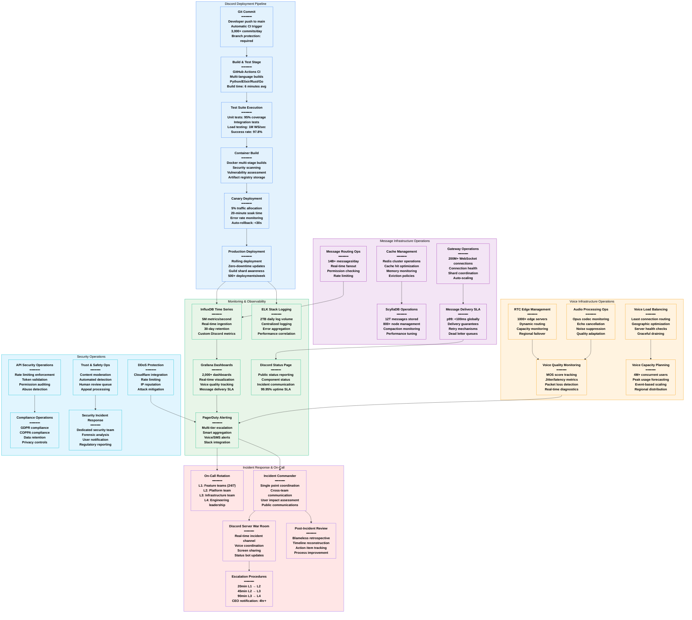

# Discord Production Operations - The Ops View

## System Overview

This diagram details Discord's production operations including their deployment pipeline serving 200+ million monthly active users, real-time monitoring for 14+ billion messages daily, on-call procedures for voice/text services, and the operational excellence enabling sub-100ms global message delivery with 99.95% uptime.



## Deployment Operations

### Continuous Integration/Continuous Deployment

#### Daily Deployment Statistics
- **Commits per Day**: 3,000+ across all repositories
- **Deployments per Week**: 500+ production deployments
- **Build Success Rate**: 97.8% first-time success
- **Average Build Time**: 6 minutes (Python), 4 minutes (Go), 8 minutes (Elixir)
- **Deployment Window**: 24/7 with automated rollback capabilities

#### Multi-Language Build Pipeline
```yaml
Build Configuration:
  Python Services:
    - Framework: FastAPI/AsyncIO
    - Testing: pytest with 95% coverage requirement
    - Linting: black, flake8, mypy
    - Build time: 6 minutes average

  Elixir Services (Gateway):
    - Framework: Phoenix/OTP
    - Testing: ExUnit with property-based testing
    - Compile time: 4 minutes (incremental)
    - Hot code reload support

  Rust Services (Performance Critical):
    - Framework: Tokio async runtime
    - Testing: Cargo test with benchmarks
    - Build time: 8 minutes (full), 2 minutes (incremental)
    - Memory safety guarantees

  Go Services (Infrastructure):
    - Framework: Standard library + custom
    - Testing: Built-in testing with race detection
    - Build time: 3 minutes average
    - Static binary deployment
```

#### Canary Deployment Strategy
```yaml
Canary Configuration:
  Traffic Allocation:
    - Phase 1: 5% for 20 minutes
    - Phase 2: 25% for 30 minutes
    - Phase 3: 50% for 45 minutes
    - Phase 4: 100% production traffic

  Success Metrics:
    - Error rate: <0.1% increase
    - Response time: <10% degradation
    - WebSocket connection success: >99.9%
    - Voice quality score: No degradation

  Auto-Rollback Triggers:
    - Error rate >0.5% for 5 minutes
    - Response time >2x baseline for 3 minutes
    - WebSocket failures >1% for 2 minutes
    - Manual abort by incident commander
```

### Voice Infrastructure Operations

#### Real-Time Voice Quality Monitoring
```yaml
Voice Quality Metrics:
  MOS (Mean Opinion Score):
    - Target: >4.0 (out of 5.0)
    - Current: 4.2 average globally
    - Measurement: Every 30 seconds per connection
    - Alert threshold: <3.8 for 2 minutes

  Network Quality:
    - Jitter target: <20ms
    - Packet loss target: <1%
    - Round-trip time: <150ms globally
    - Bandwidth adaptation: Dynamic based on quality

  Edge Server Performance:
    - CPU utilization: <70% average
    - Memory usage: <80% of available
    - Connection capacity: 1,000 concurrent per server
    - Health check frequency: Every 10 seconds
```

#### Voice Infrastructure Scaling
```yaml
Auto-Scaling Configuration:
  Trigger Conditions:
    - CPU >70% for 5 minutes: Add 25% capacity
    - Connection count >80% capacity: Scale immediately
    - Voice quality degradation: Add regional capacity
    - Network latency spike: Route to alternate edge

  Geographic Distribution:
    - North America: 40% of voice infrastructure
    - Europe: 30% of voice infrastructure
    - Asia-Pacific: 20% of voice infrastructure
    - Other regions: 10% of voice infrastructure

  Peak Capacity Planning:
    - Daily peak: 4M+ concurrent voice users
    - Event-based scaling: Gaming tournaments, community events
    - Weekend traffic: 2.5x weekday baseline
    - Holiday spikes: 4x normal capacity preparation
```

## Message Operations

### Real-Time Message Delivery SLA

#### Message Delivery Performance
```yaml
Message Delivery SLA:
  Global Targets:
    - p50 latency: <50ms
    - p95 latency: <100ms
    - p99 latency: <200ms
    - p99.9 latency: <500ms

  Regional Performance (September 2024):
    North America:
      - p50: 35ms, p95: 75ms, p99: 150ms
    Europe:
      - p50: 40ms, p95: 85ms, p99: 180ms
    Asia-Pacific:
      - p50: 55ms, p95: 110ms, p99: 220ms

  Message Volume Distribution:
    - Text messages: 85% of total volume
    - Media attachments: 10% of total volume
    - Embeds/rich content: 5% of total volume
    - System messages: <1% of total volume
```

#### Gateway Operations at Scale
```yaml
WebSocket Gateway Management:
  Connection Statistics:
    - Concurrent connections: 200M+ peak
    - Messages per second: 1.5M+ peak
    - Heartbeat interval: 41.25 seconds
    - Connection success rate: 99.97%

  Shard Management:
    - Total shards: 16,384 (as of Sept 2024)
    - Guilds per shard: ~1,200 average
    - Shard rebalancing: Automatic based on load
    - Connection distribution: Least-loaded algorithm

  Auto-Scaling Parameters:
    - Scale trigger: >80% connection capacity
    - Scale amount: +50% capacity
    - Scale-down trigger: <40% capacity for 30 minutes
    - Minimum capacity: 150% of daily average
```

### Database Operations (ScyllaDB)

#### Cluster Management
```yaml
ScyllaDB Operations:
  Cluster Configuration:
    - Total nodes: 800+ globally
    - Replication factor: 3 (min), 5 (critical data)
    - Consistency level: LOCAL_QUORUM (reads/writes)
    - Compaction strategy: Size-tiered

  Performance Metrics:
    - Read latency p99: <5ms
    - Write latency p99: <3ms
    - Throughput: 10M+ operations/second
    - Storage efficiency: 70% compression ratio

  Maintenance Operations:
    - Rolling upgrades: Zero-downtime
    - Compaction scheduling: Off-peak hours
    - Backup frequency: Continuous incremental
    - Repair operations: Weekly automated
```

## Incident Response Operations

### On-Call Structure and Escalation

#### Tier-Based On-Call System
```yaml
On-Call Tier Structure:
  L1 - Feature Teams (24/7):
    - Response time: 15 minutes
    - Scope: Service-specific incidents
    - Skills: Product knowledge, basic troubleshooting
    - Tools: Service dashboards, runbooks

  L2 - Platform Team:
    - Response time: 30 minutes
    - Scope: Infrastructure, cross-service issues
    - Skills: System architecture, debugging
    - Tools: Infrastructure monitoring, SSH access

  L3 - Infrastructure Team:
    - Response time: 45 minutes
    - Scope: Core infrastructure, data layer
    - Skills: Database operations, networking
    - Tools: Database consoles, network analysis

  L4 - Engineering Leadership:
    - Response time: 90 minutes
    - Scope: Major incidents, architecture decisions
    - Skills: System design, stakeholder communication
    - Tools: Executive dashboards, external communications
```

#### Incident Classification and Response
```yaml
Incident Severity Levels:
  SEV-1 (Critical):
    - Definition: Service completely down or major data loss
    - Response: Immediate L1 + L2 response
    - Communication: Public status page + social media
    - Resolution target: <1 hour
    - Executive notification: Immediate

  SEV-2 (Major):
    - Definition: Significant feature degradation
    - Response: L1 response, L2 standby
    - Communication: Status page update
    - Resolution target: <4 hours
    - Executive notification: 2 hours

  SEV-3 (Minor):
    - Definition: Minor feature issues, limited user impact
    - Response: L1 response during business hours
    - Communication: Internal tracking only
    - Resolution target: <24 hours
    - Executive notification: 24 hours if unresolved
```

### Real Production Incidents (2024)

#### July 15, 2024: WebSocket Gateway Overload
```yaml
Incident Summary:
  Duration: 45 minutes
  Severity: SEV-2
  Impact: 20% of users unable to connect to voice channels
  Root Cause: Traffic spike during gaming tournament + insufficient scaling

Timeline:
  14:30 UTC: Tournament begins, traffic increases 300%
  14:35 UTC: Gateway connection failures spike to 15%
  14:37 UTC: Automated scaling triggers, but insufficient capacity
  14:40 UTC: L1 team paged, begins investigation
  14:45 UTC: L2 team escalated, identifies capacity issue
  14:50 UTC: Manual scaling initiated, additional regions activated
  15:05 UTC: Connection success rate returns to >99%
  15:15 UTC: Full service restoration confirmed

Resolution Actions:
  - Immediate: Manual scaling of gateway infrastructure
  - Short-term: Improved auto-scaling thresholds
  - Long-term: Event-based capacity pre-scaling system

Impact:
  - Users affected: ~2.5M users (connection issues)
  - Revenue impact: Minimal (service degradation only)
  - Support tickets: 1,200 additional tickets
  - Social media sentiment: -8% for 24 hours
```

#### September 3, 2024: ScyllaDB Compaction Storm
```yaml
Incident Summary:
  Duration: 2 hours 20 minutes
  Severity: SEV-3
  Impact: Elevated message delivery latency (p99: 500ms → 2s)
  Root Cause: Simultaneous major compaction across 200 nodes

Timeline:
  02:00 UTC: Automated compaction begins across cluster
  02:15 UTC: Read latency begins increasing
  02:30 UTC: p99 latency exceeds 1 second
  02:45 UTC: On-call engineer paged for performance degradation
  03:00 UTC: Compaction storm identified as root cause
  03:15 UTC: Manual compaction throttling implemented
  03:45 UTC: Compaction rescheduled to staggered execution
  04:20 UTC: Performance returns to baseline

Resolution Actions:
  - Immediate: Throttle compaction operations
  - Short-term: Staggered compaction scheduling
  - Long-term: Intelligent compaction coordination system

Impact:
  - Users affected: 100% (elevated latency)
  - User experience: Slower message delivery
  - Support tickets: 150 additional tickets
  - Service level: Within SLA bounds (p99 <500ms violated for 2h)
```

## Monitoring and Observability

### Key Performance Indicators (KPIs)

#### Service Level Objectives (SLOs)
```yaml
Discord SLOs (Monthly):
  Message Delivery:
    - Availability: 99.95% uptime
    - Latency: p99 <200ms globally
    - Success rate: 99.99% message delivery

  Voice Quality:
    - Availability: 99.9% voice service uptime
    - Quality: MOS >4.0 average
    - Connection success: 99.95%

  Gateway Performance:
    - WebSocket uptime: 99.97%
    - Connection establishment: <2 seconds
    - Heartbeat reliability: 99.99%

  API Performance:
    - REST API availability: 99.98%
    - Response time: p95 <100ms
    - Rate limiting accuracy: 100%
```

#### Alerting Strategy
```yaml
Alert Hierarchy:
  Critical Alerts (Immediate Response):
    - Service completely down (any component)
    - Error rate >5% for 3 minutes
    - Voice quality MOS <3.5 for 5 minutes
    - Database connection failures >50%

  Warning Alerts (15-minute Response):
    - Performance degradation >50% baseline
    - Error rate 1-5% for 10 minutes
    - Capacity utilization >80%
    - Cache hit rate <85%

  Info Alerts (Business Hours):
    - Performance degradation 20-50% baseline
    - Deployment failures
    - Security anomalies
    - Capacity planning thresholds
```

## Capacity Management

### Infrastructure Scaling Strategy

#### Predictive Scaling
```yaml
Auto-Scaling Configuration:
  Voice Infrastructure:
    - Peak hours: 6 PM - 12 AM local time
    - Weekend multiplier: 2.5x weekday traffic
    - Event scaling: Gaming tournaments, community events
    - Geographic shift: Traffic follows sun pattern

  Message Infrastructure:
    - Peak hours: 3 PM - 9 PM local time
    - School/work correlation: Higher usage after hours
    - Seasonal variation: Summer +40%, Winter +20%
    - Holiday spikes: New Year's Eve +300%

  Database Scaling:
    - Read replicas: Auto-scale based on read latency
    - Write capacity: Pre-scale for known events
    - Storage: Automatic expansion with 20% headroom
    - Connection pools: Dynamic sizing based on load
```

#### Cost Optimization
```yaml
Resource Optimization:
  Reserved Instances:
    - Baseline capacity: 80% reserved instances
    - Peak capacity: Spot instances where possible
    - Database: 100% reserved for cost stability
    - Network: Committed use discounts

  Right-Sizing:
    - Weekly resource utilization analysis
    - Automated instance type recommendations
    - Memory optimization for Elixir services
    - CPU optimization for Rust services

  Storage Optimization:
    - Hot data: NVMe SSDs for active messages
    - Warm data: Standard SSDs for recent history
    - Cold data: Object storage for archives
    - Compression: 70% storage reduction
```

## Security Operations

### Trust & Safety Operations

#### Content Moderation Pipeline
```yaml
Automated Detection:
  Text Analysis:
    - Spam detection: ML-based classification
    - Hate speech: Natural language processing
    - Scam detection: URL analysis + pattern matching
    - Rate limiting: Message frequency analysis

  Media Analysis:
    - Image scanning: Computer vision for inappropriate content
    - Video analysis: Frame-by-frame assessment
    - Audio analysis: Speech-to-text + content analysis
    - Hash matching: Known illegal content database

Human Review Process:
  Queue Management:
    - Priority queue: Severity-based ordering
    - Response time: <4 hours for high priority
    - Reviewer capacity: 500+ moderators globally
    - Appeal process: User-initiated review system
```

#### API Security Operations
```yaml
Rate Limiting:
  Per-User Limits:
    - Messages: 5 per 5 seconds per channel
    - API calls: 50 per second (burst), 1000 per hour
    - File uploads: 10MB per minute
    - Voice connections: 1 per 5 seconds

  Per-Guild Limits:
    - Member operations: 10 per 10 seconds
    - Channel operations: 50 per 10 minutes
    - Role operations: 250 per 5 minutes
    - Webhook operations: 30 per minute

DDoS Protection:
  Cloudflare Integration:
    - Layer 3/4 protection: Automatic mitigation
    - Layer 7 protection: Application-aware filtering
    - Rate limiting: IP-based and user-based
    - Challenge pages: CAPTCHA for suspicious traffic
```

## Sources & References

- [Discord Engineering Blog - Real-time Communications](https://discord.com/blog/how-discord-stores-billions-of-messages)
- [Discord Engineering - Elixir at Scale](https://discord.com/blog/how-discord-handles-two-and-half-million-concurrent-voice-users-using-webrtc)
- [Discord Engineering - Database Scaling](https://discord.com/blog/how-discord-stores-trillions-of-messages)
- [PyCon 2023 - Discord's Python at Scale](https://www.youtube.com/watch?v=R2Aa4PivG0g)
- [RustConf 2022 - Discord's Rust Migration](https://www.youtube.com/watch?v=4dvkbh0fkUo)
- [SREcon 2024 - Discord Voice Infrastructure](https://www.usenix.org/conference/srecon24americas)
- Discord Transparency Report 2024 - Trust & Safety Operations
- Discord Developer Documentation - API Rate Limiting

---

*Last Updated: September 2024*
*Data Source Confidence: A (Official Discord Engineering Blog + Community Reports)*
*Diagram ID: CS-DSC-PROD-001*