# Discord Message Request Flow - The Golden Path

## System Overview

This diagram shows Discord's complete message flow from user input to delivery, processing 14+ billion messages daily with <100ms global delivery across 200+ million users through WebSocket connections.

```mermaid
graph TB
    subgraph EdgePlane["Edge Plane - Blue #3B82F6"]
        style EdgePlane fill:#3B82F6,stroke:#2563EB,color:#fff

        ClientApp["Discord Client<br/>━━━━━<br/>Web/Mobile/Desktop<br/>WebSocket connection<br/>Message composition<br/>Rate limiting client"]

        CloudflareEdge["Cloudflare Edge<br/>━━━━━<br/>WebSocket termination<br/>DDoS protection<br/>Request routing<br/>p95: 8ms"]

        LoadBalancer["Discord Load Balancer<br/>━━━━━<br/>Connection affinity<br/>Health checking<br/>Failover routing<br/>Shard distribution"]
    end

    subgraph ServicePlane["Service Plane - Green #10B981"]
        style ServicePlane fill:#10B981,stroke:#059669,color:#fff

        Gateway["Discord Gateway<br/>━━━━━<br/>WebSocket handler<br/>200M+ connections<br/>Elixir GenServer<br/>Per-connection process"]

        MessageValidator["Message Validator<br/>━━━━━<br/>Content validation<br/>Spam detection<br/>Rate limiting<br/>Permission checking"]

        PermissionEngine["Permission Engine<br/>━━━━━<br/>Role-based access<br/>Channel permissions<br/>User roles<br/>Override hierarchy"]

        MessageRouter["Message Router<br/>━━━━━<br/>Fanout orchestration<br/>Guild member lookup<br/>Delivery optimization<br/>Rust implementation"]

        FanoutService["Fanout Service<br/>━━━━━<br/>Batch message delivery<br/>Connection grouping<br/>Priority queues<br/>Backpressure handling"]

        NotificationService["Notification Service<br/>━━━━━<br/>Push notifications<br/>Mobile delivery<br/>Email notifications<br/>Webhook dispatch"]

        BotService["Bot Service<br/>━━━━━<br/>Bot message handling<br/>Command processing<br/>API rate limiting<br/>Webhook delivery"]
    end

    subgraph StatePlane["State Plane - Orange #F59E0B"]
        style StatePlane fill:#F59E0B,stroke:#D97706,color:#fff

        UserCache["User Session Cache<br/>━━━━━<br/>Redis cluster<br/>200M+ active sessions<br/>Connection state<br/>Presence data"]

        PermissionCache["Permission Cache<br/>━━━━━<br/>Memcached cluster<br/>Role hierarchies<br/>Channel permissions<br/>Guild member roles"]

        MessageDB["Message Database<br/>━━━━━<br/>ScyllaDB cluster<br/>12 trillion messages<br/>Partitioned by channel<br/>p99: 50ms writes"]

        GuildCache["Guild Cache<br/>━━━━━<br/>Redis cluster<br/>Guild metadata<br/>Member lists<br/>Channel structure"]

        MessageQueue["Message Queue<br/>━━━━━<br/>Apache Kafka<br/>Message ordering<br/>Delivery guarantees<br/>Replay capability"]

        SearchIndex["Search Index<br/>━━━━━<br/>Elasticsearch<br/>Message history<br/>Full-text search<br/>Async indexing"]
    end

    subgraph ControlPlane["Control Plane - Red #8B5CF6"]
        style ControlPlane fill:#8B5CF6,stroke:#7C3AED,color:#fff

        RateLimiter["Rate Limiter<br/>━━━━━<br/>Token bucket algorithm<br/>Per-user limits<br/>Guild-based limits<br/>Anti-spam protection"]

        MetricsCollector["Metrics Collector<br/>━━━━━<br/>Message throughput<br/>Delivery latency<br/>Error rates<br/>Performance monitoring"]

        CircuitBreaker["Circuit Breaker<br/>━━━━━<br/>Service protection<br/>Cascade prevention<br/>Auto-recovery<br/>Degraded mode"]

        AuditLogger["Audit Logger<br/>━━━━━<br/>Message logs<br/>Moderation actions<br/>User actions<br/>Compliance tracking"]
    end

    subgraph ExternalServices["External Services"]
        style ExternalServices fill:#f9f9f9,stroke:#999,color:#333

        PushProvider["Push Notification<br/>━━━━━<br/>APNs (iOS)<br/>FCM (Android)<br/>Web Push<br/>Delivery tracking"]

        WebhookTargets["Webhook Targets<br/>━━━━━<br/>External APIs<br/>Bot integrations<br/>Third-party services<br/>Retry logic"]

        CDNMedia["Media CDN<br/>━━━━━<br/>Image/video delivery<br/>Attachment serving<br/>Avatar caching<br/>Thumbnail generation"]
    end

    %% Message flow sequence
    ClientApp -->|"1. Message send<br/>WebSocket message<br/>JSON payload"| CloudflareEdge
    CloudflareEdge -->|"2. Route to gateway<br/>Connection affinity<br/>p95: 8ms"| LoadBalancer
    LoadBalancer -->|"3. WebSocket route<br/>Shard identification<br/>Health check"| Gateway

    %% Initial message processing
    Gateway -->|"4. Message validation<br/>Format check<br/>Content scan"| MessageValidator
    MessageValidator -->|"5. Permission check<br/>Channel access<br/>Role validation"| PermissionEngine
    PermissionEngine -->|"6. Rate limit check<br/>User quotas<br/>Anti-spam"| RateLimiter

    %% Message persistence and routing
    MessageValidator -->|"7. Persist message<br/>ScyllaDB write<br/>p99: 50ms"| MessageDB
    MessageRouter -->|"8. Guild member lookup<br/>Active users<br/>Online presence"| GuildCache
    MessageRouter -->|"9. Permission filtering<br/>Visibility rules<br/>Role-based access"| PermissionCache

    %% Message fanout
    MessageRouter -->|"10. Fanout routing<br/>Batch delivery<br/>Priority queues"| FanoutService
    FanoutService -->|"11a. Online delivery<br/>WebSocket push<br/>Real-time"| Gateway
    FanoutService -->|"11b. Offline delivery<br/>Push notifications<br/>Mobile alerts"| NotificationService
    FanoutService -->|"11c. Bot delivery<br/>Webhook dispatch<br/>API calls"| BotService

    %% Delivery to users
    Gateway -->|"12. WebSocket push<br/>Connected clients<br/>p99: 100ms"| ClientApp
    NotificationService -->|"13. Push delivery<br/>Mobile/desktop<br/>APNs/FCM"| PushProvider
    BotService -->|"14. Webhook call<br/>HTTP POST<br/>Retry logic"| WebhookTargets

    %% Async processing
    MessageDB -->|"15. Search indexing<br/>Async processing<br/>Full-text search"| SearchIndex
    MessageRouter -->|"16. Message queuing<br/>Delivery guarantees<br/>Replay capability"| MessageQueue

    %% Data caching
    Gateway -->|"Session lookup<br/>Connection state<br/>p99: 1ms"| UserCache
    PermissionEngine -->|"Permission lookup<br/>Role hierarchy<br/>p99: 2ms"| PermissionCache

    %% Monitoring and control
    Gateway -.->|"Connection metrics<br/>Message throughput"| MetricsCollector
    MessageRouter -.->|"Delivery metrics<br/>Fanout performance"| MetricsCollector
    FanoutService -.->|"Circuit breaking<br/>Service protection"| CircuitBreaker
    MessageDB -.->|"Audit logging<br/>Compliance data"| AuditLogger

    %% Apply standard colors
    classDef edgeStyle fill:#3B82F6,stroke:#2563EB,color:#fff,font-weight:bold
    classDef serviceStyle fill:#10B981,stroke:#059669,color:#fff,font-weight:bold
    classDef stateStyle fill:#F59E0B,stroke:#D97706,color:#fff,font-weight:bold
    classDef controlStyle fill:#8B5CF6,stroke:#7C3AED,color:#fff,font-weight:bold
    classDef externalStyle fill:#f9f9f9,stroke:#999,color:#333,font-weight:bold

    class ClientApp,CloudflareEdge,LoadBalancer edgeStyle
    class Gateway,MessageValidator,PermissionEngine,MessageRouter,FanoutService,NotificationService,BotService serviceStyle
    class UserCache,PermissionCache,MessageDB,GuildCache,MessageQueue,SearchIndex stateStyle
    class RateLimiter,MetricsCollector,CircuitBreaker,AuditLogger controlStyle
    class PushProvider,WebhookTargets,CDNMedia externalStyle
```



## Message Flow Breakdown

### Phase 1: Message Ingestion (Steps 1-6)
**Total Time Budget: p99 < 50ms**

1. **Client Message Send**: User types message and sends via WebSocket
2. **Edge Routing**: Cloudflare routes to appropriate Discord gateway
3. **Gateway Assignment**: Load balancer routes to specific gateway instance
4. **Message Validation**: Content scanning, format validation, attachment processing
5. **Permission Check**: Channel access, role-based permissions, mute status
6. **Rate Limiting**: User and guild-based rate limit enforcement

### Phase 2: Message Persistence (Steps 7-9)
**Total Time Budget: p99 < 80ms**

7. **Database Write**: Message stored in ScyllaDB with channel partitioning
8. **Guild Member Lookup**: Identify all users with channel access
9. **Permission Filtering**: Apply role-based visibility rules

### Phase 3: Message Delivery (Steps 10-14)
**Total Time Budget: p99 < 100ms**

10. **Fanout Orchestration**: Organize delivery to all eligible recipients
11. **Multi-Channel Delivery**:
    - 11a: Real-time WebSocket delivery to online users
    - 11b: Push notifications to offline/mobile users
    - 11c: Webhook delivery to bots and integrations
12. **WebSocket Push**: Direct delivery to connected clients
13. **Push Notification**: Mobile/desktop notification delivery
14. **Bot Webhook**: HTTP POST to bot webhook endpoints

### Phase 4: Async Processing (Steps 15-16)
**No Impact on Message Latency**

15. **Search Indexing**: Elasticsearch indexing for message history search
16. **Message Queuing**: Kafka queuing for replay and analytics

## Latency Budget Allocation

### End-to-End Message Delivery: p99 < 100ms
- **Edge Processing**: 15ms (Cloudflare + load balancer)
- **Gateway Processing**: 10ms (WebSocket handling)
- **Validation & Permissions**: 15ms (content + access checks)
- **Database Write**: 50ms (ScyllaDB persistence)
- **Fanout Processing**: 20ms (member lookup + filtering)
- **WebSocket Delivery**: 10ms (client push)
- **Buffer**: 20ms (network delays, queuing)

### Performance Targets by Service
- **Gateway**: p99 < 10ms WebSocket message handling
- **Permission Engine**: p99 < 5ms permission resolution
- **Message Router**: p99 < 25ms fanout orchestration
- **ScyllaDB**: p99 < 50ms message writes
- **Fanout Service**: p99 < 15ms batch delivery preparation

## Message Types & Routing Strategies

### Text Messages
**Standard Flow:**
- Content validation and scanning
- Permission checking
- Direct fanout to online users
- Push notifications for offline users
- Bot webhook delivery

### Rich Media Messages
**Enhanced Processing:**
- Attachment upload to CDN
- Image/video processing
- Thumbnail generation
- Virus scanning
- Size/format validation

### Bot Commands
**Specialized Routing:**
- Command parsing and validation
- Bot permission verification
- Rate limiting per bot
- Response routing back to channel
- Audit logging for compliance

### System Messages
**Priority Handling:**
- Join/leave notifications
- Permission changes
- Channel updates
- Moderation actions
- Reduced fanout (members only)

## Guild Sharding & Distribution

### Shard Assignment Strategy
```python
def calculate_shard(guild_id, total_shards):
    """
    Consistent hashing for guild distribution
    """
    return (guild_id >> 22) % total_shards
```

**Shard Characteristics:**
- **Shard Count**: Dynamic based on load (typically 1000-5000 shards)
- **Guild Distribution**: Even distribution using consistent hashing
- **Load Balancing**: Automatic rebalancing for hot guilds
- **Fault Tolerance**: Multi-shard failover capability

### Connection Affinity
- **User Stickiness**: Users maintain connection to same gateway
- **Guild Affinity**: Large guilds may have dedicated shards
- **Geographic Routing**: Users routed to nearest gateway region
- **Failover Logic**: Graceful reconnection on gateway failure

## Permission Engine Deep Dive

### Role Hierarchy Resolution
```json
{
  "guild_id": "123456789",
  "user_id": "987654321",
  "roles": [
    {
      "id": "role1",
      "name": "@everyone",
      "permissions": 104324673,
      "position": 0
    },
    {
      "id": "role2",
      "name": "Moderator",
      "permissions": 268435456,
      "position": 10
    }
  ],
  "channel_overwrites": [
    {
      "id": "987654321",
      "type": "member",
      "allow": 2048,
      "deny": 0
    }
  ]
}
```

**Permission Calculation:**
1. Start with @everyone role permissions
2. Apply additional role permissions (bitwise OR)
3. Apply channel-specific overwrites
4. Calculate final permission set
5. Cache result for subsequent checks

### Channel Permission Types
- **View Channel**: Basic channel visibility
- **Send Messages**: Message posting ability
- **Embed Links**: Link embedding permissions
- **Attach Files**: File upload capability
- **Use External Emoji**: Cross-guild emoji usage
- **Manage Messages**: Moderation capabilities

## Rate Limiting Implementation

### User Rate Limits
```yaml
Per-User Limits:
  Global: 50 requests per second
  Channel Messages: 5 messages per 5 seconds
  Guild Messages: 200 messages per minute
  API Calls: 30 requests per second

Per-Guild Limits:
  Total Messages: 1000 messages per minute
  Bot Commands: 100 commands per minute
  Member Joins: 50 joins per minute
```

### Rate Limit Algorithm
**Token Bucket Implementation:**
```python
class TokenBucket:
    def __init__(self, capacity, refill_rate):
        self.capacity = capacity
        self.tokens = capacity
        self.refill_rate = refill_rate
        self.last_refill = time.time()

    def consume(self, tokens=1):
        self._refill()
        if self.tokens >= tokens:
            self.tokens -= tokens
            return True
        return False

    def _refill(self):
        now = time.time()
        tokens_to_add = (now - self.last_refill) * self.refill_rate
        self.tokens = min(self.capacity, self.tokens + tokens_to_add)
        self.last_refill = now
```

### Anti-Spam Measures
- **Content Similarity**: Detect repeated message patterns
- **Velocity Analysis**: Unusual sending patterns
- **Account Age**: New account restrictions
- **IP Reputation**: Known spam source detection
- **Machine Learning**: AI-powered spam detection

## Message Delivery Guarantees

### Delivery Semantics
- **At-Least-Once**: Messages guaranteed to be delivered
- **Ordering**: FIFO ordering maintained per channel
- **Durability**: Messages persisted before acknowledgment
- **Idempotency**: Duplicate message detection and handling

### Failure Handling
**WebSocket Connection Failure:**
1. Client detects connection loss
2. Automatic reconnection with exponential backoff
3. Message replay for missed messages
4. Sequence number validation

**Gateway Failure:**
1. Load balancer detects unhealthy gateway
2. New connections routed to healthy gateways
3. Existing connections migrated gracefully
4. Message queue ensures no message loss

**Database Failure:**
1. ScyllaDB replica failure detected
2. Automatic failover to healthy replicas
3. Write operations queued during failover
4. Consistency validation after recovery

## Real-Time Typing Indicators

### Typing Event Flow
```javascript
// Client sends typing start
{
  "op": 8, // TYPING_START
  "d": {
    "channel_id": "123456789",
    "timestamp": 1609459200
  }
}

// Server broadcasts to channel members
{
  "t": "TYPING_START",
  "d": {
    "channel_id": "123456789",
    "user_id": "987654321",
    "timestamp": 1609459200,
    "guild_id": "456789123"
  }
}
```

**Typing State Management:**
- **10-Second Timeout**: Typing indicator expires automatically
- **Channel Scoped**: Only visible to channel members
- **Rate Limited**: Prevent typing spam
- **Optimistic Display**: Immediate local display

## Bot Integration & Webhooks

### Bot Message Handling
**Bot Permission Model:**
- **Bot User**: Special user type with bot flag
- **Application Commands**: Slash commands with permissions
- **Webhook URLs**: Direct channel posting capability
- **Rate Limiting**: Stricter limits than regular users

### Webhook Delivery
**Reliable Delivery:**
```yaml
Webhook Delivery:
  Timeout: 15 seconds
  Retry Policy:
    - Immediate retry
    - 1 second delay
    - 5 second delay
    - 25 second delay
  Max Retries: 3
  Dead Letter: Failed webhooks logged
```

**Webhook Security:**
- **Signature Validation**: HMAC-SHA256 signatures
- **TLS Encryption**: HTTPS required for webhooks
- **IP Whitelisting**: Optional IP restriction
- **Rate Limiting**: Per-webhook rate limits

## Performance Monitoring & Metrics

### Key Performance Indicators
- **Message Throughput**: Messages per second globally
- **Delivery Latency**: End-to-end message delivery time
- **WebSocket Health**: Connection stability metrics
- **Database Performance**: Read/write latency and throughput
- **Cache Hit Rates**: Permission and guild cache effectiveness

### Real-Time Dashboards
**Operations Dashboard:**
- Global message volume (real-time)
- Regional latency distribution
- Error rates by service
- Active connection counts
- Database performance metrics

**Business Metrics:**
- Monthly active users
- Messages per user
- Channel engagement
- Voice usage statistics
- Bot interaction rates

## Sources & References

- [Discord Engineering Blog - Message Architecture](https://discord.com/blog/how-discord-stores-billions-of-messages)
- [Discord Engineering - WebSocket Gateway](https://discord.com/blog/scaling-elixir-f9b8e1e7c29b)
- [Discord Developer Documentation - Gateway API](https://discord.com/developers/docs/topics/gateway)
- [Discord Engineering - Rate Limiting](https://discord.com/blog/how-discord-handles-push-request-bursts-of-over-a-million-per-minute-with-elixirs-genstage)
- ElixirConf 2020 - Discord's Use of Elixir at Scale
- ScyllaDB Summit 2023 - Discord Migration Case Study

---

*Last Updated: September 2024*
*Data Source Confidence: A (Official Discord Engineering Documentation + Developer Docs)*
*Diagram ID: CS-DIS-FLOW-001*