# Discord Storage Architecture - The Data Journey

## System Overview

This diagram shows Discord's complete storage architecture managing 12+ trillion messages with their revolutionary migration from Cassandra to ScyllaDB, achieving 90% cost reduction while handling 14+ billion messages daily.

```mermaid
graph TB
    subgraph EdgePlane["Edge Plane - Blue #3B82F6"]
        style EdgePlane fill:#3B82F6,stroke:#2563EB,color:#fff

        CDNCache["CDN Cache Layer<br/>━━━━━<br/>Cloudflare + GCP CDN<br/>Media file caching<br/>Avatar/emoji cache<br/>99% hit rate"]

        RegionalCache["Regional Cache<br/>━━━━━<br/>Geographic distribution<br/>Message cache<br/>Guild metadata<br/>Sub-50ms latency"]
    end

    subgraph ServicePlane["Service Plane - Green #10B981"]
        style ServicePlane fill:#10B981,stroke:#059669,color:#fff

        CacheOrchestrator["Cache Orchestrator<br/>━━━━━<br/>Multi-tier coordination<br/>Cache invalidation<br/>Consistency management<br/>Hit ratio optimization"]

        DataAccessLayer["Data Access Layer<br/>━━━━━<br/>Query routing<br/>Connection pooling<br/>Load balancing<br/>Circuit breakers"]

        MigrationManager["Migration Manager<br/>━━━━━<br/>Cassandra → ScyllaDB<br/>Zero-downtime migration<br/>Data consistency<br/>Performance validation"]

        SearchCoordinator["Search Coordinator<br/>━━━━━<br/>Elasticsearch routing<br/>Index management<br/>Query optimization<br/>Real-time indexing"]
    end

    subgraph StatePlane["State Plane - Orange #F59E0B"]
        style StatePlane fill:#F59E0B,stroke:#D97706,color:#fff

        subgraph MessageStorage["Message Storage - Primary"]
            ScyllaCluster["ScyllaDB Cluster<br/>━━━━━<br/>12T+ messages stored<br/>800+ nodes globally<br/>C++ performance<br/>10x faster than Cassandra"]

            ScyllaReplicas["ScyllaDB Replicas<br/>━━━━━<br/>RF=3 replication<br/>Cross-datacenter<br/>Automatic failover<br/>Consistent hashing"]
        end

        subgraph LegacyStorage["Legacy Storage - Migration"]
            CassandraCluster["Cassandra Cluster<br/>━━━━━<br/>Legacy messages<br/>6T+ messages<br/>Being migrated<br/>Read-only mode"]

            MigrationQueue["Migration Queue<br/>━━━━━<br/>Kafka-based pipeline<br/>Batch processing<br/>Consistency validation<br/>Progress tracking"]
        end

        subgraph CacheLayer["Multi-Tier Cache Layer"]
            L1Cache["L1 Cache - Redis<br/>━━━━━<br/>Hot message cache<br/>200M+ sessions<br/>Sub-ms latency<br/>Memory optimized"]

            L2Cache["L2 Cache - Memcached<br/>━━━━━<br/>Guild metadata<br/>Permission cache<br/>Channel info<br/>Distributed hash"]

            L3Cache["L3 Cache - Application<br/>━━━━━<br/>In-memory cache<br/>Connection state<br/>User sessions<br/>Process-local data"]
        end

        subgraph AnalyticsStorage["Analytics & Search"]
            ElasticsearchCluster["Elasticsearch<br/>━━━━━<br/>Message search index<br/>100TB+ indexed<br/>7-day retention<br/>Full-text search"]

            AnalyticsDB["Analytics Database<br/>━━━━━<br/>BigQuery warehouse<br/>Historical analytics<br/>User engagement<br/>Business metrics"]

            MetricsStore["Metrics Store<br/>━━━━━<br/>InfluxDB cluster<br/>Performance metrics<br/>System monitoring<br/>Real-time dashboards"]
        end

        subgraph MediaStorage["Media & Content Storage"]
            GCPStorage["Google Cloud Storage<br/>━━━━━<br/>500TB+ media files<br/>Images, videos, files<br/>Multi-region replication<br/>Lifecycle management"]

            AttachmentCache["Attachment Cache<br/>━━━━━<br/>Recent file cache<br/>Fast retrieval<br/>CDN integration<br/>Automatic expiry"]
        end
    end

    subgraph ControlPlane["Control Plane - Red #8B5CF6"]
        style ControlPlane fill:#8B5CF6,stroke:#7C3AED,color:#fff

        StorageMonitoring["Storage Monitoring<br/>━━━━━<br/>Performance tracking<br/>Capacity monitoring<br/>Health checks<br/>Alert management"]

        BackupOrchestrator["Backup Orchestrator<br/>━━━━━<br/>Continuous backups<br/>Point-in-time recovery<br/>Cross-region replication<br/>Disaster recovery"]

        ConsistencyChecker["Consistency Checker<br/>━━━━━<br/>Data validation<br/>Repair operations<br/>Conflict resolution<br/>Integrity monitoring"]

        CapacityPlanner["Capacity Planner<br/>━━━━━<br/>Growth forecasting<br/>Resource allocation<br/>Cost optimization<br/>Performance modeling"]
    end

    %% Data flow connections
    CacheOrchestrator -->|"Cache miss<br/>Read-through pattern<br/>p99: 2ms"| DataAccessLayer
    DataAccessLayer -->|"Message queries<br/>Channel reads<br/>p99: 50ms"| ScyllaCluster
    DataAccessLayer -->|"Legacy queries<br/>Historical data<br/>p99: 200ms"| CassandraCluster

    %% Replication flows
    ScyllaCluster -->|"RF=3 replication<br/>Consistent hashing<br/>Cross-AZ sync"| ScyllaReplicas
    CassandraCluster -->|"Migration pipeline<br/>Batch processing<br/>Consistency check"| MigrationQueue
    MigrationQueue -->|"Data transfer<br/>Validation<br/>Hot migration"| ScyllaCluster

    %% Cache hierarchy
    CacheOrchestrator -->|"Hot data<br/>Session cache<br/>p99: 0.5ms"| L1Cache
    CacheOrchestrator -->|"Guild metadata<br/>Permissions<br/>p99: 1ms"| L2Cache
    CacheOrchestrator -->|"Connection state<br/>Local cache<br/>p99: 0.1ms"| L3Cache

    %% Search and analytics
    ScyllaCluster -->|"Real-time indexing<br/>Message content<br/>Async pipeline"| ElasticsearchCluster
    SearchCoordinator -->|"Query routing<br/>Index selection<br/>Result aggregation"| ElasticsearchCluster
    DataAccessLayer -->|"Analytics pipeline<br/>ETL processing<br/>Daily batches"| AnalyticsDB

    %% Media storage
    GCPStorage -->|"CDN integration<br/>Edge caching<br/>Global distribution"| CDNCache
    AttachmentCache -->|"Recent files<br/>Fast access<br/>Cache warming"| GCPStorage

    %% Edge caching
    CDNCache -->|"Cache fill<br/>Origin requests<br/>TTL management"| GCPStorage
    RegionalCache -->|"Message cache<br/>Guild cache<br/>Geographic optimization"| L1Cache

    %% Control plane monitoring
    ScyllaCluster -.->|"Performance metrics<br/>Capacity monitoring"| StorageMonitoring
    CassandraCluster -.->|"Migration progress<br/>Health monitoring"| ConsistencyChecker
    BackupOrchestrator -.->|"Backup validation<br/>Recovery testing"| StorageMonitoring
    CapacityPlanner -.->|"Growth analysis<br/>Resource planning"| StorageMonitoring

    %% Apply standard colors
    classDef edgeStyle fill:#3B82F6,stroke:#2563EB,color:#fff,font-weight:bold
    classDef serviceStyle fill:#10B981,stroke:#059669,color:#fff,font-weight:bold
    classDef stateStyle fill:#F59E0B,stroke:#D97706,color:#fff,font-weight:bold
    classDef controlStyle fill:#8B5CF6,stroke:#7C3AED,color:#fff,font-weight:bold

    class CDNCache,RegionalCache edgeStyle
    class CacheOrchestrator,DataAccessLayer,MigrationManager,SearchCoordinator serviceStyle
    class ScyllaCluster,ScyllaReplicas,CassandraCluster,MigrationQueue,L1Cache,L2Cache,L3Cache,ElasticsearchCluster,AnalyticsDB,MetricsStore,GCPStorage,AttachmentCache stateStyle
    class StorageMonitoring,BackupOrchestrator,ConsistencyChecker,CapacityPlanner controlStyle
```



## Storage Evolution: The Great Migration

### From Cassandra to ScyllaDB
**The Challenge:**
- **Scale Issues**: Cassandra struggling with 12T+ messages
- **Performance**: High latency during peak usage
- **Operational Overhead**: Complex tuning and maintenance
- **Cost**: Expensive infrastructure requirements

**The Solution: ScyllaDB**
- **10x Performance**: C++ implementation vs Java
- **90% Cost Reduction**: Lower hardware requirements
- **Drop-in Replacement**: Same CQL interface
- **Better Operations**: Simplified maintenance

### Migration Strategy & Results

**Zero-Downtime Migration Process:**
```yaml
Migration Phases:
1. Dual-Write Phase (6 months):
   - All writes go to both Cassandra and ScyllaDB
   - Read traffic remains on Cassandra
   - Data consistency validation

2. Read Migration Phase (3 months):
   - Gradually shift read traffic to ScyllaDB
   - Performance comparison and validation
   - Rollback capability maintained

3. Complete Migration (1 month):
   - All traffic moved to ScyllaDB
   - Cassandra cluster decommissioned
   - Final data validation
```

**Performance Improvements Achieved:**
- **Read Latency**: p99 reduced from 200ms to 50ms
- **Write Latency**: p99 reduced from 100ms to 15ms
- **Throughput**: 10x increase in operations per second
- **Resource Usage**: 90% reduction in CPU and memory
- **Cost**: $15M/year savings in infrastructure

## ScyllaDB Architecture Deep Dive

### Cluster Configuration

**Production Cluster Specs:**
```yaml
Cluster Size: 800 nodes across 6 regions
Instance Type: i4i.8xlarge (32 vCPU, 256GB RAM, 15TB NVMe)
Replication Factor: 3 (RF=3)
Consistency Level: QUORUM for writes, LOCAL_QUORUM for reads
Compaction Strategy: Time Window Compaction (TWCS)
```

**Data Distribution Strategy:**
```python
# Message partitioning by channel_id + time bucket
CREATE TABLE messages (
    channel_id bigint,
    bucket int,        -- Time bucket (hour)
    message_id bigint,
    author_id bigint,
    content text,
    timestamp timestamp,
    attachments list<text>,
    PRIMARY KEY ((channel_id, bucket), message_id)
) WITH CLUSTERING ORDER BY (message_id DESC);
```

### Performance Characteristics

**Read Performance:**
- **Point Queries**: p50 < 5ms, p99 < 50ms
- **Range Queries**: p50 < 20ms, p99 < 100ms
- **Throughput**: 1M+ reads per second per node
- **Cache Hit Rate**: 95% for recent messages

**Write Performance:**
- **Single Writes**: p50 < 2ms, p99 < 15ms
- **Batch Writes**: p50 < 10ms, p99 < 50ms
- **Throughput**: 500K+ writes per second per node
- **Durability**: Synchronous replication (RF=3)

### Data Modeling for Chat Applications

**Message Table Schema:**
```sql
-- Optimized for recent message retrieval
CREATE TABLE messages_by_channel (
    channel_id bigint,
    bucket int,           -- Time-based partitioning
    message_id bigint,    -- Snowflake ID for ordering
    author_id bigint,
    content text,
    timestamp timestamp,
    message_type int,     -- Text, image, system, etc.
    attachments frozen<list<attachment>>,
    embeds frozen<list<embed>>,
    reactions frozen<map<text, reaction_count>>,
    PRIMARY KEY ((channel_id, bucket), message_id)
) WITH CLUSTERING ORDER BY (message_id DESC)
   AND COMPACTION = {
     'class': 'TimeWindowCompactionStrategy',
     'compaction_window_unit': 'HOURS',
     'compaction_window_size': 24
   };
```

**Guild Member Table:**
```sql
-- Optimized for permission checks and presence
CREATE TABLE guild_members (
    guild_id bigint,
    user_id bigint,
    joined_at timestamp,
    roles frozen<set<bigint>>,
    nick text,
    permissions bigint,
    last_seen timestamp,
    PRIMARY KEY (guild_id, user_id)
);
```

## Multi-Tier Caching Strategy

### L1 Cache - Redis Hot Data
**Configuration:**
- **Cluster Size**: 30 nodes, r6gd.16xlarge instances
- **Memory**: 15TB total cache capacity
- **Data Types**: Recent messages, active sessions, presence
- **TTL Strategy**: 1 hour for messages, 15 minutes for sessions

**Usage Patterns:**
```python
# Message caching pattern
def get_recent_messages(channel_id, limit=50):
    cache_key = f"messages:{channel_id}:recent"
    cached = redis.lrange(cache_key, 0, limit-1)

    if len(cached) < limit:
        # Cache miss - fetch from ScyllaDB
        messages = scylla.execute(
            "SELECT * FROM messages_by_channel WHERE channel_id = ? "
            "AND bucket >= ? LIMIT ?",
            [channel_id, current_bucket(), limit]
        )
        # Update cache
        redis.lpush(cache_key, *[json.dumps(msg) for msg in messages])
        redis.expire(cache_key, 3600)  # 1 hour TTL

    return [json.loads(msg) for msg in cached[:limit]]
```

### L2 Cache - Memcached Metadata
**Configuration:**
- **Cluster Size**: 20 nodes, r6i.4xlarge instances
- **Memory**: 5TB total capacity
- **Data Types**: Guild metadata, channel info, permissions
- **TTL Strategy**: 30 minutes for metadata, 10 minutes for permissions

**Cache Patterns:**
- **Guild Information**: Member count, channel list, settings
- **Permission Cache**: Role hierarchy, channel permissions
- **User Profiles**: Avatar URLs, usernames, status

### L3 Cache - Application Layer
**In-Memory Caching:**
- **Connection State**: WebSocket connection metadata
- **Active Sessions**: Currently connected users
- **Rate Limit Counters**: Per-user request quotas
- **Feature Flags**: Real-time configuration

## Search Infrastructure

### Elasticsearch Architecture
**Cluster Configuration:**
```yaml
Cluster: 40 nodes across 3 availability zones
Instance Type: i3.2xlarge (8 vCPU, 61GB RAM, 1.9TB NVMe)
Total Storage: 100TB indexed data
Retention: 7 days of searchable history
Shards: 120 primary shards, 1 replica each
```

**Index Strategy:**
```json
{
  "messages": {
    "settings": {
      "number_of_shards": 40,
      "number_of_replicas": 1,
      "refresh_interval": "30s",
      "analysis": {
        "analyzer": {
          "discord_analyzer": {
            "type": "custom",
            "tokenizer": "standard",
            "filter": ["lowercase", "discord_emoji_filter"]
          }
        }
      }
    },
    "mappings": {
      "properties": {
        "message_id": {"type": "keyword"},
        "channel_id": {"type": "keyword"},
        "guild_id": {"type": "keyword"},
        "author_id": {"type": "keyword"},
        "content": {
          "type": "text",
          "analyzer": "discord_analyzer",
          "fields": {
            "keyword": {"type": "keyword"}
          }
        },
        "timestamp": {"type": "date"},
        "attachments": {"type": "nested"},
        "has_embed": {"type": "boolean"}
      }
    }
  }
}
```

### Real-Time Indexing Pipeline
```python
# Kafka consumer for real-time indexing
async def index_message_stream():
    consumer = KafkaConsumer(
        'message-events',
        bootstrap_servers=['kafka1:9092', 'kafka2:9092'],
        value_deserializer=lambda x: json.loads(x.decode('utf-8'))
    )

    batch = []
    for message in consumer:
        # Transform for Elasticsearch
        doc = {
            'message_id': message.value['id'],
            'channel_id': message.value['channel_id'],
            'guild_id': message.value['guild_id'],
            'author_id': message.value['author']['id'],
            'content': message.value['content'],
            'timestamp': message.value['timestamp'],
            'has_embed': len(message.value.get('embeds', [])) > 0
        }

        batch.append(doc)

        if len(batch) >= 1000:
            # Bulk index to Elasticsearch
            helpers.bulk(es_client, batch)
            batch = []
```

## Media Storage Architecture

### Google Cloud Storage Configuration
**Storage Classes & Lifecycle:**
```yaml
Storage Strategy:
- Standard Storage: Active files (0-30 days)
- Nearline Storage: Recent files (30-90 days)
- Coldline Storage: Archive files (90+ days)
- Archive Storage: Long-term retention (1+ years)

Lifecycle Rules:
- Auto-transition to Nearline after 30 days
- Auto-transition to Coldline after 90 days
- Auto-transition to Archive after 365 days
- Auto-deletion after 7 years (compliance)
```

**Performance Optimization:**
- **Multi-regional Buckets**: Reduced latency globally
- **CDN Integration**: Cloudflare + GCP CDN
- **Compression**: Automatic image optimization
- **Parallel Uploads**: Multi-part upload for large files

### Attachment Processing Pipeline
```python
async def process_attachment(file_data, channel_id, user_id):
    """
    Process uploaded attachments with virus scanning,
    optimization, and CDN distribution
    """
    # 1. Virus scanning
    scan_result = await virus_scanner.scan(file_data)
    if not scan_result.clean:
        raise SecurityException("File failed virus scan")

    # 2. File type validation
    file_type = detect_file_type(file_data)
    if file_type not in ALLOWED_TYPES:
        raise ValidationException("File type not allowed")

    # 3. Image optimization (if applicable)
    if file_type in IMAGE_TYPES:
        optimized_data = await image_optimizer.optimize(file_data)
        thumbnail = await image_optimizer.create_thumbnail(file_data, 256)

    # 4. Upload to GCS
    file_id = generate_snowflake_id()
    gcs_path = f"attachments/{channel_id[:2]}/{file_id}"

    await gcs_client.upload(gcs_path, optimized_data or file_data)

    # 5. Update CDN
    cdn_url = f"https://cdn.discordapp.com/{gcs_path}"
    await cdn_cache.warm(cdn_url)

    return {
        "id": file_id,
        "filename": file_data.filename,
        "size": len(file_data),
        "url": cdn_url,
        "proxy_url": f"https://media.discordapp.net/{gcs_path}",
        "content_type": file_type
    }
```

## Data Consistency & Backup

### Backup Strategy
**Continuous Backup System:**
```yaml
ScyllaDB Backups:
  - Incremental backups every 15 minutes
  - Full backups every 24 hours
  - Cross-region replication to 3 regions
  - Point-in-time recovery capability

Retention Policy:
  - Incremental: 7 days retention
  - Daily: 30 days retention
  - Weekly: 12 weeks retention
  - Monthly: 12 months retention
```

**Disaster Recovery:**
- **RTO**: 2 hours for full cluster recovery
- **RPO**: 15 minutes maximum data loss
- **Cross-Region**: Automatic failover capability
- **Data Validation**: Integrity checks during recovery

### Consistency Guarantees
**ScyllaDB Consistency:**
- **Write Consistency**: QUORUM (2 of 3 replicas)
- **Read Consistency**: LOCAL_QUORUM (local datacenter)
- **Cross-Region**: Eventual consistency
- **Conflict Resolution**: Last-write-wins with timestamps

**Cache Consistency:**
- **Write-Through**: Updates cache and database
- **TTL-Based**: Automatic expiration and refresh
- **Invalidation**: Event-driven cache clearing
- **Eventual Consistency**: Cache may lag database briefly

## Performance Monitoring & Optimization

### Key Metrics Dashboard
**Database Performance:**
- **Read Latency**: p50, p95, p99 across all queries
- **Write Latency**: p50, p95, p99 for all write operations
- **Throughput**: Operations per second per node
- **Error Rates**: Failed queries and timeouts
- **Disk Utilization**: Storage capacity and I/O metrics

**Cache Performance:**
- **Hit Rates**: L1, L2, L3 cache hit ratios
- **Memory Usage**: Cache memory utilization
- **Eviction Rates**: Cache eviction patterns
- **Network**: Cache cluster network utilization

### Auto-Scaling & Capacity Management
**ScyllaDB Auto-Scaling:**
```python
# Capacity monitoring and auto-scaling
def monitor_cluster_capacity():
    metrics = get_cluster_metrics()

    # CPU utilization threshold
    if metrics.avg_cpu > 70:
        if metrics.sustained_minutes > 15:
            trigger_scale_up()

    # Disk utilization threshold
    if metrics.avg_disk_usage > 80:
        if metrics.growth_rate > 5:  # 5% per day
            trigger_capacity_expansion()

    # Memory pressure threshold
    if metrics.memory_pressure > 85:
        trigger_cache_optimization()
```

**Cost Optimization:**
- **Reserved Instances**: 60% of capacity on reserved pricing
- **Spot Instances**: Non-production workloads on spot
- **Data Tiering**: Automatic data lifecycle management
- **Compression**: Storage optimization with minimal CPU overhead

## Migration Lessons Learned

### Technical Challenges Overcome
1. **Data Consistency**: Ensuring zero data loss during migration
2. **Performance Validation**: Comprehensive testing before cutover
3. **Application Changes**: Minimal code changes required
4. **Operational Procedures**: New monitoring and alerting systems

### Business Impact
- **Cost Savings**: $15M+ annual savings
- **Performance Improvement**: 90% latency reduction
- **Operational Efficiency**: Simplified maintenance procedures
- **Scalability**: Better handling of traffic spikes

### Migration Best Practices
1. **Dual-Write Strategy**: Maintain consistency during transition
2. **Gradual Rollout**: Phase migration to minimize risk
3. **Comprehensive Testing**: Load testing and data validation
4. **Rollback Planning**: Quick rollback capability maintained
5. **Team Training**: Operations team training on new system

## Sources & References

- [Discord Engineering Blog - ScyllaDB Migration](https://discord.com/blog/how-discord-stores-billions-of-messages)
- [ScyllaDB Summit 2023 - Discord Case Study](https://www.scylladb.com/summit/)
- [Discord Engineering - Database Architecture Evolution](https://discord.com/blog/using-rust-to-scale-elixir-for-11-million-concurrent-users)
- [ScyllaDB Documentation - Performance Tuning](https://docs.scylladb.com/stable/)
- [Google Cloud Storage Best Practices](https://cloud.google.com/storage/docs/best-practices)
- [Elasticsearch at Scale - Discord's Search Infrastructure](https://discord.com/blog/discord-search-answering-billions-of-questions)

---

*Last Updated: September 2024*
*Data Source Confidence: A (Official Discord Engineering Blog + Conference Presentations)*
*Diagram ID: CS-DIS-STOR-001*