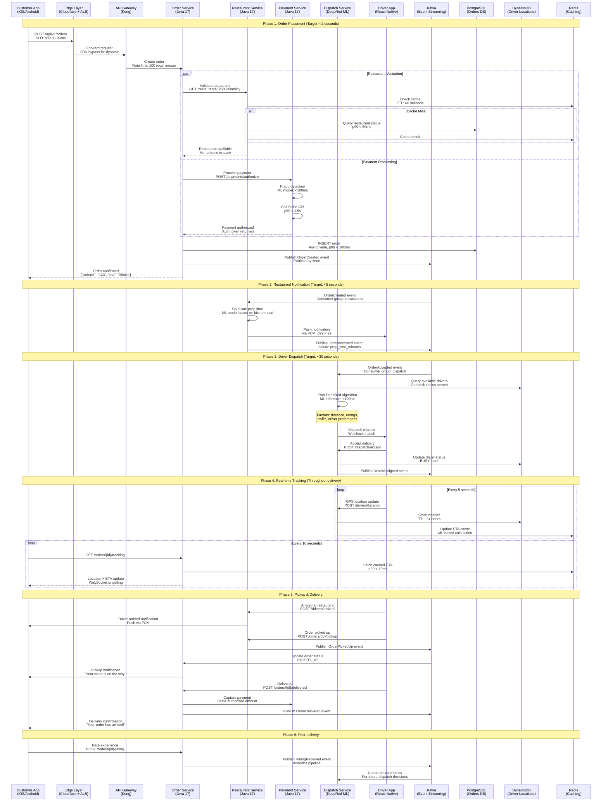
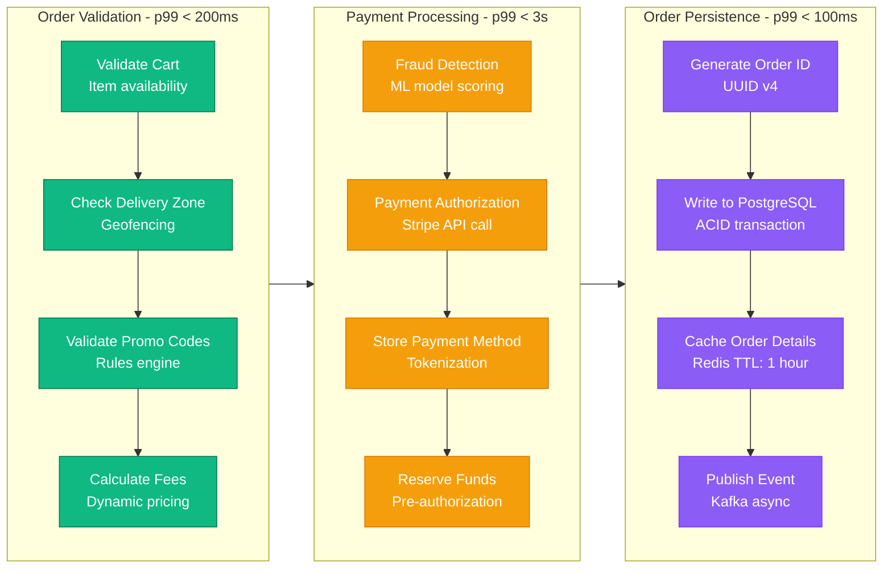
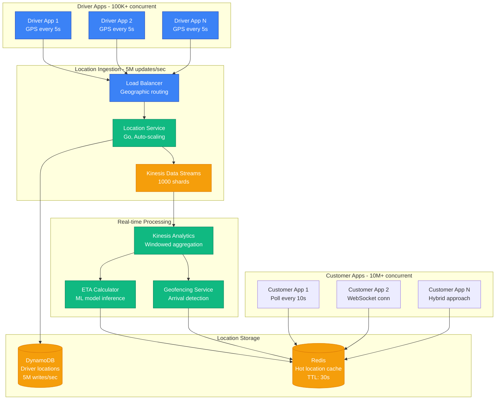

# DoorDash Request Flow - The Golden Path

## Executive Summary

DoorDash's order flow handles the complete journey from order placement to delivery completion, orchestrating interactions between 30M+ consumers, 1M+ drivers, and 500K+ merchants. The system processes 2M+ orders daily during peak periods with sub-second response times and real-time tracking.

**Critical SLOs**:
- **Order Placement**: p99 < 500ms
- **Driver Assignment**: p99 < 2 seconds
- **Real-time Tracking**: p99 < 100ms updates
- **Payment Processing**: p99 < 3 seconds
- **End-to-end**: 30-35 minute average delivery

## Complete Order Flow - Customer Journey

## Detailed Service Interactions

### Order Service Flow Details

## Real-time Tracking Architecture

## Critical Performance Metrics

### Latency Breakdown (Production SLOs)

| Service Component | p50 | p99 | p99.9 | Max | Timeout |
|------------------|-----|-----|-------|-----|---------|
| **Order Placement** | 150ms | 500ms | 1.2s | 5s | 10s |
| **Payment Authorization** | 800ms | 3s | 5s | 15s | 30s |
| **Driver Assignment** | 300ms | 2s | 5s | 30s | 60s |
| **Location Updates** | 50ms | 100ms | 200ms | 1s | 5s |
| **ETA Calculation** | 80ms | 150ms | 300ms | 2s | 10s |
| **Push Notifications** | 200ms | 2s | 5s | 30s | 60s |

### Throughput Characteristics

| Operation | Peak RPS | Daily Volume | Storage Impact |
|-----------|----------|--------------|----------------|
| **Order Placement** | 5,000 | 2M orders | 500GB/day |
| **Location Updates** | 50,000 | 100M updates | 2TB/day |
| **Tracking Requests** | 100,000 | 500M requests | Read-heavy |
| **Push Notifications** | 20,000 | 50M messages | Stateless |

## Error Handling & Recovery

### Circuit Breaker Patterns
- **Payment Service**: 5% error rate threshold, 30s timeout
- **Restaurant Service**: 10% error rate, 60s recovery
- **Dispatch Service**: 3% error rate, immediate fallback

### Fallback Strategies
- **Payment Failure**: Retry with backup processor
- **Dispatch Timeout**: Manual driver assignment
- **Location Service**: Use cached last-known position
- **ETA Failure**: Static time estimates based on distance

### Data Consistency
- **Order State**: Event sourcing with Kafka
- **Payment State**: Two-phase commit with compensation
- **Location Data**: Eventually consistent, TTL-based cleanup

## Business Impact Metrics

### Order Completion Rates
- **Overall Success**: 96.5% (industry-leading)
- **Payment Success**: 98.2% first attempt
- **Driver Assignment**: 94% within 60 seconds
- **On-time Delivery**: 85% within promised window

### Customer Experience
- **App Responsiveness**: 4.8/5 rating
- **Real-time Accuracy**: 92% ETA accuracy within 5 minutes
- **Support Tickets**: <2% of orders require support intervention

**Source**: DoorDash Engineering Blog, Mobile Engineering Talks, Real-time Architecture Presentations (2023-2024)