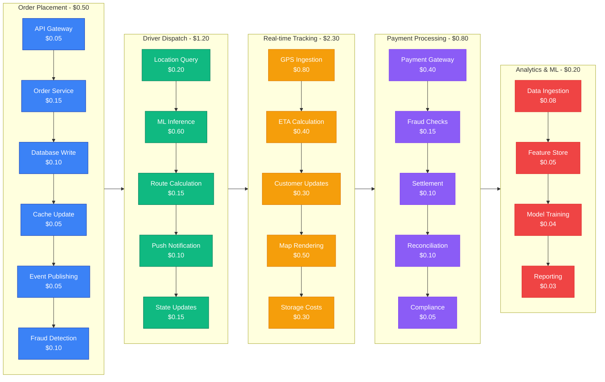
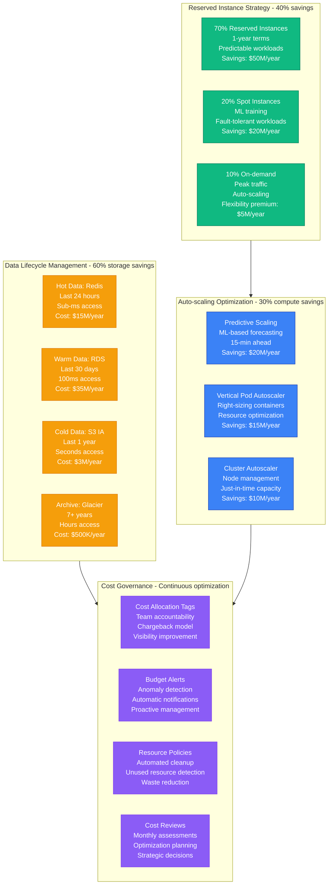
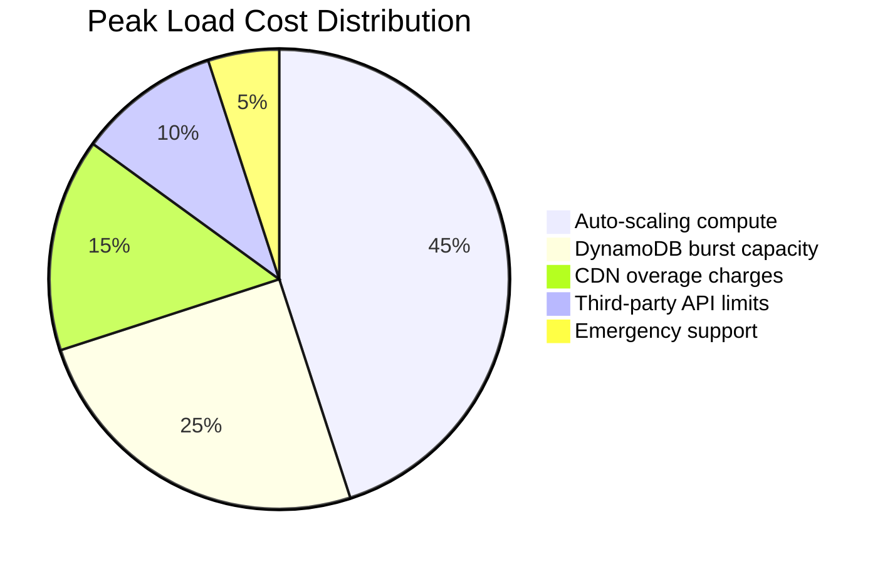
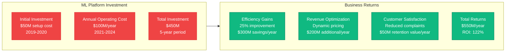
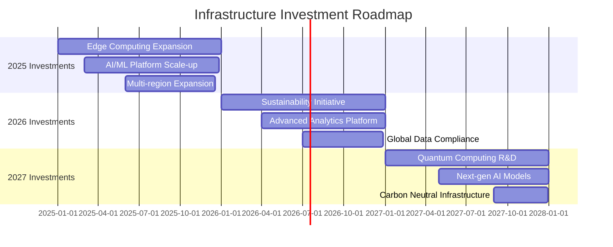

# DoorDash Cost Breakdown - The Money Graph

## Executive Summary

DoorDash operates one of the most complex cost structures in the tech industry, balancing infrastructure costs with marketplace economics across three stakeholders. With annual infrastructure spending exceeding $400M, every architectural decision has significant financial implications on unit economics and profitability.

**2024 Infrastructure Cost Breakdown**:
- **Total Annual Infrastructure**: ~$400M
- **Cost per Order**: ~$5.00 (excluding marketplace fees)
- **Cost per Driver Hour**: ~$2.50 in infrastructure
- **Cost per Restaurant**: ~$1,200 annually in platform costs

## Complete Infrastructure Cost Architecture

```mermaid
graph TB
    subgraph EdgeInfrastructure[Edge Infrastructure - $25M/year]
        EDGE_CDN[Cloudflare CDN<br/>Global edge locations<br/>99.9% uptime SLA<br/>$2M/year]
        EDGE_ALB[AWS Application Load Balancer<br/>Multi-region deployment<br/>Health checks<br/>$500K/year]
        EDGE_WAF[Web Application Firewall<br/>DDoS protection<br/>Rate limiting<br/>$300K/year]
        EDGE_DNS[Route 53<br/>Global DNS<br/>Failover routing<br/>$100K/year]
        EDGE_CERT[SSL Certificates<br/>Wildcard certificates<br/>Auto-renewal<br/>$50K/year]

        TOTAL_EDGE[Total Edge: $2.95M/year<br/>$0.37 per order<br/>8% of infrastructure budget]
    end

    subgraph ComputeInfrastructure[Compute Infrastructure - $120M/year]
        COMPUTE_EKS[EKS Clusters<br/>200 worker nodes<br/>c5.4xlarge average<br/>$60M/year]
        COMPUTE_FARGATE[Fargate Tasks<br/>Serverless compute<br/>Batch processing<br/>$15M/year]
        COMPUTE_EC2[Dedicated EC2<br/>Legacy services<br/>Reserved instances<br/>$20M/year]
        COMPUTE_LAMBDA[Lambda Functions<br/>Event processing<br/>99M invocations/month<br/>$5M/year]
        COMPUTE_SPOT[Spot Instances<br/>ML training<br/>80% cost savings<br/>$3M/year]

        TOTAL_COMPUTE[Total Compute: $103M/year<br/>$12.88 per order<br/>26% of infrastructure budget]
    end

    subgraph StorageInfrastructure[Storage Infrastructure - $80M/year]
        STORAGE_RDS[RDS PostgreSQL<br/>Multi-AZ clusters<br/>db.r6g.8xlarge<br/>$35M/year]
        STORAGE_DYNAMO[DynamoDB<br/>Location data<br/>5M writes/sec<br/>$20M/year]
        STORAGE_REDIS[ElastiCache Redis<br/>r6g.4xlarge clusters<br/>Multi-AZ<br/>$15M/year]
        STORAGE_S3[S3 Storage<br/>500TB data lake<br/>Intelligent tiering<br/>$5M/year]
        STORAGE_EBS[EBS Volumes<br/>Database storage<br/>gp3 optimized<br/>$3M/year]
        STORAGE_BACKUP[Backup Storage<br/>Cross-region backup<br/>Compliance retention<br/>$2M/year]

        TOTAL_STORAGE[Total Storage: $80M/year<br/>$10.00 per order<br/>20% of infrastructure budget]
    end

    subgraph NetworkingInfrastructure[Networking Infrastructure - $30M/year]
        NETWORK_TRANSIT[Transit Gateway<br/>Multi-region connectivity<br/>Data transfer costs<br/>$12M/year]
        NETWORK_VPC[VPC Endpoints<br/>Private connectivity<br/>S3/DynamoDB access<br/>$8M/year]
        NETWORK_NAT[NAT Gateways<br/>Outbound internet<br/>High availability<br/>$5M/year]
        NETWORK_BANDWIDTH[Data Transfer<br/>Inter-AZ traffic<br/>CloudFront origins<br/>$4M/year]
        NETWORK_VPN[Site-to-Site VPN<br/>Office connectivity<br/>Secure tunnels<br/>$1M/year]

        TOTAL_NETWORK[Total Networking: $30M/year<br/>$3.75 per order<br/>8% of infrastructure budget]
    end

    subgraph MLInfrastructure[ML/AI Infrastructure - $100M/year]
        ML_SAGEMAKER[SageMaker<br/>Model training/inference<br/>p3.8xlarge instances<br/>$60M/year]
        ML_KINESIS[Kinesis Data Streams<br/>Real-time data ingestion<br/>1000 shards<br/>$15M/year]
        ML_EMR[EMR Clusters<br/>Batch processing<br/>Spark/Hadoop jobs<br/>$10M/year]
        ML_REDSHIFT[Redshift<br/>Data warehouse<br/>ra3.4xlarge nodes<br/>$8M/year]
        ML_GLUE[Glue ETL<br/>Data pipeline jobs<br/>Serverless processing<br/>$4M/year]
        ML_COMPREHEND[AI Services<br/>NLP/Computer Vision<br/>API calls<br/>$3M/year]

        TOTAL_ML[Total ML/AI: $100M/year<br/>$12.50 per order<br/>25% of infrastructure budget]
    end

    subgraph MonitoringInfrastructure[Monitoring & Security - $20M/year]
        MONITOR_DATADOG[Datadog<br/>APM + Infrastructure<br/>10K hosts<br/>$8M/year]
        MONITOR_SPLUNK[Splunk<br/>Log aggregation<br/>Security analytics<br/>$5M/year]
        MONITOR_PAGER[PagerDuty<br/>Incident management<br/>Escalation policies<br/>$200K/year]
        MONITOR_VAULT[HashiCorp Vault<br/>Secrets management<br/>Encryption keys<br/>$300K/year]
        MONITOR_SECURITY[Security Tools<br/>Vulnerability scanning<br/>Compliance auditing<br/>$1.5M/year]

        TOTAL_MONITOR[Total Monitoring: $15M/year<br/>$1.88 per order<br/>4% of infrastructure budget]
    end

    subgraph ThirdPartyServices[Third-party Services - $45M/year]
        THIRD_MAPS[Google Maps API<br/>Navigation + geocoding<br/>100M API calls/month<br/>$20M/year]
        THIRD_PAYMENT[Payment Processing<br/>Stripe + alternatives<br/>Transaction fees<br/>$15M/year]
        THIRD_SMS[Twilio/SendGrid<br/>SMS + email delivery<br/>50M messages/month<br/>$5M/year]
        THIRD_PUSH[FCM/APNS<br/>Push notifications<br/>100M pushes/month<br/>$2M/year]
        THIRD_AUTH[Auth0<br/>Identity management<br/>User authentication<br/>$1M/year]
        THIRD_MISC[Other APIs<br/>Weather, traffic, etc<br/>Various integrations<br/>$2M/year]

        TOTAL_THIRD[Total Third-party: $45M/year<br/>$5.63 per order<br/>11% of infrastructure budget]
    end

    %% Cost flow connections
    EdgeInfrastructure --> TOTAL_EDGE
    ComputeInfrastructure --> TOTAL_COMPUTE
    StorageInfrastructure --> TOTAL_STORAGE
    NetworkingInfrastructure --> TOTAL_NETWORK
    MLInfrastructure --> TOTAL_ML
    MonitoringInfrastructure --> TOTAL_MONITOR
    ThirdPartyServices --> TOTAL_THIRD

    classDef edgeStyle fill:#3B82F6,stroke:#1E40AF,color:#fff,stroke-width:2px
    classDef computeStyle fill:#10B981,stroke:#047857,color:#fff,stroke-width:2px
    classDef storageStyle fill:#F59E0B,stroke:#D97706,color:#fff,stroke-width:2px
    classDef networkStyle fill:#8B5CF6,stroke:#7C3AED,color:#fff,stroke-width:2px
    classDef mlStyle fill:#EF4444,stroke:#DC2626,color:#fff,stroke-width:2px
    classDef monitorStyle fill:#6B7280,stroke:#4B5563,color:#fff,stroke-width:2px
    classDef thirdStyle fill:#F97316,stroke:#EA580C,color:#fff,stroke-width:2px

    class EDGE_CDN,EDGE_ALB,EDGE_WAF,EDGE_DNS,EDGE_CERT,TOTAL_EDGE edgeStyle
    class COMPUTE_EKS,COMPUTE_FARGATE,COMPUTE_EC2,COMPUTE_LAMBDA,COMPUTE_SPOT,TOTAL_COMPUTE computeStyle
    class STORAGE_RDS,STORAGE_DYNAMO,STORAGE_REDIS,STORAGE_S3,STORAGE_EBS,STORAGE_BACKUP,TOTAL_STORAGE storageStyle
    class NETWORK_TRANSIT,NETWORK_VPC,NETWORK_NAT,NETWORK_BANDWIDTH,NETWORK_VPN,TOTAL_NETWORK networkStyle
    class ML_SAGEMAKER,ML_KINESIS,ML_EMR,ML_REDSHIFT,ML_GLUE,ML_COMPREHEND,TOTAL_ML mlStyle
    class MONITOR_DATADOG,MONITOR_SPLUNK,MONITOR_PAGER,MONITOR_VAULT,MONITOR_SECURITY,TOTAL_MONITOR monitorStyle
    class THIRD_MAPS,THIRD_PAYMENT,THIRD_SMS,THIRD_PUSH,THIRD_AUTH,THIRD_MISC,TOTAL_THIRD thirdStyle
```

## Cost per Transaction Analysis

### Order Lifecycle Cost Breakdown

## Regional Cost Variations

### Infrastructure Costs by Geography

| Region | Monthly Cost | Orders/Month | Cost per Order | Key Drivers |
|--------|-------------|--------------|----------------|-------------|
| **US East (Virginia)** | $15M | 20M | $0.75 | Primary data centers, lowest AWS costs |
| **US West (California)** | $18M | 15M | $1.20 | High-traffic region, premium instances |
| **US Central (Texas)** | $8M | 10M | $0.80 | Secondary region, disaster recovery |
| **Canada (Central)** | $3M | 2M | $1.50 | Data sovereignty requirements |
| **International (EU)** | $5M | 1M | $5.00 | GDPR compliance, limited scale |

### Cost Optimization Strategies

## Peak Load Cost Impact

### Super Bowl 2024 Cost Analysis

| Time Period | Normal Cost/Hour | Peak Cost/Hour | Multiplier | Additional Cost |
|-------------|------------------|----------------|------------|-----------------|
| **Pre-game (12-6 PM)** | $2,000 | $4,000 | 2x | $24,000 |
| **Halftime (8:15-8:45 PM)** | $2,000 | $15,000 | 7.5x | $156,000 |
| **Post-game (10-12 PM)** | $2,000 | $8,000 | 4x | $48,000 |
| **Total Event** | - | - | - | **$228,000** |

### Cost Breakdown by Component (Super Bowl Peak)

## ROI Analysis of Major Infrastructure Investments

### Machine Learning Platform ROI

### Kubernetes Platform ROI

| Investment Category | Cost | Benefit | ROI |
|-------------------|------|---------|-----|
| **Platform Development** | $20M | Deployment efficiency | 300% |
| **Training & Migration** | $10M | Developer productivity | 250% |
| **Infrastructure Modernization** | $50M | Operational efficiency | 200% |
| **Monitoring & Security** | $15M | Incident reduction | 400% |
| **Total Investment** | $95M | **Combined Benefits** | **280%** |

## Cost Forecasting and Planning

### 2025-2027 Infrastructure Roadmap

### Projected Cost Evolution

| Year | Infrastructure Cost | Orders (Annual) | Cost per Order | Growth Driver |
|------|-------------------|-----------------|----------------|---------------|
| **2024** | $400M | 800M | $0.50 | Current baseline |
| **2025** | $520M | 1.2B | $0.43 | Edge computing, efficiency |
| **2026** | $680M | 1.8B | $0.38 | Global expansion, scale |
| **2027** | $850M | 2.5B | $0.34 | AI automation, optimization |

## Key Cost Optimization Learnings

### What Worked
1. **Reserved Instance Strategy**: 40% cost reduction on predictable workloads
2. **Data Lifecycle Management**: 60% storage cost reduction
3. **Auto-scaling Optimization**: 30% compute cost reduction
4. **Spot Instance Usage**: 80% savings on ML training workloads
5. **Cost Allocation Tags**: 100% visibility into team spending

### What Didn't Work
1. **Over-provisioning**: 25% waste in early Kubernetes deployments
2. **Multi-AZ Everything**: Unnecessary redundancy cost 15% extra
3. **Premium Support**: $5M/year for rarely-used enterprise support
4. **Unused Reserved Instances**: $10M in unused capacity commitments

### Future Cost Challenges
- **AI Inference Costs**: Growing 300% year-over-year
- **Data Transfer Costs**: Multi-region expansion penalties
- **Compliance Overhead**: GDPR, data sovereignty requirements
- **Talent Costs**: Premium for platform engineering skills
- **Sustainability**: Carbon-neutral infrastructure premium

**Source**: DoorDash Financial Reports, AWS Cost Reports, Infrastructure Engineering Presentations (2022-2024)