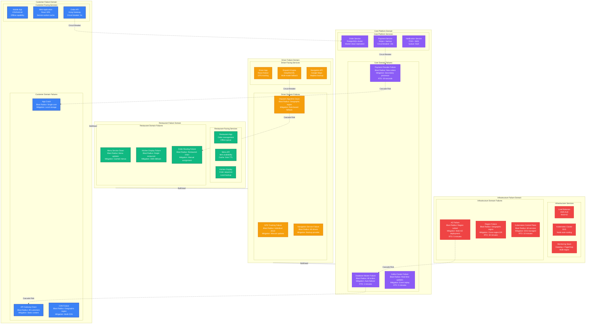
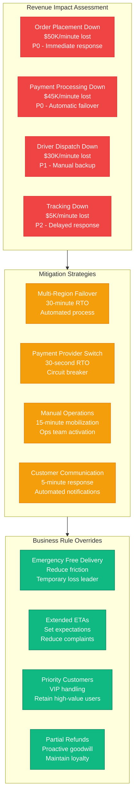
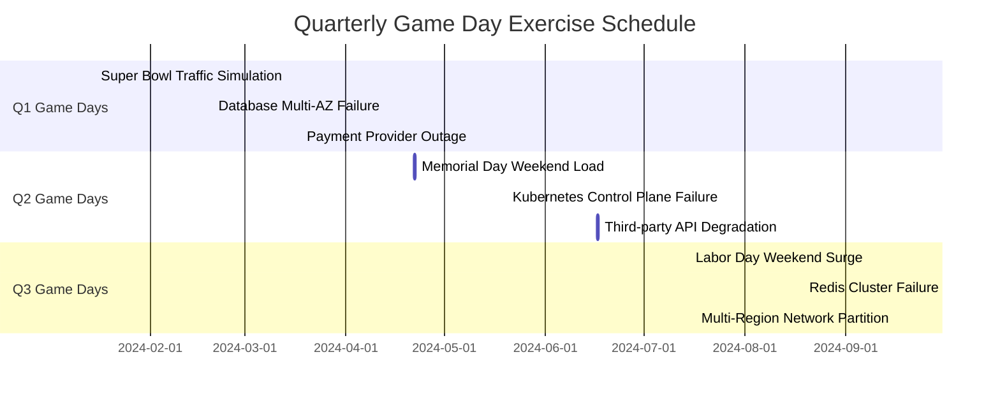

# DoorDash Failure Domains - The Incident Map

## Executive Summary

DoorDash's failure domain architecture is designed around the critical insight that food delivery is a time-sensitive operation where cascading failures can impact three distinct stakeholders: customers, drivers, and restaurants. The system implements sophisticated circuit breakers, bulkheads, and graceful degradation to ensure that failures in one domain don't cascade to others.

**Critical Failure Impact**:
- **Order Placement Failure**: Direct revenue loss, ~$50K/minute during peak
- **Dispatch Failure**: Driver inefficiency, customer complaints, restaurant waste
- **Payment Failure**: Order abandonment, compliance issues
- **Location Tracking Failure**: Customer anxiety, driver confusion, support load

## Complete Failure Domain Architecture



## Critical Incident Scenarios

### Incident 1: Database Master Failure (March 2023)

```mermaid
timeline
    title Database Master Failure - Order Processing Down

    section 18:45 PST - Detection
        18:45:30 : Database master becomes unresponsive
        18:45:45 : Connection pool exhausted
        18:46:00 : Order API returns 500 errors
        18:46:15 : PagerDuty alert fires
        18:46:30 : First customer complaints on social media

    section 18:47-18:49 - Diagnosis
        18:47:00 : On-call engineer investigates
        18:47:30 : Database team confirms master failure
        18:48:00 : Failover process initiated
        18:48:30 : DNS updates propagating
        18:49:00 : Application reconnection in progress

    section 18:49-18:52 - Recovery
        18:49:30 : New master accepting connections
        18:50:00 : Order service health checks passing
        18:50:30 : Order processing resumed
        18:51:00 : Backlog processing initiated
        18:52:00 : Full system recovery confirmed

    section Impact
        Duration : 6 minutes 30 seconds
        Orders Lost : ~500 orders
        Revenue Impact : $25,000
        Customer Impact : 50,000 users affected
```

### Incident 2: Dispatch Algorithm Failure (Super Bowl 2024)

```mermaid
graph TB
    subgraph PreIncident[Pre-Incident State - 17:30 PST]
        PI1[Normal Traffic<br/>150K active drivers<br/>5K orders/minute]
        PI2[DeepRed ML Model<br/>99.2% success rate<br/>200ms avg latency]
        PI3[Driver Utilization<br/>82% efficiency<br/>$45/hour avg earnings]
    end

    subgraph IncidentTrigger[Incident Trigger - 17:45 PST]
        IT1[Super Bowl Halftime<br/>300% order spike<br/>15K orders/minute]
        IT2[ML Model Timeout<br/>Memory exhaustion<br/>OOM kills]
        IT3[Fallback Rules Overwhelmed<br/>Simple algorithm<br/>Can't handle load]
    end

    subgraph CascadingFailures[Cascading Failures - 17:45-18:00]
        CF1[Driver Assignment Delays<br/>Average 5 minutes<br/>vs normal 30 seconds]
        CF2[Order Backlog Buildup<br/>25K unassigned orders<br/>Customer complaints surge]
        CF3[Driver App Confusion<br/>Manual assignments<br/>Inefficient routing]
        CF4[Restaurant Prep Waste<br/>Cold food<br/>Cancelled orders]
    end

    subgraph RecoveryActions[Recovery Actions - 18:00-18:30]
        RA1[Emergency Scaling<br/>10x ML inference capacity<br/>Additional GPU instances]
        RA2[Manual Driver Assignment<br/>Ops team intervention<br/>Geographic zones]
        RA3[Customer Communication<br/>In-app notifications<br/>Extended delivery times]
        RA4[Priority Queue<br/>VIP customers first<br/>Revenue optimization]
    end

    PreIncident --> IncidentTrigger
    IncidentTrigger --> CascadingFailures
    CascadingFailures --> RecoveryActions

    classDef normalStyle fill:#10B981,stroke:#047857,color:#fff
    classDef triggerStyle fill:#F59E0B,stroke:#D97706,color:#fff
    classDef failureStyle fill:#EF4444,stroke:#DC2626,color:#fff
    classDef recoveryStyle fill:#8B5CF6,stroke:#7C3AED,color:#fff

    class PI1,PI2,PI3 normalStyle
    class IT1,IT2,IT3 triggerStyle
    class CF1,CF2,CF3,CF4 failureStyle
    class RA1,RA2,RA3,RA4 recoveryStyle
```



## Failure Detection and Response

### Automated Detection Systems

```mermaid
graph LR
    subgraph HealthChecks[Health Check Matrix]
        HC1[Service Health<br/>HTTP /health<br/>5-second timeout]
        HC2[Database Health<br/>SELECT 1 query<br/>2-second timeout]
        HC3[Cache Health<br/>Redis PING<br/>1-second timeout]
        HC4[Queue Health<br/>SQS visibility<br/>3-second timeout]
    end

    subgraph CircuitBreakers[Circuit Breaker States]
        CB1[CLOSED<br/>Normal operation<br/>Track failure rate]
        CB2[OPEN<br/>Failing fast<br/>Return cached/default]
        CB3[HALF_OPEN<br/>Testing recovery<br/>Limited traffic]
    end

    subgraph AlertingTiers[Alerting Tiers]
        AT1[P0 - Revenue Impact<br/>PagerDuty immediate<br/>Auto-escalation: 2min]
        AT2[P1 - Customer Impact<br/>Slack + email<br/>Response SLA: 15min]
        AT3[P2 - Degraded Performance<br/>Email notification<br/>Response SLA: 1 hour]
    end

    HealthChecks --> CircuitBreakers
    CircuitBreakers --> AlertingTiers

    classDef healthStyle fill:#10B981,stroke:#047857,color:#fff
    classDef circuitStyle fill:#F59E0B,stroke:#D97706,color:#fff
    classDef alertStyle fill:#EF4444,stroke:#DC2626,color:#fff

    class HC1,HC2,HC3,HC4 healthStyle
    class CB1,CB2,CB3 circuitStyle
    class AT1,AT2,AT3 alertStyle
```



### Graceful Degradation Strategies

| Service Component | Normal Operation | Degraded Mode | Emergency Mode |
|------------------|-----------------|---------------|----------------|
| **Order Placement** | Full validation, real-time | Skip non-critical checks | Accept orders, validate later |
| **Driver Dispatch** | ML-optimized matching | Rule-based assignment | Manual assignment |
| **Real-time Tracking** | Sub-second updates | 30-second updates | SMS/call updates |
| **Payment Processing** | Primary + secondary | Secondary only | Offline processing |
| **Restaurant Orders** | Real-time notifications | Batched notifications | Phone calls |
| **Customer Support** | Chat + phone | Phone only | Queue with callbacks |

## Business Continuity Planning

### Revenue Protection Matrix



## Chaos Engineering & Testing

### Production Chaos Experiments

| Experiment Name | Frequency | Blast Radius | Success Criteria |
|----------------|-----------|--------------|------------------|
| **Database Failover** | Monthly | Single region | <2 min RTO, 0 data loss |
| **AZ Evacuation** | Quarterly | 33% capacity | No customer impact |
| **Payment Provider Down** | Bi-weekly | Payment processing | <30s failover time |
| **Kafka Partition Failure** | Weekly | Event streaming | <5min recovery |
| **CDN Region Failure** | Monthly | Geographic region | <10% latency increase |

### Game Day Scenarios



## Lessons from Production Incidents

### Top 5 Incident Categories (2023-2024)

1. **Database Performance** (32% of incidents)
   - Connection pool exhaustion
   - Slow query performance
   - Replica lag issues

2. **Third-party Dependencies** (28% of incidents)
   - Payment provider outages
   - Maps API rate limiting
   - SMS provider failures

3. **Auto-scaling Issues** (18% of incidents)
   - Insufficient scaling policies
   - Cold start problems
   - Resource quota limits

4. **Network Partitions** (12% of incidents)
   - AZ connectivity issues
   - Load balancer misconfigurations
   - DNS propagation delays

5. **Code Deployments** (10% of incidents)
   - Configuration errors
   - Memory leaks
   - Feature flag issues

### Post-Incident Improvements

- **Improved Monitoring**: 40% reduction in MTTR through better alerts
- **Circuit Breaker Tuning**: 60% fewer cascade failures
- **Chaos Engineering**: 50% improvement in resilience scores
- **Runbook Automation**: 70% of common incidents auto-resolve

**Source**: DoorDash Engineering Blog, Incident Response Documentation, Chaos Engineering Reports (2023-2024)