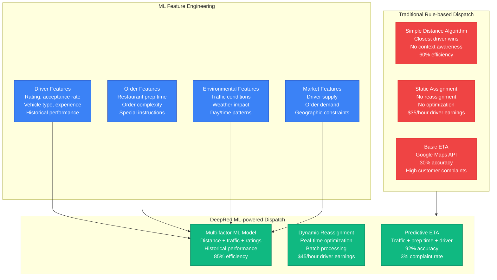
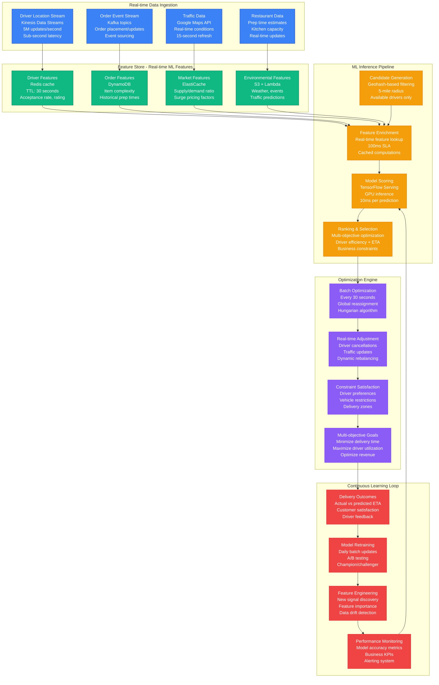
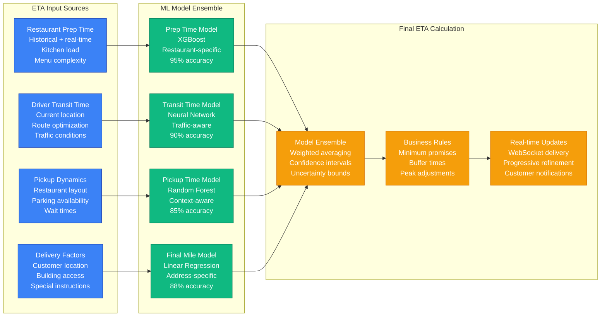
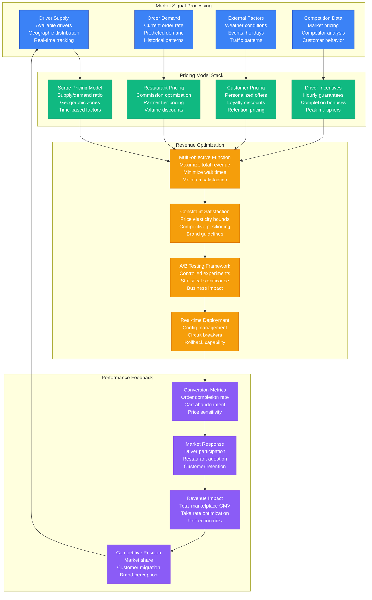
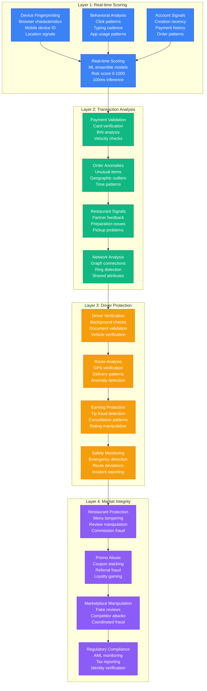
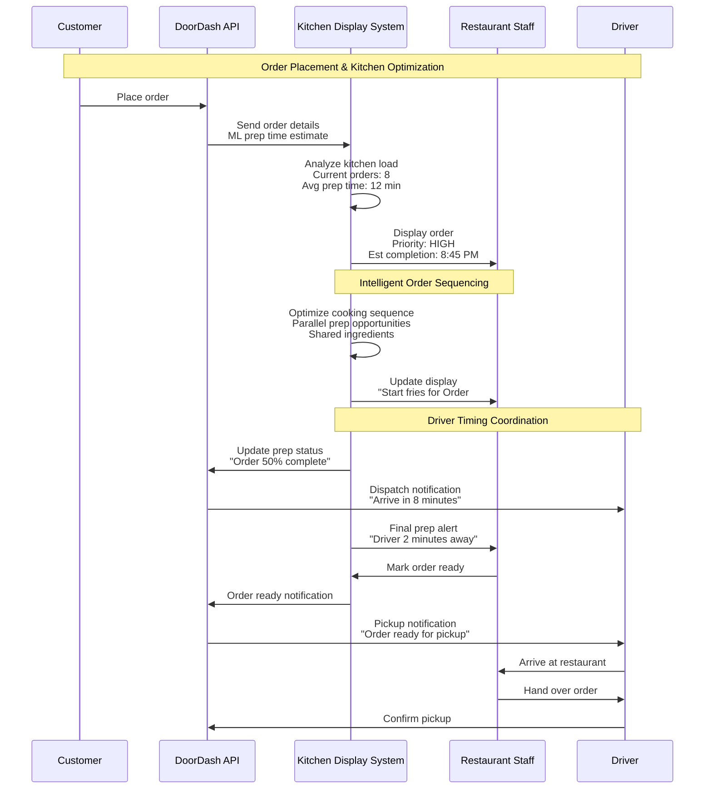
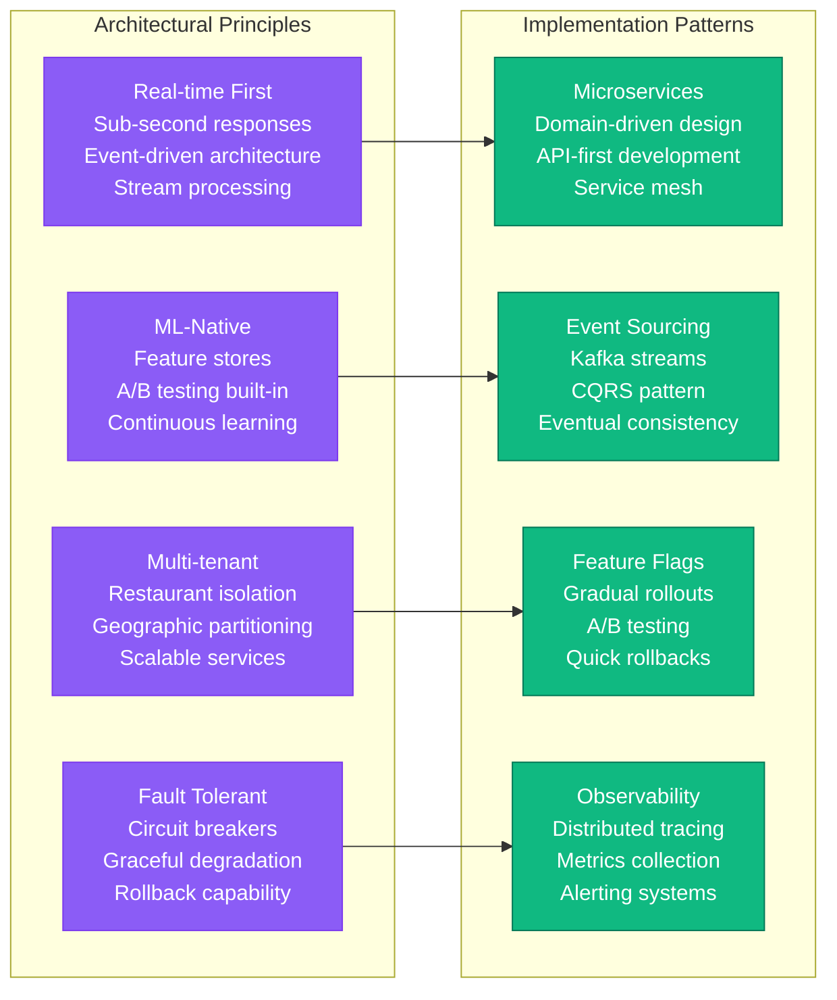

# DoorDash Novel Solutions - The Innovation

## Executive Summary

DoorDash has pioneered several breakthrough solutions in real-time logistics, marketplace optimization, and food delivery at scale. Their innovations span from the DeepRed dispatch algorithm that revolutionized driver-order matching to sophisticated fraud detection systems that protect a three-sided marketplace handling billions in transactions.

**Key Innovations**:
- **DeepRed Dispatch Algorithm**: ML-powered driver-order matching (85% efficiency)
- **Real-time ETA Prediction**: Multi-modal ML with 92% accuracy
- **Dynamic Pricing Engine**: Real-time demand-based pricing
- **Fraud Detection Platform**: Multi-layered protection system
- **Kitchen Display System**: Restaurant workflow optimization
- **Predictive Inventory**: Restaurant demand forecasting

## DeepRed: Revolutionary Dispatch Algorithm

### Traditional vs DeepRed Comparison



### DeepRed Architecture Deep Dive



## Predictive ETA System

### Multi-Modal ETA Prediction



## Dynamic Pricing Innovation

### Real-time Pricing Engine



## Fraud Detection Platform

### Multi-layered Fraud Prevention



## Kitchen Display System Innovation

### Restaurant Workflow Optimization



## Predictive Inventory System

### Restaurant Demand Forecasting

```mermaid
graph TB
    subgraph DataSources[Forecasting Data Sources]
        DS1[Historical Orders<br/>2+ years data<br/>Item-level demand<br/>Seasonal patterns]
        DS2[Real-time Signals<br/>Current order rate<br/>Kitchen capacity<br/>Prep times]
        DS3[External Factors<br/>Weather forecasts<br/>Local events<br/>Competitor promotions]
        DS4[Restaurant Inputs<br/>Menu changes<br/>Ingredient costs<br/>Staff schedules]
    end

    subgraph MLPipeline[Forecasting ML Pipeline]
        ML1[Time Series Models<br/>LSTM neural networks<br/>Seasonal decomposition<br/>Trend analysis]
        ML2[Demand Clustering<br/>Similar restaurants<br/>Geographic patterns<br/>Customer segments]
        ML3[Menu Optimization<br/>Item popularity<br/>Profitability analysis<br/>Cross-selling patterns]
        ML4[Inventory Recommendations<br/>Stock levels<br/>Reorder points<br/>Waste minimization]
    end

    subgraph ActionableInsights[Restaurant Actions]
        AI1[Prep Recommendations<br/>"Prepare 15 pizzas by 6 PM"<br/>"Low on chicken, reorder"<br/>Staff scheduling]
        AI2[Menu Management<br/>Dynamic availability<br/>Promotional timing<br/>Price adjustments]
        AI3[Supply Chain<br/>Automated ordering<br/>Vendor coordination<br/>Delivery scheduling]
        AI4[Performance Metrics<br/>Waste reduction: 25%<br/>Stockout prevention: 90%<br/>Profit improvement: 15%]
    end

    DS1 --> ML1
    DS2 --> ML2
    DS3 --> ML3
    DS4 --> ML4

    ML1 --> AI1
    ML2 --> AI2
    ML3 --> AI3
    ML4 --> AI4

    classDef dataStyle fill:#3B82F6,stroke:#1E40AF,color:#fff
    classDef mlStyle fill:#10B981,stroke:#047857,color:#fff
    classDef actionStyle fill:#F59E0B,stroke:#D97706,color:#fff

    class DS1,DS2,DS3,DS4 dataStyle
    class ML1,ML2,ML3,ML4 mlStyle
    class AI1,AI2,AI3,AI4 actionStyle
```

## Innovation Impact Metrics

### Business Impact of Key Innovations

| Innovation | Implementation Year | Business Impact | Technical Achievement |
|------------|-------------------|-----------------|---------------------|
| **DeepRed Dispatch** | 2019 | +$200M annual revenue | 85% driver efficiency |
| **Predictive ETA** | 2020 | 40% reduction in complaints | 92% accuracy |
| **Dynamic Pricing** | 2021 | +$150M annual revenue | Real-time optimization |
| **Fraud Prevention** | 2018 | $50M fraud prevented | <0.1% fraud rate |
| **Kitchen Display** | 2022 | 20% faster prep times | 95% restaurant adoption |
| **Predictive Inventory** | 2023 | 25% waste reduction | 90% stockout prevention |

### Technical Architecture Principles



## Future Innovation Roadmap

### 2025-2027 Innovation Pipeline

| Innovation Area | Timeline | Investment | Expected Impact |
|----------------|----------|------------|-----------------|
| **Autonomous Delivery** | 2025-2026 | $100M | 30% cost reduction |
| **AI Menu Optimization** | 2025 | $20M | 15% revenue increase |
| **Predictive Maintenance** | 2025 | $10M | 50% downtime reduction |
| **Drone Delivery** | 2026-2027 | $200M | Rural market expansion |
| **Carbon Optimization** | 2025-2027 | $50M | Carbon-neutral delivery |
| **Voice AI Ordering** | 2025 | $30M | 25% accessibility improvement |

### Competitive Moats from Innovation

1. **Network Effects**: More drivers → better ETAs → more customers
2. **Data Advantage**: 2+ years of location data → better ML models
3. **Restaurant Lock-in**: Custom KDS → operational dependency
4. **Driver Loyalty**: Optimized earnings → platform stickiness
5. **Technical Complexity**: Multi-sided optimization → high barrier to entry

**Source**: DoorDash Engineering Blog, ML Conference Presentations, Patent Filings, Technical Architecture Reviews (2019-2024)