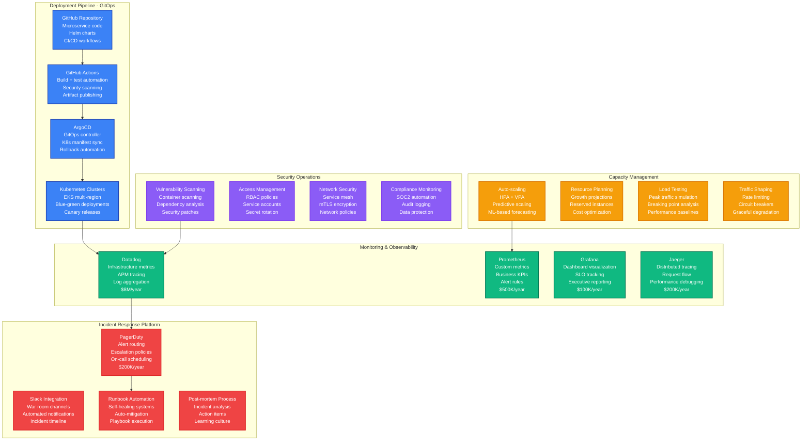
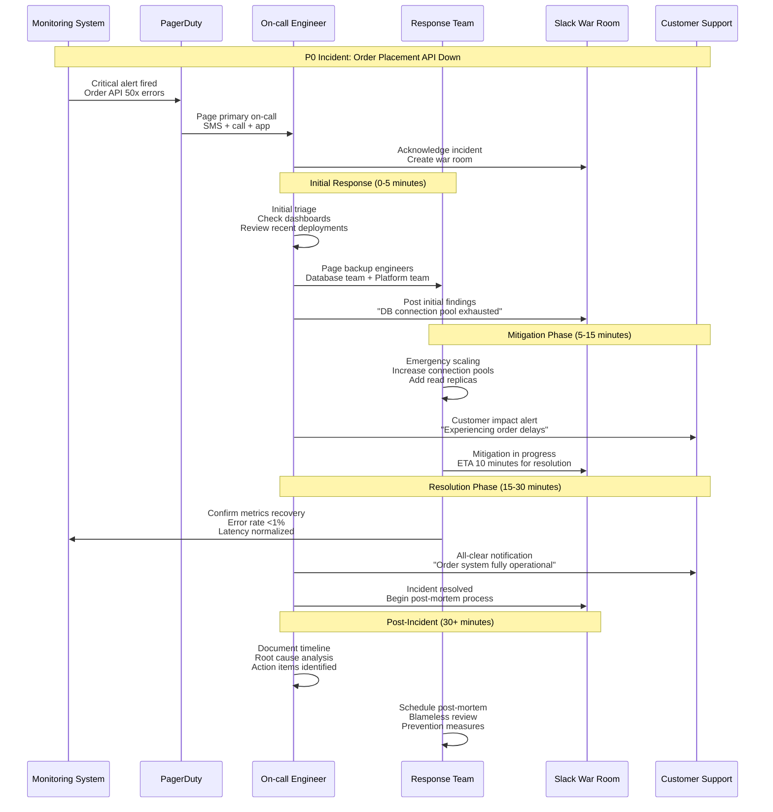
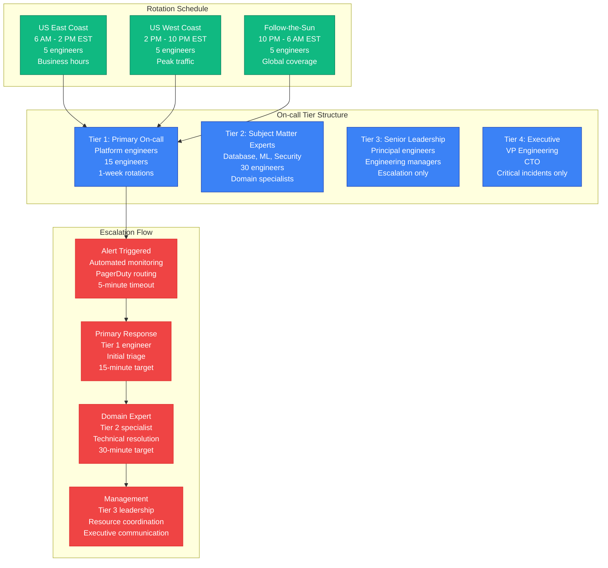
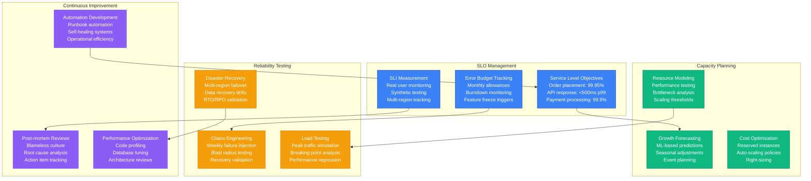

# DoorDash Production Operations - The Ops View

## Executive Summary

DoorDash operates one of the most complex production environments in the logistics industry, managing 2M+ daily orders across 7,000+ cities with 99.95% uptime requirements. Their operations team handles everything from routine deployments to massive traffic spikes during events like the Super Bowl, requiring sophisticated automation, monitoring, and incident response capabilities.

**Critical Operations Metrics**:
- **Deployment Frequency**: 1,000+ deployments/day
- **MTTR**: 15 minutes for P0 incidents
- **Uptime**: 99.95% for core order flow
- **Peak Traffic**: 10x normal during major events
- **On-call Engineers**: 24/7 coverage, 150+ engineers

## Production Operations Architecture



## Peak Load Operations - Super Bowl Case Study

### Super Bowl 2024 Operations Timeline

```mermaid
gantt
    title Super Bowl 2024 Operations Timeline
    dateFormat  HH:mm
    axisFormat %H:%M

    section Pre-Event Preparation
    Infrastructure scaling     :prep1, 12:00, 2h
    Team mobilization         :prep2, 14:00, 1h
    Monitoring setup          :prep3, 15:00, 1h
    Final system checks       :prep4, 16:00, 1h

    section Game Time Operations
    Pre-game traffic spike    :game1, 17:00, 1h
    First half operations     :game2, 18:00, 2h
    Halftime surge handling   :critical, game3, 20:15, 0.5h
    Second half operations    :game4, 20:45, 2h
    Post-game celebration     :game5, 23:00, 2h

    section Post-Event Recovery
    Traffic normalization     :post1, 01:00, 2h
    System scale-down         :post2, 03:00, 1h
    Performance analysis      :post3, 04:00, 3h
    Post-mortem preparation   :post4, 07:00, 2h
```

### Resource Scaling During Peak Events

```mermaid
graph TB
    subgraph NormalOperations[Normal Operations - Baseline]
        NO1[Kubernetes Nodes<br/>200 worker nodes<br/>c5.4xlarge<br/>$60K/day]
        NO2[Database Capacity<br/>db.r6g.8xlarge<br/>10K connections<br/>$15K/day]
        NO3[Cache Layer<br/>Redis r6g.4xlarge × 10<br/>100GB memory<br/>$5K/day]
        NO4[Load Balancer<br/>ALB standard<br/>Normal routing<br/>$1K/day]
    end

    subgraph PreEventScaling[Pre-Event Scaling - 2 hours before]
        PE1[Kubernetes Nodes<br/>400 worker nodes (+100%)<br/>c5.4xlarge<br/>$120K/day]
        PE2[Database Capacity<br/>Read replicas +5<br/>Connection pools +50%<br/>$25K/day]
        PE3[Cache Layer<br/>Redis r6g.8xlarge × 15<br/>300GB memory (+200%)<br/>$15K/day]
        PE4[Load Balancer<br/>Pre-warm ALB<br/>Health check tuning<br/>$2K/day]
    end

    subgraph PeakScaling[Peak Scaling - Halftime]
        PS1[Kubernetes Nodes<br/>800 worker nodes (+300%)<br/>c5.9xlarge<br/>$400K/day]
        PS2[Database Capacity<br/>Emergency read replicas<br/>20K connections<br/>$50K/day]
        PS3[Cache Layer<br/>Redis r6g.16xlarge × 25<br/>1TB memory (+1000%)<br/>$80K/day]
        PS4[Load Balancer<br/>Multi-region failover<br/>Geographic routing<br/>$10K/day]
    end

    subgraph PostEventScaling[Post-Event Scale Down - 4 hours after]
        POST1[Kubernetes Nodes<br/>300 worker nodes<br/>Gradual scale-down<br/>$90K/day]
        POST2[Database Capacity<br/>Normal + 2 replicas<br/>Standard connections<br/>$20K/day]
        POST3[Cache Layer<br/>Redis r6g.4xlarge × 12<br/>150GB memory<br/>$8K/day]
        POST4[Load Balancer<br/>Standard configuration<br/>Normal routing<br/>$1K/day]
    end

    NormalOperations --> PreEventScaling
    PreEventScaling --> PeakScaling
    PeakScaling --> PostEventScaling

    classDef normalStyle fill:#10B981,stroke:#047857,color:#fff
    classDef preStyle fill:#F59E0B,stroke:#D97706,color:#fff
    classDef peakStyle fill:#EF4444,stroke:#DC2626,color:#fff
    classDef postStyle fill:#3B82F6,stroke:#1E40AF,color:#fff

    class NO1,NO2,NO3,NO4 normalStyle
    class PE1,PE2,PE3,PE4 preStyle
    class PS1,PS2,PS3,PS4 peakStyle
    class POST1,POST2,POST3,POST4 postStyle
```

## Incident Response Framework

### P0 Incident Response Process



### Incident Classification and Response Times

| Incident Level | Definition | Response Time | Escalation | Examples |
|---------------|------------|---------------|------------|----------|
| **P0 - Critical** | Revenue impacting | 5 minutes | Immediate | Order placement down |
| **P1 - High** | Customer experience | 15 minutes | 30 minutes | Slow response times |
| **P2 - Medium** | Degraded functionality | 1 hour | 2 hours | Feature partially broken |
| **P3 - Low** | Minor issues | 4 hours | Next day | Cosmetic bugs |

## Deployment Operations

### Continuous Deployment Pipeline

```mermaid
graph LR
    subgraph Development[Development Workflow]
        DEV1[Feature Branch<br/>Developer commits<br/>Unit tests<br/>Code review]
        DEV2[Pull Request<br/>Automated testing<br/>Security scanning<br/>Approval required]
        DEV3[Main Branch<br/>Integration tests<br/>Build artifacts<br/>Container images]
    end

    subgraph Staging[Staging Environment]
        STAGE1[Deploy to Staging<br/>Full environment<br/>Integration testing<br/>Performance testing]
        STAGE2[QA Validation<br/>Manual testing<br/>Regression testing<br/>User acceptance]
        STAGE3[Load Testing<br/>Traffic simulation<br/>Breaking point<br/>Performance baseline]
    end

    subgraph Production[Production Deployment]
        PROD1[Canary Deployment<br/>5% traffic<br/>Error rate monitoring<br/>Automatic rollback]
        PROD2[Blue-Green Switch<br/>50% traffic split<br/>A/B testing<br/>Gradual rollout]
        PROD3[Full Deployment<br/>100% traffic<br/>Health monitoring<br/>Success confirmation]
    end

    subgraph Monitoring[Post-Deployment]
        MON1[Health Checks<br/>Service availability<br/>Error rate monitoring<br/>Performance metrics]
        MON2[Business Metrics<br/>Order completion rate<br/>Customer satisfaction<br/>Revenue impact]
        MON3[Rollback Decision<br/>Automated triggers<br/>Manual intervention<br/>Incident response]
    end

    DEV1 --> DEV2 --> DEV3
    DEV3 --> STAGE1 --> STAGE2 --> STAGE3
    STAGE3 --> PROD1 --> PROD2 --> PROD3
    PROD3 --> MON1 --> MON2 --> MON3

    classDef devStyle fill:#3B82F6,stroke:#1E40AF,color:#fff
    classDef stageStyle fill:#F59E0B,stroke:#D97706,color:#fff
    classDef prodStyle fill:#10B981,stroke:#047857,color:#fff
    classDef monStyle fill:#8B5CF6,stroke:#7C3AED,color:#fff

    class DEV1,DEV2,DEV3 devStyle
    class STAGE1,STAGE2,STAGE3 stageStyle
    class PROD1,PROD2,PROD3 prodStyle
    class MON1,MON2,MON3 monStyle
```



### Deployment Statistics (2024)

| Metric | Value | Industry Benchmark | DoorDash Advantage |
|--------|-------|-------------------|-------------------|
| **Deployments/Day** | 1,000+ | 10-50 | 20-100x higher |
| **Deployment Success Rate** | 99.5% | 95% | 4.5% better |
| **Rollback Rate** | 0.5% | 5-10% | 10-20x lower |
| **MTTR** | 15 minutes | 60 minutes | 4x faster |
| **Lead Time** | 2 hours | 2-4 weeks | 168-336x faster |

## On-call Operations

### 24/7 Coverage Model



## Performance Engineering

### Site Reliability Engineering (SRE) Practices



## Key Operational Metrics

### Daily Operations Dashboard

| Metric Category | Key Indicators | Target | Current | Trend |
|-----------------|----------------|--------|---------|--------|
| **Availability** | Order API uptime | 99.95% | 99.97% | ↗️ |
| **Performance** | P99 response time | <500ms | 420ms | ↗️ |
| **Deployment** | Success rate | >99% | 99.5% | → |
| **Incidents** | MTTR | <15min | 12min | ↗️ |
| **Capacity** | CPU utilization | <70% | 65% | → |
| **Cost** | Daily infrastructure | <$1.2M | $1.1M | ↗️ |

### Operational Excellence Awards (2024)

- **Fastest MTTR**: Database team - 8-minute average resolution
- **Lowest Error Rate**: Payment service - 0.01% error rate
- **Best Deployment Record**: Order service - 500 consecutive successful deployments
- **Innovation Award**: Auto-scaling team - 30% cost reduction through ML-based scaling

## Future Operations Roadmap

### 2025 Operations Initiatives

1. **AI-Powered Operations**: Predictive incident detection, automated resolution
2. **Global Follow-the-Sun**: 24/7 coverage with international teams
3. **Self-Healing Infrastructure**: 90% automatic incident resolution
4. **Chaos Engineering**: Advanced failure injection, blast radius testing
5. **Carbon-Neutral Operations**: Renewable energy, carbon offset automation

**Source**: DoorDash Engineering Blog, SRE Presentations, Operations Metrics Dashboard, Incident Response Documentation (2023-2024)