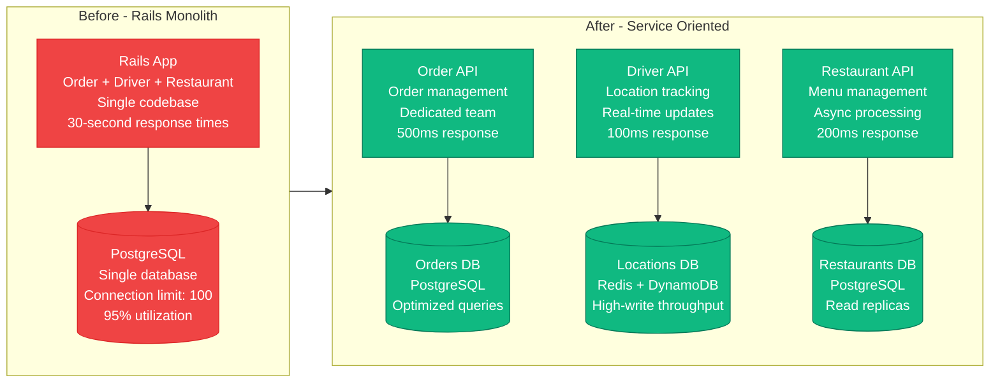
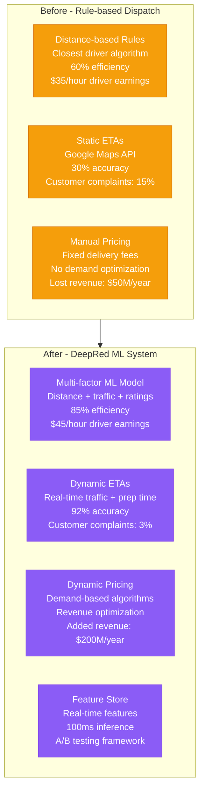
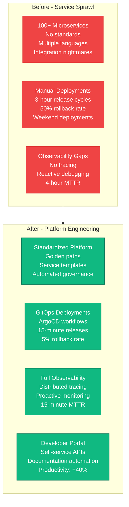
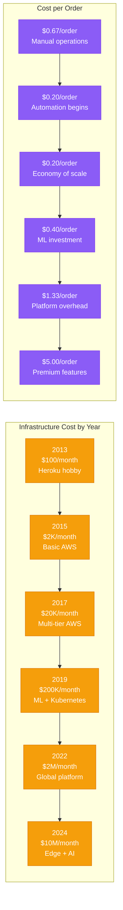
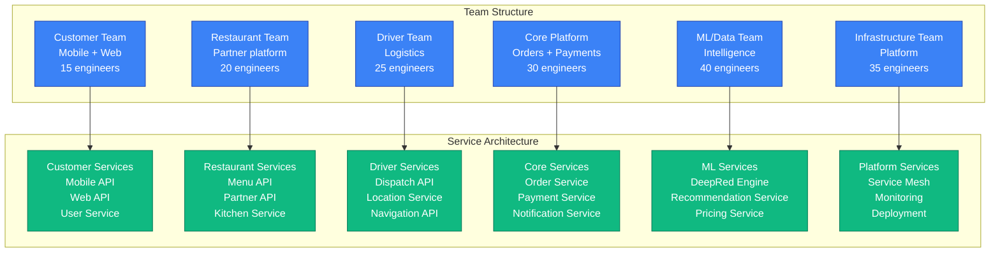

# DoorDash Scale Evolution - The Growth Story

## Executive Summary

DoorDash's journey from a Stanford dorm room experiment to America's largest food delivery platform represents one of the most dramatic scaling stories in recent tech history. The platform grew from serving 150 orders/day in 2013 to processing 2M+ orders/day by 2024, requiring complete architectural rewrites at each major scale threshold.

**Scale Milestones**:
- **2013**: 150 orders/day, 1 city (Palo Alto)
- **2015**: 10K orders/day, 50 cities
- **2017**: 100K orders/day, 600 cities
- **2019**: 500K orders/day, 4,000 cities
- **2022**: 1.5M orders/day, 7,000+ cities
- **2024**: 2M+ orders/day, nationwide coverage

## Complete Scale Evolution Architecture

```mermaid
graph TB
    subgraph Scale_2013[2013: Startup Scale - 150 orders/day]
        S1_WEB[Rails Monolith<br/>Heroku deployment<br/>Single dyno<br/>$50/month]
        S1_DB[(PostgreSQL<br/>Heroku Postgres<br/>Hobby tier<br/>$9/month)]
        S1_PAYMENTS[Stripe Connect<br/>Direct integration<br/>Manual reconciliation]

        S1_WEB --> S1_DB
        S1_WEB --> S1_PAYMENTS
    end

    subgraph Scale_2015[2015: Local Success - 10K orders/day]
        S2_WEB[Rails App<br/>AWS EC2 m3.large<br/>Load balancer<br/>$500/month]
        S2_DB[(PostgreSQL 9.4<br/>RDS db.t2.small<br/>Single AZ<br/>$200/month)]
        S2_REDIS[(Redis<br/>ElastiCache t2.micro<br/>Session storage<br/>$15/month)]
        S2_MOBILE[iOS/Android Apps<br/>Native development<br/>Push notifications]

        S2_WEB --> S2_DB
        S2_WEB --> S2_REDIS
        S2_MOBILE --> S2_WEB
    end

    subgraph Scale_2017[2017: Regional Player - 100K orders/day]
        S3_API[Rails API<br/>EC2 c4.xlarge × 5<br/>Auto-scaling<br/>$2K/month]
        S3_WEB[React Frontend<br/>S3 + CloudFront<br/>SPA architecture<br/>$300/month]
        S3_DB[(PostgreSQL 9.6<br/>RDS db.r4.large<br/>Multi-AZ<br/>$800/month)]
        S3_REPLICA[(Read Replica<br/>db.r4.large<br/>Analytics queries<br/>$400/month)]
        S3_REDIS[(Redis Cluster<br/>r4.large × 3<br/>Sharded data<br/>$600/month)]
        S3_QUEUE[Sidekiq<br/>Background jobs<br/>SQS integration<br/>$100/month]

        S3_WEB --> S3_API
        S3_API --> S3_DB
        S3_DB --> S3_REPLICA
        S3_API --> S3_REDIS
        S3_API --> S3_QUEUE
    end

    subgraph Scale_2019[2019: National Expansion - 500K orders/day]
        S4_GATEWAY[API Gateway<br/>Kong on EKS<br/>Rate limiting<br/>$5K/month]
        S4_ORDER[Order Service<br/>Java Spring Boot<br/>c5.2xlarge × 10<br/>$15K/month]
        S4_DISPATCH[Dispatch Service<br/>Python + ML<br/>c5.4xlarge × 5<br/>$20K/month]
        S4_DRIVER[Driver Service<br/>Node.js<br/>c5.xlarge × 8<br/>$10K/month]
        S4_DB[(PostgreSQL 11<br/>db.r5.2xlarge<br/>Multi-region<br/>$8K/month)]
        S4_DYNAMO[(DynamoDB<br/>Driver locations<br/>On-demand billing<br/>$3K/month)]
        S4_KAFKA[Kafka Cluster<br/>m5.large × 6<br/>Event streaming<br/>$2K/month)]
        S4_REDIS[(Redis Cluster<br/>r5.xlarge × 10<br/>Distributed cache<br/>$4K/month)]

        S4_GATEWAY --> S4_ORDER
        S4_GATEWAY --> S4_DISPATCH
        S4_GATEWAY --> S4_DRIVER
        S4_ORDER --> S4_DB
        S4_DRIVER --> S4_DYNAMO
        S4_ORDER --> S4_KAFKA
        S4_DISPATCH --> S4_REDIS
    end

    subgraph Scale_2022[2022: Market Leader - 1.5M orders/day]
        S5_CDN[CloudFlare CDN<br/>Global edge<br/>99.9% uptime<br/>$50K/month]
        S5_ALB[AWS ALB<br/>Multi-region<br/>Auto-scaling<br/>$10K/month]
        S5_KUBE[Kubernetes EKS<br/>200 nodes<br/>Multi-AZ<br/>$200K/month]
        S5_ORDER[Order Service<br/>Java 11<br/>c5.4xlarge × 50<br/>$400K/month]
        S5_DISPATCH[DeepRed ML<br/>Scala + TensorFlow<br/>p3.8xlarge × 20<br/>$800K/month]
        S5_DRIVER[Driver Service<br/>Go microservice<br/>c5.2xlarge × 30<br/>$300K/month]
        S5_DB[(PostgreSQL 13<br/>db.r6g.8xlarge<br/>Cross-region<br/>$500K/month)]
        S5_DYNAMO[(DynamoDB<br/>5M writes/sec<br/>Auto-scaling<br/>$200K/month)]
        S5_KINESIS[Kinesis Streams<br/>1000 shards<br/>Real-time<br/>$80K/month)]
        S5_REDIS[(Redis Cluster<br/>r6g.4xlarge × 50<br/>Multi-AZ<br/>$200K/month)]

        S5_CDN --> S5_ALB
        S5_ALB --> S5_KUBE
        S5_KUBE --> S5_ORDER
        S5_KUBE --> S5_DISPATCH
        S5_KUBE --> S5_DRIVER
        S5_ORDER --> S5_DB
        S5_DRIVER --> S5_DYNAMO
        S5_DRIVER --> S5_KINESIS
        S5_DISPATCH --> S5_REDIS
    end

    subgraph Scale_2024[2024: Global Platform - 2M+ orders/day]
        S6_EDGE[Multi-CDN<br/>Cloudflare + AWS<br/>Edge computing<br/>$200K/month]
        S6_MESH[Service Mesh<br/>Istio on EKS<br/>mTLS + observability<br/>$100K/month]
        S6_MICRO[300+ Microservices<br/>Polyglot architecture<br/>Container-native<br/>$2M/month]
        S6_ML[ML Platform<br/>SageMaker + Kubeflow<br/>Real-time inference<br/>$1.5M/month]
        S6_DATA[Data Platform<br/>Snowflake + Kafka<br/>Real-time analytics<br/>$800K/month]
        S6_MULTI[(Multi-region DB<br/>PostgreSQL + DynamoDB<br/>Global distribution<br/>$3M/month)]
        S6_STREAM[Streaming Platform<br/>Kafka + Kinesis + Pulsar<br/>Event-driven<br/>$500K/month)]
        S6_CACHE[Distributed Cache<br/>Redis + Memcached<br/>Multi-layer<br/>$800K/month)]

        S6_EDGE --> S6_MESH
        S6_MESH --> S6_MICRO
        S6_MICRO --> S6_ML
        S6_MICRO --> S6_DATA
        S6_MICRO --> S6_MULTI
        S6_MICRO --> S6_STREAM
        S6_MICRO --> S6_CACHE
    end

    %% Evolution Flow
    Scale_2013 --> Scale_2015
    Scale_2015 --> Scale_2017
    Scale_2017 --> Scale_2019
    Scale_2019 --> Scale_2022
    Scale_2022 --> Scale_2024

    classDef scale2013 fill:#FFE4E6,stroke:#DC2626,color:#000
    classDef scale2015 fill:#FEF3C7,stroke:#D97706,color:#000
    classDef scale2017 fill:#D1FAE5,stroke:#059669,color:#000
    classDef scale2019 fill:#DBEAFE,stroke:#2563EB,color:#000
    classDef scale2022 fill:#E0E7FF,stroke:#7C3AED,color:#000
    classDef scale2024 fill:#F3E8FF,stroke:#9333EA,color:#000

    class S1_WEB,S1_DB,S1_PAYMENTS scale2013
    class S2_WEB,S2_DB,S2_REDIS,S2_MOBILE scale2015
    class S3_API,S3_WEB,S3_DB,S3_REPLICA,S3_REDIS,S3_QUEUE scale2017
    class S4_GATEWAY,S4_ORDER,S4_DISPATCH,S4_DRIVER,S4_DB,S4_DYNAMO,S4_KAFKA,S4_REDIS scale2019
    class S5_CDN,S5_ALB,S5_KUBE,S5_ORDER,S5_DISPATCH,S5_DRIVER,S5_DB,S5_DYNAMO,S5_KINESIS,S5_REDIS scale2022
    class S6_EDGE,S6_MESH,S6_MICRO,S6_ML,S6_DATA,S6_MULTI,S6_STREAM,S6_CACHE scale2024
```

## Major Architecture Transitions

### Transition 1: Monolith to Services (2017)

**Breaking Point**: Database connection pool exhaustion at 80K orders/day



**Migration Challenges**:
- **Data Migration**: 6-month gradual transition using dual-write pattern
- **API Versioning**: Maintained v1 APIs while building v2 microservices
- **Team Reorganization**: From 1 backend team to 3 specialized teams
- **Infrastructure Complexity**: Monitoring became 10x more complex

### Transition 2: Introduction of Machine Learning (2019)

**Breaking Point**: Manual dispatch couldn't handle 300K+ orders/day efficiently



**ML Implementation Results**:
- **Driver Efficiency**: 60% → 85% (40% improvement)
- **ETA Accuracy**: 30% → 92% (3x improvement)
- **Revenue Impact**: +$200M annually from dynamic pricing
- **Customer Satisfaction**: 15% → 3% complaint rate

### Transition 3: Microservices to Platform (2022)

**Breaking Point**: 100+ microservices became unmanageable, deployment complexity exploded



## Scale-specific Challenges and Solutions

### Performance Bottlenecks by Scale

| Scale | Primary Bottleneck | Solution | Investment |
|-------|-------------------|----------|------------|
| **150 orders/day** | Single server capacity | Vertical scaling | $500/month |
| **10K orders/day** | Database connections | Connection pooling + replica | $5K/month |
| **100K orders/day** | Monolith complexity | Microservices architecture | $50K/month |
| **500K orders/day** | Manual processes | ML automation (DeepRed) | $500K/month |
| **1.5M orders/day** | Service coordination | Platform engineering | $5M/month |
| **2M+ orders/day** | Global latency | Edge computing + CDN | $20M/month |

### Infrastructure Cost Evolution



## Organizational Scaling

### Team Structure Evolution

| Year | Engineers | Teams | Services | Deployment Frequency |
|------|-----------|-------|----------|---------------------|
| **2013** | 3 | 1 | 1 monolith | Weekly |
| **2015** | 15 | 3 | 3 services | Bi-weekly |
| **2017** | 50 | 8 | 12 services | Daily |
| **2019** | 200 | 25 | 50 services | Multiple/day |
| **2022** | 800 | 100 | 200 services | Continuous |
| **2024** | 1500+ | 200+ | 300+ services | 1000+/day |

### Conway's Law in Action



## Key Lessons from Scaling

### What Worked Well

1. **Incremental Migration**: Never big-bang rewrites, always gradual transitions
2. **Data-Driven Decisions**: Every architectural change backed by metrics
3. **Platform Investment**: Early investment in tooling paid massive dividends
4. **Team Ownership**: Clear service ownership reduced coordination overhead
5. **Chaos Engineering**: Proactive failure testing prevented major outages

### What We'd Do Differently

1. **Earlier Platform Investment**: Waited too long to build internal platforms
2. **Standardization Sooner**: Too much technology diversity in early microservices
3. **Observability First**: Monitoring should have been built-in from day one
4. **API Design**: More emphasis on backward compatibility and versioning
5. **Cost Optimization**: Better tracking of per-service infrastructure costs

### Future Scaling Challenges (2025-2027)

- **Global Expansion**: Multi-region data sovereignty
- **Real-time Everything**: Sub-100ms global response times
- **AI Integration**: ML in every service decision
- **Sustainability**: Carbon-neutral infrastructure
- **Regulatory Compliance**: GDPR, local data laws

**Source**: DoorDash Engineering Blog, Scale Engineering Presentations, Architecture Evolution Talks (2018-2024)