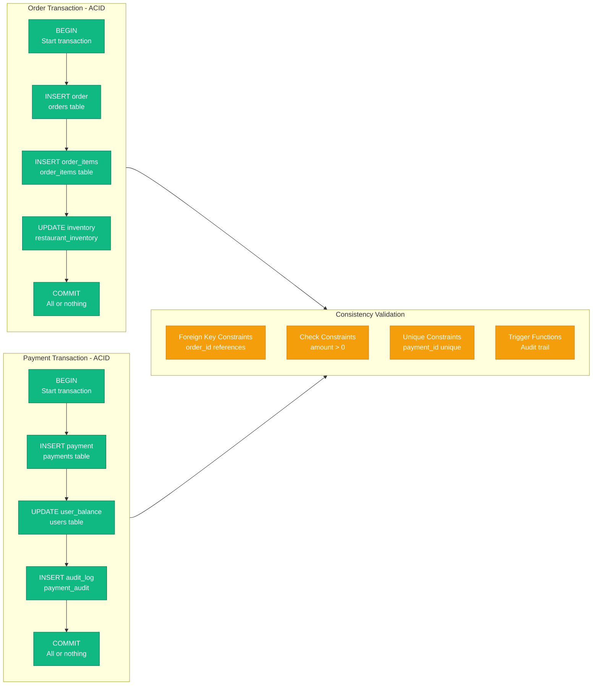
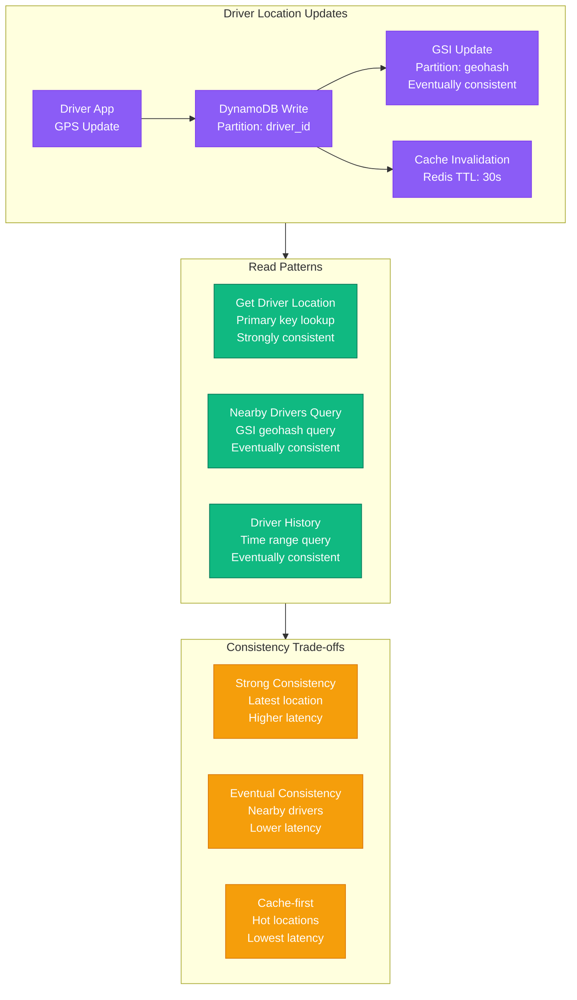

# DoorDash Storage Architecture - The Data Journey

## Executive Summary

DoorDash manages a complex multi-modal data architecture supporting real-time logistics at scale. The system handles 50TB+ of operational data with strict consistency requirements for orders and payments, eventual consistency for location tracking, and real-time streaming for driver dispatch and customer notifications.

**Storage Breakdown**:
- **Transactional Data**: 15TB (PostgreSQL clusters)
- **Location Data**: 25TB (DynamoDB, high-write throughput)
- **Analytics Data**: 500TB+ (S3 data lake)
- **Cache Layer**: 2TB (Redis/Memcached hot data)
- **Message Streaming**: 10TB/day throughput (Kafka/Kinesis)

## Complete Storage Architecture

```mermaid
graph TB
    subgraph EdgeCaching[Edge Caching Layer]
        CDN[Cloudflare CDN<br/>Static Assets<br/>Restaurant images, menus]
        REDIS_EDGE[Redis Edge Cache<br/>Restaurant availability<br/>TTL: 60 seconds]
    end

    subgraph ApplicationServices[Application Services]
        ORDER_SVC[Order Service]
        DRIVER_SVC[Driver Service]
        RESTAURANT_SVC[Restaurant Service]
        PAYMENT_SVC[Payment Service]
        DISPATCH_SVC[Dispatch Service]
    end

    subgraph TransactionalLayer[Transactional Storage - ACID Guarantees]
        subgraph OrdersCluster[Orders Database Cluster]
            ORDERS_PRIMARY[(Orders Primary<br/>PostgreSQL 14<br/>db.r6g.8xlarge<br/>50TB, 10K connections)]
            ORDERS_REPLICA1[(Orders Replica 1<br/>Read-only<br/>Analytics queries)]
            ORDERS_REPLICA2[(Orders Replica 2<br/>Read-only<br/>Reporting)]

            ORDERS_PRIMARY --> ORDERS_REPLICA1
            ORDERS_PRIMARY --> ORDERS_REPLICA2
        end

        subgraph UsersCluster[Users Database Cluster]
            USERS_PRIMARY[(Users Primary<br/>PostgreSQL 14<br/>db.r6g.4xlarge<br/>5TB, Customer profiles)]
            USERS_REPLICA[(Users Replica<br/>Read-only<br/>Profile lookups)]

            USERS_PRIMARY --> USERS_REPLICA
        end

        subgraph RestaurantsCluster[Restaurants Database Cluster]
            RESTAURANTS_PRIMARY[(Restaurants Primary<br/>PostgreSQL 14<br/>db.r6g.4xlarge<br/>8TB, Menu data)]
            RESTAURANTS_REPLICA[(Restaurants Replica<br/>Read-only<br/>Search queries)]

            RESTAURANTS_PRIMARY --> RESTAURANTS_REPLICA
        end

        subgraph PaymentsCluster[Payments Database Cluster]
            PAYMENTS_PRIMARY[(Payments Primary<br/>PostgreSQL 14<br/>db.r6g.2xlarge<br/>2TB, PCI compliant)]
            PAYMENTS_REPLICA[(Payments Replica<br/>Read-only<br/>Encrypted at rest)]

            PAYMENTS_PRIMARY --> PAYMENTS_REPLICA
        end
    end

    subgraph NoSQLLayer[NoSQL Storage - High Throughput]
        subgraph LocationStorage[Driver Location Storage]
            DRIVER_LOCATIONS[(DynamoDB Table<br/>DriverLocations<br/>Partition: driver_id<br/>Sort: timestamp<br/>5M writes/sec<br/>Auto-scaling enabled)]

            LOCATION_GSI[(Global Secondary Index<br/>Partition: geohash<br/>Sort: timestamp<br/>Spatial queries)]

            DRIVER_LOCATIONS --> LOCATION_GSI
        end

        subgraph CatalogStorage[Menu Catalog Storage]
            MENU_DYNAMO[(DynamoDB Table<br/>RestaurantMenus<br/>Partition: restaurant_id<br/>Sort: item_id<br/>Eventually consistent)]
        end

        subgraph SessionStorage[Session Storage]
            SESSION_DYNAMO[(DynamoDB Table<br/>UserSessions<br/>Partition: session_id<br/>TTL: 24 hours)]
        end
    end

    subgraph CachingLayer[Caching Layer - Sub-millisecond Access]
        subgraph RedisCluster[Redis Cluster]
            REDIS_ORDERS[(Redis Cluster<br/>Order Cache<br/>r6g.4xlarge × 10<br/>TTL: 1 hour)]
            REDIS_DRIVERS[(Redis Cluster<br/>Driver Status Cache<br/>r6g.2xlarge × 15<br/>TTL: 30 seconds)]
            REDIS_RESTAURANTS[(Redis Cluster<br/>Restaurant Cache<br/>r6g.2xlarge × 8<br/>TTL: 5 minutes)]
            REDIS_PRICES[(Redis Cluster<br/>Dynamic Pricing<br/>r6g.xlarge × 5<br/>TTL: 60 seconds)]
        end

        MEMCACHED[(Memcached<br/>Hot Location Data<br/>r6g.large × 20<br/>TTL: 10 seconds)]
    end

    subgraph StreamingLayer[Streaming Data Layer]
        subgraph KafkaCluster[Kafka Cluster - Event Sourcing]
            KAFKA_ORDERS[orders-events<br/>Partitions: 50<br/>Retention: 7 days<br/>Replication: 3]
            KAFKA_DRIVERS[driver-events<br/>Partitions: 100<br/>Retention: 1 day<br/>Replication: 3]
            KAFKA_RESTAURANTS[restaurant-events<br/>Partitions: 20<br/>Retention: 7 days<br/>Replication: 3]
        end

        subgraph KinesisStreams[Kinesis Data Streams]
            KINESIS_LOCATIONS[driver-locations<br/>1000 shards<br/>24-hour retention<br/>5M records/sec]
            KINESIS_EVENTS[order-tracking<br/>500 shards<br/>Real-time processing]
        end
    end

    subgraph AnalyticsLayer[Analytics & Data Lake]
        subgraph DataLake[S3 Data Lake]
            S3_RAW[(S3 Raw Data<br/>Parquet format<br/>500TB+ historical<br/>Lifecycle: IA → Glacier)]
            S3_PROCESSED[(S3 Processed<br/>Aggregated metrics<br/>Daily/hourly rollups)]
        end

        subgraph OLAP[OLAP Systems]
            REDSHIFT[(Redshift Cluster<br/>ra3.4xlarge × 20<br/>Analytics queries<br/>100TB)]
            SNOWFLAKE[(Snowflake<br/>ML feature store<br/>Real-time analytics)]
        end
    end

    %% Service Connections
    ORDER_SVC --> ORDERS_PRIMARY
    ORDER_SVC --> REDIS_ORDERS
    ORDER_SVC --> KAFKA_ORDERS

    DRIVER_SVC --> DRIVER_LOCATIONS
    DRIVER_SVC --> REDIS_DRIVERS
    DRIVER_SVC --> KINESIS_LOCATIONS
    DRIVER_SVC --> MEMCACHED

    RESTAURANT_SVC --> RESTAURANTS_PRIMARY
    RESTAURANT_SVC --> MENU_DYNAMO
    RESTAURANT_SVC --> REDIS_RESTAURANTS
    RESTAURANT_SVC --> KAFKA_RESTAURANTS

    PAYMENT_SVC --> PAYMENTS_PRIMARY
    PAYMENT_SVC --> SESSION_DYNAMO

    DISPATCH_SVC --> DRIVER_LOCATIONS
    DISPATCH_SVC --> LOCATION_GSI
    DISPATCH_SVC --> REDIS_DRIVERS
    DISPATCH_SVC --> KAFKA_DRIVERS

    %% Data Flow Connections
    KAFKA_ORDERS --> S3_RAW
    KINESIS_LOCATIONS --> S3_RAW
    S3_RAW --> S3_PROCESSED
    S3_PROCESSED --> REDSHIFT
    S3_PROCESSED --> SNOWFLAKE

    %% Apply four-plane colors
    classDef edgeStyle fill:#3B82F6,stroke:#1E40AF,color:#fff,stroke-width:2px
    classDef serviceStyle fill:#10B981,stroke:#047857,color:#fff,stroke-width:2px
    classDef stateStyle fill:#F59E0B,stroke:#D97706,color:#fff,stroke-width:2px
    classDef controlStyle fill:#8B5CF6,stroke:#7C3AED,color:#fff,stroke-width:2px

    class CDN,REDIS_EDGE edgeStyle
    class ORDER_SVC,DRIVER_SVC,RESTAURANT_SVC,PAYMENT_SVC,DISPATCH_SVC serviceStyle
    class ORDERS_PRIMARY,ORDERS_REPLICA1,ORDERS_REPLICA2,USERS_PRIMARY,USERS_REPLICA,RESTAURANTS_PRIMARY,RESTAURANTS_REPLICA,PAYMENTS_PRIMARY,PAYMENTS_REPLICA stateStyle
    class DRIVER_LOCATIONS,LOCATION_GSI,MENU_DYNAMO,SESSION_DYNAMO stateStyle
    class REDIS_ORDERS,REDIS_DRIVERS,REDIS_RESTAURANTS,REDIS_PRICES,MEMCACHED stateStyle
    class KAFKA_ORDERS,KAFKA_DRIVERS,KAFKA_RESTAURANTS,KINESIS_LOCATIONS,KINESIS_EVENTS stateStyle
    class S3_RAW,S3_PROCESSED,REDSHIFT,SNOWFLAKE stateStyle
```



## Data Consistency Models

### Strict ACID Consistency (PostgreSQL)



### Eventually Consistent (DynamoDB)



## Data Partitioning Strategies

### Geographic Partitioning (Orders)

| Region | Database Instance | Orders/Day | Storage Size | Notes |
|--------|------------------|------------|--------------|-------|
| **US-West** | us-west-1-primary | 800K | 20TB | CA, WA, OR, NV |
| **US-East** | us-east-1-primary | 1.2M | 30TB | NY, MA, FL, GA |
| **US-Central** | us-central-1-primary | 600K | 15TB | TX, IL, OH, MI |
| **Canada** | ca-central-1-primary | 200K | 5TB | Toronto, Vancouver |

### Time-based Partitioning (Locations)

```sql
-- DynamoDB Table Design
Table: DriverLocations
Partition Key: driver_id
Sort Key: timestamp (UNIX milliseconds)

-- Hot Partition (current day)
driver_123#2024-01-15 → Current tracking data

-- Warm Partitions (last 7 days)
driver_123#2024-01-14 → Historical data

-- Cold Storage (> 7 days)
Archived to S3 via DynamoDB TTL
```

### Hash-based Partitioning (Kafka)

```yaml
# Orders Events Topic
Topic: orders-events
Partitions: 50
Partition Key: order_id hash
Replication Factor: 3
Retention: 7 days

# Driver Events Topic
Topic: driver-events
Partitions: 100
Partition Key: driver_id hash
Replication Factor: 3
Retention: 24 hours
```

## Performance Characteristics

### Database Performance (Production Metrics)

| Database | Read QPS | Write QPS | P99 Latency | Connection Pool |
|----------|----------|-----------|-------------|-----------------|
| **Orders Primary** | 15K | 8K | 50ms | 1000 |
| **Orders Replica** | 25K | 0 | 30ms | 500 |
| **Driver Locations** | 100K | 50K | 10ms | Auto-scale |
| **Redis Cluster** | 500K | 100K | 1ms | 2000 |

### Storage Costs (Annual)

| Storage Type | Capacity | Annual Cost | Cost/GB/Month |
|--------------|----------|-------------|---------------|
| **PostgreSQL (GP2)** | 65TB | $8M | $0.115 |
| **DynamoDB** | 25TB | $6M | $0.25 |
| **Redis** | 2TB | $2M | $1.00 |
| **S3 Standard** | 100TB | $300K | $0.023 |
| **S3 Glacier** | 400TB | $160K | $0.004 |

## Backup and Recovery Strategy

### PostgreSQL Backup Strategy
- **Continuous WAL Archiving**: 15-minute RPO
- **Daily Full Backups**: Automated via pg_basebackup
- **Point-in-time Recovery**: 30-day retention
- **Cross-region Replication**: us-east-1 → us-west-2

### DynamoDB Backup Strategy
- **Point-in-time Recovery**: Enabled, 35-day retention
- **On-demand Backups**: Weekly full backups
- **Cross-region Backup**: Automated to secondary region
- **Item-level Restore**: Available for critical data

### Data Lake Backup Strategy
- **S3 Cross-region Replication**: Automatic
- **Versioning**: Enabled on critical buckets
- **Lifecycle Policies**: Standard → IA → Glacier → Deep Archive
- **Compliance**: 7-year retention for financial data

## Security and Compliance

### Encryption Standards
- **At Rest**: AES-256 for all storage systems
- **In Transit**: TLS 1.3 for all data movement
- **Key Management**: AWS KMS with automatic rotation
- **Field-level**: PII encrypted at application layer

### Access Controls
- **Database Access**: IAM roles with least privilege
- **VPC Isolation**: Private subnets, no internet access
- **Audit Logging**: All database queries logged
- **Data Masking**: PII masked in non-production environments

## Monitoring and Alerting

### Critical Metrics
- **Database Connection Pool**: >80% utilization
- **DynamoDB Throttling**: >0.1% throttled requests
- **Replication Lag**: >5 seconds
- **Cache Hit Rate**: <95% for Redis clusters
- **Storage Growth**: >10% week-over-week

### Automated Responses
- **Auto-scaling**: DynamoDB read/write capacity
- **Connection Pooling**: Automatic pool size adjustment
- **Cache Warming**: Predictive pre-loading
- **Partition Rebalancing**: Automatic Kafka partition management

**Source**: DoorDash Engineering Blog, Database Architecture Talks, AWS re:Invent Presentations (2023-2024)