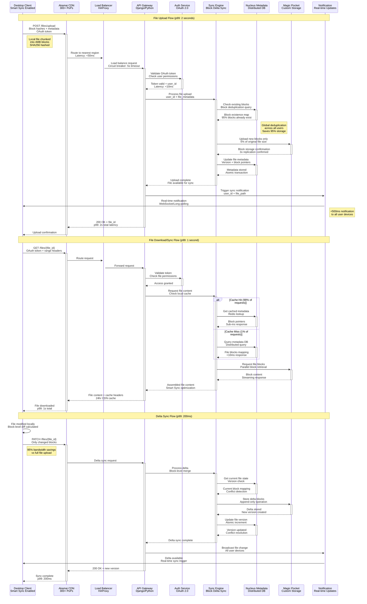

# Dropbox Request Flow

## File Upload/Download and Sync Flow

Dropbox's request flow handles billions of file operations daily through block-level delta sync, achieving 95% bandwidth reduction and sub-second sync latency across 700M+ users.



## Request Flow Metrics

| Operation | P50 Latency | P99 Latency | Throughput | Bandwidth Savings |
|-----------|-------------|-------------|------------|-------------------|
| **File Upload** | 800ms | 2s | 1M+ uploads/hour | 95% via deduplication |
| **File Download** | 300ms | 1s | 10M+ downloads/hour | 99% cache hit rate |
| **Delta Sync** | 50ms | 200ms | 100M+ syncs/hour | 95% vs full file |
| **Real-time Notification** | 100ms | 500ms | 1B+ notifications/day | WebSocket efficiency |

## Critical Path Optimizations

### Block-Level Deduplication
```
Original File: 100MB
After Chunking: 25 × 4MB blocks
Global Dedup Hit: 95% (23 blocks exist)
Upload Required: 5% (2 new blocks = 8MB)
Bandwidth Saved: 95% (92MB saved)
```

### Smart Sync Intelligence
```
User Requests File → Check Local Cache →
Cache Miss → Download Metadata Only →
On-Demand Block Retrieval → Assemble File →
Background Prefetch Related Files
```

### Real-Time Sync Pipeline
```
File Change Detected → Block Diff Calculated →
Delta Upload (2-8MB avg) → Metadata Update →
Push Notification → Device Sync Triggered →
<500ms End-to-End Sync Time
```

## Performance SLAs

- **Upload Latency**: p99 under 2 seconds for files up to 1GB
- **Download Latency**: p99 under 1 second with 99% cache hit
- **Sync Propagation**: <500ms notification to all devices
- **Delta Sync**: p99 under 200ms for incremental changes
- **API Availability**: 99.9% uptime with <100ms baseline latency

## Failure Handling

- **Network Interruption**: Resume upload from last block
- **Auth Token Expiry**: Auto-refresh with exponential backoff
- **Storage Backend Error**: Failover to secondary Magic Pocket
- **Metadata Inconsistency**: Last-writer-wins with conflict resolution
- **Rate Limiting**: Exponential backoff with jitter (max 30s)

*Source: Dropbox Engineering Blog, Sync Protocol Documentation, Performance Engineering Talks*