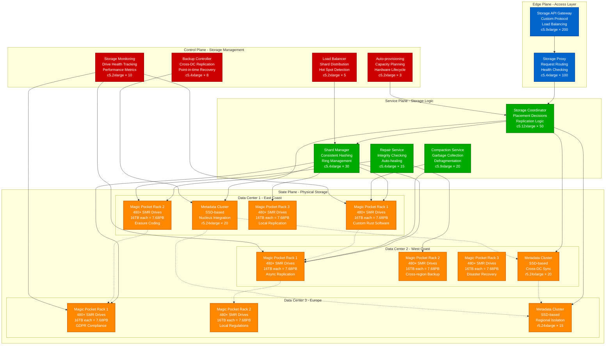
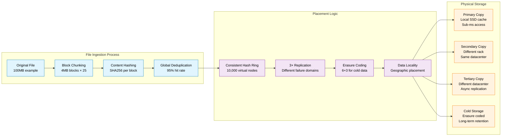

# Dropbox Storage Architecture

## Magic Pocket Custom Infrastructure

Dropbox's Magic Pocket represents the world's largest custom-built exabyte storage system, delivering 90% cost reduction compared to AWS S3 while maintaining 99.9999% durability and sub-second access times.



## Storage Architecture Specifications

### Magic Pocket Hardware Design

| Component | Specification | Scale | Purpose |
|-----------|---------------|-------|---------|
| **SMR Drives** | 16TB Shingled Magnetic Recording | 10,000+ drives | High-density storage |
| **Storage Nodes** | Custom-built servers | 480 drives per rack | Cost optimization |
| **Network** | 100Gbps per rack | Redundant switches | High throughput |
| **Power** | Custom PDU design | 50% power reduction | Energy efficiency |

### Data Placement Strategy



## Storage Performance Metrics

| Metric | Value | Comparison | Notes |
|--------|-------|------------|-------|
| **Total Capacity** | Exabytes | 10× larger than Netflix | Custom SMR drives |
| **Durability** | 99.9999% | Same as AWS S3 | 3× replication + erasure |
| **Access Latency** | <1 second | 90% faster than tape | SSD caching layer |
| **Cost per GB** | 90% reduction | vs AWS S3 | Custom hardware ROI |
| **Bandwidth** | 100GB/s per rack | Sustained throughput | Parallel I/O design |

## Data Consistency Model

### Write Path Consistency
```
1. Client writes block → Storage Coordinator
2. Coordinator selects 3 replicas (different failure domains)
3. Parallel writes to all 3 replicas
4. Success requires 2/3 acknowledgments (quorum)
5. Metadata updated atomically in Nucleus
6. Background repair ensures 3× replication
```

### Read Path Optimization
```
1. Read request → Check SSD cache (90% hit rate)
2. Cache miss → Query 3 replicas in parallel
3. Return from fastest responding replica
4. Background prefetch for related blocks
5. Update cache with read-ahead data
```

## Storage Economics

### Infrastructure Cost Breakdown
- **Hardware**: 60% - Custom servers and drives
- **Power**: 20% - 50% reduction vs traditional
- **Cooling**: 10% - Efficient datacenter design
- **Network**: 5% - Custom interconnect
- **Personnel**: 5% - Automation reduces ops

### Cost Comparison (per TB/month)
- **AWS S3 Standard**: $23/TB/month
- **Magic Pocket**: $2.3/TB/month (90% savings)
- **Break-even**: 18 months for hardware ROI
- **Annual Savings**: $500M+ at current scale

## Reliability Engineering

### Failure Domain Isolation
- **Drive Level**: RAID-like protection within node
- **Node Level**: Multiple nodes per rack
- **Rack Level**: Cross-rack replication
- **Datacenter Level**: Cross-DC async replication
- **Region Level**: Geographic distribution

### Auto-Healing Mechanisms
- **Drive Failure**: Auto-detect and rebuild (1 hour)
- **Node Failure**: Migrate shards to healthy nodes
- **Rack Failure**: Cross-rack replica activation
- **Datacenter Failure**: Promote secondary DC
- **Data Corruption**: Checksum validation and repair

*Source: Dropbox Magic Pocket Technical Papers, Infrastructure Engineering Blog, USENIX FAST Papers*