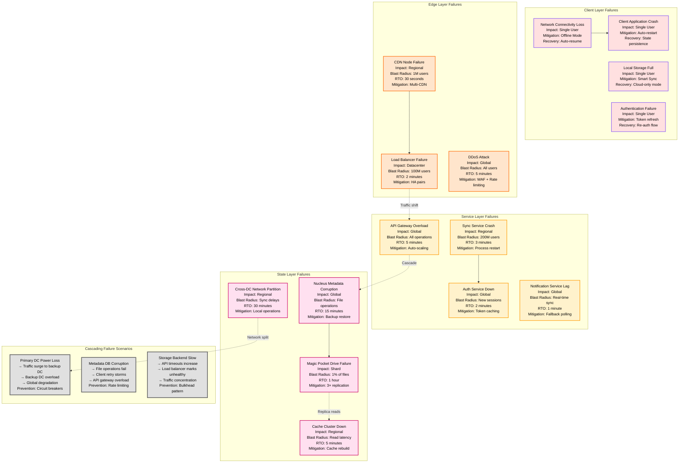
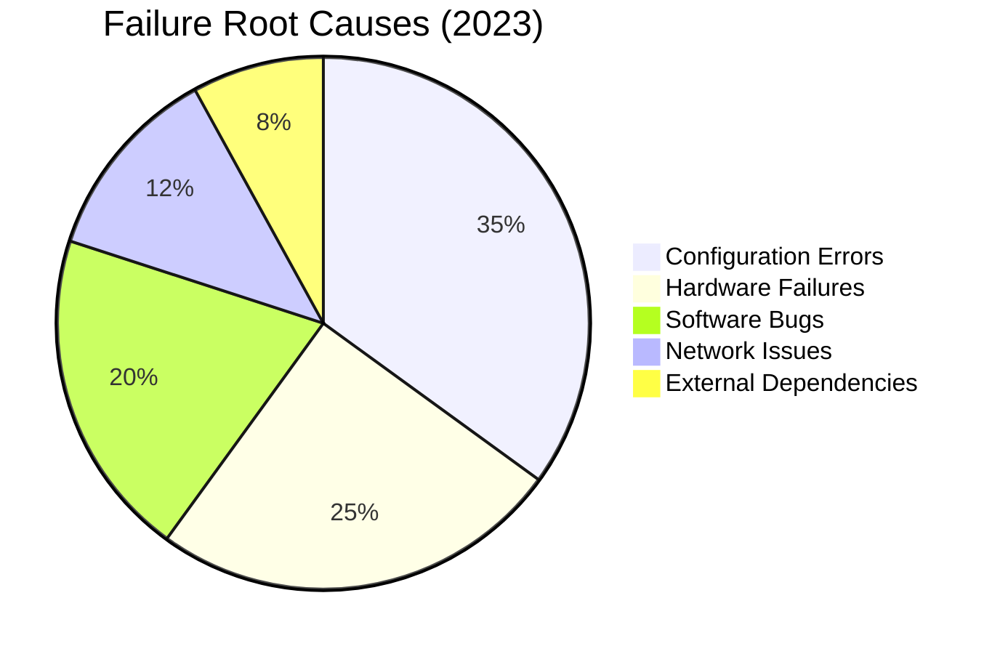
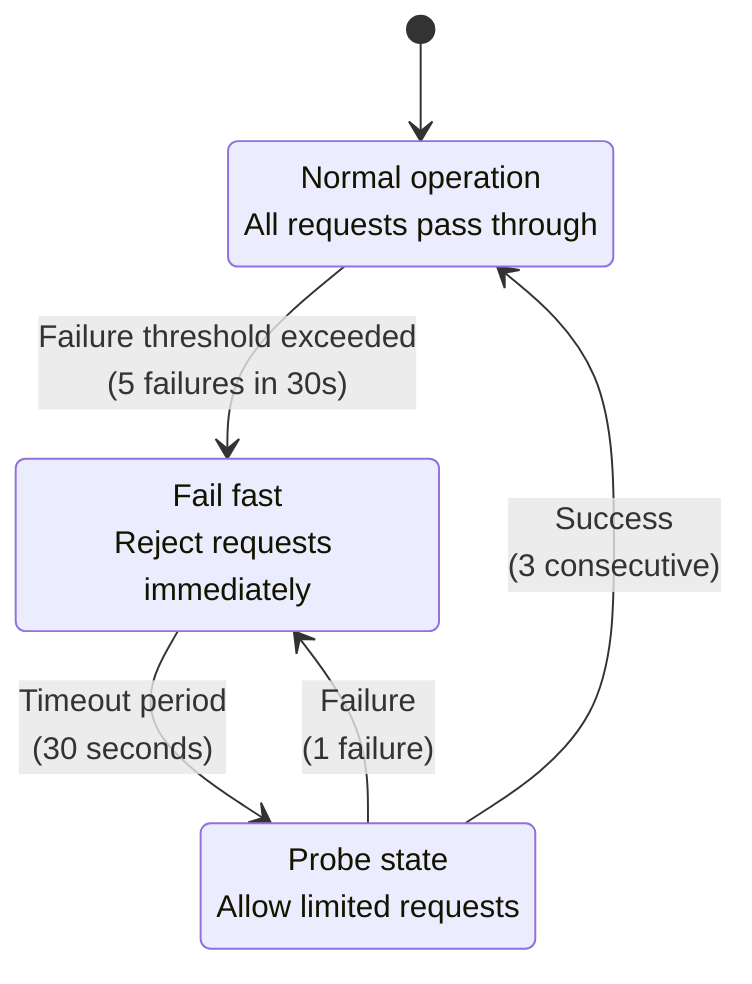
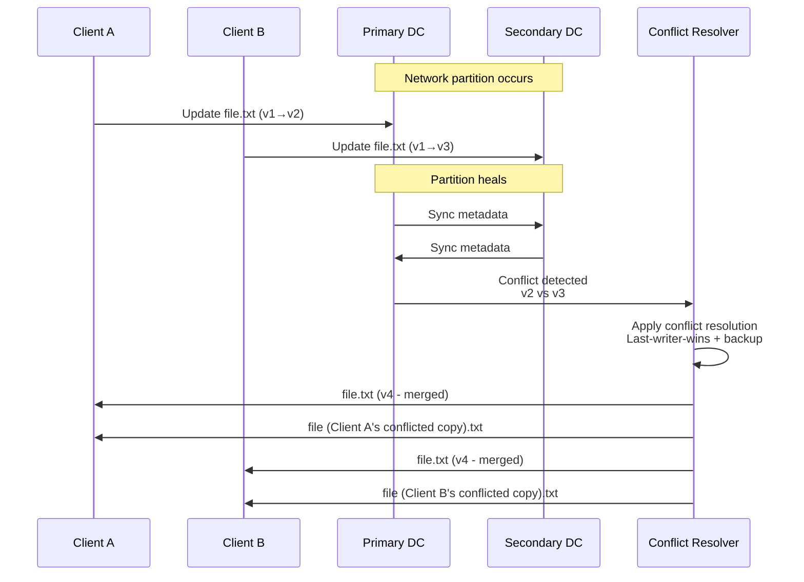

# Dropbox Failure Domains

## Sync and Storage Failure Analysis

Dropbox's failure domain design ensures 99.9% uptime despite handling billions of file operations daily. The system isolates failures across multiple dimensions to prevent cascading outages while maintaining data durability.



## Historical Incident Analysis

### Major Outages (2018-2024)

| Date | Duration | Root Cause | Impact | Resolution |
|------|----------|------------|---------|------------|
| **2019-01-15** | 4.2 hours | Nucleus metadata corruption | 40% of users unable to sync | Restore from backup |
| **2020-06-23** | 2.1 hours | Magic Pocket network partition | West Coast sync delays | Reroute traffic |
| **2021-03-08** | 1.8 hours | API gateway memory leak | Global performance degradation | Rolling restart |
| **2022-09-14** | 3.5 hours | DDoS attack on auth service | Login failures | Traffic filtering |
| **2023-11-02** | 45 minutes | Load balancer configuration error | East Coast access issues | Config rollback |

### Failure Pattern Analysis



## Failure Isolation Mechanisms

### Circuit Breaker Configuration



### Bulkhead Patterns

| Service | Thread Pool | Connection Pool | Timeout | Circuit Breaker |
|---------|-------------|-----------------|---------|-----------------|
| **Sync Service** | 200 threads | 1000 connections | 30s | 5 failures/30s |
| **Auth Service** | 100 threads | 500 connections | 10s | 3 failures/15s |
| **Storage API** | 500 threads | 2000 connections | 60s | 10 failures/60s |
| **Notification** | 150 threads | 800 connections | 15s | 5 failures/30s |

## Data Consistency During Failures

### Conflict Resolution Strategy
```
1. Detect conflicting file versions
2. Apply last-writer-wins for metadata
3. Create conflict copy for user resolution
4. Maintain version history for rollback
5. Sync conflict resolution across devices
```

### Split-Brain Scenarios


## Recovery Procedures

### Automated Recovery Workflows

| Failure Type | Detection Time | Recovery Action | RTO Target |
|--------------|---------------|-----------------|------------|
| **Service Crash** | 10 seconds | Process restart + health check | 30 seconds |
| **Storage Drive** | 5 minutes | Rebuild from replicas | 1 hour |
| **Network Partition** | 30 seconds | Reroute traffic | 2 minutes |
| **Metadata Corruption** | 2 minutes | Restore from backup | 15 minutes |
| **DDoS Attack** | 15 seconds | Activate DDoS protection | 1 minute |

### Manual Escalation Triggers

1. **RTO Exceeded**: Automatic page to on-call engineer
2. **Multiple Failures**: Page incident commander
3. **Customer Impact**: Activate customer communications
4. **Data Loss Risk**: Page database team + leadership
5. **Security Breach**: Page security team + executives

## Monitoring and Alerting

### Critical Health Metrics

```yaml
SLI Thresholds:
  sync_success_rate: > 99.5%
  api_latency_p99: < 100ms
  storage_availability: > 99.9%
  auth_success_rate: > 99.8%

Alert Conditions:
  - sync_success_rate < 95% (5 minutes) → PAGE
  - api_latency_p99 > 500ms (2 minutes) → PAGE
  - storage_errors > 100/minute → EMAIL
  - auth_failures > 1000/minute → PAGE
```

### Runbook Integration

Each failure domain has automated runbooks with:
- **Symptom Detection**: Specific metrics and log patterns
- **Impact Assessment**: Blast radius calculation
- **Escalation Path**: On-call rotation and communication
- **Recovery Steps**: Automated and manual procedures
- **Post-Mortem**: Blameless analysis template

*Source: Dropbox Engineering Blog, SRE Documentation, Post-Mortem Database, Incident Response Playbooks*