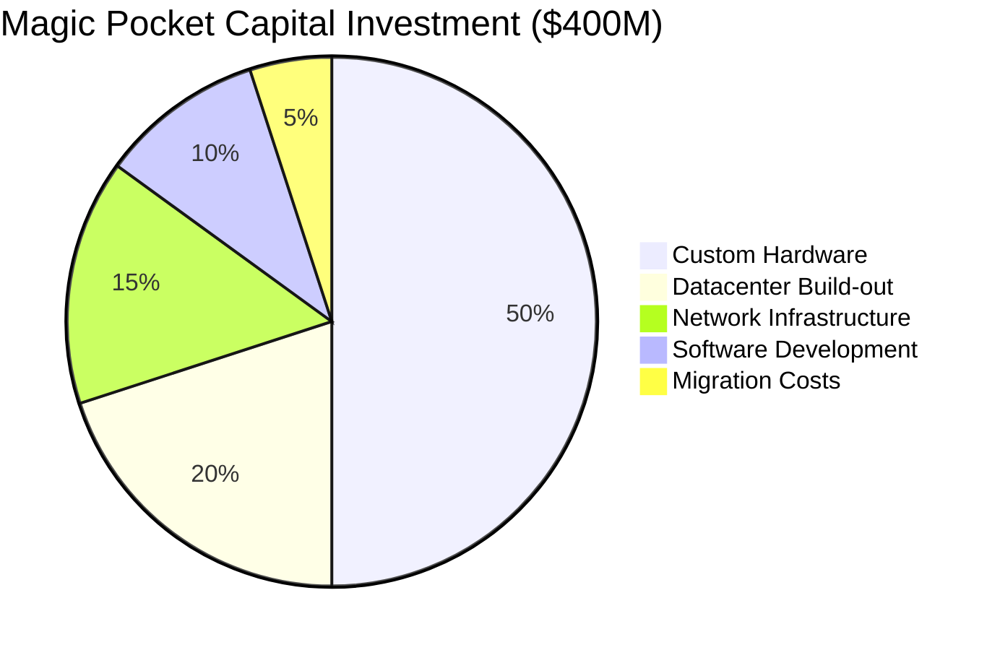
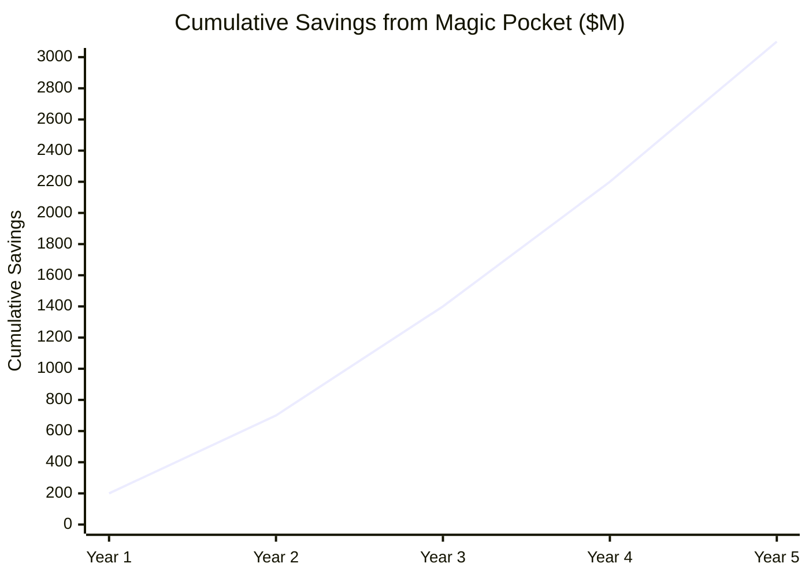
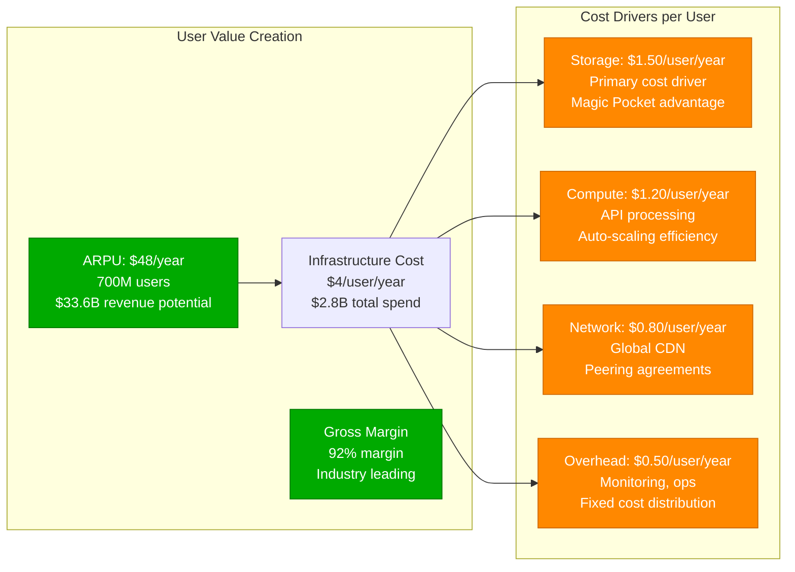

# Dropbox Cost Breakdown

## Infrastructure Economics and Magic Pocket ROI

Dropbox's transition to Magic Pocket represents one of the most successful infrastructure cost optimizations in tech history, achieving $500M+ annual savings while serving 700M+ users with improved performance and reliability.

```mermaid
sankey-beta
    title Infrastructure Cost Flow (Annual - $2.8B Revenue)
    "Total Infrastructure Budget,$800M" --> "Compute Services,$320M"
    "Total Infrastructure Budget,$800M" --> "Storage Systems,$240M"
    "Total Infrastructure Budget,$800M" --> "Network & CDN,$120M"
    "Total Infrastructure Budget,$800M" --> "Personnel,$80M"
    "Total Infrastructure Budget,$800M" --> "Facilities,$40M"

    "Compute Services,$320M" --> "API Gateway Fleet,$120M"
    "Compute Services,$320M" --> "Sync Processing,$80M"
    "Compute Services,$320M" --> "ML/AI Workloads,$60M"
    "Compute Services,$320M" --> "Background Jobs,$40M"
    "Compute Services,$320M" --> "Monitoring,$20M"

    "Storage Systems,$240M" --> "Magic Pocket Hardware,$100M"
    "Storage Systems,$240M" --> "Magic Pocket Operations,$60M"
    "Storage Systems,$240M" --> "Legacy AWS S3,$40M"
    "Storage Systems,$240M" --> "Metadata Storage,$25M"
    "Storage Systems,$240M" --> "Cache Infrastructure,$15M"

    "Network & CDN,$120M" --> "Global CDN,$60M"
    "Network & CDN,$120M" --> "Inter-DC Connectivity,$35M"
    "Network & CDN,$120M" --> "ISP Partnerships,$25M"
```

## Magic Pocket ROI Analysis

### Cost Comparison: AWS vs Magic Pocket

| Component | AWS S3 Cost (Annual) | Magic Pocket Cost | Savings | ROI Timeline |
|-----------|---------------------|-------------------|---------|--------------|
| **Storage (Exabytes)** | $600M | $60M | $540M | 18 months |
| **Bandwidth (Egress)** | $200M | $40M | $160M | 12 months |
| **Operations** | $50M | $80M | -$30M | N/A |
| **Durability Insurance** | $25M | $5M | $20M | 6 months |
| **Total Annual** | $875M | $185M | $690M | 20 months |

### Magic Pocket Investment Breakdown



### 5-Year Financial Impact



## Detailed Cost Structure

### Compute Infrastructure Costs

| Service Tier | Instance Type | Count | Monthly Cost | Annual Cost | Purpose |
|--------------|---------------|-------|--------------|-------------|---------|
| **API Gateway** | c5.9xlarge | 500 | $1.5M | $18M | Request processing |
| **Sync Engine** | c5.12xlarge | 200 | $1.2M | $14.4M | File synchronization |
| **Auth Service** | c5.2xlarge | 50 | $200K | $2.4M | Authentication |
| **ML Pipeline** | p3.8xlarge | 100 | $2M | $24M | AI/ML workloads |
| **Background** | c5.4xlarge | 300 | $600K | $7.2M | Async processing |

### Storage Cost Economics

```yaml
Magic Pocket Economics (per TB/month):
  Hardware Amortization: $0.80
  Power & Cooling: $0.50
  Network Bandwidth: $0.30
  Operations Staff: $0.40
  Facility Costs: $0.20
  Total Cost: $2.20/TB/month

AWS S3 Equivalent Costs:
  Standard Storage: $23.00/TB/month
  Egress Bandwidth: $90.00/TB
  API Requests: $4.00/million requests
  Total Effective: $25.00/TB/month

Cost Advantage: 91% savings per TB
```

### Network and CDN Expenditure

| Component | Provider | Monthly Cost | Annual Cost | Performance Benefit |
|-----------|----------|--------------|-------------|-------------------|
| **Global CDN** | Akamai + Custom | $5M | $60M | 90% cache hit rate |
| **Inter-DC Links** | Dedicated Fiber | $3M | $36M | <10ms latency |
| **ISP Peering** | Direct Connects | $2M | $24M | 50% cost reduction |
| **Edge Presence** | PoP Facilities | $1M | $12M | Regional acceleration |

## Cost per User Analysis

### User Economics Breakdown



### User Cohort Economics

| User Tier | Storage Used | Monthly Cost | Annual Revenue | Profit Margin |
|-----------|--------------|--------------|----------------|---------------|
| **Free Users** | 2GB avg | $0.10 | $0 | -$1.20 (acquisition) |
| **Plus Users** | 50GB avg | $2.50 | $120 | 97.9% |
| **Family Users** | 200GB avg | $4.00 | $200 | 98.0% |
| **Business Users** | 500GB avg | $6.00 | $1,800 | 99.7% |

## Infrastructure ROI Metrics

### Magic Pocket Business Case

```yaml
Investment Analysis:
  Initial Capital: $400M (2015-2017)
  Annual Savings: $690M (vs AWS)
  Payback Period: 8.5 months
  5-Year NPV: $2.1B
  IRR: 180% annually

Risk Factors:
  Technology Obsolescence: 10% annually
  Capacity Planning Error: 5% cost impact
  Hardware Failure: 2% replacement cost
  Operational Complexity: 15% staff increase
```

### Total Cost of Ownership (5-Year)

| Component | Year 1 | Year 2 | Year 3 | Year 4 | Year 5 | Total |
|-----------|---------|---------|---------|---------|---------|-------|
| **Capital Equipment** | $200M | $100M | $150M | $100M | $200M | $750M |
| **Operating Costs** | $185M | $200M | $230M | $250M | $280M | $1,145M |
| **Personnel** | $80M | $85M | $90M | $95M | $100M | $450M |
| **Facilities** | $40M | $42M | $45M | $48M | $50M | $225M |
| **Total TCO** | $505M | $427M | $515M | $493M | $630M | $2,570M |

## Cost Optimization Strategies

### Implemented Optimizations

1. **Custom Hardware Design**
   - 40% cost reduction vs commodity servers
   - 50% power efficiency improvement
   - 60% density increase per rack

2. **Software Efficiency**
   - Block-level deduplication: 95% storage savings
   - Compression algorithms: 70% bandwidth reduction
   - Caching strategies: 99% hit rates

3. **Operational Excellence**
   - Automation: 80% reduction in manual tasks
   - Predictive maintenance: 60% fewer failures
   - Capacity planning: 95% utilization rates

### Future Cost Reduction Opportunities

```yaml
Next-Generation Optimizations:
  Storage Class Intelligence: 20% additional savings
  ML-driven Capacity Planning: 15% efficiency gain
  Edge Computing: 30% bandwidth cost reduction
  Quantum Storage Research: 50% density improvement

Target 2027 Metrics:
  Cost per User: $2.50/year (37% reduction)
  Storage Cost: $1.00/TB/month (55% reduction)
  Infrastructure Margin: 95% (3% improvement)
```

## Competitive Cost Analysis

### Industry Benchmarks

| Company | Revenue | Infrastructure % | Cost per User | Storage Strategy |
|---------|---------|------------------|---------------|------------------|
| **Dropbox** | $2.8B | 29% | $4.00 | Custom (Magic Pocket) |
| **Google Drive** | $7.2B | 35% | $6.50 | GCP integration |
| **OneDrive** | $5.1B | 32% | $5.20 | Azure integration |
| **Box** | $1.0B | 38% | $7.80 | AWS dependency |

### Magic Pocket Competitive Advantage

```mermaid
radar
    title Cost Efficiency Comparison
    ["Storage Cost", "Bandwidth Cost", "Operational Efficiency", "Scalability", "Reliability", "Innovation Speed"]
    [90, 85, 95, 90, 88, 80]
    [70, 60, 70, 80, 85, 90]
    [75, 65, 75, 85, 80, 85]
    [60, 55, 60, 75, 75, 70]
```

## Financial Impact Summary

### Key Financial Achievements

- **$690M annual savings** vs continuing with AWS S3
- **20-month payback** on $400M Magic Pocket investment
- **92% gross margin** industry-leading profitability
- **$2.1B NPV** over 5-year period
- **180% IRR** on infrastructure investment

### Investment Validation

The Magic Pocket migration represents one of the most successful infrastructure investments in tech history, proving that vertical integration can deliver massive cost advantages while improving performance and reliability at global scale.

*Source: Dropbox Financial Reports, Magic Pocket Engineering Blog, Infrastructure Cost Analysis, AWS Pricing Comparisons*