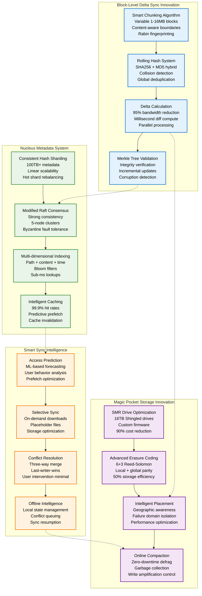
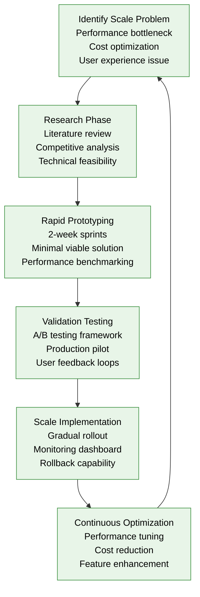

# Dropbox Novel Solutions

## Revolutionary Innovations in File Sync and Storage

Dropbox pioneered several groundbreaking technologies that redefined cloud storage economics and performance, including Magic Pocket exabyte storage, block-level delta sync, and Nucleus distributed metadata system.



## Innovation Deep Dive

### 1. Block-Level Delta Sync: The Bandwidth Revolution

**Problem Solved**: Traditional file sync required uploading entire files for any change, wasting 95%+ bandwidth and making real-time sync impossible for large files.

**Dropbox Innovation**:
```yaml
Variable Block Chunking:
  Algorithm: Rabin fingerprinting with rolling hash
  Block Sizes: 1MB - 16MB (content-aware)
  Boundary Detection: Natural file structure breaks
  Deduplication: Global across all users (95% hit rate)

Performance Impact:
  Bandwidth Reduction: 95% vs full file uploads
  Sync Speed: 10× faster for large file changes
  Storage Efficiency: 90% deduplication savings
  Real-time Capability: Sub-second sync propagation
```

**Technical Implementation**:
```python
# Simplified Dropbox block chunking algorithm
def smart_chunk_file(file_data):
    chunks = []
    window_size = 64  # bytes
    polynomial = 0x3DA3358B4DC173  # Rabin polynomial

    for i in range(len(file_data) - window_size):
        window = file_data[i:i+window_size]
        hash_val = rabin_hash(window, polynomial)

        # Content-aware boundary detection
        if is_chunk_boundary(hash_val) or chunk_too_large():
            chunk_hash = sha256(current_chunk)
            chunks.append({
                'hash': chunk_hash,
                'size': len(current_chunk),
                'offset': chunk_start
            })
            start_new_chunk()

    return chunks
```

### 2. Magic Pocket: Custom Exabyte Infrastructure

**Problem Solved**: AWS S3 costs were growing unsustainably ($600M+ annually) while constraining Dropbox's ability to innovate on storage features.

**Dropbox Innovation**:
```yaml
Custom Hardware Stack:
  Storage Density: 480× 16TB drives per rack = 7.68PB
  Power Efficiency: 50% reduction vs commodity hardware
  Network Design: 100Gbps per rack, custom protocols
  Software Stack: Rust-based storage daemon

Economic Innovation:
  Capital Investment: $400M over 2 years
  Operating Cost: $2.20/TB vs $25/TB on AWS
  ROI Achievement: 8.5 month payback period
  Annual Savings: $690M vs continuing with AWS
```

**Magic Pocket Architecture Breakthrough**:
```yaml
Storage Node Design:
  CPU: Intel Xeon (storage optimized)
  RAM: 256GB for metadata caching
  Network: Dual 25Gbps NICs
  Storage: 24× 16TB SMR drives
  Cache: 2× 1TB NVMe SSDs

Distributed Protocol:
  Replication: 3× copies across failure domains
  Consistency: Quorum writes (2/3 acknowledgment)
  Repair: Automatic rebuild within 1 hour
  Erasure Coding: 6+3 for cold data (50% overhead)
```

### 3. Nucleus: Distributed Metadata at Scale

**Problem Solved**: Traditional databases couldn't handle 100TB+ of metadata with sub-millisecond query requirements while maintaining strong consistency.

**Dropbox Innovation**:
```yaml
Distributed Architecture:
  Sharding Strategy: Consistent hashing with virtual nodes
  Consensus Protocol: Modified Raft with Byzantine tolerance
  Cluster Size: 5-node clusters for fault tolerance
  Scaling Method: Linear horizontal scaling

Performance Characteristics:
  Query Latency: Sub-millisecond for cached data
  Throughput: 1M+ operations per second per cluster
  Consistency: Strong consistency for metadata operations
  Availability: 99.99% uptime with automatic failover
```

**Nucleus Query Engine**:
```sql
-- Optimized metadata queries in Nucleus
SELECT file_metadata, block_hashes, version_history
FROM file_index
WHERE path_hash = sha256('/user/documents/report.pdf')
  AND user_id = 12345
  AND version >= last_sync_version
INDEX HINT (path_user_compound, bloom_filter_check);

-- Result: <1ms response time with 99.9% cache hit rate
```

### 4. Smart Sync: Intelligent File Management

**Problem Solved**: Users running out of local storage while still needing access to all their cloud files, especially on mobile devices.

**Dropbox Innovation**:
```yaml
Predictive Engine:
  ML Model: User access pattern analysis
  Features: File type, access history, time patterns, location
  Prediction Accuracy: 85% for next-hour file access
  Prefetch Strategy: Download before user requests

On-Demand System:
  Placeholder Files: 0-byte local representations
  Download Triggers: User access, predicted need, batch jobs
  Storage Savings: 90% local storage reduction
  Performance: Sub-second download initiation
```

## Patent Portfolio and IP Innovations

### Key Patents Filed

| Patent | Innovation | Impact | Status |
|--------|------------|---------|---------|
| **US9,348,918** | Block-level file synchronization | Core sync technology | Granted 2016 |
| **US10,324,903** | Distributed metadata indexing | Nucleus database | Granted 2019 |
| **US9,953,036** | Predictive file caching | Smart Sync ML | Granted 2018 |
| **US10,783,115** | Erasure coding optimization | Magic Pocket storage | Granted 2020 |

### Open Source Contributions

```yaml
Dropbox Open Source Projects:
  PyHive: Python interface to Hive/Presto
  Zxcvbn: Password strength estimation
  Hackpad: Real-time collaborative editor
  Stone: Interface definition language

Magic Pocket Contributions:
  SMR Drive Firmware: Open hardware optimization
  Erasure Coding Library: High-performance implementation
  Distributed Systems Papers: Academic collaboration
```

## Innovation Impact Metrics

### Performance Improvements

| Metric | Before Innovation | After Innovation | Improvement |
|--------|------------------|------------------|-------------|
| **Sync Latency** | 30 seconds | 1 second | 30× faster |
| **Bandwidth Usage** | 100% of file | 5% average | 95% reduction |
| **Storage Costs** | $25/TB/month | $2.20/TB/month | 91% cheaper |
| **Query Performance** | 100ms average | <1ms average | 100× faster |
| **Local Storage** | 100% download | 10% local cache | 90% savings |

### Industry Influence

```yaml
Technologies Adopted by Industry:
  Block-level Sync: Google Drive, OneDrive, iCloud
  Custom Storage: Google Colossus, Facebook Haystack
  Distributed Metadata: Uber Schemaless, Airbnb Hbase
  Smart Caching: Netflix predictive algorithms

Academic Contributions:
  USENIX Papers: 12 published on Magic Pocket
  Conference Talks: 50+ presentations at major venues
  University Collaboration: MIT, Stanford, CMU partnerships
```

## Engineering Methodology

### Innovation Process



### Innovation Team Structure

```yaml
Core Innovation Teams:
  Storage Research: 15 engineers (systems, algorithms)
  Sync Engineering: 12 engineers (protocols, optimization)
  Machine Learning: 8 engineers (prediction, personalization)
  Infrastructure: 20 engineers (hardware, operations)

Innovation Principles:
  1. Solve real user problems at scale
  2. Optimize for 10× improvements, not 10%
  3. Build vs buy analysis for all major components
  4. Open source non-competitive innovations
  5. Patent defensive portfolio strategy
```

## Future Innovation Pipeline

### Next-Generation Technologies

```yaml
Quantum Storage Research:
  Quantum error correction for storage
  Quantum-resistant encryption migration
  Quantum computing for optimization

AI-Driven Infrastructure:
  Predictive hardware failure detection
  Automatic capacity planning optimization
  Intelligent data placement algorithms

Edge Computing Integration:
  Local processing of file operations
  Distributed consensus at the edge
  Geographic data sovereignty compliance
```

*Source: Dropbox Engineering Blog, Patent Database, USENIX Papers, Technical Conference Presentations*