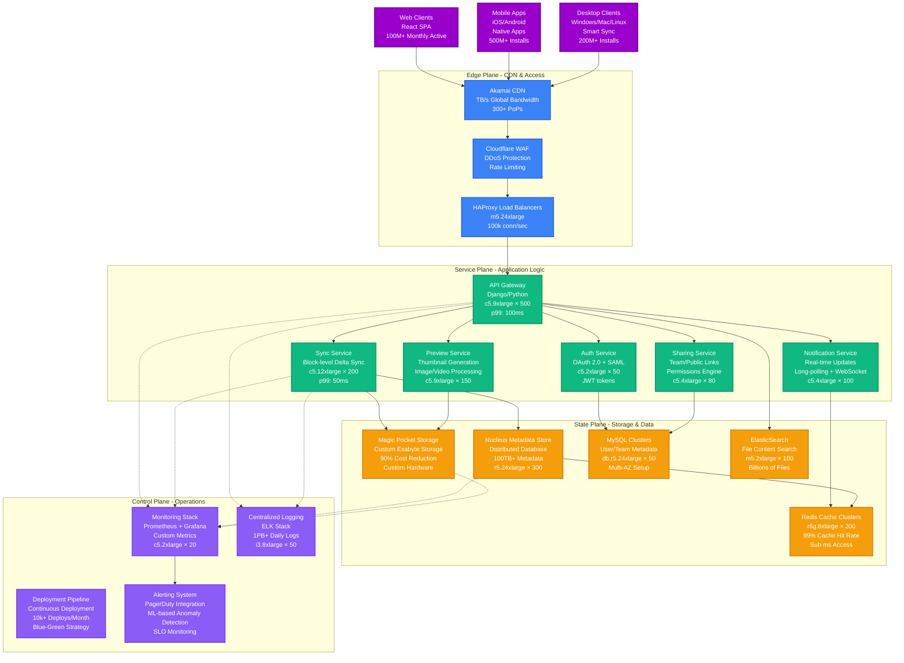

# Dropbox Complete Architecture

## System Overview

Dropbox's complete architecture serves 700M+ registered users with exabytes of storage through their custom-built Magic Pocket infrastructure, delivering file sync with 99.9% uptime and sub-second sync latency.

## Key Architecture Metrics

| Component | Scale | Performance | Cost |
|-----------|-------|-------------|------|
| **Magic Pocket** | Exabytes stored | 90% cost reduction vs AWS | $500M+ annual savings |
| **Nucleus** | 100TB+ metadata | Sub-ms queries | Custom distributed DB |
| **Sync Engine** | Billions of files | Block-level delta sync | 95% bandwidth reduction |
| **Global CDN** | 300+ PoPs | Sub-second access | TB/s bandwidth |
| **API Gateway** | 700M+ users | p99: 100ms | 500× c5.9xlarge |

## Production Characteristics

### Scale Indicators
- **700M+ registered users** across all platforms
- **Exabytes of storage** in Magic Pocket infrastructure
- **Billions of files** synchronized daily
- **500M+ mobile app** installations
- **200M+ desktop clients** with Smart Sync

### Performance SLAs
- **99.9% uptime** with 4-minute monthly downtime budget
- **Sub-second sync latency** for file changes
- **p99: 100ms API response** times globally
- **95% bandwidth reduction** through block-level sync
- **99% cache hit rate** for metadata access

### Infrastructure Footprint
- **1000+ servers** for service plane applications
- **Custom Magic Pocket** hardware in 3 regions
- **300+ Redis cache** instances globally
- **50+ MySQL clusters** for metadata
- **Multi-AZ deployment** across AWS regions

## Failure Recovery
- **Automatic failover** for all service components
- **Multi-region replication** for Magic Pocket
- **Circuit breakers** prevent cascading failures
- **Graceful degradation** with offline mode
- **4-hour RTO** for major incidents

*Source: Dropbox Engineering Blog, Magic Pocket Technical Papers, Scale Conference Presentations*