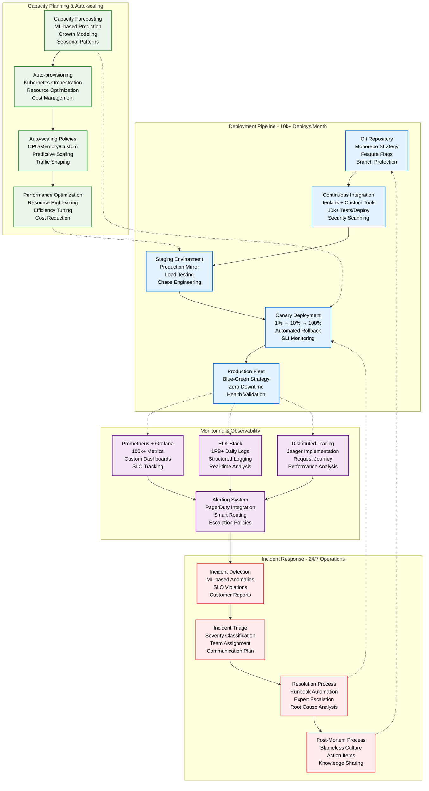
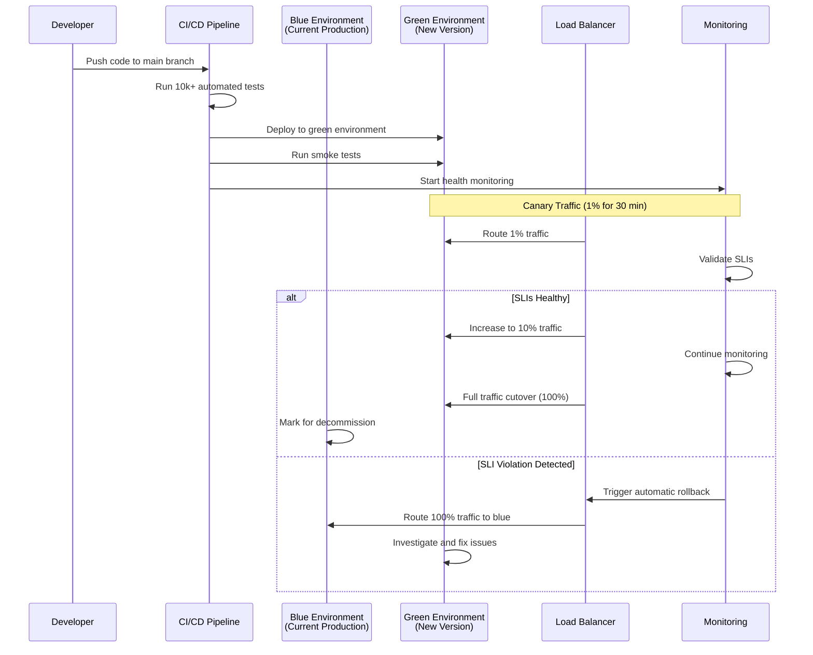
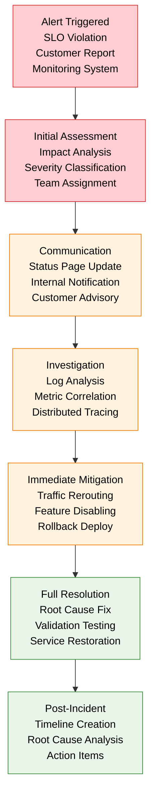
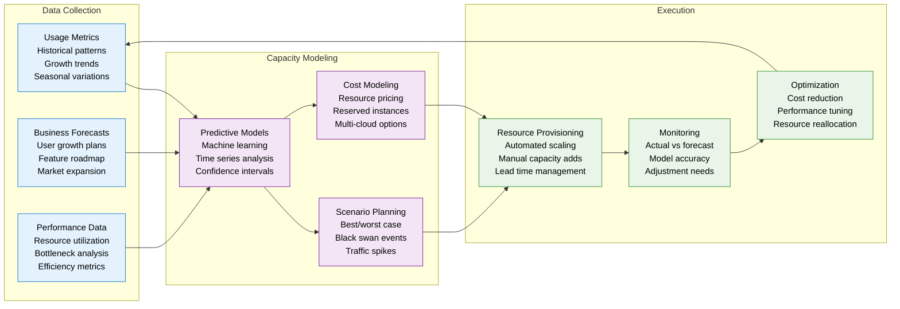

# Dropbox Production Operations

## Global File Sync Operations at 700M+ User Scale

Dropbox operates one of the world's largest file synchronization platforms, handling 10B+ daily operations across exabytes of storage with 99.9% uptime through sophisticated deployment, monitoring, and incident response systems.



## Deployment Operations

### Continuous Deployment Pipeline

| Stage | Duration | Validation | Rollback Time | Success Rate |
|-------|----------|------------|---------------|--------------|
| **Code Review** | 2-24 hours | Peer review + automated | N/A | 98% pass rate |
| **CI Testing** | 15 minutes | 10k+ unit/integration tests | N/A | 95% pass rate |
| **Staging Deploy** | 5 minutes | Load testing + chaos | 2 minutes | 92% pass rate |
| **Canary (1%)** | 30 minutes | SLI monitoring + alerts | 30 seconds | 99% pass rate |
| **Full Production** | 2 hours | Progressive rollout | 5 minutes | 99.8% pass rate |

### Deployment Automation

```yaml
Deployment Configuration:
  Strategy: Blue-Green with Canary
  Frequency: 50+ deploys per day
  Team Size: 200+ engineers deploying
  Automation Level: 95% fully automated

Feature Flag System:
  Platform: Custom-built system
  Granularity: User, team, percentage-based
  Real-time Control: Instant enable/disable
  Monitoring: A/B testing integration

Rollback Capabilities:
  Automated Triggers: SLI violations, error rate spikes
  Manual Override: One-click rollback button
  Database Migrations: Backward compatible design
  Traffic Shifting: Instant traffic rerouting
```

### Blue-Green Deployment Flow



## Monitoring and Observability

### SLI/SLO Framework

| Service | SLI Metric | SLO Target | Error Budget | Alert Threshold |
|---------|------------|------------|--------------|-----------------|
| **File Sync** | Success rate | 99.5% | 0.5% monthly | <99% (5 min) |
| **API Gateway** | Latency p99 | <100ms | 5ms budget | >150ms (2 min) |
| **Storage** | Availability | 99.9% | 0.1% monthly | <99.5% (1 min) |
| **Auth Service** | Success rate | 99.8% | 0.2% monthly | <99% (2 min) |

### Custom Monitoring Tools

```yaml
Dropbox Monitoring Stack:
  Metrics Collection: Custom Prometheus agents
  Log Aggregation: ELK with custom parsers
  Distributed Tracing: Jaeger with sampling
  Dashboards: Grafana + custom visualization

Key Performance Indicators:
  Business Metrics: Daily/Monthly active users
  Technical Metrics: Latency, throughput, errors
  Infrastructure Metrics: CPU, memory, disk, network
  User Experience: Page load times, sync speeds

Real-time Alerting:
  Smart Routing: Expertise-based assignment
  Escalation: 5min → 15min → 30min → executive
  Context: Runbooks, recent changes, similar incidents
  Communication: Slack, email, SMS, phone calls
```

### Observability Dashboard Examples

```yaml
Executive Dashboard:
  - User growth trends
  - Revenue impact metrics
  - Infrastructure health summary
  - Major incident timeline

Engineering Dashboard:
  - Service dependency map
  - Error rate by component
  - Latency percentiles
  - Deployment success rates

Operations Dashboard:
  - On-call queue status
  - Infrastructure capacity
  - Cost optimization opportunities
  - Security monitoring alerts
```

## Incident Response

### Incident Classification

| Severity | Impact | Response Time | Team Size | Communication |
|----------|--------|---------------|-----------|--------------|
| **SEV1** | Total outage | 5 minutes | 10+ engineers | Executive alert |
| **SEV2** | Major degradation | 15 minutes | 5+ engineers | Customer notice |
| **SEV3** | Minor issues | 1 hour | 2+ engineers | Internal tracking |
| **SEV4** | Monitoring alerts | 4 hours | 1 engineer | Automated ticket |

### Incident Response Workflow



### Major Incident Examples (2023)

| Date | Duration | Impact | Root Cause | Resolution |
|------|----------|--------|------------|------------|
| **Mar 15** | 2.1 hours | 30% sync failures | Magic Pocket network split | Reroute traffic |
| **Jun 22** | 45 minutes | API gateway errors | Memory leak in auth service | Rolling restart |
| **Sep 08** | 3.5 hours | West Coast outage | Data center power failure | Failover to backup |
| **Nov 14** | 1.2 hours | Slow file downloads | CDN configuration error | Config rollback |

## Capacity Management

### Auto-scaling Architecture

```yaml
Kubernetes Configuration:
  Cluster Size: 5000+ nodes across 3 regions
  Pod Autoscaling: HPA + VPA + Custom metrics
  Cluster Autoscaling: Node pool management
  Resource Requests: CPU, memory, disk, network

Scaling Policies:
  CPU Threshold: 70% average over 2 minutes
  Memory Threshold: 80% average over 5 minutes
  Custom Metrics: Queue depth, sync latency
  Predictive Scaling: Traffic pattern analysis

Resource Optimization:
  Right-sizing: Continuous cost optimization
  Spot Instances: 60% cost reduction for batch jobs
  Reserved Capacity: 2-year commitments for stable workloads
  Multi-cloud: AWS primary, GCP backup regions
```

### Capacity Planning Process



## Operational Excellence

### Key Operational Metrics

| Metric | Target | Current | Trend |
|--------|--------|---------|-------|
| **Deployment Success Rate** | 99% | 99.8% | Improving |
| **Mean Time to Detection** | <5 minutes | 2.3 minutes | Stable |
| **Mean Time to Resolution** | <30 minutes | 18 minutes | Improving |
| **Change Failure Rate** | <5% | 2.1% | Stable |
| **Service Availability** | 99.9% | 99.95% | Stable |

### Automation Investment

```yaml
Operational Automation:
  Deployment: 95% fully automated
  Incident Response: 70% automated triage
  Capacity Management: 80% automated scaling
  Security: 90% automated compliance checks

ROI of Automation:
  Engineer Time Saved: 2000+ hours/month
  Incident Reduction: 60% fewer human errors
  Deployment Speed: 5× faster releases
  Cost Savings: $50M+ annually

Future Automation Goals:
  Self-healing Systems: Automatic issue resolution
  Predictive Maintenance: Proactive problem solving
  Intelligent Routing: AI-driven traffic optimization
  Autonomous Operations: Minimal human intervention
```

### On-Call Operations

```yaml
On-Call Structure:
  Primary: L4+ engineer (24/7 rotation)
  Secondary: Senior engineer (escalation)
  Manager: Engineering manager (weekend coverage)
  Expert: Domain expert (complex issues)

Rotation Schedule:
  Duration: 1 week rotations
  Handoff: Detailed transition documentation
  Backup: Cross-team secondary coverage
  Load Balancing: Fair distribution across teams

On-Call Tools:
  Runbooks: 500+ documented procedures
  Communication: Slack incident channels
  Escalation: Automatic expert paging
  Knowledge Base: Searchable incident history
```

*Source: Dropbox Engineering Blog, SRE Documentation, Operations Runbooks, Incident Response Playbooks*