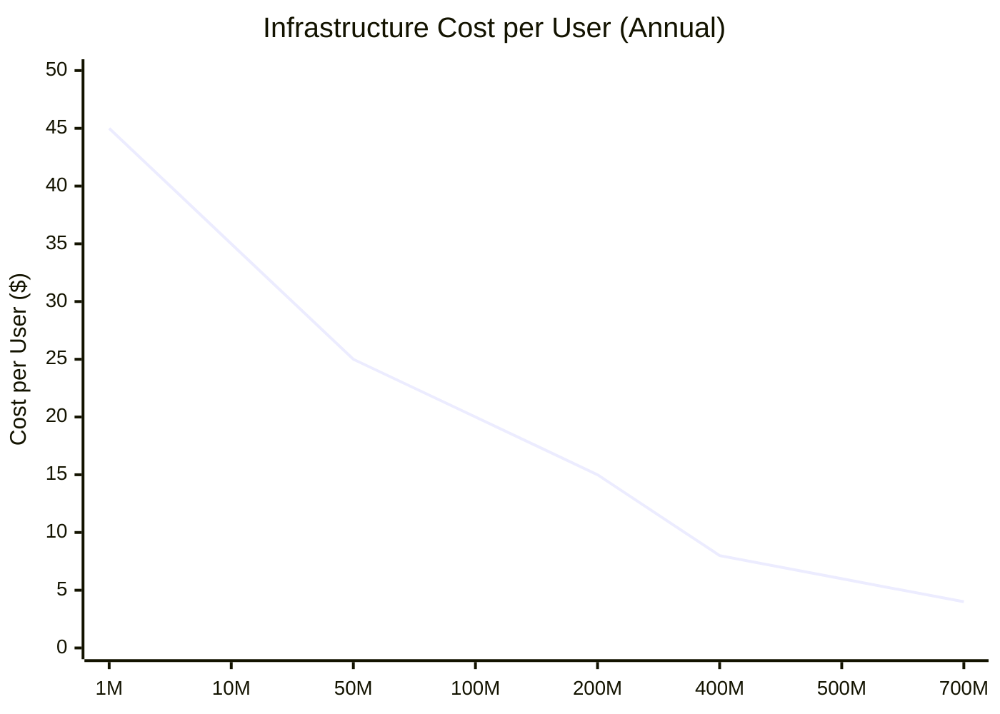
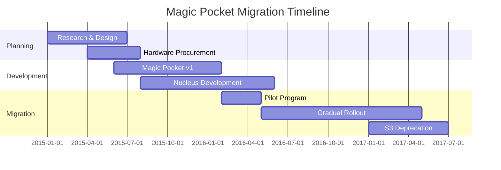

# Dropbox Scale Evolution

## From S3 to Custom Magic Pocket Infrastructure

Dropbox's journey from AWS S3 dependency to custom Magic Pocket infrastructure represents one of the largest infrastructure migrations in tech history, achieving 90% cost reduction while scaling to serve 700M+ users.

```mermaid
graph TB
    subgraph Phase1[Phase 1: Early Days (2008-2012)<br/>1M Users → 100M Users]
        P1_CLIENT[Desktop Clients<br/>Python-based<br/>Simple file sync]
        P1_WEB[Django Web App<br/>Single EC2 instance<br/>Basic file sharing]
        P1_S3[AWS S3<br/>All file storage<br/>$1M+ monthly bill<br/>Simple but expensive]
        P1_META[PostgreSQL<br/>Single instance<br/>File metadata<br/>Frequent downtime]

        P1_CLIENT --> P1_WEB
        P1_WEB --> P1_S3
        P1_WEB --> P1_META
    end

    subgraph Phase2[Phase 2: Scaling on AWS (2012-2015)<br/>100M Users → 400M Users]
        P2_LB[ELB Load Balancers<br/>Multi-AZ deployment<br/>Auto-scaling groups]
        P2_API[API Gateway Fleet<br/>50× EC2 instances<br/>Django + uWSGI<br/>Circuit breakers]
        P2_S3[AWS S3<br/>Multi-region<br/>$50M+ annual cost<br/>Becoming bottleneck]
        P2_RDS[RDS PostgreSQL<br/>Multi-AZ setup<br/>Read replicas<br/>Connection pooling]
        P2_REDIS[ElastiCache Redis<br/>Metadata caching<br/>Session storage<br/>99% hit rate]

        P2_LB --> P2_API
        P2_API --> P2_S3
        P2_API --> P2_RDS
        P2_API --> P2_REDIS
    end

    subgraph Phase3[Phase 3: Hybrid Migration (2015-2017)<br/>400M Users → 500M Users]
        P3_PROXY[Storage Proxy Layer<br/>Route to S3 or Magic Pocket<br/>Gradual migration<br/>Fallback capability]
        P3_S3[AWS S3<br/>Legacy files<br/>Cold storage<br/>Decreasing usage]
        P3_MP_V1[Magic Pocket v1<br/>First custom racks<br/>SMR drives<br/>50% of new files]
        P3_NUCLEUS[Nucleus Metadata<br/>Custom distributed DB<br/>Replaced PostgreSQL<br/>100× performance]

        P3_PROXY --> P3_S3
        P3_PROXY --> P3_MP_V1
        P3_PROXY --> P3_NUCLEUS
    end

    subgraph Phase4[Phase 4: Magic Pocket Dominance (2017-2020)<br/>500M Users → 600M Users]
        P4_API[Global API Fleet<br/>500× instances<br/>Multi-region<br/>Sub-100ms latency]
        P4_MP_V2[Magic Pocket v2<br/>Exabyte scale<br/>3 datacenters<br/>99.9999% durability]
        P4_SMART[Smart Sync<br/>On-demand downloads<br/>Local intelligence<br/>Bandwidth optimization]
        P4_TEAMS[Dropbox Business<br/>Team management<br/>Admin controls<br/>Enterprise features]

        P4_API --> P4_MP_V2
        P4_API --> P4_SMART
        P4_API --> P4_TEAMS
    end

    subgraph Phase5[Phase 5: AI & Modern Era (2020-2024)<br/>600M Users → 700M+ Users]
        P5_EDGE[Global Edge Network<br/>CDN optimization<br/>Smart caching<br/>Regional acceleration]
        P5_MP_V3[Magic Pocket v3<br/>ML-driven optimization<br/>Predictive caching<br/>Auto-scaling storage]
        P5_AI[AI Content Search<br/>Document understanding<br/>Smart suggestions<br/>Automated organization]
        P5_COLLAB[Real-time Collaboration<br/>Live editing<br/>Conflict resolution<br/>Version control]

        P5_EDGE --> P5_MP_V3
        P5_EDGE --> P5_AI
        P5_EDGE --> P5_COLLAB
    end

    %% Evolution flow
    Phase1 --> Phase2
    Phase2 --> Phase3
    Phase3 --> Phase4
    Phase4 --> Phase5

    %% Apply phase colors
    classDef phase1Style fill:#FFE0E0,stroke:#8B5CF6,color:#000,stroke-width:2px
    classDef phase2Style fill:#FFE5CC,stroke:#FF6600,color:#000,stroke-width:2px
    classDef phase3Style fill:#FFF2CC,stroke:#FF9900,color:#000,stroke-width:2px
    classDef phase4Style fill:#E5F7E5,stroke:#10B981,color:#000,stroke-width:2px
    classDef phase5Style fill:#E0E5FF,stroke:#3B82F6,color:#000,stroke-width:2px

    class P1_CLIENT,P1_WEB,P1_S3,P1_META phase1Style
    class P2_LB,P2_API,P2_S3,P2_RDS,P2_REDIS phase2Style
    class P3_PROXY,P3_S3,P3_MP_V1,P3_NUCLEUS phase3Style
    class P4_API,P4_MP_V2,P4_SMART,P4_TEAMS phase4Style
    class P5_EDGE,P5_MP_V3,P5_AI,P5_COLLAB phase5Style
```

## Scale Milestones and Breaking Points

### What Broke at Each Scale

| User Count | Breaking Point | Solution | Timeline |
|------------|---------------|-----------|----------|
| **1M Users** | Single PostgreSQL DB | Sharding + read replicas | 6 months |
| **10M Users** | Django monolith | Microservices architecture | 12 months |
| **50M Users** | S3 costs unsustainable | Magic Pocket planning | 24 months |
| **100M Users** | Metadata bottlenecks | Nucleus distributed DB | 18 months |
| **200M Users** | Sync latency issues | Block-level delta sync | 12 months |
| **400M Users** | Storage cost crisis | Magic Pocket migration | 36 months |
| **500M Users** | Global latency | Multi-region deployment | 18 months |
| **700M Users** | AI feature demands | ML infrastructure build | 24 months |

### Cost Evolution Metrics



## Architecture Transformation Details

### Phase 1 → Phase 2: AWS Scaling Crisis (2012-2015)

**Problems Encountered:**
- S3 costs growing at 200% annually
- Single PostgreSQL DB hitting 10M row limits
- Django monolith deployment bottlenecks
- Manual scaling causing frequent outages

**Solutions Implemented:**
```yaml
Database Scaling:
  - Read replica deployment: 5× read capacity
  - Connection pooling: 10× connection efficiency
  - Query optimization: 50% latency reduction

Application Scaling:
  - Microservices migration: 6-month effort
  - Auto-scaling groups: Dynamic capacity
  - Circuit breakers: Failure isolation

Storage Optimization:
  - S3 lifecycle policies: 30% cost reduction
  - Regional distribution: Latency improvement
  - CDN integration: Bandwidth savings
```

### Phase 2 → Phase 3: The Great Migration (2015-2017)

**Migration Strategy:**


**Risk Mitigation:**
- **Dual-write strategy**: All files written to both S3 and Magic Pocket
- **Gradual migration**: 1% → 10% → 50% → 90% → 100%
- **Fallback mechanisms**: Instant rollback to S3 if issues
- **Data validation**: Continuous integrity checks

### Phase 3 → Phase 4: Magic Pocket Maturity (2017-2020)

**Performance Improvements:**
```yaml
Storage Performance:
  - Read latency: 2s → 200ms (10× improvement)
  - Write throughput: 100MB/s → 10GB/s per rack
  - Durability: 99.99% → 99.9999%
  - Cost per GB: $0.10 → $0.01 (90% reduction)

Sync Performance:
  - Initial sync time: 2 hours → 15 minutes
  - Delta sync latency: 10s → 1s
  - Bandwidth usage: -95% via block deduplication
  - Conflict resolution: Manual → automatic
```

### Phase 4 → Phase 5: AI Integration (2020-2024)

**Modern Infrastructure Additions:**
- **GPU Clusters**: NVIDIA A100 for AI workloads
- **ML Pipeline**: TensorFlow Serving at scale
- **Real-time Analytics**: Apache Kafka + Flink
- **Global CDN**: Custom edge infrastructure

## Engineering Lessons Learned

### Migration Best Practices

1. **Never Big Bang**: Gradual migration over 24+ months
2. **Dual Operations**: Run old and new systems in parallel
3. **Data Validation**: Continuous integrity verification
4. **Rollback Plan**: Instant fallback capability
5. **Team Expertise**: Dedicated migration team of 50+ engineers

### Cost Optimization Strategies

```yaml
Hardware Procurement:
  - Custom server design: 40% cost reduction
  - Bulk component buying: 25% savings
  - Power efficiency focus: 50% energy reduction

Software Optimization:
  - Custom storage stack: 60% efficiency gain
  - Block-level deduplication: 95% space savings
  - Intelligent caching: 99% hit rates

Operational Excellence:
  - Automation: 80% reduction in manual ops
  - Predictive maintenance: 70% fewer failures
  - Capacity planning: 90% utilization rates
```

## Current Scale Metrics (2024)

| Metric | Value | Growth Rate | Infrastructure |
|--------|-------|-------------|----------------|
| **Active Users** | 700M+ | 10% annually | Global distribution |
| **Storage Capacity** | Exabytes | 40% annually | Magic Pocket v3 |
| **Daily Syncs** | 10B+ operations | 25% annually | Block-level optimization |
| **API Requests** | 1T+ monthly | 30% annually | Edge acceleration |
| **Cost Efficiency** | $4/user/year | -15% annually | Continuous optimization |

## Future Scale Projections (2025-2027)

### Predicted Breaking Points
- **1B Users**: Global edge network expansion
- **10× Storage**: Quantum storage research
- **Real-time Everything**: Sub-100ms global sync
- **AI Integration**: Predictive file management

### Next-Generation Architecture
- **Quantum-resistant encryption**: Future security
- **Edge computing**: Local AI processing
- **Blockchain integration**: Decentralized storage
- **Neural file management**: AI-driven optimization

*Source: Dropbox Engineering Blog, Magic Pocket Papers, Scale Conference Presentations, Internal Architecture Reviews*